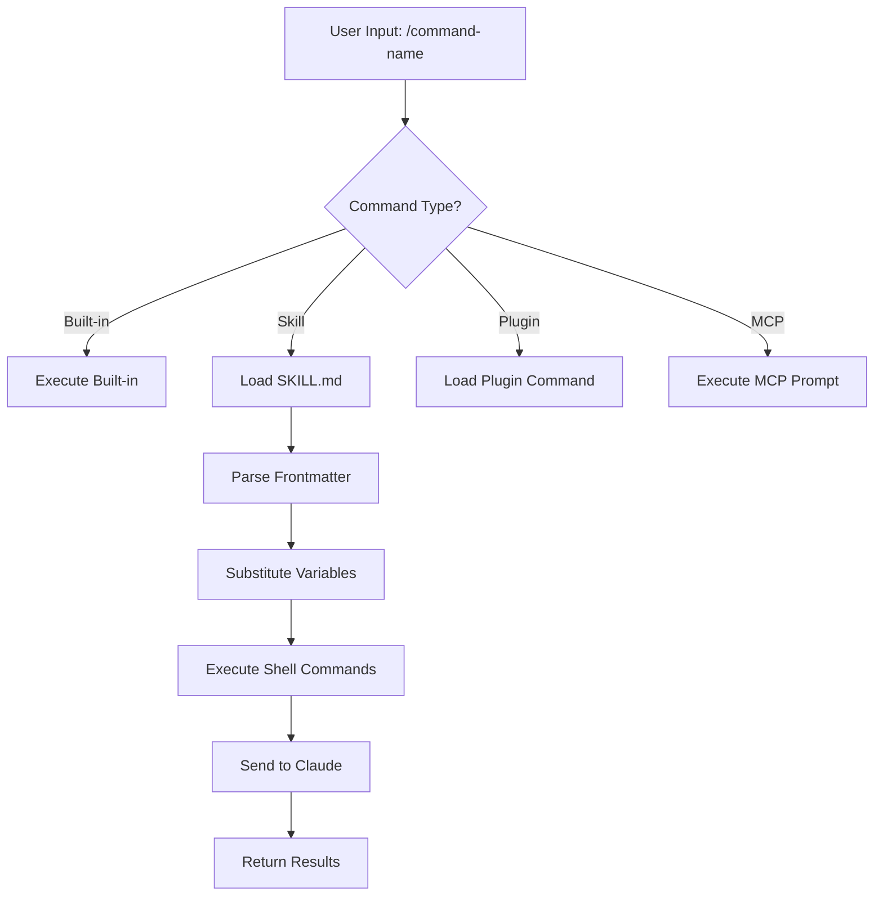
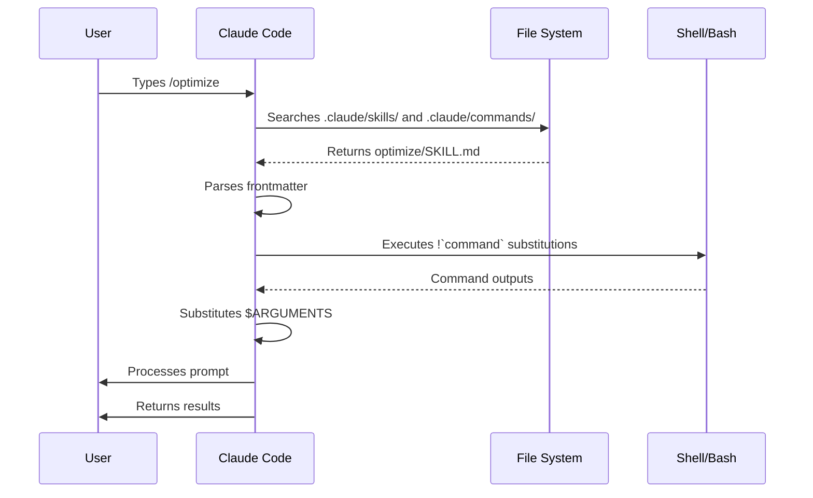

# Slash Command

Slash command는 Claude Code 세션 안에서 자주 쓰는 동작을 빠르게 호출하는 단축 명령입니다. 내장 명령부터 skill, plugin, MCP prompt까지 다양한 출처가 동일한 `/이름` 형태로 노출됩니다.

## 언제 읽으면 좋은가

- Claude Code의 기본 동작(`/help`, `/clear`, `/model` 등)을 빠르게 확인하고 싶을 때
- 팀이나 개인의 자주 쓰는 워크플로를 단축 명령으로 정리하고 싶을 때
- skill, plugin, MCP prompt가 어떻게 slash command 형태로 노출되는지 이해하고 싶을 때
- 기존 사용자 정의 slash command를 skill 구조로 마이그레이션해야 할 때

## 개요

Slash command는 대화형 세션에서 Claude의 동작을 제어하는 단축 명령입니다. 여러 유형이 있습니다:

- **내장 명령**: Claude Code에서 제공하는 명령 (`/help`, `/clear`, `/model`)
- **Skill**: `SKILL.md` 파일로 생성된 사용자 정의 명령 (`/optimize`, `/pr`)
- **Plugin 명령**: 설치된 plugin에서 제공하는 명령 (`/frontend-design:frontend-design`)
- **MCP prompt**: MCP 서버에서 제공하는 명령 (`/mcp__github__list_prs`)

[[TIP("참고")]]
사용자 정의 slash command는 skill로 통합되었습니다. `.claude/commands/`에 있는 파일은 여전히 작동하지만, skill(`.claude/skills/`)이 현재 권장 방식입니다. 두 가지 모두 `/command-name` 단축 명령을 생성합니다. 전체 레퍼런스는 [Skill 가이드](../../03-skills/)를 참조하십시오.
[[/TIP]]

**신규 내장 워크플로 관련 가이드:**

- [Ultraplan](./ultraplan.md)
- [Ultrareview](./ultrareview.md)

## 내장 명령 레퍼런스

내장 명령은 일반적인 작업을 위한 단축 명령입니다. **60개 이상의 내장 명령**과 **5개의 번들 skill**을 사용할 수 있습니다. Claude Code에서 `/`를 입력하면 전체 목록을 볼 수 있고, `/` 뒤에 문자를 입력하면 필터링됩니다.

[[TIP("참고")]]
일부 명령은 조건부입니다 — 구독 티어(예: `/privacy-settings`), 플랫폼(예: `/desktop`), 또는 환경 설정(예: `/setup-bedrock`)에 따라 표시됩니다.
[[/TIP]]

| Command | 용도 |
|---------|---------|
| `/add-dir <path>` | 작업 디렉터리 추가 |
| `/agents` | agent 구성 관리 |
| `/branch [name]` | 대화를 새 세션으로 분기 (별칭: `/fork`). 참고: `/fork`는 v2.1.77에서 `/branch`로 이름 변경 |
| `/btw <question>` | 히스토리에 추가하지 않는 부가 질문 |
| `/chrome` | Chrome 브라우저 통합 구성 |
| `/clear` | 대화 초기화 (별칭: `/reset`, `/new`) |
| `/color [color\|default]` | 프롬프트 바 색상 설정 |
| `/compact [instructions]` | 선택적 포커스 지시사항으로 대화 압축 |
| `/config` | 설정 열기 (별칭: `/settings`) |
| `/context` | 컨텍스트 사용량을 컬러 그리드로 시각화 |
| `/copy [N]` | 어시스턴트 응답을 클립보드에 복사; `w`로 파일에 쓰기 |
| `/cost` | 토큰 사용량 통계 표시 |
| `/desktop` | Desktop 앱에서 계속 (별칭: `/app`) |
| `/diff` | 커밋되지 않은 변경사항을 위한 대화형 diff 뷰어 |
| `/doctor` | 설치 상태 진단 |
| `/effort [low\|medium\|high\|max\|auto]` | 노력 수준 설정. `max`는 Opus 4.6 필요 |
| `/exit` | REPL 종료 (별칭: `/quit`) |
| `/export [filename]` | 현재 대화를 파일 또는 클립보드로 내보내기 |
| `/extra-usage` | 속도 제한을 위한 추가 사용량 구성 |
| `/fast [on\|off]` | 빠른 모드 전환 |
| `/feedback` | 피드백 제출 (별칭: `/bug`) |
| `/help` | 도움말 표시 |
| `/hooks` | hook 구성 보기 |
| `/ide` | IDE 통합 관리 |
| `/init` | `CLAUDE.md` 초기화. 대화형 흐름을 위해 `CLAUDE_CODE_NEW_INIT=1` 설정 |
| `/insights` | 세션 분석 보고서 생성 |
| `/install-github-app` | GitHub Actions 앱 설정 |
| `/install-slack-app` | Slack 앱 설치 |
| `/keybindings` | 키 바인딩 구성 열기 |
| `/login` | Anthropic 계정 전환 |
| `/logout` | Anthropic 계정에서 로그아웃 |
| `/mcp` | MCP 서버 및 OAuth 관리 |
| `/memory` | `CLAUDE.md` 편집, 자동 메모리 전환 |
| `/mobile` | 모바일 앱용 QR 코드 (별칭: `/ios`, `/android`) |
| `/model [model]` | 모델 선택, 좌우 화살표로 노력 수준 조정 |
| `/passes` | Claude Code 무료 1주 공유 |
| `/permissions` | 권한 보기/업데이트 (별칭: `/allowed-tools`) |
| `/plan [description]` | 계획 모드 진입 |
| `/plugin` | plugin 관리 |
| `/powerup` | 애니메이션 데모가 포함된 대화형 레슨으로 기능 탐색 |
| `/privacy-settings` | 개인정보 설정 (Pro/Max 전용) |
| `/release-notes` | 변경 로그 보기 |
| `/reload-plugins` | 활성 plugin 다시 로드 |
| `/remote-control` | claude.ai에서 원격 제어 (별칭: `/rc`) |
| `/remote-env` | 기본 원격 환경 구성 |
| `/rename [name]` | 세션 이름 변경 |
| `/resume [session]` | 대화 이어서 하기 (별칭: `/continue`) |
| `/review` | **지원 중단** -- 대신 `code-review` plugin을 설치하십시오 |
| `/rewind` | 대화 및/또는 코드 되감기 (별칭: `/checkpoint`) |
| `/sandbox` | sandbox 모드 전환 |
| `/schedule [description]` | 클라우드 예약 작업 생성/관리 |
| `/security-review` | 브랜치의 보안 취약점 분석 |
| `/skills` | 사용 가능한 skill 목록 |
| `/stats` | 일일 사용량, 세션, 연속 기록 시각화 |
| `/stickers` | Claude Code 스티커 주문 |
| `/status` | 버전, 모델, 계정 표시 |
| `/statusline` | 상태 줄 구성 |
| `/tasks` | 백그라운드 작업 목록/관리 |
| `/terminal-setup` | 터미널 키 바인딩 구성 |
| `/theme` | 색상 테마 변경 |
| `/ultraplan <prompt>` | ultraplan 세션에서 계획 초안 작성, 브라우저에서 검토 |
| `/upgrade` | 상위 플랜 티어 업그레이드 페이지 열기 |
| `/usage` | 플랜 사용 한도 및 속도 제한 상태 표시 |
| `/voice` | 푸시투톡 음성 받아쓰기 전환 |

### 번들 Skill

이 skill은 Claude Code에 기본 포함되어 있으며 slash command처럼 호출됩니다:

| Skill | 용도 |
|-------|---------|
| `/batch <instruction>` | 워크트리를 사용하여 대규모 병렬 변경 오케스트레이션 |
| `/claude-api` | 프로젝트 언어에 맞는 Claude API 레퍼런스 로드 |
| `/debug [description]` | 디버그 로깅 활성화 |
| `/loop [interval] <prompt>` | 프롬프트를 주기적으로 반복 실행 |
| `/simplify [focus]` | 변경된 파일의 코드 품질 검토 |

### 지원 중단된 명령

| Command | 상태 |
|---------|--------|
| `/review` | 지원 중단 -- `code-review` plugin으로 대체 |
| `/output-style` | v2.1.73부터 지원 중단 |
| `/fork` | `/branch`로 이름 변경 (별칭은 계속 작동, v2.1.77) |
| `/pr-comments` | v2.1.91에서 제거 -- Claude에게 직접 PR 댓글 보기를 요청하십시오 |
| `/vim` | v2.1.92에서 제거 -- /config -> Editor mode 사용 |

### 최근 변경사항

- `/fork`가 `/branch`로 이름 변경되고 `/fork`는 별칭으로 유지 (v2.1.77)
- `/output-style` 지원 중단 (v2.1.73)
- `/review`가 `code-review` plugin에 의해 지원 중단
- `max` 수준이 Opus 4.6을 요구하는 `/effort` 명령 추가
- 푸시투톡 음성 받아쓰기를 위한 `/voice` 명령 추가
- 예약 작업 생성/관리를 위한 `/schedule` 명령 추가
- 프롬프트 바 커스터마이징을 위한 `/color` 명령 추가
- /pr-comments가 v2.1.91에서 제거 -- Claude에게 직접 PR 댓글 보기를 요청하십시오
- /vim이 v2.1.92에서 제거 -- /config -> Editor mode를 대신 사용하십시오
- 브라우저 기반 계획 검토 및 실행을 위한 /ultraplan 추가
- 대화형 기능 레슨을 위한 /powerup 추가
- sandbox 모드 전환을 위한 /sandbox 추가
- `/model` 선택기가 이제 원시 모델 ID 대신 읽기 쉬운 레이블(예: "Sonnet 4.6")을 표시
- `/resume`이 `/continue` 별칭 지원
- MCP prompt를 `/mcp__<server>__<prompt>` 명령으로 사용 가능 ([MCP Prompt를 명령으로 사용](#mcp-prompt를-명령으로-사용) 참조)
- `CLAUDE_CODE_USE_BEDROCK=1` 설정 시 `/setup-bedrock` 사용 가능 (조건부 명령)

## 사용자 정의 명령 (현재 Skill)

사용자 정의 slash command는 **skill로 통합**되었습니다. 두 가지 방식 모두 `/command-name`으로 호출할 수 있는 명령을 생성합니다:

| 방식 | 위치 | 상태 |
|----------|----------|--------|
| **Skill (권장)** | `.claude/skills/<name>/SKILL.md` | 현재 표준 |
| **레거시 명령** | `.claude/commands/<name>.md` | 계속 작동 |

Skill과 명령이 같은 이름을 공유하면 **skill이 우선**합니다. 예를 들어 `.claude/commands/review.md`와 `.claude/skills/review/SKILL.md`가 모두 존재하면 skill 버전이 사용됩니다.

### 마이그레이션 경로

기존 `.claude/commands/` 파일은 변경 없이 계속 작동합니다. Skill로 마이그레이션하려면:

**이전 (명령):**
```
.claude/commands/optimize.md
```

**이후 (Skill):**
```
.claude/skills/optimize/SKILL.md
```

### Skill을 사용하는 이유

Skill은 레거시 명령에 비해 추가 기능을 제공합니다:

- **디렉터리 구조**: 스크립트, 템플릿, 참조 파일을 번들로 구성
- **자동 호출**: Claude가 관련 상황에서 skill을 자동으로 트리거 가능
- **호출 제어**: 사용자, Claude, 또는 둘 다 호출할 수 있는지 선택
- **Subagent 실행**: `context: fork`로 격리된 컨텍스트에서 skill 실행
- **점진적 공개**: 필요할 때만 추가 파일 로드

### Skill로 사용자 정의 명령 만들기

`SKILL.md` 파일이 포함된 디렉터리를 생성합니다:

```bash
mkdir -p .claude/skills/my-command
```

**파일:** `.claude/skills/my-command/SKILL.md`

```yaml
---
name: my-command
description: What this command does and when to use it
---

# My Command

Instructions for Claude to follow when this command is invoked.

1. First step
2. Second step
3. Third step
```

### Frontmatter 레퍼런스

| 필드 | 용도 | 기본값 |
|-------|---------|---------|
| `name` | 명령 이름 (`/name`이 됨) | 디렉터리 이름 |
| `description` | 간단한 설명 (Claude가 언제 사용할지 판단하는 데 도움) | 첫 번째 단락 |
| `argument-hint` | 자동 완성을 위한 예상 인수 | 없음 |
| `allowed-tools` | 권한 없이 사용할 수 있는 도구 | 상속 |
| `model` | 사용할 특정 모델 | 상속 |
| `disable-model-invocation` | `true`이면 사용자만 호출 가능 (Claude는 불가) | `false` |
| `user-invocable` | `false`이면 `/` 메뉴에서 숨김 | `true` |
| `context` | `fork`로 설정하면 격리된 subagent에서 실행 | 없음 |
| `agent` | `context: fork` 사용 시 agent 유형 | `general-purpose` |
| `hooks` | Skill 범위 hook (PreToolUse, PostToolUse, Stop) | 없음 |
| `when_to_use` | Claude가 스킬을 호출할 추가 맥락 | 없음 |
| `effort` | 노력 수준 재정의 (`low`, `medium`, `high`, `xhigh`, `max`) | 상속 |
| `paths` | 스킬 자동 활성화를 제한하는 glob 패턴 | 없음 |
| `shell` | 인라인 명령 셸: `bash` (기본) 또는 `powershell` | `bash` |

### 인수

명령은 인수를 받을 수 있습니다:

**`$ARGUMENTS`를 사용한 모든 인수:**

```yaml
---
name: fix-issue
description: Fix a GitHub issue by number
---

Fix issue #$ARGUMENTS following our coding standards
```

사용법: `/fix-issue 123` -> `$ARGUMENTS`가 "123"이 됩니다

**`$0`, `$1` 등을 사용한 개별 인수:**

```yaml
---
name: review-pr
description: Review a PR with priority
---

Review PR #$0 with priority $1
```

사용법: `/review-pr 456 high` -> `$0`="456", `$1`="high"

### 셸 명령을 사용한 동적 컨텍스트

프롬프트 전에 `!`command``를 사용하여 bash 명령을 실행합니다:

```yaml
---
name: commit
description: Create a git commit with context
allowed-tools: Bash(git *)
---

## Context

- Current git status: !`git status`
- Current git diff: !`git diff HEAD`
- Current branch: !`git branch --show-current`
- Recent commits: !`git log --oneline -5`

## Your task

Based on the above changes, create a single git commit.
```

### 파일 참조

`@`를 사용하여 파일 내용을 포함합니다:

```markdown
Review the implementation in @src/utils/helpers.js
Compare @src/old-version.js with @src/new-version.js
```

## Plugin 명령

Plugin은 사용자 정의 명령을 제공할 수 있습니다:

```
/plugin-name:command-name
```

또는 이름 충돌이 없을 때 단순히 `/command-name`으로 사용합니다.

**예시:**
```bash
/frontend-design:frontend-design
/commit-commands:commit
```

## MCP Prompt를 명령으로 사용

MCP 서버는 prompt를 slash command로 노출할 수 있습니다:

```
/mcp__<server-name>__<prompt-name> [arguments]
```

**예시:**
```bash
/mcp__github__list_prs
/mcp__github__pr_review 456
/mcp__jira__create_issue "Bug title" high
```

### MCP 권한 구문

권한에서 MCP 서버 접근을 제어합니다:

- `mcp__github` - 전체 GitHub MCP 서버 접근
- `mcp__github__*` - 모든 도구에 대한 와일드카드 접근
- `mcp__github__get_issue` - 특정 도구 접근

## 명령 아키텍처



## 명령 라이프사이클



## 이 폴더의 사용 가능한 명령

이 예제 명령들은 skill 또는 레거시 명령으로 설치할 수 있습니다.

### 1. `/optimize` - 코드 최적화

성능 문제, 메모리 누수, 최적화 기회를 분석합니다.

**사용법:**
```
/optimize
[Paste your code]
```

### 2. `/pr` - Pull Request 준비

린팅, 테스팅, 커밋 포맷팅을 포함한 PR 준비 체크리스트를 안내합니다.

**사용법:**
```
/pr
```

**스크린샷:**


### 3. `/generate-api-docs` - API 문서 생성기

소스 코드에서 종합적인 API 문서를 생성합니다.

**사용법:**
```
/generate-api-docs
```

### 4. `/commit` - 컨텍스트가 포함된 Git 커밋

리포지토리의 동적 컨텍스트를 사용하여 git 커밋을 생성합니다.

**사용법:**
```
/commit [optional message]
```

### 5. `/push-all` - 스테이지, 커밋, 푸시

모든 변경사항을 스테이지하고 커밋을 생성한 후 안전 점검과 함께 원격에 푸시합니다.

**사용법:**
```
/push-all
```

**안전 점검:**
- 시크릿: `.env*`, `*.key`, `*.pem`, `credentials.json`
- API 키: 실제 키 vs 플레이스홀더 감지
- 대용량 파일: Git LFS 없이 `>10MB`
- 빌드 아티팩트: `node_modules/`, `dist/`, `__pycache__/`

### 6. `/doc-refactor` - 문서 재구성

프로젝트 문서를 명확성과 접근성을 위해 재구성합니다.

**사용법:**
```
/doc-refactor
```

### 7. `/setup-ci-cd` - CI/CD 파이프라인 설정

품질 보증을 위한 pre-commit hook과 GitHub Actions를 구현합니다.

**사용법:**
```
/setup-ci-cd
```

### 8. `/unit-test-expand` - 테스트 커버리지 확장

테스트되지 않은 분기와 엣지 케이스를 대상으로 테스트 커버리지를 증가시킵니다.

**사용법:**
```
/unit-test-expand
```

## 설치

### Skill로 설치 (권장)

Skill 디렉터리에 복사합니다:

```bash
# Create skills directory
mkdir -p .claude/skills

# For each command file, create a skill directory
for cmd in optimize pr commit; do
  mkdir -p .claude/skills/$cmd
  cp 01-slash-commands/$cmd.md .claude/skills/$cmd/SKILL.md
done
```

### 레거시 명령으로 설치

명령 디렉터리에 복사합니다:

```bash
# Project-wide (team)
mkdir -p .claude/commands
cp 01-slash-commands/*.md .claude/commands/

# Personal use
mkdir -p ~/.claude/commands
cp 01-slash-commands/*.md ~/.claude/commands/
```

## 나만의 명령 만들기

### Skill 템플릿 (권장)

`.claude/skills/my-command/SKILL.md`를 생성합니다:

```yaml
---
name: my-command
description: What this command does. Use when [trigger conditions].
argument-hint: [optional-args]
allowed-tools: Bash(npm *), Read, Grep
---

# Command Title

## Context

- Current branch: !`git branch --show-current`
- Related files: @package.json

## Instructions

1. First step
2. Second step with argument: $ARGUMENTS
3. Third step

## Output Format

- How to format the response
- What to include
```

### 사용자 전용 명령 (자동 호출 없음)

Claude가 자동으로 트리거하면 안 되는 부작용이 있는 명령:

```yaml
---
name: deploy
description: Deploy to production
disable-model-invocation: true
allowed-tools: Bash(npm *), Bash(git *)
---

Deploy the application to production:

1. Run tests
2. Build application
3. Push to deployment target
4. Verify deployment
```

## 모범 사례

| 권장 | 비권장 |
|------|---------|
| 명확하고 행동 지향적인 이름 사용 | 일회성 작업을 위한 명령 생성 |
| 트리거 조건이 포함된 `description` 포함 | 명령에 복잡한 로직 구축 |
| 단일 작업에 집중하는 명령 유지 | 민감한 정보 하드코딩 |
| 부작용이 있는 경우 `disable-model-invocation` 사용 | description 필드 생략 |
| 동적 컨텍스트에 `!` 접두사 사용 | Claude가 현재 상태를 알고 있다고 가정 |
| 관련 파일을 skill 디렉터리로 정리 | 모든 것을 하나의 파일에 넣기 |

## 문제 해결

### 명령을 찾을 수 없음

**해결 방법:**
- 파일이 `.claude/skills/<name>/SKILL.md` 또는 `.claude/commands/<name>.md`에 있는지 확인
- frontmatter의 `name` 필드가 예상 명령 이름과 일치하는지 확인
- Claude Code 세션 재시작
- `/help`를 실행하여 사용 가능한 명령 확인

### 명령이 예상대로 실행되지 않음

**해결 방법:**
- 더 구체적인 지시사항 추가
- skill 파일에 예제 포함
- bash 명령을 사용하는 경우 `allowed-tools` 확인
- 간단한 입력으로 먼저 테스트

### Skill vs 명령 충돌

두 가지가 같은 이름으로 존재하면 **skill이 우선**합니다. 하나를 제거하거나 이름을 변경하십시오.

## 관련 가이드

- **[Skill](../../03-skills/)** - Skill 전체 레퍼런스 (자동 호출 기능)
- **[Memory](../../02-memory/)** - CLAUDE.md를 사용한 영구 컨텍스트
- **[Subagent](../../04-subagents/)** - 위임된 AI agent
- **[Plugin](../../07-plugins/)** - 번들 명령 컬렉션
- **[Hook](../../06-hooks/)** - 이벤트 기반 자동화

## 추가 리소스

- [공식 대화형 모드 문서](https://code.claude.com/docs/ko/interactive-mode) - 내장 명령 레퍼런스
- [공식 Skill 문서](https://code.claude.com/docs/ko/skills) - Skill 전체 레퍼런스
- [CLI 레퍼런스](https://code.claude.com/docs/ko/cli-reference) - 명령줄 옵션

---
