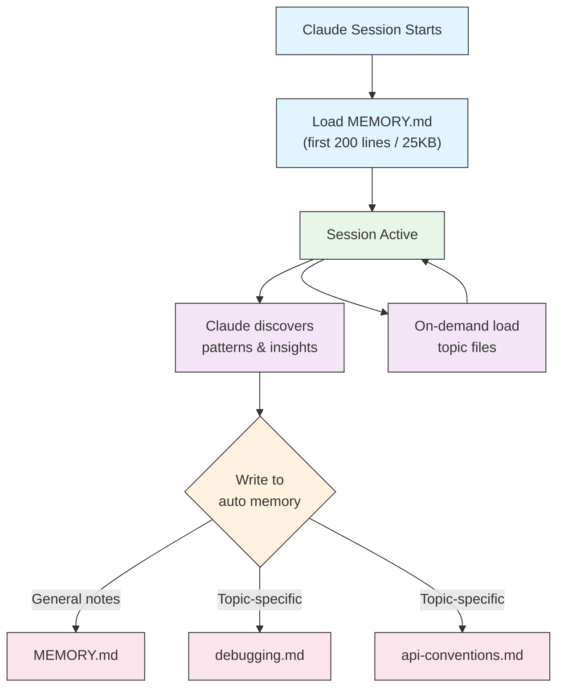

# 자동 Memory

이 문서는 Claude Code v2.1.59 이상에서 사용할 수 있는 "자동 Memory" 기능 — 즉, Claude가 세션 중에 스스로 학습한 패턴과 인사이트를 저장하는 영구 디렉터리 — 의 작동 방식, 디렉터리 구조, 설정 옵션을 정리합니다. 사용자가 직접 작성하는 CLAUDE.md와 자동 Memory가 어떻게 다르며 언제 어떤 것을 활용해야 하는지 이해하고 싶을 때 이 문서를 참조하세요. 디렉터리 위치 변경, Subagent별 Memory 범위 지정, 자동 기록의 활성화·비활성화 같은 고급 제어가 필요할 때도 여기서 정확한 옵션을 찾을 수 있습니다.

자동 memory는 Claude가 프로젝트와 작업하면서 학습한 내용, 패턴, 인사이트를 자동으로 기록하는 영구 디렉터리입니다. 사용자가 직접 작성하고 관리하는 CLAUDE.md 파일과 달리, 자동 memory는 세션 중에 Claude 자체가 작성합니다.

## 자동 Memory 작동 방식

- **위치**: `~/.claude/projects/<project>/memory/`
- **진입점**: `MEMORY.md`가 자동 memory 디렉터리의 메인 파일 역할
- **주제 파일**: 특정 주제를 위한 선택적 추가 파일 (예: `debugging.md`, `api-conventions.md`)
- **로딩 동작**: 세션 시작 시 `MEMORY.md`의 처음 200줄 (또는 처음 25KB 중 먼저 도달하는 쪽)이 컨텍스트에 로드됨. 주제 파일은 시작 시가 아닌 필요 시 로드
- **읽기/쓰기**: Claude가 세션 중 패턴과 프로젝트별 지식을 발견하면서 memory 파일을 읽고 씀

## 자동 Memory 아키텍처



## 자동 Memory 디렉터리 구조

```
~/.claude/projects/<project>/memory/
├── MEMORY.md              # Entrypoint (first 200 lines / 25KB loaded at startup)
├── debugging.md           # Topic file (loaded on demand)
├── api-conventions.md     # Topic file (loaded on demand)
└── testing-patterns.md    # Topic file (loaded on demand)
```

## 버전 요구사항

자동 memory는 **Claude Code v2.1.59 이상**이 필요합니다. 이전 버전을 사용 중이라면 먼저 업그레이드하십시오:

```bash
npm install -g @anthropic-ai/claude-code@latest
```

## 사용자 정의 자동 Memory 디렉터리

기본적으로 자동 memory는 `~/.claude/projects/<project>/memory/`에 저장됩니다. `autoMemoryDirectory` 설정을 사용하여 이 위치를 변경할 수 있습니다 (**v2.1.74**부터 사용 가능):

```jsonc
// In ~/.claude/settings.json or .claude/settings.local.json (user/local settings only)
{
  "autoMemoryDirectory": "/path/to/custom/memory/directory"
}
```

[[TIP("참고")]]
`autoMemoryDirectory`는 사용자 수준(`~/.claude/settings.json`) 또는 로컬 설정(`.claude/settings.local.json`)에서만 설정할 수 있으며, 프로젝트 또는 관리 정책 설정에서는 설정할 수 없습니다.
[[/TIP]]

다음과 같은 경우에 유용합니다:

- 자동 memory를 공유 또는 동기화된 위치에 저장하려는 경우
- 자동 memory를 기본 Claude 구성 디렉터리와 분리하려는 경우
- 기본 계층 외부의 프로젝트별 경로를 사용하려는 경우

## 워크트리 및 리포지토리 공유

동일한 git 리포지토리 내의 모든 워크트리와 하위 디렉터리는 단일 자동 memory 디렉터리를 공유합니다. 즉, 워크트리 간 전환이나 같은 리포지토리의 다른 하위 디렉터리에서 작업할 때 동일한 memory 파일을 읽고 씁니다.

## Subagent Memory

Subagent(Task 또는 병렬 실행과 같은 도구를 통해 생성됨)는 자체 memory 컨텍스트를 가질 수 있습니다. Subagent 정의에서 `memory` frontmatter 필드를 사용하여 로드할 memory 범위를 지정합니다:

```yaml
memory: user      # Load user-level memory only
memory: project   # Load project-level memory only
memory: local     # Load local memory only
```

이를 통해 subagent가 전체 memory 계층을 상속하는 대신 집중된 컨텍스트로 작동할 수 있습니다.

[[TIP("참고")]]
Subagent도 자체 자동 memory를 유지할 수 있습니다. 자세한 내용은 [공식 subagent memory 문서](https://code.claude.com/docs/ko/sub-agents#enable-persistent-memory)를 참조하십시오.
[[/TIP]]

## 자동 Memory 제어

Auto Memory를 비활성화하려면 `/memory`에서 토글하거나 프로젝트 설정에서 `autoMemoryEnabled`를 설정하세요:

```json
{
  "autoMemoryEnabled": false
}
```

환경 변수로도 제어할 수 있습니다: `CLAUDE_CODE_DISABLE_AUTO_MEMORY`

| 값 | 동작 |
|-------|----------|
| `0` | 자동 memory **강제 활성화** |
| `1` | 자동 memory **강제 비활성화** |
| *(미설정)* | 기본 동작 (자동 memory 활성화) |

```bash
# Disable auto memory for a session
CLAUDE_CODE_DISABLE_AUTO_MEMORY=1 claude

# Force auto memory on explicitly
CLAUDE_CODE_DISABLE_AUTO_MEMORY=0 claude
```
