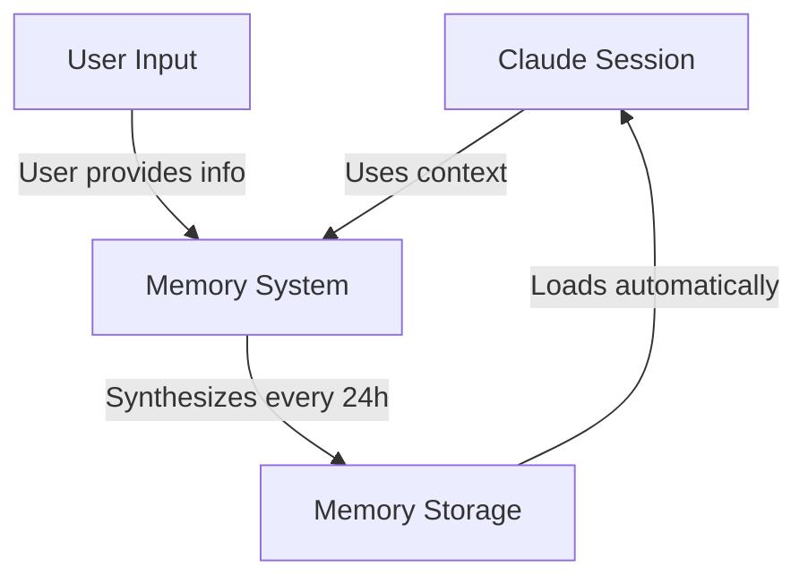

# Memory 아키텍처

이 문서는 Claude Code의 Memory 시스템이 어떻게 계층적으로 구성되어 있는지 한 장의 다이어그램으로 보여줍니다. 사용자 입력이 어떻게 Memory에 흘러 들어가고, 24시간 주기로 합성되어 다음 세션에 자동 로드되는지를 이해하고 싶을 때 참조하세요. Memory 기능을 처음 접하거나 전체 흐름을 빠르게 떠올려야 할 때 출발점이 됩니다.

Claude Code의 Memory는 다른 범위가 다른 목적을 제공하는 계층적 시스템을 따릅니다:

