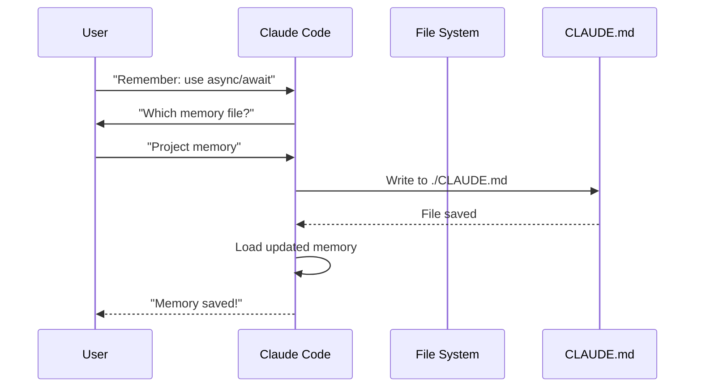

# Memory 업데이트 라이프사이클

이 문서는 사용자가 "Remember:" 같은 지시를 내렸을 때 Memory가 어떤 절차로 갱신되는지 시퀀스 다이어그램으로 보여줍니다. Claude가 어느 파일에 쓰는지 되묻는 이유, 디스크 쓰기 후 즉시 재로드되는 흐름을 이해하고 싶을 때 참조하세요. Memory 갱신 동작이 직관과 다르게 느껴질 때 디버깅 출발점으로 사용합니다.

Claude Code 세션에서 memory 업데이트가 진행되는 과정입니다:

