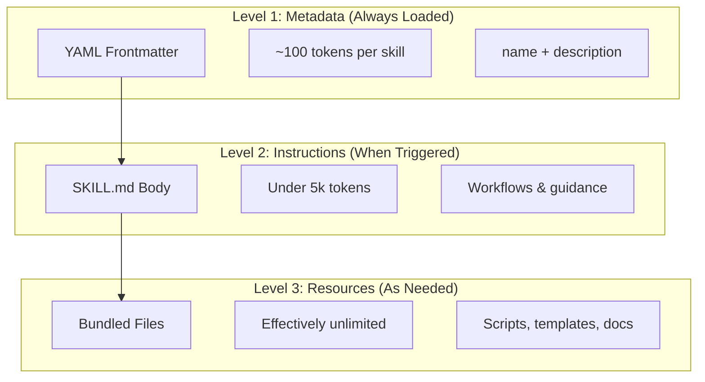
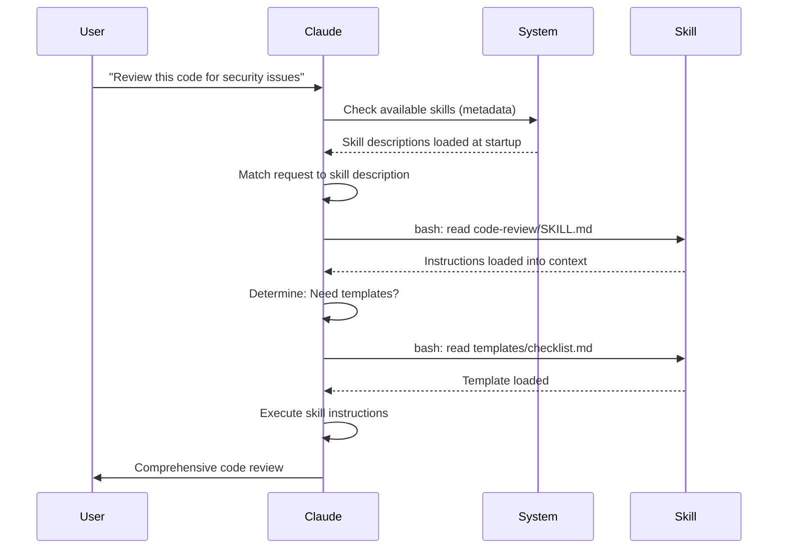

# 에이전트 스킬 가이드

에이전트 스킬은 Claude의 기능을 확장하는 재사용 가능한 파일 시스템 기반 기능입니다. 도메인별 전문 지식, 워크플로, 모범 사례를 검색 가능한 컴포넌트로 패키징하여 Claude가 관련 상황에서 자동으로 사용합니다.

## 개요

**에이전트 스킬**은 범용 에이전트를 전문가로 변환하는 모듈식 기능입니다. 프롬프트(일회성 작업을 위한 대화 수준의 지시)와 달리, 스킬은 필요할 때 로드되며 여러 대화에서 동일한 안내를 반복적으로 제공할 필요를 없애줍니다.

### 주요 이점

- **Claude 특화**: 도메인별 작업에 맞게 기능을 맞춤 설정합니다
- **반복 감소**: 한 번 만들면 대화 전반에서 자동으로 사용됩니다
- **기능 조합**: 스킬을 결합하여 복잡한 워크플로를 구축합니다
- **워크플로 확장**: 여러 프로젝트와 팀에서 스킬을 재사용합니다
- **품질 유지**: 모범 사례를 워크플로에 직접 내장합니다

스킬은 여러 AI 도구에서 작동하는 [Agent Skills](https://agentskills.io) 오픈 표준을 따릅니다. Claude Code는 호출 제어, subagent 실행, 동적 컨텍스트 주입과 같은 추가 기능으로 이 표준을 확장합니다.

> **참고**: 커스텀 slash command는 스킬로 통합되었습니다. `.claude/commands/` 파일은 여전히 작동하며 동일한 frontmatter 필드를 지원합니다. 새로운 개발에는 스킬을 권장합니다. 동일한 경로에 둘 다 존재하는 경우(예: `.claude/commands/review.md`와 `.claude/skills/review/SKILL.md`), 스킬이 우선합니다.

## 스킬 작동 방식: 점진적 공개

스킬은 **점진적 공개(Progressive Disclosure)** 아키텍처를 활용합니다. Claude는 정보를 미리 모두 소비하는 대신, 필요에 따라 단계적으로 로드합니다. 이를 통해 무제한 확장성을 유지하면서 효율적인 컨텍스트 관리가 가능합니다.

### 세 단계의 로딩



| 레벨 | 로드 시점 | 토큰 비용 | 내용 |
|-------|------------|------------|---------|
| **레벨 1: 메타데이터** | 항상 (시작 시) | 스킬당 ~100 토큰 | YAML frontmatter의 `name` 및 `description` |
| **레벨 2: 지시사항** | 스킬이 트리거될 때 | 5k 토큰 미만 | 지시사항과 가이드가 포함된 SKILL.md 본문 |
| **레벨 3+: 리소스** | 필요할 때 | 사실상 무제한 | 컨텍스트에 내용을 로드하지 않고 bash를 통해 실행되는 번들 파일 |

이는 컨텍스트 비용 없이 많은 스킬을 설치할 수 있음을 의미합니다. Claude는 실제로 트리거되기 전까지 각 스킬의 존재 여부와 사용 시점만 알고 있습니다.

## 스킬 로딩 프로세스



## 스킬 유형 및 위치

| 유형 | 위치 | 범위 | 공유 | 적합한 용도 |
|------|----------|-------|--------|----------|
| **Enterprise** | 관리 설정 | 모든 조직 사용자 | 예 | 조직 전체 표준 |
| **Personal** | `~/.claude/skills/<skill-name>/SKILL.md` | 개인 | 아니오 | 개인 워크플로 |
| **Project** | `.claude/skills/<skill-name>/SKILL.md` | 팀 | 예 (git 통해) | 팀 표준 |
| **Plugin** | `<plugin>/skills/<skill-name>/SKILL.md` | 활성화된 곳 | 상황에 따라 | 플러그인과 번들 |

동일한 이름의 스킬이 여러 레벨에 존재하면 우선순위가 높은 위치가 적용됩니다: **enterprise > personal > project**. Plugin 스킬은 `plugin-name:skill-name` 네임스페이스를 사용하므로 충돌이 발생하지 않습니다.

### 자동 검색

**중첩 디렉토리**: 하위 디렉토리의 파일로 작업할 때, Claude Code는 중첩된 `.claude/skills/` 디렉토리에서 스킬을 자동으로 검색합니다. 예를 들어 `packages/frontend/`의 파일을 편집하는 경우, Claude Code는 `packages/frontend/.claude/skills/`에서도 스킬을 찾습니다. 이는 패키지별 스킬이 있는 모노레포 구성을 지원합니다.

**`--add-dir` 디렉토리**: `--add-dir`을 통해 추가된 디렉토리의 스킬은 실시간 변경 감지와 함께 자동으로 로드됩니다. 해당 디렉토리의 스킬 파일에 대한 수정은 Claude Code를 재시작하지 않아도 즉시 반영됩니다.

**설명 예산**: 스킬 설명(레벨 1 메타데이터)은 **컨텍스트 윈도우의 1%** (폴백: **8,000자**)로 제한됩니다. 많은 스킬이 설치된 경우 설명이 단축될 수 있습니다. 모든 스킬 이름은 항상 포함되지만, 설명은 맞도록 다듬어집니다. 설명에서 핵심 사용 사례를 앞에 배치하십시오. `SLASH_COMMAND_TOOL_CHAR_BUDGET` 환경 변수로 예산을 재정의할 수 있습니다.

## 커스텀 스킬 만들기

### 기본 디렉토리 구조

```
my-skill/
├── SKILL.md           # 주요 지시사항 (필수)
├── template.md        # Claude가 채울 템플릿
├── examples/
│   └── sample.md      # 예상 형식을 보여주는 예제 출력
└── scripts/
    └── validate.sh    # Claude가 실행할 수 있는 스크립트
```

### SKILL.md 형식

```yaml
---
name: your-skill-name
description: Brief description of what this Skill does and when to use it
---

# Your Skill Name

## Instructions
Provide clear, step-by-step guidance for Claude.

## Examples
Show concrete examples of using this Skill.
```

### 필수 필드

- **name**: 소문자, 숫자, 하이픈만 가능 (최대 64자). "anthropic" 또는 "claude"를 포함할 수 없습니다.
- **description**: 스킬이 무엇을 하는지와 언제 사용하는지 (최대 250자). Claude가 스킬을 활성화할 시점을 아는 데 중요합니다.

### 선택적 Frontmatter 필드

```yaml
---
name: my-skill
description: What this skill does and when to use it
argument-hint: "[filename] [format]"        # 자동 완성을 위한 힌트
disable-model-invocation: true              # 사용자만 호출 가능
user-invocable: false                       # slash 메뉴에서 숨김
allowed-tools: Read, Grep, Glob             # 도구 접근 제한
model: opus                                 # 사용할 특정 모델
effort: high                                # 노력 수준 재정의 (low, medium, high, max)
context: fork                               # 격리된 subagent에서 실행
agent: Explore                              # 에이전트 유형 (context: fork와 함께)
shell: bash                                 # 명령어 셸: bash (기본) 또는 powershell
hooks:                                      # 스킬 범위 hook
  PreToolUse:
    - matcher: "Bash"
      hooks:
        - type: command
          command: "./scripts/validate.sh"
paths: "src/api/**/*.ts"               # 스킬 활성화를 제한하는 glob 패턴
---
```

| 필드 | 설명 |
|-------|-------------|
| `name` | 소문자, 숫자, 하이픈만 가능 (최대 64자). "anthropic" 또는 "claude"를 포함할 수 없습니다. |
| `description` | 스킬이 무엇을 하는지와 언제 사용하는지 (최대 250자). 자동 호출 매칭에 중요합니다. |
| `argument-hint` | `/` 자동 완성 메뉴에 표시되는 힌트 (예: `"[filename] [format]"`). |
| `disable-model-invocation` | `true` = 사용자만 `/name`으로 호출 가능. Claude는 절대 자동 호출하지 않습니다. |
| `user-invocable` | `false` = `/` 메뉴에서 숨겨짐. Claude만 자동으로 호출할 수 있습니다. |
| `allowed-tools` | 스킬이 권한 프롬프트 없이 사용할 수 있는 도구의 쉼표로 구분된 목록. |
| `model` | 스킬이 활성 상태인 동안의 모델 재정의 (예: `opus`, `sonnet`). |
| `effort` | 스킬이 활성 상태인 동안의 노력 수준 재정의: `low`, `medium`, `high`, 또는 `max`. |
| `context` | `fork`로 설정하면 자체 컨텍스트 윈도우를 가진 포크된 subagent 컨텍스트에서 스킬을 실행합니다. |
| `agent` | `context: fork` 시 subagent 유형 (예: `Explore`, `Plan`, `general-purpose`). |
| `shell` | `` !`command` `` 대체 및 스크립트에 사용되는 셸: `bash` (기본) 또는 `powershell`. |
| `hooks` | 이 스킬의 수명 주기에 한정된 hook (글로벌 hook과 동일한 형식). |
| `paths` | 스킬이 자동 활성화되는 시점을 제한하는 glob 패턴. 쉼표로 구분된 문자열 또는 YAML 목록. 경로별 규칙과 동일한 형식. |

## 스킬 콘텐츠 유형

스킬에는 각각 다른 목적에 적합한 두 가지 유형의 콘텐츠가 포함될 수 있습니다:

### 참조 콘텐츠

Claude가 현재 작업에 적용하는 지식을 추가합니다 - 규칙, 패턴, 스타일 가이드, 도메인 지식. 대화 컨텍스트와 인라인으로 실행됩니다.

```yaml
---
name: api-conventions
description: API design patterns for this codebase
---

When writing API endpoints:
- Use RESTful naming conventions
- Return consistent error formats
- Include request validation
```

### 작업 콘텐츠

특정 작업에 대한 단계별 지시사항입니다. `/skill-name`으로 직접 호출되는 경우가 많습니다.

```yaml
---
name: deploy
description: Deploy the application to production
context: fork
disable-model-invocation: true
---

Deploy the application:
1. Run the test suite
2. Build the application
3. Push to the deployment target
```

## 스킬 호출 제어

기본적으로 사용자와 Claude 모두 모든 스킬을 호출할 수 있습니다. 두 개의 frontmatter 필드가 세 가지 호출 모드를 제어합니다:

| Frontmatter | 사용자 호출 가능 | Claude 호출 가능 |
|---|---|---|
| (기본) | 예 | 예 |
| `disable-model-invocation: true` | 예 | 아니오 |
| `user-invocable: false` | 아니오 | 예 |

**`disable-model-invocation: true`는** 부작용이 있는 워크플로에 사용합니다: `/commit`, `/deploy`, `/send-slack-message`. 코드가 준비되어 보인다고 Claude가 배포를 결정하는 것을 원하지 않을 것입니다.

**`user-invocable: false`는** 명령으로는 의미 없는 배경 지식에 사용합니다. `legacy-system-context` 스킬은 이전 시스템의 작동 방식을 설명합니다. Claude에게는 유용하지만, 사용자에게는 의미 있는 액션이 아닙니다.

## 문자열 대체

스킬은 스킬 콘텐츠가 Claude에 도달하기 전에 해석되는 동적 값을 지원합니다:

| 변수 | 설명 |
|----------|-------------|
| `$ARGUMENTS` | 스킬 호출 시 전달된 모든 인수 |
| `$ARGUMENTS[N]` 또는 `$N` | 인덱스로 특정 인수 접근 (0 기반) |
| `${CLAUDE_SESSION_ID}` | 현재 세션 ID |
| `${CLAUDE_SKILL_DIR}` | 스킬의 SKILL.md 파일이 포함된 디렉토리 |
| `` !`command` `` | 동적 컨텍스트 주입 - 셸 명령을 실행하고 출력을 인라인으로 삽입 |

**예시:**

```yaml
---
name: fix-issue
description: Fix a GitHub issue
---

Fix GitHub issue $ARGUMENTS following our coding standards.
1. Read the issue description
2. Implement the fix
3. Write tests
4. Create a commit
```

`/fix-issue 123`을 실행하면 `$ARGUMENTS`가 `123`으로 대체됩니다.

## 동적 컨텍스트 주입

`` !`command` `` 구문은 스킬 콘텐츠가 Claude에 전송되기 전에 셸 명령을 실행합니다:

```yaml
---
name: pr-summary
description: Summarize changes in a pull request
context: fork
agent: Explore
---

## Pull request context
- PR diff: !`gh pr diff`
- PR comments: !`gh pr view --comments`
- Changed files: !`gh pr diff --name-only`

## Your task
Summarize this pull request...
```

명령은 즉시 실행되며, Claude는 최종 출력만 봅니다. 기본적으로 명령은 `bash`에서 실행됩니다. PowerShell을 사용하려면 frontmatter에서 `shell: powershell`을 설정하십시오.

## Subagent에서 스킬 실행

`context: fork`를 추가하면 격리된 subagent 컨텍스트에서 스킬이 실행됩니다. 스킬 콘텐츠는 자체 컨텍스트 윈도우를 가진 전용 subagent의 작업이 되어 메인 대화를 깔끔하게 유지합니다.

`agent` 필드는 사용할 에이전트 유형을 지정합니다:

| 에이전트 유형 | 적합한 용도 |
|---|---|
| `Explore` | 읽기 전용 조사, 코드베이스 분석 |
| `Plan` | 구현 계획 작성 |
| `general-purpose` | 모든 도구가 필요한 광범위한 작업 |
| Custom agents | 구성에서 정의된 전문화된 에이전트 |

**frontmatter 예시:**

```yaml
---
context: fork
agent: Explore
---
```

**전체 스킬 예시:**

```yaml
---
name: deep-research
description: Research a topic thoroughly
context: fork
agent: Explore
---

Research $ARGUMENTS thoroughly:
1. Find relevant files using Glob and Grep
2. Read and analyze the code
3. Summarize findings with specific file references
```

## 실전 예시

### 예시 1: 코드 리뷰 스킬

**디렉토리 구조:**

```
~/.claude/skills/code-review/
├── SKILL.md
├── templates/
│   ├── review-checklist.md
│   └── finding-template.md
└── scripts/
    ├── analyze-metrics.py
    └── compare-complexity.py
```

**파일:** `~/.claude/skills/code-review/SKILL.md`

```yaml
---
name: code-review-specialist
description: Comprehensive code review with security, performance, and quality analysis. Use when users ask to review code, analyze code quality, evaluate pull requests, or mention code review, security analysis, or performance optimization.
---

# Code Review Skill

This skill provides comprehensive code review capabilities focusing on:

1. **Security Analysis**
   - Authentication/authorization issues
   - Data exposure risks
   - Injection vulnerabilities
   - Cryptographic weaknesses

2. **Performance Review**
   - Algorithm efficiency (Big O analysis)
   - Memory optimization
   - Database query optimization
   - Caching opportunities

3. **Code Quality**
   - SOLID principles
   - Design patterns
   - Naming conventions
   - Test coverage

4. **Maintainability**
   - Code readability
   - Function size (should be < 50 lines)
   - Cyclomatic complexity
   - Type safety

## Review Template

For each piece of code reviewed, provide:

### Summary
- Overall quality assessment (1-5)
- Key findings count
- Recommended priority areas

### Critical Issues (if any)
- **Issue**: Clear description
- **Location**: File and line number
- **Impact**: Why this matters
- **Severity**: Critical/High/Medium
- **Fix**: Code example

For detailed checklists, see [templates/review-checklist.md](templates/review-checklist.md).
```

### 예시 2: 코드베이스 시각화 스킬

인터랙티브 HTML 시각화를 생성하는 스킬입니다:

**디렉토리 구조:**

```
~/.claude/skills/codebase-visualizer/
├── SKILL.md
└── scripts/
    └── visualize.py
```

**파일:** `~/.claude/skills/codebase-visualizer/SKILL.md`

````yaml
---
name: codebase-visualizer
description: Generate an interactive collapsible tree visualization of your codebase. Use when exploring a new repo, understanding project structure, or identifying large files.
allowed-tools: Bash(python *)
---

# Codebase Visualizer

Generate an interactive HTML tree view showing your project's file structure.

## Usage

Run the visualization script from your project root:

```bash
python ~/.claude/skills/codebase-visualizer/scripts/visualize.py .
```

This creates `codebase-map.html` and opens it in your default browser.

## What the visualization shows

- **Collapsible directories**: Click folders to expand/collapse
- **File sizes**: Displayed next to each file
- **Colors**: Different colors for different file types
- **Directory totals**: Shows aggregate size of each folder
````

번들된 Python 스크립트가 실제 작업을 수행하고 Claude는 오케스트레이션을 담당합니다.

### 예시 3: 배포 스킬 (사용자 호출만 가능)

```yaml
---
name: deploy
description: Deploy the application to production
disable-model-invocation: true
allowed-tools: Bash(npm *), Bash(git *)
---

Deploy $ARGUMENTS to production:

1. Run the test suite: `npm test`
2. Build the application: `npm run build`
3. Push to the deployment target
4. Verify the deployment succeeded
5. Report deployment status
```

### 예시 4: 브랜드 보이스 스킬 (배경 지식)

```yaml
---
name: brand-voice
description: Ensure all communication matches brand voice and tone guidelines. Use when creating marketing copy, customer communications, or public-facing content.
user-invocable: false
---

## Tone of Voice
- **Friendly but professional** - approachable without being casual
- **Clear and concise** - avoid jargon
- **Confident** - we know what we're doing
- **Empathetic** - understand user needs

## Writing Guidelines
- Use "you" when addressing readers
- Use active voice
- Keep sentences under 20 words
- Start with value proposition

For templates, see [templates/](templates/).
```

### 예시 5: CLAUDE.md 생성기 스킬

```yaml
---
name: claude-md
description: Create or update CLAUDE.md files following best practices for optimal AI agent onboarding. Use when users mention CLAUDE.md, project documentation, or AI onboarding.
---

## Core Principles

**LLMs are stateless**: CLAUDE.md is the only file automatically included in every conversation.

### The Golden Rules

1. **Less is More**: Keep under 300 lines (ideally under 100)
2. **Universal Applicability**: Only include information relevant to EVERY session
3. **Don't Use Claude as a Linter**: Use deterministic tools instead
4. **Never Auto-Generate**: Craft it manually with careful consideration

## Essential Sections

- **Project Name**: Brief one-line description
- **Tech Stack**: Primary language, frameworks, database
- **Development Commands**: Install, test, build commands
- **Critical Conventions**: Only non-obvious, high-impact conventions
- **Known Issues / Gotchas**: Things that trip up developers
```

### 예시 6: 리팩토링 스킬과 스크립트

**디렉토리 구조:**

```
refactor/
├── SKILL.md
├── references/
│   ├── code-smells.md
│   └── refactoring-catalog.md
├── templates/
│   └── refactoring-plan.md
└── scripts/
    ├── analyze-complexity.py
    └── detect-smells.py
```

**파일:** `refactor/SKILL.md`

```yaml
---
name: code-refactor
description: Systematic code refactoring based on Martin Fowler's methodology. Use when users ask to refactor code, improve code structure, reduce technical debt, or eliminate code smells.
---

# Code Refactoring Skill

A phased approach emphasizing safe, incremental changes backed by tests.

## Workflow

Phase 1: Research & Analysis → Phase 2: Test Coverage Assessment →
Phase 3: Code Smell Identification → Phase 4: Refactoring Plan Creation →
Phase 5: Incremental Implementation → Phase 6: Review & Iteration

## Core Principles

1. **Behavior Preservation**: External behavior must remain unchanged
2. **Small Steps**: Make tiny, testable changes
3. **Test-Driven**: Tests are the safety net
4. **Continuous**: Refactoring is ongoing, not a one-time event

For code smell catalog, see [references/code-smells.md](references/code-smells.md).
For refactoring techniques, see [references/refactoring-catalog.md](references/refactoring-catalog.md).
```

## 지원 파일

스킬은 `SKILL.md` 외에 디렉토리에 여러 파일을 포함할 수 있습니다. 이러한 지원 파일(템플릿, 예제, 스크립트, 참조 문서)을 통해 메인 스킬 파일을 집중적으로 유지하면서 Claude에 필요에 따라 로드할 수 있는 추가 리소스를 제공합니다.

```
my-skill/
├── SKILL.md              # 주요 지시사항 (필수, 500줄 미만 유지)
├── templates/            # Claude가 채울 템플릿
│   └── output-format.md
├── examples/             # 예상 형식을 보여주는 예제 출력
│   └── sample-output.md
├── references/           # 도메인 지식 및 사양
│   └── api-spec.md
└── scripts/              # Claude가 실행할 수 있는 스크립트
    └── validate.sh
```

지원 파일 가이드라인:

- `SKILL.md`를 **500줄** 미만으로 유지하십시오. 상세한 참조 자료, 대규모 예제, 사양은 별도 파일로 이동하십시오.
- `SKILL.md`에서 추가 파일을 **상대 경로**로 참조하십시오 (예: `[API reference](references/api-spec.md)`).
- 지원 파일은 레벨 3(필요 시)에서 로드되므로 Claude가 실제로 읽을 때까지 컨텍스트를 소비하지 않습니다.

## 스킬 관리

### 사용 가능한 스킬 보기

Claude에 직접 물어보십시오:
```
What Skills are available?
```

또는 파일 시스템을 확인하십시오:
```bash
# 개인 스킬 목록
ls ~/.claude/skills/

# 프로젝트 스킬 목록
ls .claude/skills/
```

### 스킬 테스트

두 가지 테스트 방법이 있습니다:

**설명과 일치하는 요청을 통해 Claude가 자동으로 호출하게 합니다**:
```
Can you help me review this code for security issues?
```

**또는 스킬 이름으로 직접 호출합니다**:
```
/code-review src/auth/login.ts
```

### 스킬 업데이트

`SKILL.md` 파일을 직접 편집하십시오. 변경 사항은 다음 Claude Code 시작 시 적용됩니다.

```bash
# 개인 스킬
code ~/.claude/skills/my-skill/SKILL.md

# 프로젝트 스킬
code .claude/skills/my-skill/SKILL.md
```

### Claude의 스킬 접근 제한

Claude가 호출할 수 있는 스킬을 제어하는 세 가지 방법이 있습니다:

**모든 스킬 비활성화** `/permissions`에서:
```
# 거부 규칙에 추가:
Skill
```

**특정 스킬 허용 또는 거부**:
```
# 특정 스킬만 허용
Skill(commit)
Skill(review-pr *)

# 특정 스킬 거부
Skill(deploy *)
```

**개별 스킬 숨기기** frontmatter에 `disable-model-invocation: true`를 추가합니다.

## 모범 사례

### 1. 설명을 구체적으로 작성합니다

- **나쁜 예 (모호함)**: "Helps with documents"
- **좋은 예 (구체적)**: "Extract text and tables from PDF files, fill forms, merge documents. Use when working with PDF files or when the user mentions PDFs, forms, or document extraction."

### 2. 스킬을 집중적으로 유지합니다

- 하나의 스킬 = 하나의 기능
- "PDF form filling"
- "Document processing" (너무 광범위)

### 3. 트리거 용어를 포함합니다

사용자 요청과 일치하는 키워드를 설명에 추가합니다:
```yaml
description: Analyze Excel spreadsheets, generate pivot tables, create charts. Use when working with Excel files, spreadsheets, or .xlsx files.
```

### 4. SKILL.md를 500줄 미만으로 유지합니다

상세한 참조 자료는 Claude가 필요에 따라 로드하는 별도 파일로 이동합니다.

### 5. 지원 파일을 참조합니다

```markdown
## Additional resources

- For complete API details, see [reference.md](reference.md)
- For usage examples, see [examples.md](examples.md)
```

### 해야 할 것

- 명확하고 설명적인 이름을 사용합니다
- 포괄적인 지시사항을 포함합니다
- 구체적인 예제를 추가합니다
- 관련 스크립트와 템플릿을 패키징합니다
- 실제 시나리오로 테스트합니다
- 의존성을 문서화합니다

### 하지 말아야 할 것

- 일회성 작업을 위한 스킬을 만들지 마십시오
- 기존 기능을 중복하지 마십시오
- 스킬을 너무 광범위하게 만들지 마십시오
- 설명 필드를 건너뛰지 마십시오
- 신뢰할 수 없는 소스의 스킬을 감사 없이 설치하지 마십시오

## 문제 해결

### 빠른 참조

| 문제 | 해결 방법 |
|-------|----------|
| Claude가 스킬을 사용하지 않음 | 트리거 용어를 포함하여 설명을 더 구체적으로 만듭니다 |
| 스킬 파일을 찾을 수 없음 | 경로 확인: `~/.claude/skills/name/SKILL.md` |
| YAML 오류 | `---` 마커, 들여쓰기, 탭 없음을 확인합니다 |
| 스킬 충돌 | 설명에서 고유한 트리거 용어를 사용합니다 |
| 스크립트가 실행되지 않음 | 권한 확인: `chmod +x scripts/*.py` |
| Claude가 모든 스킬을 보지 못함 | 스킬이 너무 많음; `/context`에서 경고를 확인합니다 |

### 스킬이 트리거되지 않는 경우

Claude가 예상대로 스킬을 사용하지 않는 경우:

1. 설명에 사용자가 자연스럽게 말할 키워드가 포함되어 있는지 확인합니다
2. "What skills are available?"을 물어볼 때 스킬이 나타나는지 확인합니다
3. 설명에 맞게 요청을 다시 표현해 봅니다
4. `/skill-name`으로 직접 호출하여 테스트합니다

### 스킬이 너무 자주 트리거되는 경우

원하지 않을 때 Claude가 스킬을 사용하는 경우:

1. 설명을 더 구체적으로 만듭니다
2. 수동 호출만 가능하도록 `disable-model-invocation: true`를 추가합니다

### Claude가 모든 스킬을 보지 못하는 경우

스킬 설명은 **컨텍스트 윈도우의 1%** (폴백: **8,000자**)에서 로드됩니다. 각 항목은 예산에 관계없이 250자로 제한됩니다. `/context`를 실행하여 제외된 스킬에 대한 경고를 확인하십시오. `SLASH_COMMAND_TOOL_CHAR_BUDGET` 환경 변수로 예산을 재정의할 수 있습니다.

## 보안 고려사항

**신뢰할 수 있는 소스의 스킬만 사용하십시오.** 스킬은 지시사항과 코드를 통해 Claude에 기능을 제공합니다. 악의적인 스킬은 Claude가 도구를 호출하거나 해로운 방식으로 코드를 실행하도록 유도할 수 있습니다.

**주요 보안 고려사항:**

- **철저히 감사**: 스킬 디렉토리의 모든 파일을 검토합니다
- **외부 소스는 위험**: 외부 URL에서 가져오는 스킬은 손상될 수 있습니다
- **도구 오용**: 악의적인 스킬은 해로운 방식으로 도구를 호출할 수 있습니다
- **소프트웨어 설치처럼 취급**: 신뢰할 수 있는 소스의 스킬만 사용합니다

## 스킬 vs 다른 기능

| 기능 | 호출 방식 | 적합한 용도 |
|---------|------------|----------|
| **스킬** | 자동 또는 `/name` | 재사용 가능한 전문 지식, 워크플로 |
| **Slash Command** | 사용자 시작 `/name` | 빠른 단축키 (스킬로 통합됨) |
| **Subagent** | 자동 위임 | 격리된 작업 실행 |
| **Memory (CLAUDE.md)** | 항상 로드 | 영구적인 프로젝트 컨텍스트 |
| **MCP** | 실시간 | 외부 데이터/서비스 접근 |
| **Hook** | 이벤트 기반 | 자동화된 부작용 |

## 번들 스킬

Claude Code에는 설치 없이 항상 사용할 수 있는 여러 내장 스킬이 포함되어 있습니다:

| 스킬 | 설명 |
|-------|-------------|
| `/simplify` | 변경된 파일의 재사용성, 품질, 효율성을 검토합니다; 3개의 병렬 리뷰 에이전트를 생성합니다 |
| `/batch <instruction>` | git worktree를 사용하여 코드베이스 전반에 걸친 대규모 병렬 변경을 오케스트레이션합니다 |
| `/debug [description]` | 디버그 로그를 읽어 현재 세션의 문제를 해결합니다 |
| `/loop [interval] <prompt>` | 주어진 간격으로 프롬프트를 반복 실행합니다 (예: `/loop 5m check the deploy`) |
| `/claude-api` | Claude API/SDK 레퍼런스를 로드합니다; `anthropic`/`@anthropic-ai/sdk` import 시 자동 활성화됩니다 |

이 스킬들은 설치나 설정 없이 바로 사용할 수 있습니다. 커스텀 스킬과 동일한 SKILL.md 형식을 따릅니다.

## 스킬 공유

### 프로젝트 스킬 (팀 공유)

1. `.claude/skills/`에 스킬을 생성합니다
2. git에 커밋합니다
3. 팀원들이 변경 사항을 pull하면 스킬이 즉시 사용 가능합니다

### 개인 스킬

```bash
# 개인 디렉토리에 복사
cp -r my-skill ~/.claude/skills/

# 스크립트를 실행 가능하게 만들기
chmod +x ~/.claude/skills/my-skill/scripts/*.py
```

### Plugin 배포

더 넓은 배포를 위해 plugin의 `skills/` 디렉토리에 스킬을 패키징합니다.

## 추가 리소스

- [공식 스킬 문서](https://code.claude.com/docs/ko/skills)
- [에이전트 스킬 아키텍처 블로그](https://claude.com/blog/equipping-agents-for-the-real-world-with-agent-skills)
- [Slash Command 가이드](../../01-slash-commands/) - 사용자 시작 단축키
- [Subagent 가이드](../../04-subagents/) - 위임된 AI 에이전트
- [Memory 가이드](../../02-memory/) - 영구적인 컨텍스트
- [MCP (Model Context Protocol)](../../05-mcp/) - 실시간 외부 데이터
- [Hook 가이드](../../06-hooks/) - 이벤트 기반 자동화

---
