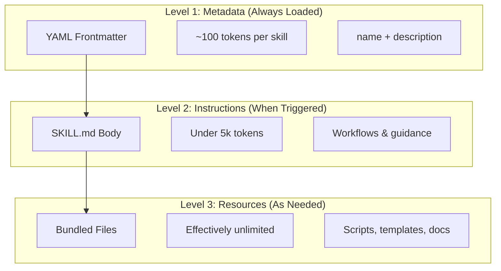

# 스킬 작동 방식: 점진적 공개

이 문서는 스킬이 컨텍스트를 어떻게 절약하면서도 무제한 확장성을 유지하는지 설명합니다.
스킬을 처음 도입할 때, 또는 "왜 스킬을 많이 깔아도 컨텍스트가 안 터지는가"가 궁금할 때 읽으세요.
세 단계 로딩(메타데이터 → 지시사항 → 리소스) 모델을 이해하면 스킬 설계와 운영 결정이 명확해집니다.

스킬은 **점진적 공개(Progressive Disclosure)** 아키텍처를 활용합니다. Claude는 정보를 미리 모두 소비하는 대신, 필요에 따라 단계적으로 로드합니다. 이를 통해 무제한 확장성을 유지하면서 효율적인 컨텍스트 관리가 가능합니다.

## 세 단계의 로딩

| 레벨 | 로드 시점 | 토큰 비용 | 내용 |
|-------|------------|------------|---------|
| **레벨 1: 메타데이터** | 항상 (시작 시) | 스킬당 ~100 토큰 | YAML frontmatter의 `name` 및 `description` |
| **레벨 2: 지시사항** | 스킬이 트리거될 때 | 5k 토큰 미만 | 지시사항과 가이드가 포함된 SKILL.md 본문 |
| **레벨 3+: 리소스** | 필요할 때 | 사실상 무제한 | 컨텍스트에 내용을 로드하지 않고 bash를 통해 실행되는 번들 파일 |

이는 컨텍스트 비용 없이 많은 스킬을 설치할 수 있음을 의미합니다. Claude는 실제로 트리거되기 전까지 각 스킬의 존재 여부와 사용 시점만 알고 있습니다.
