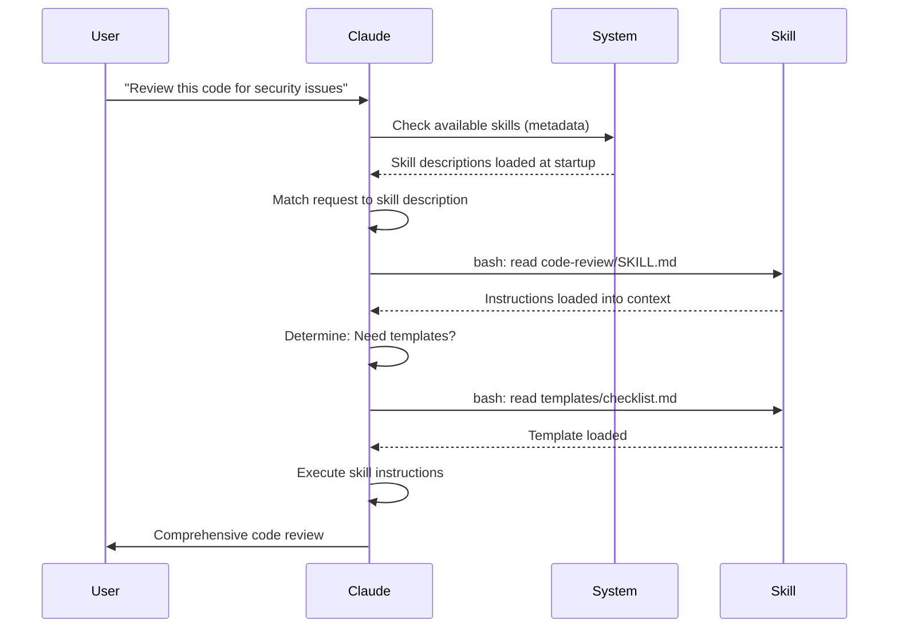

# 스킬 로딩 프로세스

이 문서는 사용자 요청이 스킬 호출로 이어지는 전체 시퀀스를 보여줍니다.
스킬이 "왜 호출되었는가" 또는 "왜 호출되지 않았는가"를 디버깅할 때 이 흐름을 알면 빠르게 원인을 좁힐 수 있습니다.
설명문 매칭, SKILL.md 본문 로드, 지원 파일 추가 로드 단계를 분리해서 이해하세요.

```mermaid
sequenceDiagram
    participant User
    participant Claude as Claude
    participant System as System
    participant Skill as Skill

    User->>Claude: "Review this code for security issues"
    Claude->>System: Check available skills (metadata)
    System-->>Claude: Skill descriptions loaded at startup
    Claude->>Claude: Match request to skill description
    Claude->>Skill: bash: read code-review/SKILL.md
    Skill-->>Claude: Instructions loaded into context
    Claude->>Claude: Determine: Need templates?
    Claude->>Skill: bash: read templates/checklist.md
    Skill-->>Claude: Template loaded
    Claude->>Claude: Execute skill instructions
    Claude->>User: Comprehensive code review
```
