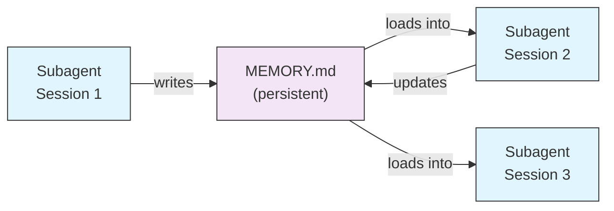
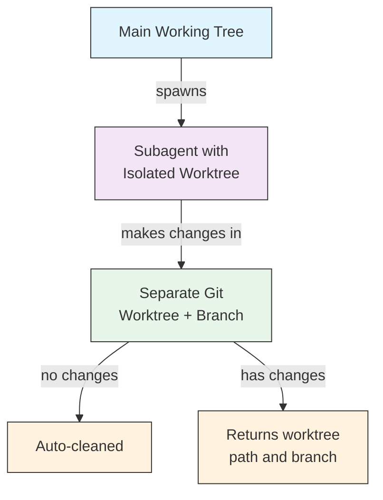
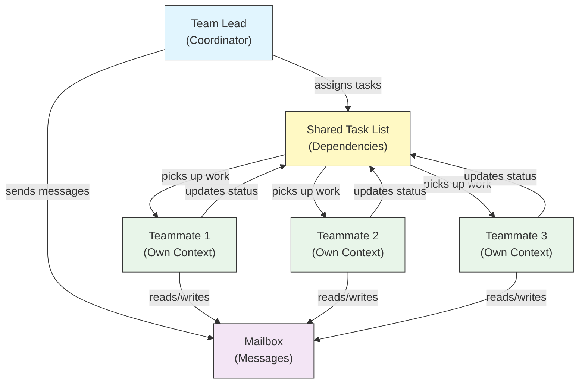
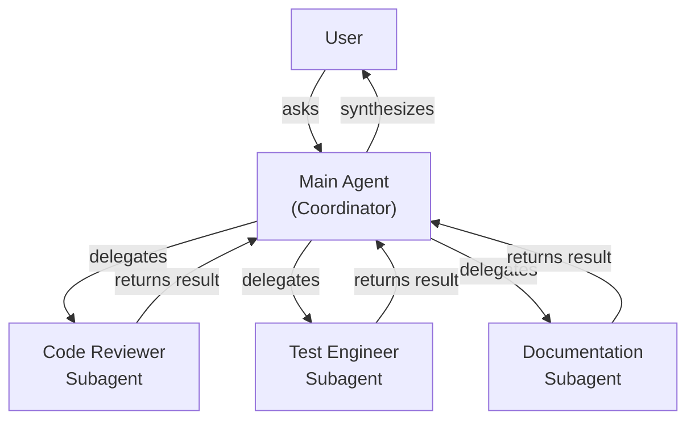
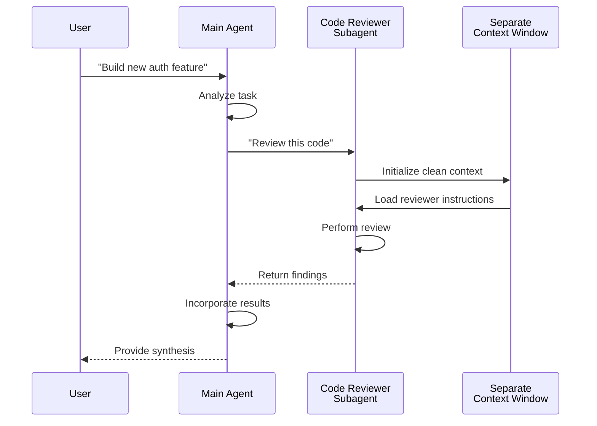
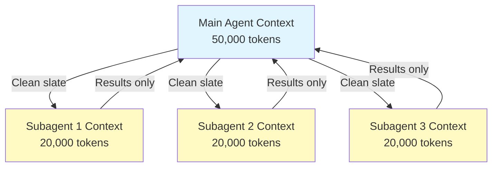
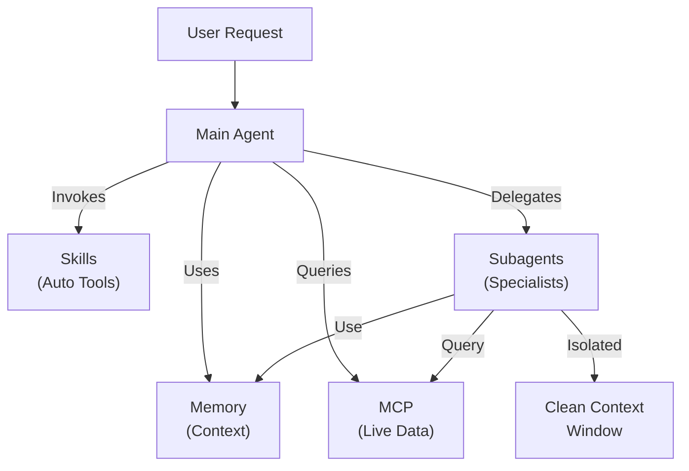

<picture>
  <source media="(prefers-color-scheme: dark)" srcset="../../resources/logos/claude-howto-logo-dark.svg">
  
</picture>

# Subagent - 완전 참조 가이드

Subagent는 Claude Code가 작업을 위임할 수 있는 전문화된 AI 어시스턴트입니다. 각 subagent는 특정 목적을 가지며, 메인 대화와 분리된 자체 컨텍스트 윈도우를 사용하고, 특정 도구와 커스텀 시스템 프롬프트로 구성할 수 있습니다.

## 목차

1. [개요](#개요)
2. [주요 이점](#주요-이점)
3. [파일 위치](#파일-위치)
4. [구성](#구성)
5. [내장 Subagent](#내장-subagent)
6. [Subagent 관리](#subagent-관리)
7. [Subagent 사용](#subagent-사용)
8. [재개 가능한 Agent](#재개-가능한-agent)
9. [Subagent 체이닝](#subagent-체이닝)
10. [Subagent 영구 메모리](#subagent-영구-메모리)
11. [백그라운드 Subagent](#백그라운드-subagent)
12. [Worktree 격리](#worktree-격리)
13. [생성 가능한 Subagent 제한](#생성-가능한-subagent-제한)
14. [`claude agents` CLI 명령어](#claude-agents-cli-명령어)
15. [Agent Teams (실험적)](#agent-teams-실험적)
16. [Plugin Subagent 보안](#plugin-subagent-보안)
17. [아키텍처](#아키텍처)
18. [컨텍스트 관리](#컨텍스트-관리)
19. [Subagent 사용 시점](#subagent-사용-시점)
20. [모범 사례](#모범-사례)
21. [이 폴더의 예제 Subagent](#이-폴더의-예제-subagent)
22. [설치 안내](#설치-안내)
23. [관련 개념](#관련-개념)

---

## 개요

Subagent는 Claude Code에서 위임된 작업 실행을 가능하게 합니다:

- 별도의 컨텍스트 윈도우를 가진 **격리된 AI 어시스턴트** 생성
- 전문 지식을 위한 **커스텀 시스템 프롬프트** 제공
- 기능을 제한하기 위한 **도구 접근 제어** 적용
- 복잡한 작업으로 인한 **컨텍스트 오염 방지**
- 여러 전문 작업의 **병렬 실행** 지원

각 subagent는 깨끗한 상태에서 독립적으로 작동하며, 작업에 필요한 특정 컨텍스트만 전달받은 후 메인 agent에 결과를 반환하여 종합합니다.

**빠른 시작**: `/agents` 명령어를 사용하여 subagent를 대화식으로 생성, 확인, 편집 및 관리할 수 있습니다.

---

## 주요 이점

| 이점 | 설명 |
|---------|-------------|
| **컨텍스트 보존** | 별도의 컨텍스트에서 작동하여 메인 대화의 오염을 방지합니다 |
| **전문 지식** | 특정 도메인에 맞게 조정되어 더 높은 성공률을 보입니다 |
| **재사용성** | 여러 프로젝트에서 사용하고 팀과 공유할 수 있습니다 |
| **유연한 권한** | subagent 유형별로 서로 다른 도구 접근 수준을 설정할 수 있습니다 |
| **확장성** | 여러 agent가 서로 다른 측면을 동시에 처리합니다 |

---

## 파일 위치

Subagent 파일은 서로 다른 범위의 여러 위치에 저장할 수 있습니다:

| 우선순위 | 유형 | 위치 | 범위 |
|----------|------|----------|-------|
| 1 (최고) | **CLI 정의** | `--agents` 플래그 사용 (JSON) | 세션 한정 |
| 2 | **프로젝트 subagent** | `.claude/agents/` | 현재 프로젝트 |
| 3 | **사용자 subagent** | `~/.claude/agents/` | 모든 프로젝트 |
| 4 (최저) | **Plugin agent** | Plugin `agents/` 디렉토리 | Plugin 경유 |

중복된 이름이 있을 경우, 우선순위가 높은 소스가 우선합니다.

---

## 구성

### 파일 형식

Subagent는 YAML frontmatter와 그 뒤에 이어지는 마크다운 형식의 시스템 프롬프트로 정의됩니다:

```yaml
---
name: your-sub-agent-name
description: Description of when this subagent should be invoked
tools: tool1, tool2, tool3  # Optional - inherits all tools if omitted
disallowedTools: tool4  # Optional - explicitly disallowed tools
model: sonnet  # Optional - sonnet, opus, haiku, or inherit
permissionMode: default  # Optional - permission mode
maxTurns: 20  # Optional - limit agentic turns
skills: skill1, skill2  # Optional - skills to preload into context
mcpServers: server1  # Optional - MCP servers to make available
memory: user  # Optional - persistent memory scope (user, project, local)
background: false  # Optional - run as background task
effort: high  # Optional - reasoning effort (low, medium, high, max)
isolation: worktree  # Optional - git worktree isolation
initialPrompt: "Start by analyzing the codebase"  # Optional - auto-submitted first turn
hooks:  # Optional - component-scoped hooks
  PreToolUse:
    - matcher: "Bash"
      hooks:
        - type: command
          command: "./scripts/security-check.sh"
---

Your subagent's system prompt goes here. This can be multiple paragraphs
and should clearly define the subagent's role, capabilities, and approach
to solving problems.
```

### 구성 필드

| 필드 | 필수 | 설명 |
|-------|----------|-------------|
| `name` | 예 | 고유 식별자 (소문자와 하이픈) |
| `description` | 예 | 목적에 대한 자연어 설명. 자동 호출을 장려하려면 "use PROACTIVELY"를 포함하세요 |
| `tools` | 아니오 | 쉼표로 구분된 특정 도구 목록. 생략하면 모든 도구를 상속합니다. 생성 가능한 subagent를 제한하기 위해 `Agent(agent_name)` 구문을 지원합니다 |
| `disallowedTools` | 아니오 | subagent가 사용해서는 안 되는 도구의 쉼표 구분 목록 |
| `model` | 아니오 | 사용할 모델: `sonnet`, `opus`, `haiku`, 전체 모델 ID, 또는 `inherit`. 기본값은 구성된 subagent 모델입니다 |
| `permissionMode` | 아니오 | `default`, `acceptEdits`, `dontAsk`, `bypassPermissions`, `plan` |
| `maxTurns` | 아니오 | subagent가 수행할 수 있는 최대 에이전트 턴 수 |
| `skills` | 아니오 | 사전 로드할 skill의 쉼표 구분 목록. 시작 시 subagent의 컨텍스트에 전체 skill 내용을 주입합니다 |
| `mcpServers` | 아니오 | subagent에서 사용 가능한 MCP 서버 |
| `hooks` | 아니오 | 컴포넌트 범위 hook (PreToolUse, PostToolUse, Stop) |
| `memory` | 아니오 | 영구 메모리 디렉토리 범위: `user`, `project`, 또는 `local` |
| `background` | 아니오 | `true`로 설정하면 이 subagent를 항상 백그라운드 작업으로 실행합니다 |
| `effort` | 아니오 | 추론 노력 수준: `low`, `medium`, `high`, 또는 `max` |
| `isolation` | 아니오 | `worktree`로 설정하면 subagent에 자체 git worktree를 부여합니다 |
| `initialPrompt` | 아니오 | subagent가 메인 agent로 실행될 때 자동 제출되는 첫 번째 턴 |

### 도구 구성 옵션

**옵션 1: 모든 도구 상속 (필드 생략)**
```yaml
---
name: full-access-agent
description: Agent with all available tools
---
```

**옵션 2: 개별 도구 지정**
```yaml
---
name: limited-agent
description: Agent with specific tools only
tools: Read, Grep, Glob, Bash
---
```

**옵션 3: 조건부 도구 접근**
```yaml
---
name: conditional-agent
description: Agent with filtered tool access
tools: Read, Bash(npm:*), Bash(test:*)
---
```

### CLI 기반 구성

`--agents` 플래그와 JSON 형식을 사용하여 단일 세션용 subagent를 정의할 수 있습니다:

```bash
claude --agents '{
  "code-reviewer": {
    "description": "Expert code reviewer. Use proactively after code changes.",
    "prompt": "You are a senior code reviewer. Focus on code quality, security, and best practices.",
    "tools": ["Read", "Grep", "Glob", "Bash"],
    "model": "sonnet"
  }
}'
```

**`--agents` 플래그의 JSON 형식:**

```json
{
  "agent-name": {
    "description": "Required: when to invoke this agent",
    "prompt": "Required: system prompt for the agent",
    "tools": ["Optional", "array", "of", "tools"],
    "model": "optional: sonnet|opus|haiku"
  }
}
```

**Agent 정의 우선순위:**

Agent 정의는 다음 우선순위로 로드됩니다 (첫 번째 매칭이 적용):
1. **CLI 정의** - `--agents` 플래그 (세션 한정, JSON)
2. **프로젝트 레벨** - `.claude/agents/` (현재 프로젝트)
3. **사용자 레벨** - `~/.claude/agents/` (모든 프로젝트)
4. **Plugin 레벨** - Plugin `agents/` 디렉토리

이를 통해 CLI 정의가 단일 세션에서 다른 모든 소스를 재정의할 수 있습니다.

---

## 내장 Subagent

Claude Code에는 항상 사용 가능한 여러 내장 subagent가 포함되어 있습니다:

| Agent | 모델 | 용도 |
|-------|-------|---------|
| **general-purpose** | 상속 | 복잡한 다단계 작업 |
| **Plan** | 상속 | plan 모드를 위한 리서치 |
| **Explore** | Haiku | 읽기 전용 코드베이스 탐색 (빠름/중간/매우 철저) |
| **Bash** | 상속 | 별도 컨텍스트에서 터미널 명령 실행 |
| **statusline-setup** | Sonnet | 상태 표시줄 구성 |
| **Claude Code Guide** | Haiku | Claude Code 기능 관련 질문 응답 |

### General-Purpose Subagent

| 속성 | 값 |
|----------|-------|
| **모델** | 부모로부터 상속 |
| **도구** | 모든 도구 |
| **용도** | 복잡한 리서치 작업, 다단계 작업, 코드 수정 |

**사용 시점**: 복잡한 추론과 함께 탐색과 수정을 모두 필요로 하는 작업.

### Plan Subagent

| 속성 | 값 |
|----------|-------|
| **모델** | 부모로부터 상속 |
| **도구** | Read, Glob, Grep, Bash |
| **용도** | plan 모드에서 코드베이스 리서치를 위해 자동으로 사용됨 |

**사용 시점**: Claude가 계획을 제시하기 전에 코드베이스를 이해해야 할 때.

### Explore Subagent

| 속성 | 값 |
|----------|-------|
| **모델** | Haiku (빠름, 저지연) |
| **모드** | 엄격한 읽기 전용 |
| **도구** | Glob, Grep, Read, Bash (읽기 전용 명령만) |
| **용도** | 빠른 코드베이스 검색 및 분석 |

**사용 시점**: 변경 없이 코드를 검색하거나 이해할 때.

**정밀도 수준** - 탐색 깊이를 지정합니다:
- **"quick"** - 최소한의 탐색으로 빠른 검색, 특정 패턴 찾기에 적합
- **"medium"** - 중간 수준의 탐색, 속도와 정밀도의 균형, 기본 접근 방식
- **"very thorough"** - 여러 위치와 명명 규칙에 걸친 포괄적 분석, 시간이 더 걸릴 수 있음

### Bash Subagent

| 속성 | 값 |
|----------|-------|
| **모델** | 부모로부터 상속 |
| **도구** | Bash |
| **용도** | 별도의 컨텍스트 윈도우에서 터미널 명령 실행 |

**사용 시점**: 격리된 컨텍스트에서 실행하면 유리한 셸 명령을 실행할 때.

### Statusline Setup Subagent

| 속성 | 값 |
|----------|-------|
| **모델** | Sonnet |
| **도구** | Read, Write, Bash |
| **용도** | Claude Code 상태 표시줄 구성 |

**사용 시점**: 상태 표시줄을 설정하거나 커스터마이징할 때.

### Claude Code Guide Subagent

| 속성 | 값 |
|----------|-------|
| **모델** | Haiku (빠름, 저지연) |
| **도구** | 읽기 전용 |
| **용도** | Claude Code 기능 및 사용법에 대한 질문 응답 |

**사용 시점**: 사용자가 Claude Code의 작동 방식이나 특정 기능의 사용법에 대해 질문할 때.

---

## Subagent 관리

### `/agents` 명령어 사용 (권장)

```bash
/agents
```

이 명령어는 다음을 위한 대화식 메뉴를 제공합니다:
- 사용 가능한 모든 subagent 보기 (내장, 사용자, 프로젝트)
- 가이드 설정으로 새 subagent 생성
- 기존 커스텀 subagent 및 도구 접근 편집
- 커스텀 subagent 삭제
- 중복이 있을 때 어떤 subagent가 활성인지 확인

### 직접 파일 관리

```bash
# Create a project subagent
mkdir -p .claude/agents
cat > .claude/agents/test-runner.md << 'EOF'
---
name: test-runner
description: Use proactively to run tests and fix failures
---

You are a test automation expert. When you see code changes, proactively
run the appropriate tests. If tests fail, analyze the failures and fix
them while preserving the original test intent.
EOF

# Create a user subagent (available in all projects)
mkdir -p ~/.claude/agents
```

---

## Subagent 사용

### 자동 위임

Claude는 다음을 기반으로 작업을 사전에 위임합니다:
- 요청의 작업 설명
- subagent 구성의 `description` 필드
- 현재 컨텍스트와 사용 가능한 도구

사전 사용을 장려하려면 `description` 필드에 "use PROACTIVELY" 또는 "MUST BE USED"를 포함하세요:

```yaml
---
name: code-reviewer
description: Expert code review specialist. Use PROACTIVELY after writing or modifying code.
---
```

### 명시적 호출

특정 subagent를 명시적으로 요청할 수 있습니다:

```
> Use the test-runner subagent to fix failing tests
> Have the code-reviewer subagent look at my recent changes
> Ask the debugger subagent to investigate this error
```

### @-멘션 호출

`@` 접두사를 사용하여 특정 subagent가 확실히 호출되도록 합니다 (자동 위임 휴리스틱 우회):

```
> @"code-reviewer (agent)" review the auth module
```

### 세션 전체 Agent

특정 agent를 메인 agent로 사용하여 전체 세션을 실행합니다:

```bash
# Via CLI flag
claude --agent code-reviewer

# Via settings.json
{
  "agent": "code-reviewer"
}
```

### 사용 가능한 Agent 목록 보기

`claude agents` 명령어를 사용하여 모든 소스에서 구성된 모든 agent를 나열합니다:

```bash
claude agents
```

---

## 재개 가능한 Agent

Subagent는 전체 컨텍스트가 보존된 상태로 이전 대화를 계속할 수 있습니다:

```bash
# Initial invocation
> Use the code-analyzer agent to start reviewing the authentication module
# Returns agentId: "abc123"

# Resume the agent later
> Resume agent abc123 and now analyze the authorization logic as well
```

**사용 사례**:
- 여러 세션에 걸친 장기 리서치
- 컨텍스트를 잃지 않는 반복적 개선
- 컨텍스트를 유지하는 다단계 워크플로우

---

## Subagent 체이닝

여러 subagent를 순차적으로 실행합니다:

```bash
> First use the code-analyzer subagent to find performance issues,
  then use the optimizer subagent to fix them
```

이를 통해 한 subagent의 출력이 다른 subagent에 전달되는 복잡한 워크플로우를 구현할 수 있습니다.

---

## Subagent 영구 메모리

`memory` 필드는 subagent에 대화 간에 유지되는 영구 디렉토리를 제공합니다. 이를 통해 subagent는 시간이 지남에 따라 지식을 축적하고, 세션 간에 유지되는 메모, 발견 사항 및 컨텍스트를 저장할 수 있습니다.

### 메모리 범위

| 범위 | 디렉토리 | 사용 사례 |
|-------|-----------|----------|
| `user` | `~/.claude/agent-memory/<name>/` | 모든 프로젝트에 걸친 개인 메모 및 선호사항 |
| `project` | `.claude/agent-memory/<name>/` | 팀과 공유되는 프로젝트별 지식 |
| `local` | `.claude/agent-memory-local/<name>/` | 버전 관리에 커밋되지 않는 로컬 프로젝트 지식 |

### 작동 방식

- 메모리 디렉토리의 `MEMORY.md` 처음 200줄이 subagent의 시스템 프롬프트에 자동으로 로드됩니다
- subagent가 메모리 파일을 관리할 수 있도록 `Read`, `Write`, `Edit` 도구가 자동으로 활성화됩니다
- subagent는 필요에 따라 메모리 디렉토리에 추가 파일을 생성할 수 있습니다

### 구성 예시

```yaml
---
name: researcher
memory: user
---

You are a research assistant. Use your memory directory to store findings,
track progress across sessions, and build up knowledge over time.

Check your MEMORY.md file at the start of each session to recall previous context.
```



---

## 백그라운드 Subagent

Subagent는 백그라운드에서 실행할 수 있어 메인 대화를 다른 작업에 사용할 수 있습니다.

### 구성

frontmatter에서 `background: true`로 설정하여 subagent를 항상 백그라운드 작업으로 실행합니다:

```yaml
---
name: long-runner
background: true
description: Performs long-running analysis tasks in the background
---
```

### 키보드 단축키

| 단축키 | 동작 |
|----------|--------|
| `Ctrl+B` | 현재 실행 중인 subagent 작업을 백그라운드로 전환 |
| `Ctrl+F` | 모든 백그라운드 agent 종료 (두 번 눌러 확인) |

### 백그라운드 작업 비활성화

환경 변수를 설정하여 백그라운드 작업 지원을 완전히 비활성화합니다:

```bash
export CLAUDE_CODE_DISABLE_BACKGROUND_TASKS=1
```

---

## Worktree 격리

`isolation: worktree` 설정은 subagent에 자체 git worktree를 부여하여 메인 작업 트리에 영향을 주지 않고 독립적으로 변경할 수 있게 합니다.

### 구성

```yaml
---
name: feature-builder
isolation: worktree
description: Implements features in an isolated git worktree
tools: Read, Write, Edit, Bash, Grep, Glob
---
```

### 작동 방식



- subagent는 별도의 브랜치에 있는 자체 git worktree에서 작동합니다
- subagent가 변경 사항을 만들지 않으면 worktree가 자동으로 정리됩니다
- 변경 사항이 있으면 worktree 경로와 브랜치 이름이 메인 agent에 반환되어 검토 또는 병합에 사용됩니다

---

## 생성 가능한 Subagent 제한

`tools` 필드에서 `Agent(agent_type)` 구문을 사용하여 특정 subagent가 생성할 수 있는 subagent를 제어할 수 있습니다. 이는 위임을 위한 특정 subagent를 허용 목록에 추가하는 방법을 제공합니다.

> **참고**: v2.1.63에서 `Task` 도구가 `Agent`로 이름이 변경되었습니다. 기존 `Task(...)` 참조는 별칭으로 계속 작동합니다.

### 예시

```yaml
---
name: coordinator
description: Coordinates work between specialized agents
tools: Agent(worker, researcher), Read, Bash
---

You are a coordinator agent. You can delegate work to the "worker" and
"researcher" subagents only. Use Read and Bash for your own exploration.
```

이 예시에서 `coordinator` subagent는 `worker`와 `researcher` subagent만 생성할 수 있습니다. 다른 곳에 정의된 다른 subagent는 생성할 수 없습니다.

---

## `claude agents` CLI 명령어

`claude agents` 명령어는 소스별로 그룹화하여 구성된 모든 agent를 나열합니다 (내장, 사용자 레벨, 프로젝트 레벨):

```bash
claude agents
```

이 명령어는:
- 모든 소스의 사용 가능한 모든 agent를 표시합니다
- 소스 위치별로 agent를 그룹화합니다
- 더 높은 우선순위 레벨의 agent가 더 낮은 레벨의 agent를 가리는 경우 **재정의**를 표시합니다 (예: 사용자 레벨 agent와 같은 이름의 프로젝트 레벨 agent)

---

## Agent Teams (실험적)

Agent Teams는 복잡한 작업에서 함께 일하는 여러 Claude Code 인스턴스를 조율합니다. subagent(하위 작업을 위임받고 결과를 반환)와 달리, 팀원은 자체 컨텍스트 윈도우를 가지고 독립적으로 작업하며 공유 메일박스 시스템을 통해 서로 직접 메시지를 보낼 수 있습니다.

> **공식 문서**: [code.claude.com/docs/en/agent-teams](https://code.claude.com/docs/en/agent-teams)

> **참고**: Agent Teams는 실험적 기능이며 기본적으로 비활성화되어 있습니다. Claude Code v2.1.32+가 필요합니다. 사용 전에 활성화하세요.

### Subagent vs Agent Teams

| 측면 | Subagent | Agent Teams |
|--------|-----------|-------------|
| **위임 모델** | 부모가 하위 작업을 위임하고 결과를 기다림 | 팀 리더가 작업을 조율하고 팀원이 독립적으로 실행 |
| **컨텍스트** | 하위 작업마다 새 컨텍스트, 결과를 요약하여 반환 | 각 팀원이 자체 영구 컨텍스트 윈도우 유지 |
| **조율** | 순차 또는 병렬, 부모가 관리 | 자동 의존성 관리가 있는 공유 작업 목록 |
| **통신** | 결과가 부모에게만 반환됨 (agent 간 메시징 없음) | 팀원이 메일박스를 통해 직접 메시지를 보낼 수 있음 |
| **세션 재개** | 지원됨 | 인프로세스 팀원은 지원되지 않음 |
| **적합한 용도** | 집중적이고 잘 정의된 하위 작업 | agent 간 통신과 병렬 실행이 필요한 복잡한 작업 |

### Agent Teams 활성화

환경 변수를 설정하거나 `settings.json`에 추가합니다:

```bash
export CLAUDE_CODE_EXPERIMENTAL_AGENT_TEAMS=1
```

또는 `settings.json`에서:

```json
{
  "env": {
    "CLAUDE_CODE_EXPERIMENTAL_AGENT_TEAMS": "1"
  }
}
```

### 팀 시작

활성화하면 프롬프트에서 Claude에게 팀원과 함께 작업하도록 요청합니다:

```
User: Build the authentication module. Use a team — one teammate for the API endpoints,
      one for the database schema, and one for the test suite.
```

Claude가 자동으로 팀을 생성하고 작업을 할당하며 작업을 조율합니다.

### 표시 모드

팀원 활동 표시 방식을 제어합니다:

| 모드 | 플래그 | 설명 |
|------|------|-------------|
| **Auto** | `--teammate-mode auto` | 터미널에 가장 적합한 표시 모드를 자동으로 선택합니다 |
| **In-process** (기본값) | `--teammate-mode in-process` | 현재 터미널에 팀원 출력을 인라인으로 표시합니다 |
| **Split-panes** | `--teammate-mode tmux` | 각 팀원을 별도의 tmux 또는 iTerm2 패널에서 엽니다 |

```bash
claude --teammate-mode tmux
```

`settings.json`에서도 표시 모드를 설정할 수 있습니다:

```json
{
  "teammateMode": "tmux"
}
```

> **참고**: Split-pane 모드는 tmux 또는 iTerm2가 필요합니다. VS Code 터미널, Windows Terminal, 또는 Ghostty에서는 사용할 수 없습니다.

### 내비게이션

split-pane 모드에서 `Shift+Down`을 사용하여 팀원 간을 이동합니다.

### 팀 구성

팀 구성은 `~/.claude/teams/{team-name}/config.json`에 저장됩니다.

### 아키텍처



**핵심 구성 요소**:

- **Team Lead**: 팀을 생성하고 작업을 할당하며 조율하는 메인 Claude Code 세션
- **Shared Task List**: 자동 의존성 추적이 있는 동기화된 작업 목록
- **Mailbox**: 팀원이 상태를 전달하고 조율하기 위한 agent 간 메시징 시스템
- **Teammates**: 각각 자체 컨텍스트 윈도우를 가진 독립적인 Claude Code 인스턴스

### 작업 할당 및 메시징

팀 리더가 작업을 분해하여 팀원에게 할당합니다. 공유 작업 목록은 다음을 처리합니다:

- **자동 의존성 관리** -- 작업은 의존성이 완료될 때까지 대기합니다
- **상태 추적** -- 팀원이 작업하면서 작업 상태를 업데이트합니다
- **agent 간 메시징** -- 팀원이 조율을 위해 메일박스를 통해 메시지를 보냅니다 (예: "데이터베이스 스키마가 준비되었습니다. 쿼리 작성을 시작할 수 있습니다")

### 계획 승인 워크플로우

복잡한 작업의 경우, 팀 리더가 팀원이 작업을 시작하기 전에 실행 계획을 작성합니다. 사용자가 계획을 검토하고 승인하여, 코드 변경 전에 팀의 접근 방식이 기대에 부합하는지 확인합니다.

### 팀을 위한 Hook 이벤트

Agent Teams는 두 가지 추가 [hook 이벤트](../../06-hooks/)를 도입합니다:

| 이벤트 | 발생 시점 | 사용 사례 |
|-------|-----------|----------|
| `TeammateIdle` | 팀원이 현재 작업을 완료하고 대기 중인 작업이 없을 때 | 알림 트리거, 후속 작업 할당 |
| `TaskCompleted` | 공유 작업 목록의 작업이 완료로 표시될 때 | 검증 실행, 대시보드 업데이트, 종속 작업 연결 |

### 모범 사례

- **팀 규모**: 최적의 조율을 위해 3-5명의 팀원을 유지하세요
- **작업 규모**: 작업을 각각 5-15분 소요되는 단위로 분할하세요 -- 병렬화할 수 있을 만큼 작고, 의미 있을 만큼 큰 단위
- **파일 충돌 방지**: 병합 충돌을 방지하기 위해 서로 다른 파일이나 디렉토리를 서로 다른 팀원에게 할당하세요
- **간단하게 시작**: 첫 번째 팀에는 in-process 모드를 사용하세요; 익숙해지면 split-pane으로 전환하세요
- **명확한 작업 설명**: 팀원이 독립적으로 작업할 수 있도록 구체적이고 실행 가능한 작업 설명을 제공하세요

### 제한 사항

- **실험적**: 향후 릴리스에서 기능 동작이 변경될 수 있습니다
- **세션 재개 불가**: 인프로세스 팀원은 세션 종료 후 재개할 수 없습니다
- **세션당 하나의 팀**: 단일 세션에서 중첩된 팀이나 여러 팀을 만들 수 없습니다
- **고정된 리더십**: 팀 리더 역할은 팀원에게 이전할 수 없습니다
- **Split-pane 제한**: tmux/iTerm2 필수; VS Code 터미널, Windows Terminal, 또는 Ghostty에서는 사용 불가
- **크로스 세션 팀 불가**: 팀원은 현재 세션 내에서만 존재합니다

> **경고**: Agent Teams는 실험적 기능입니다. 먼저 중요하지 않은 작업에서 테스트하고 예상치 못한 동작에 대해 팀원 조율을 모니터링하세요.

---

## Plugin Subagent 보안

Plugin 제공 subagent는 보안을 위해 frontmatter 기능이 제한됩니다. 다음 필드는 plugin subagent 정의에서 **허용되지 않습니다**:

- `hooks` - 라이프사이클 hook 정의 불가
- `mcpServers` - MCP 서버 구성 불가
- `permissionMode` - 권한 설정 재정의 불가

이를 통해 plugin이 subagent hook을 통해 권한을 상승시키거나 임의의 명령을 실행하는 것을 방지합니다.

> **보안 제한**: Plugin을 통해 배포된 agent는 `hooks`, `mcpServers`, `permissionMode` 필드를 사용할 수 없습니다. 보안상의 이유로 제한됩니다.

---

## 아키텍처

### 상위 수준 아키텍처



### Subagent 라이프사이클



---

## 컨텍스트 관리



### 핵심 사항

- 각 subagent는 메인 대화 기록 없이 **새로운 컨텍스트 윈도우**를 받습니다
- 특정 작업에 **관련된 컨텍스트만** subagent에 전달됩니다
- 결과는 메인 agent에 **요약되어** 반환됩니다
- 이는 장기 프로젝트에서 **컨텍스트 토큰 소진을 방지**합니다

### 성능 고려 사항

- **컨텍스트 효율성** - Agent가 메인 컨텍스트를 보존하여 더 긴 세션이 가능합니다
- **지연 시간** - Subagent는 깨끗한 상태에서 시작하며 초기 컨텍스트 수집 시 지연이 추가될 수 있습니다

### 주요 동작

- **중첩 생성 불가** - Subagent는 다른 subagent를 생성할 수 없습니다
- **백그라운드 권한** - 백그라운드 subagent는 사전 승인되지 않은 모든 권한을 자동으로 거부합니다
- **백그라운드 전환** - `Ctrl+B`를 눌러 현재 실행 중인 작업을 백그라운드로 전환합니다
- **트랜스크립트** - Subagent 트랜스크립트는 `~/.claude/projects/{project}/{sessionId}/subagents/agent-{agentId}.jsonl`에 저장됩니다
- **자동 압축** - Subagent 컨텍스트는 약 95% 용량에서 자동 압축됩니다 (`CLAUDE_AUTOCOMPACT_PCT_OVERRIDE` 환경 변수로 재정의 가능)

---

## Subagent 사용 시점

| 시나리오 | Subagent 사용 | 이유 |
|----------|--------------|-----|
| 많은 단계가 있는 복잡한 기능 | 예 | 관심사 분리, 컨텍스트 오염 방지 |
| 간단한 코드 리뷰 | 아니오 | 불필요한 오버헤드 |
| 병렬 작업 실행 | 예 | 각 subagent가 자체 컨텍스트를 가짐 |
| 전문 지식 필요 | 예 | 커스텀 시스템 프롬프트 |
| 장기 실행 분석 | 예 | 메인 컨텍스트 소진 방지 |
| 단일 작업 | 아니오 | 불필요한 지연 추가 |

---

## 모범 사례

### 설계 원칙

**권장:**
- Claude가 생성한 agent로 시작하기 - Claude로 초기 subagent를 생성한 후 반복하여 커스터마이징
- 집중된 subagent 설계 - 하나가 모든 것을 하기보다 단일하고 명확한 책임
- 상세한 프롬프트 작성 - 구체적인 지시, 예시 및 제약 조건 포함
- 도구 접근 제한 - subagent의 목적에 필요한 도구만 부여
- 버전 관리 - 팀 협업을 위해 프로젝트 subagent를 버전 관리에 체크인

**비권장:**
- 동일한 역할의 중복 subagent 생성
- subagent에 불필요한 도구 접근 부여
- 단순한 단일 단계 작업에 subagent 사용
- 하나의 subagent 프롬프트에 관심사 혼합
- 필요한 컨텍스트 전달 누락

### 시스템 프롬프트 모범 사례

1. **역할을 구체적으로 명시**
   ```
   You are an expert code reviewer specializing in [specific areas]
   ```

2. **우선순위를 명확하게 정의**
   ```
   Review priorities (in order):
   1. Security Issues
   2. Performance Problems
   3. Code Quality
   ```

3. **출력 형식 지정**
   ```
   For each issue provide: Severity, Category, Location, Description, Fix, Impact
   ```

4. **실행 단계 포함**
   ```
   When invoked:
   1. Run git diff to see recent changes
   2. Focus on modified files
   3. Begin review immediately
   ```

### 도구 접근 전략

1. **제한적으로 시작**: 필수 도구만으로 시작
2. **필요시에만 확장**: 요구 사항에 따라 도구 추가
3. **가능하면 읽기 전용**: 분석 agent에는 Read/Grep 사용
4. **샌드박스 실행**: Bash 명령을 특정 패턴으로 제한

---

## 이 폴더의 예제 Subagent

이 폴더에는 바로 사용할 수 있는 예제 subagent가 포함되어 있습니다:

### 1. Code Reviewer (`code-reviewer.md`)

**용도**: 포괄적인 코드 품질 및 유지보수성 분석

**도구**: Read, Grep, Glob, Bash

**전문 분야**:
- 보안 취약점 탐지
- 성능 최적화 식별
- 코드 유지보수성 평가
- 테스트 커버리지 분석

**사용 시점**: 품질과 보안에 초점을 맞춘 자동화된 코드 리뷰가 필요할 때

---

### 2. Test Engineer (`test-engineer.md`)

**용도**: 테스트 전략, 커버리지 분석 및 자동화된 테스팅

**도구**: Read, Write, Bash, Grep

**전문 분야**:
- 단위 테스트 생성
- 통합 테스트 설계
- 엣지 케이스 식별
- 커버리지 분석 (80% 이상 목표)

**사용 시점**: 포괄적인 테스트 스위트 생성이나 커버리지 분석이 필요할 때

---

### 3. Documentation Writer (`documentation-writer.md`)

**용도**: 기술 문서, API 문서 및 사용자 가이드

**도구**: Read, Write, Grep

**전문 분야**:
- API 엔드포인트 문서화
- 사용자 가이드 작성
- 아키텍처 문서화
- 코드 주석 개선

**사용 시점**: 프로젝트 문서를 작성하거나 업데이트해야 할 때

---

### 4. Secure Reviewer (`secure-reviewer.md`)

**용도**: 최소 권한으로 보안에 초점을 맞춘 코드 리뷰

**도구**: Read, Grep

**전문 분야**:
- 보안 취약점 탐지
- 인증/권한 부여 문제
- 데이터 노출 위험
- 인젝션 공격 식별

**사용 시점**: 수정 기능 없이 보안 감사가 필요할 때

---

### 5. Implementation Agent (`implementation-agent.md`)

**용도**: 기능 개발을 위한 전체 구현 기능

**도구**: Read, Write, Edit, Bash, Grep, Glob

**전문 분야**:
- 기능 구현
- 코드 생성
- 빌드 및 테스트 실행
- 코드베이스 수정

**사용 시점**: subagent가 처음부터 끝까지 기능을 구현해야 할 때

---

### 6. Debugger (`debugger.md`)

**용도**: 오류, 테스트 실패 및 예상치 못한 동작에 대한 디버깅 전문가

**도구**: Read, Edit, Bash, Grep, Glob

**전문 분야**:
- 근본 원인 분석
- 오류 조사
- 테스트 실패 해결
- 최소한의 수정 구현

**사용 시점**: 버그, 오류 또는 예상치 못한 동작이 발생했을 때

---

### 7. Data Scientist (`data-scientist.md`)

**용도**: SQL 쿼리 및 데이터 인사이트를 위한 데이터 분석 전문가

**도구**: Bash, Read, Write

**전문 분야**:
- SQL 쿼리 최적화
- BigQuery 작업
- 데이터 분석 및 시각화
- 통계적 인사이트

**사용 시점**: 데이터 분석, SQL 쿼리 또는 BigQuery 작업이 필요할 때

---

## 설치 안내

### 방법 1: /agents 명령어 사용 (권장)

```bash
/agents
```

그런 다음:
1. 'Create New Agent' 선택
2. 프로젝트 레벨 또는 사용자 레벨 선택
3. subagent를 상세하게 설명
4. 접근을 부여할 도구 선택 (또는 비워두어 모든 도구 상속)
5. 저장 후 사용

### 방법 2: 프로젝트에 복사

agent 파일을 프로젝트의 `.claude/agents/` 디렉토리에 복사합니다:

```bash
# Navigate to your project
cd /path/to/your/project

# Create agents directory if it doesn't exist
mkdir -p .claude/agents

# Copy all agent files from this folder
cp /path/to/04-subagents/*.md .claude/agents/

# Remove the README (not needed in .claude/agents)
rm .claude/agents/README.md
```

### 방법 3: 사용자 디렉토리에 복사

모든 프로젝트에서 사용 가능한 agent:

```bash
# Create user agents directory
mkdir -p ~/.claude/agents

# Copy agents
cp /path/to/04-subagents/code-reviewer.md ~/.claude/agents/
cp /path/to/04-subagents/debugger.md ~/.claude/agents/
# ... copy others as needed
```

### 확인

설치 후 agent가 인식되는지 확인합니다:

```bash
/agents
```

내장 agent와 함께 설치한 agent가 나열되어야 합니다.

---

## 파일 구조

```
project/
├── .claude/
│   └── agents/
│       ├── code-reviewer.md
│       ├── test-engineer.md
│       ├── documentation-writer.md
│       ├── secure-reviewer.md
│       ├── implementation-agent.md
│       ├── debugger.md
│       └── data-scientist.md
└── ...
```

---

## 관련 개념

### 관련 기능

- **[Slash Commands](../../01-slash-commands/)** - 빠른 사용자 호출 단축키
- **[Memory](../../02-memory/)** - 영구 세션 간 컨텍스트
- **[Skills](../../03-skills/)** - 재사용 가능한 자율 기능
- **[MCP Protocol](../../05-mcp/)** - 실시간 외부 데이터 접근
- **[Hooks](../../06-hooks/)** - 이벤트 기반 셸 명령 자동화
- **[Plugins](../../07-plugins/)** - 번들 확장 패키지

### 다른 기능과의 비교

| 기능 | 사용자 호출 | 자동 호출 | 영구적 | 외부 접근 | 격리된 컨텍스트 |
|---------|--------------|--------------|-----------|------------------|------------------|
| **Slash Commands** | 예 | 아니오 | 아니오 | 아니오 | 아니오 |
| **Subagent** | 예 | 예 | 아니오 | 아니오 | 예 |
| **Memory** | 자동 | 자동 | 예 | 아니오 | 아니오 |
| **MCP** | 자동 | 예 | 아니오 | 예 | 아니오 |
| **Skills** | 예 | 예 | 아니오 | 아니오 | 아니오 |

### 통합 패턴



---

## 추가 리소스

- [공식 Subagent 문서](https://code.claude.com/docs/en/sub-agents)
- [CLI 참조](https://code.claude.com/docs/en/cli-reference) - `--agents` 플래그 및 기타 CLI 옵션
- [Plugins 가이드](../../07-plugins/) - 다른 기능과 agent를 번들링
- [Skills 가이드](../../03-skills/) - 자동 호출 기능
- [Memory 가이드](../../02-memory/) - 영구 컨텍스트
- [Hooks 가이드](../../06-hooks/) - 이벤트 기반 자동화

---
**최종 업데이트**: 2026년 4월
**Claude Code 버전**: 2.1+
**호환 모델**: Claude Sonnet 4.6, Claude Opus 4.6, Claude Haiku 4.5
