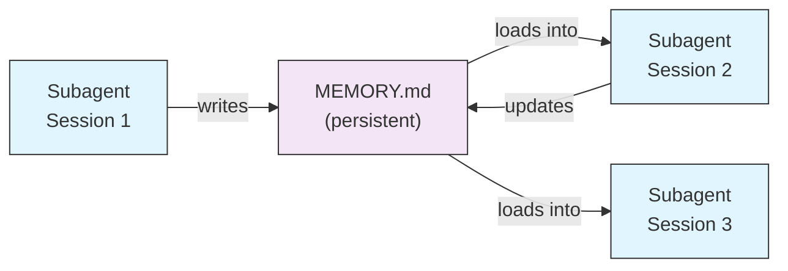

# Subagent 영구 메모리

이 문서는 `memory` 필드로 subagent에 세션 간 유지되는 디렉토리를 부여하는 방법을 설명합니다.
"같은 subagent가 어제 발견한 사실을 오늘 다시 발견하지 않게 하고 싶다"면 사용합니다.
범위(user·project·local)에 따라 메모리 위치와 공유 정책이 달라집니다.

`memory` 필드는 subagent에 대화 간에 유지되는 영구 디렉토리를 제공합니다. 이를 통해 subagent는 시간이 지남에 따라 지식을 축적하고, 세션 간에 유지되는 메모, 발견 사항 및 컨텍스트를 저장할 수 있습니다.

## 메모리 범위

| 범위 | 디렉토리 | 사용 사례 |
|-------|-----------|----------|
| `user` | `~/.claude/agent-memory/<name>/` | 모든 프로젝트에 걸친 개인 메모 및 선호사항 |
| `project` | `.claude/agent-memory/<name>/` | 팀과 공유되는 프로젝트별 지식 |
| `local` | `.claude/agent-memory-local/<name>/` | 버전 관리에 커밋되지 않는 로컬 프로젝트 지식 |

## 작동 방식

- 메모리 디렉토리의 `MEMORY.md` 처음 200줄이 subagent의 시스템 프롬프트에 자동으로 로드됩니다
- subagent가 메모리 파일을 관리할 수 있도록 `Read`, `Write`, `Edit` 도구가 자동으로 활성화됩니다
- subagent는 필요에 따라 메모리 디렉토리에 추가 파일을 생성할 수 있습니다

## 구성 예시

```yaml
---
name: researcher
memory: user
---

You are a research assistant. Use your memory directory to store findings,
track progress across sessions, and build up knowledge over time.

Check your MEMORY.md file at the start of each session to recall previous context.
```


