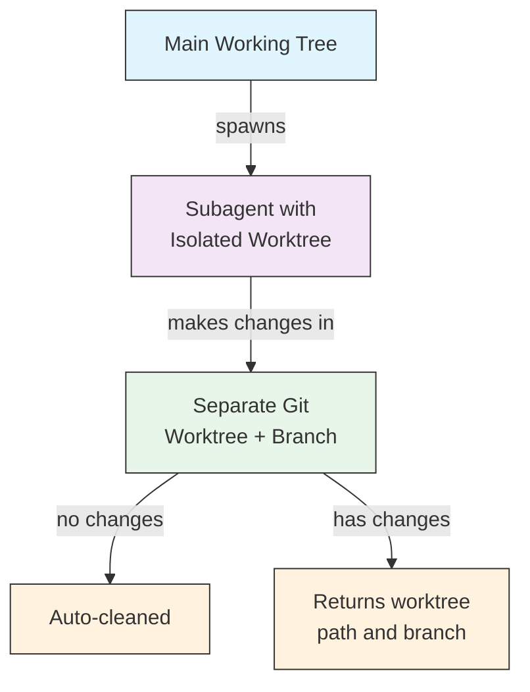

# Worktree 격리

이 문서는 `isolation: worktree` 옵션으로 subagent에 자체 git worktree를 부여하는 방법을 설명합니다.
"실험적 변경을 메인 작업 트리에 영향 없이 시도해보고 싶다"면 적합합니다.
변경이 없으면 자동 정리되고, 변경이 있으면 worktree 경로와 브랜치 이름이 메인 agent로 반환됩니다.

`isolation: worktree` 설정은 subagent에 자체 git worktree를 부여하여 메인 작업 트리에 영향을 주지 않고 독립적으로 변경할 수 있게 합니다.

## 구성

```yaml
---
name: feature-builder
isolation: worktree
description: Implements features in an isolated git worktree
tools: Read, Write, Edit, Bash, Grep, Glob
---
```

## 작동 방식



- subagent는 별도의 브랜치에 있는 자체 git worktree에서 작동합니다
- subagent가 변경 사항을 만들지 않으면 worktree가 자동으로 정리됩니다
- 변경 사항이 있으면 worktree 경로와 브랜치 이름이 메인 agent에 반환되어 검토 또는 병합에 사용됩니다
