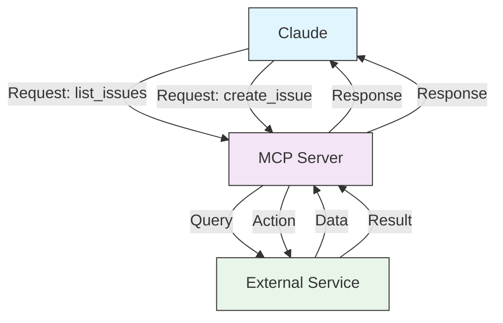

# MCP 아키텍처

이 페이지는 MCP의 client-server 아키텍처를 다이어그램으로 설명한다. Claude가 MCP 서버를 통해 외부 서비스에 어떻게 요청을 보내고 응답을 받는지 한눈에 보여 주므로, 처음 통신 흐름이 잡히지 않을 때 먼저 보면 좋다. 다른 페이지(설치·OAuth·Tool Search 등)는 모두 이 흐름 위에서 구체화된다.

