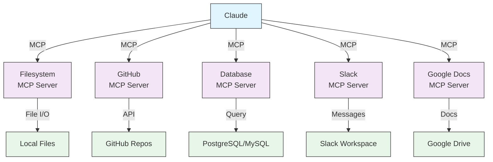

# MCP 생태계

이 페이지는 Claude가 어떤 종류의 MCP 서버에 연결되어 어떤 외부 시스템에 접근할 수 있는지 다이어그램으로 보여 준다. Filesystem, GitHub, Database, Slack, Google Docs 같은 대표 서버를 한 화면으로 잡고 싶을 때 이 페이지를 먼저 본다. 실제 등록 명령은 [mcp-installation.md](mcp-installation.md), 서버 카탈로그 표는 [mcp-server-catalog.md](mcp-server-catalog.md)에서 다룬다.

