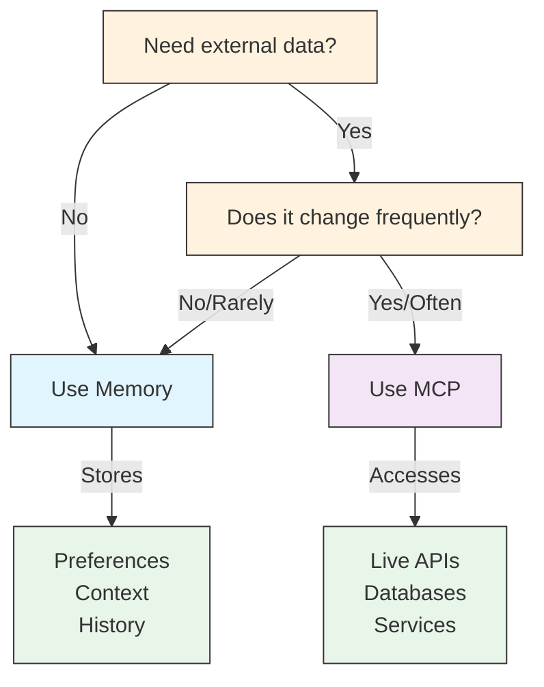

# MCP vs Memory: 결정 매트릭스

이 페이지는 "외부 데이터인가? 자주 변하나?"라는 두 질문으로 Memory와 MCP 중 어느 쪽을 써야 하는지를 결정 트리로 보여 준다. 두 기능을 처음 접해 헷갈릴 때, 또는 팀 가이드라인을 정할 때 한 번 보고 가면 된다. Memory 자체에 대한 자세한 설명은 [02. Memory 모듈](../02-memory/README.md)에서 다룬다.

