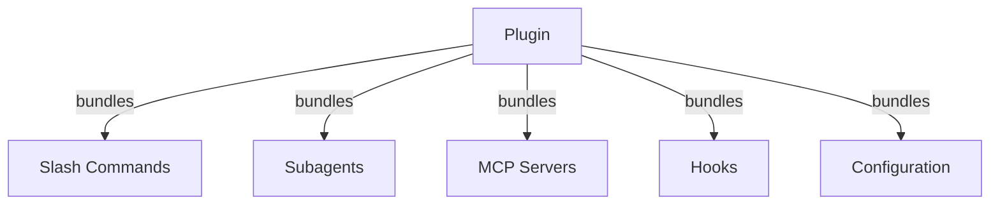
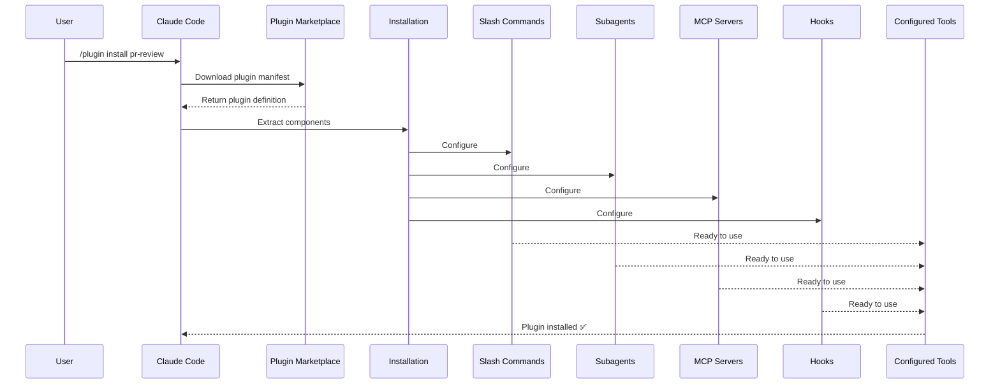
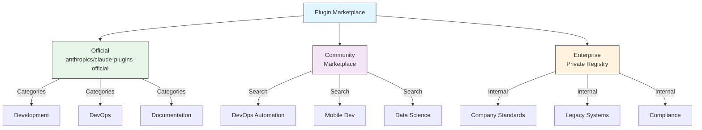
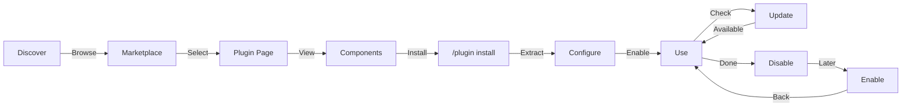
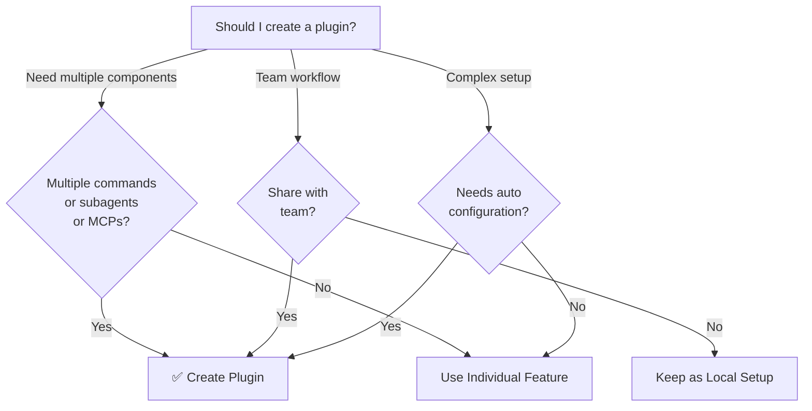

<picture>
  <source media="(prefers-color-scheme: dark)" srcset="../../resources/logos/claude-howto-logo-dark.svg">
  
</picture>

# Claude Code Plugins

이 폴더에는 여러 Claude Code 기능을 하나의 설치 가능한 패키지로 묶은 완전한 plugin 예제가 포함되어 있습니다.

## 개요

Claude Code Plugins는 커스터마이징(slash command, subagent, MCP 서버, hooks)의 번들 컬렉션으로, 단일 명령으로 설치할 수 있습니다. 여러 기능을 응집력 있고 공유 가능한 패키지로 결합하는 최상위 확장 메커니즘입니다.

## Plugin 아키텍처



## Plugin 로딩 프로세스



## Plugin 유형 및 배포

| 유형 | 범위 | 공유 | 관리 주체 | 예시 |
|------|-------|--------|-----------|----------|
| Official | 글로벌 | 모든 사용자 | Anthropic | PR Review, Security Guidance |
| Community | 공개 | 모든 사용자 | 커뮤니티 | DevOps, Data Science |
| Organization | 내부 | 팀원 | 회사 | 내부 표준, 도구 |
| Personal | 개인 | 단일 사용자 | 개발자 | 커스텀 워크플로우 |

## Plugin 정의 구조

Plugin 매니페스트는 `.claude-plugin/plugin.json`에서 JSON 형식을 사용합니다:

```json
{
  "name": "my-first-plugin",
  "description": "A greeting plugin",
  "version": "1.0.0",
  "author": {
    "name": "Your Name"
  },
  "homepage": "https://example.com",
  "repository": "https://github.com/user/repo",
  "license": "MIT"
}
```

## Plugin 구조 예시

```
my-plugin/
├── .claude-plugin/
│   └── plugin.json       # 매니페스트 (이름, 설명, 버전, 작성자)
├── commands/             # 마크다운 파일로 된 Skills
│   ├── task-1.md
│   ├── task-2.md
│   └── workflows/
├── agents/               # 커스텀 에이전트 정의
│   ├── specialist-1.md
│   ├── specialist-2.md
│   └── configs/
├── skills/               # SKILL.md 파일이 있는 Agent Skills
│   ├── skill-1.md
│   └── skill-2.md
├── hooks/                # hooks.json의 이벤트 핸들러
│   └── hooks.json
├── .mcp.json             # MCP 서버 설정
├── .lsp.json             # 코드 인텔리전스를 위한 LSP 서버 설정
├── bin/                  # plugin 활성화 시 Bash 도구의 PATH에 추가되는 실행 파일
├── settings.json         # plugin 활성화 시 적용되는 기본 설정 (현재 `agent` 키만 지원)
├── templates/
│   └── issue-template.md
├── scripts/
│   ├── helper-1.sh
│   └── helper-2.py
├── docs/
│   ├── README.md
│   └── USAGE.md
└── tests/
    └── plugin.test.js
```

### LSP 서버 설정

Plugin은 실시간 코드 인텔리전스를 위한 Language Server Protocol(LSP) 지원을 포함할 수 있습니다. LSP 서버는 작업 중 진단, 코드 탐색, 심볼 정보를 제공합니다.

**설정 위치**:
- plugin 루트 디렉토리의 `.lsp.json` 파일
- `plugin.json`의 인라인 `lsp` 키

#### 필드 참조

| 필드 | 필수 | 설명 |
|-------|----------|-------------|
| `command` | 예 | LSP 서버 바이너리 (PATH에 있어야 함) |
| `extensionToLanguage` | 예 | 파일 확장자를 언어 ID에 매핑 |
| `args` | 아니오 | 서버의 명령줄 인수 |
| `transport` | 아니오 | 통신 방법: `stdio` (기본값) 또는 `socket` |
| `env` | 아니오 | 서버 프로세스의 환경 변수 |
| `initializationOptions` | 아니오 | LSP 초기화 시 전송되는 옵션 |
| `settings` | 아니오 | 서버에 전달되는 작업공간 설정 |
| `workspaceFolder` | 아니오 | 작업공간 폴더 경로 재정의 |
| `startupTimeout` | 아니오 | 서버 시작 대기 최대 시간(ms) |
| `shutdownTimeout` | 아니오 | 정상 종료를 위한 최대 시간(ms) |
| `restartOnCrash` | 아니오 | 서버 충돌 시 자동 재시작 |
| `maxRestarts` | 아니오 | 포기 전 최대 재시작 시도 횟수 |

#### 설정 예시

**Go (gopls)**:

```json
{
  "go": {
    "command": "gopls",
    "args": ["serve"],
    "extensionToLanguage": {
      ".go": "go"
    }
  }
}
```

**Python (pyright)**:

```json
{
  "python": {
    "command": "pyright-langserver",
    "args": ["--stdio"],
    "extensionToLanguage": {
      ".py": "python",
      ".pyi": "python"
    }
  }
}
```

**TypeScript**:

```json
{
  "typescript": {
    "command": "typescript-language-server",
    "args": ["--stdio"],
    "extensionToLanguage": {
      ".ts": "typescript",
      ".tsx": "typescriptreact",
      ".js": "javascript",
      ".jsx": "javascriptreact"
    }
  }
}
```

#### 사용 가능한 LSP plugin

공식 마켓플레이스에는 사전 구성된 LSP plugin이 포함되어 있습니다:

| Plugin | 언어 | 서버 바이너리 | 설치 명령 |
|--------|----------|---------------|----------------|
| `pyright-lsp` | Python | `pyright-langserver` | `pip install pyright` |
| `typescript-lsp` | TypeScript/JavaScript | `typescript-language-server` | `npm install -g typescript-language-server typescript` |
| `rust-lsp` | Rust | `rust-analyzer` | `rustup component add rust-analyzer`로 설치 |

#### LSP 기능

구성이 완료되면 LSP 서버는 다음을 제공합니다:

- **즉시 진단** -- 편집 직후 오류와 경고가 표시됩니다
- **코드 탐색** -- 정의로 이동, 참조 찾기, 구현체 찾기
- **호버 정보** -- 호버 시 타입 시그니처와 문서 표시
- **심볼 목록** -- 현재 파일이나 작업공간의 심볼 탐색

## Plugin 옵션 (v2.1.83+)

Plugin은 매니페스트의 `userConfig`를 통해 사용자 설정 가능한 옵션을 선언할 수 있습니다. `sensitive: true`로 표시된 값은 일반 텍스트 설정 파일이 아닌 시스템 키체인에 저장됩니다:

```json
{
  "name": "my-plugin",
  "version": "1.0.0",
  "userConfig": {
    "apiKey": {
      "description": "API key for the service",
      "sensitive": true
    },
    "region": {
      "description": "Deployment region",
      "default": "us-east-1"
    }
  }
}
```

## 영구 Plugin 데이터 (`${CLAUDE_PLUGIN_DATA}`) (v2.1.78+)

Plugin은 `${CLAUDE_PLUGIN_DATA}` 환경 변수를 통해 영구 상태 디렉토리에 접근할 수 있습니다. 이 디렉토리는 plugin별로 고유하며 세션 간에 유지되므로 캐시, 데이터베이스 및 기타 영구 상태에 적합합니다:

```json
{
  "hooks": {
    "PostToolUse": [
      {
        "command": "node ${CLAUDE_PLUGIN_DATA}/track-usage.js"
      }
    ]
  }
}
```

이 디렉토리는 plugin 설치 시 자동으로 생성됩니다. 여기에 저장된 파일은 plugin이 제거될 때까지 유지됩니다.

## 설정을 통한 인라인 Plugin (`source: 'settings'`) (v2.1.80+)

Plugin은 `source: 'settings'` 필드를 사용하여 설정 파일에 마켓플레이스 항목으로 인라인 정의할 수 있습니다. 이를 통해 별도의 저장소나 마켓플레이스 없이 plugin 정의를 직접 포함할 수 있습니다:

```json
{
  "pluginMarketplaces": [
    {
      "name": "inline-tools",
      "source": "settings",
      "plugins": [
        {
          "name": "quick-lint",
          "source": "./local-plugins/quick-lint"
        }
      ]
    }
  ]
}
```

## Plugin 설정

Plugin은 기본 설정을 제공하기 위해 `settings.json` 파일을 포함할 수 있습니다. 현재 `agent` 키를 지원하며, plugin의 메인 스레드 에이전트를 설정합니다:

```json
{
  "agent": "agents/specialist-1.md"
}
```

Plugin이 `settings.json`을 포함하면 설치 시 기본값이 적용됩니다. 사용자는 자신의 프로젝트 또는 사용자 설정에서 이러한 설정을 재정의할 수 있습니다.

## 독립형 vs Plugin 접근 방식

| 접근 방식 | 명령 이름 | 설정 | 적합한 용도 |
|----------|---------------|---|---|
| **독립형** | `/hello` | CLAUDE.md에서 수동 설정 | 개인용, 프로젝트별 |
| **Plugin** | `/plugin-name:hello` | plugin.json을 통한 자동화 | 공유, 배포, 팀 사용 |

빠른 개인 워크플로우에는 **독립형 slash command**를 사용하세요. 여러 기능을 번들로 묶거나, 팀과 공유하거나, 배포용으로 게시하려면 **plugin**을 사용하세요.

## 실용 예제

### 예제 1: PR Review Plugin

**파일:** `.claude-plugin/plugin.json`

```json
{
  "name": "pr-review",
  "version": "1.0.0",
  "description": "Complete PR review workflow with security, testing, and docs",
  "author": {
    "name": "Anthropic"
  },
  "repository": "https://github.com/your-org/pr-review",
  "license": "MIT"
}
```

**파일:** `commands/review-pr.md`

```markdown
---
name: Review PR
description: Start comprehensive PR review with security and testing checks
---

# PR Review

This command initiates a complete pull request review including:

1. Security analysis
2. Test coverage verification
3. Documentation updates
4. Code quality checks
5. Performance impact assessment
```

**파일:** `agents/security-reviewer.md`

```yaml
---
name: security-reviewer
description: Security-focused code review
tools: read, grep, diff
---

# Security Reviewer

Specializes in finding security vulnerabilities:
- Authentication/authorization issues
- Data exposure
- Injection attacks
- Secure configuration
```

**설치:**

```bash
/plugin install pr-review

# Result:
# ✅ 3 slash commands installed
# ✅ 3 subagents configured
# ✅ 2 MCP servers connected
# ✅ 4 hooks registered
# ✅ Ready to use!
```

### 예제 2: DevOps Plugin

**구성요소:**

```
devops-automation/
├── commands/
│   ├── deploy.md
│   ├── rollback.md
│   ├── status.md
│   └── incident.md
├── agents/
│   ├── deployment-specialist.md
│   ├── incident-commander.md
│   └── alert-analyzer.md
├── mcp/
│   ├── github-config.json
│   ├── kubernetes-config.json
│   └── prometheus-config.json
├── hooks/
│   ├── pre-deploy.js
│   ├── post-deploy.js
│   └── on-error.js
└── scripts/
    ├── deploy.sh
    ├── rollback.sh
    └── health-check.sh
```

### 예제 3: Documentation Plugin

**번들 구성요소:**

```
documentation/
├── commands/
│   ├── generate-api-docs.md
│   ├── generate-readme.md
│   ├── sync-docs.md
│   └── validate-docs.md
├── agents/
│   ├── api-documenter.md
│   ├── code-commentator.md
│   └── example-generator.md
├── mcp/
│   ├── github-docs-config.json
│   └── slack-announce-config.json
└── templates/
    ├── api-endpoint.md
    ├── function-docs.md
    └── adr-template.md
```

## Plugin 마켓플레이스

공식 Anthropic 관리 plugin 디렉토리는 `anthropics/claude-plugins-official`입니다. 엔터프라이즈 관리자는 내부 배포를 위한 비공개 plugin 마켓플레이스도 만들 수 있습니다.



### 마켓플레이스 설정

엔터프라이즈 및 고급 사용자는 설정을 통해 마켓플레이스 동작을 제어할 수 있습니다:

| 설정 | 설명 |
|---------|-------------|
| `extraKnownMarketplaces` | 기본값 외에 추가 마켓플레이스 소스 추가 |
| `strictKnownMarketplaces` | 사용자가 추가할 수 있는 마켓플레이스 제어 |
| `deniedPlugins` | 특정 plugin의 설치를 방지하는 관리자 관리 차단 목록 |

### 추가 마켓플레이스 기능

- **기본 git 타임아웃**: 대규모 plugin 저장소를 위해 30초에서 120초로 증가
- **커스텀 npm 레지스트리**: plugin이 의존성 해결을 위한 커스텀 npm 레지스트리 URL 지정 가능
- **버전 고정**: 재현 가능한 환경을 위해 plugin을 특정 버전에 고정

### 마켓플레이스 정의 스키마

Plugin 마켓플레이스는 `.claude-plugin/marketplace.json`에 정의됩니다:

```json
{
  "name": "my-team-plugins",
  "owner": "my-org",
  "plugins": [
    {
      "name": "code-standards",
      "source": "./plugins/code-standards",
      "description": "Enforce team coding standards",
      "version": "1.2.0",
      "author": "platform-team"
    },
    {
      "name": "deploy-helper",
      "source": {
        "source": "github",
        "repo": "my-org/deploy-helper",
        "ref": "v2.0.0"
      },
      "description": "Deployment automation workflows"
    }
  ]
}
```

| 필드 | 필수 | 설명 |
|-------|----------|-------------|
| `name` | 예 | 케밥 케이스의 마켓플레이스 이름 |
| `owner` | 예 | 마켓플레이스를 관리하는 조직 또는 사용자 |
| `plugins` | 예 | plugin 항목 배열 |
| `plugins[].name` | 예 | Plugin 이름 (케밥 케이스) |
| `plugins[].source` | 예 | Plugin 소스 (경로 문자열 또는 소스 객체) |
| `plugins[].description` | 아니오 | 간단한 plugin 설명 |
| `plugins[].version` | 아니오 | 시맨틱 버전 문자열 |
| `plugins[].author` | 아니오 | Plugin 작성자 이름 |

### Plugin 소스 유형

Plugin은 여러 위치에서 가져올 수 있습니다:

| 소스 | 구문 | 예시 |
|--------|--------|---------|
| **상대 경로** | 문자열 경로 | `"./plugins/my-plugin"` |
| **GitHub** | `{ "source": "github", "repo": "owner/repo" }` | `{ "source": "github", "repo": "acme/lint-plugin", "ref": "v1.0" }` |
| **Git URL** | `{ "source": "url", "url": "..." }` | `{ "source": "url", "url": "https://git.internal/plugin.git" }` |
| **Git 하위 디렉토리** | `{ "source": "git-subdir", "url": "...", "path": "..." }` | `{ "source": "git-subdir", "url": "https://github.com/org/monorepo.git", "path": "packages/plugin" }` |
| **npm** | `{ "source": "npm", "package": "..." }` | `{ "source": "npm", "package": "@acme/claude-plugin", "version": "^2.0" }` |
| **pip** | `{ "source": "pip", "package": "..." }` | `{ "source": "pip", "package": "claude-data-plugin", "version": ">=1.0" }` |

GitHub 및 git 소스는 버전 고정을 위한 선택적 `ref`(브랜치/태그) 및 `sha`(커밋 해시) 필드를 지원합니다.

### 배포 방법

**GitHub (권장)**:
```bash
# Users add your marketplace
/plugin marketplace add owner/repo-name
```

**기타 git 서비스** (전체 URL 필요):
```bash
/plugin marketplace add https://gitlab.com/org/marketplace-repo.git
```

**비공개 저장소**: git 자격 증명 도우미 또는 환경 토큰을 통해 지원됩니다. 사용자는 저장소에 대한 읽기 접근 권한이 있어야 합니다.

**공식 마켓플레이스 제출**: 더 넓은 배포를 위해 Anthropic이 관리하는 마켓플레이스에 plugin을 제출하려면 [claude.ai/settings/plugins/submit](https://claude.ai/settings/plugins/submit) 또는 [platform.claude.com/plugins/submit](https://platform.claude.com/plugins/submit)을 이용하세요.

### Strict 모드

마켓플레이스 정의가 로컬 `plugin.json` 파일과 상호작용하는 방식을 제어합니다:

| 설정 | 동작 |
|---------|----------|
| `strict: true` (기본값) | 로컬 `plugin.json`이 권위적; 마켓플레이스 항목이 보완 |
| `strict: false` | 마켓플레이스 항목이 전체 plugin 정의 |

**`strictKnownMarketplaces`를 통한 조직 제한:**

| 값 | 효과 |
|-------|--------|
| 설정 안 됨 | 제한 없음 -- 사용자가 모든 마켓플레이스 추가 가능 |
| 빈 배열 `[]` | 잠금 -- 마켓플레이스 허용 안 됨 |
| 패턴 배열 | 허용 목록 -- 일치하는 마켓플레이스만 추가 가능 |

```json
{
  "strictKnownMarketplaces": [
    "my-org/*",
    "github.com/trusted-vendor/*"
  ]
}
```

> **경고**: `strictKnownMarketplaces`가 적용된 strict 모드에서는 사용자가 허용 목록에 있는 마켓플레이스에서만 plugin을 설치할 수 있습니다. 이는 통제된 plugin 배포가 필요한 엔터프라이즈 환경에 유용합니다.

## Plugin 설치 및 수명 주기



## Plugin 기능 비교

| 기능 | Slash Command | Skill | Subagent | Plugin |
|---------|---------------|-------|----------|--------|
| **설치** | 수동 복사 | 수동 복사 | 수동 설정 | 단일 명령 |
| **설정 시간** | 5분 | 10분 | 15분 | 2분 |
| **번들링** | 단일 파일 | 단일 파일 | 단일 파일 | 다중 |
| **버전 관리** | 수동 | 수동 | 수동 | 자동 |
| **팀 공유** | 파일 복사 | 파일 복사 | 파일 복사 | 설치 ID |
| **업데이트** | 수동 | 수동 | 수동 | 자동 제공 |
| **의존성** | 없음 | 없음 | 없음 | 포함 가능 |
| **마켓플레이스** | 아니오 | 아니오 | 아니오 | 예 |
| **배포** | 저장소 | 저장소 | 저장소 | 마켓플레이스 |

## Plugin CLI 명령

모든 plugin 작업은 CLI 명령으로 사용할 수 있습니다:

```bash
claude plugin install <name>@<marketplace>   # Install from a marketplace
claude plugin uninstall <name>               # Remove a plugin
claude plugin list                           # List installed plugins
claude plugin enable <name>                  # Enable a disabled plugin
claude plugin disable <name>                 # Disable a plugin
claude plugin validate                       # Validate plugin structure
claude plugin update                         # Update installed plugins
```

## 설치 방법

### 마켓플레이스에서 설치
```bash
/plugin install plugin-name
# or from CLI:
claude plugin install plugin-name@marketplace-name
```

### 활성화 / 비활성화 (자동 감지된 범위로)
```bash
/plugin enable plugin-name
/plugin disable plugin-name
```

### 로컬 Plugin (개발용)
```bash
# CLI flag for local testing (repeatable for multiple plugins)
claude --plugin-dir ./path/to/plugin
claude --plugin-dir ./plugin-a --plugin-dir ./plugin-b
```

### Git 저장소에서 설치
```bash
/plugin install github:username/repo
```

## Plugin을 만들어야 하는 시점



### Plugin 사용 사례

| 사용 사례 | 권장 | 이유 |
|----------|-----------------|-----|
| **팀 온보딩** | ✅ Plugin 사용 | 즉시 설정, 모든 구성 포함 |
| **프레임워크 설정** | ✅ Plugin 사용 | 프레임워크별 명령 번들 |
| **엔터프라이즈 표준** | ✅ Plugin 사용 | 중앙 배포, 버전 관리 |
| **빠른 작업 자동화** | ❌ Command 사용 | 과도한 복잡성 |
| **단일 도메인 전문성** | ❌ Skill 사용 | 너무 무거움, skill 대신 사용 |
| **전문 분석** | ❌ Subagent 사용 | 수동으로 생성하거나 skill 사용 |
| **실시간 데이터 접근** | ❌ MCP 사용 | 독립형, 번들하지 않음 |

## Plugin 테스트

게시 전에 `--plugin-dir` CLI 플래그(여러 plugin에 대해 반복 가능)를 사용하여 로컬에서 plugin을 테스트합니다:

```bash
claude --plugin-dir ./my-plugin
claude --plugin-dir ./my-plugin --plugin-dir ./another-plugin
```

이렇게 하면 plugin이 로드된 상태로 Claude Code가 시작되어 다음을 확인할 수 있습니다:
- 모든 slash command가 사용 가능한지 확인
- subagent와 에이전트가 올바르게 작동하는지 테스트
- MCP 서버가 올바르게 연결되는지 확인
- hook 실행 검증
- LSP 서버 설정 확인
- 설정 오류가 있는지 확인

## 핫 리로드

Plugin은 개발 중 핫 리로드를 지원합니다. plugin 파일을 수정하면 Claude Code가 자동으로 변경을 감지할 수 있습니다. 강제로 리로드하려면:

```bash
/reload-plugins
```

이 명령은 세션을 재시작하지 않고 모든 plugin 매니페스트, 명령, 에이전트, skill, hooks, MCP/LSP 설정을 다시 읽습니다.

## Plugin의 관리 설정

관리자는 관리 설정을 사용하여 조직 전체의 plugin 동작을 제어할 수 있습니다:

| 설정 | 설명 |
|---------|-------------|
| `enabledPlugins` | 기본적으로 활성화된 plugin 허용 목록 |
| `deniedPlugins` | 설치할 수 없는 plugin 차단 목록 |
| `extraKnownMarketplaces` | 기본값 외에 추가 마켓플레이스 소스 추가 |
| `strictKnownMarketplaces` | 사용자가 추가할 수 있는 마켓플레이스 제한 |
| `allowedChannelPlugins` | 릴리스 채널별 허용되는 plugin 제어 |

이러한 설정은 관리 설정 파일을 통해 조직 수준에서 적용할 수 있으며 사용자 수준 설정보다 우선합니다.

## Plugin 보안

Plugin subagent는 제한된 샌드박스에서 실행됩니다. 다음 frontmatter 키는 plugin subagent 정의에서 **허용되지 않습니다**:

- `hooks` -- subagent가 이벤트 핸들러를 등록할 수 없음
- `mcpServers` -- subagent가 MCP 서버를 설정할 수 없음
- `permissionMode` -- subagent가 권한 모델을 재정의할 수 없음

이를 통해 plugin이 선언된 범위를 넘어 권한을 에스컬레이션하거나 호스트 환경을 수정할 수 없도록 합니다.

> **보안 제한**: Plugin을 통해 배포된 agent는 보안상의 이유로 `hooks`, `mcpServers`, `permissionMode` 필드를 사용할 수 없습니다.

## Plugin 게시

**게시 단계:**

1. 모든 구성요소가 포함된 plugin 구조 생성
2. `.claude-plugin/plugin.json` 매니페스트 작성
3. 문서가 포함된 `README.md` 생성
4. `claude --plugin-dir ./my-plugin`으로 로컬 테스트
5. plugin 마켓플레이스에 제출
6. 검토 및 승인 받기
7. 마켓플레이스에 게시됨
8. 사용자가 단일 명령으로 설치 가능

**제출 예시:**

```markdown
# PR Review Plugin

## Description
Complete PR review workflow with security, testing, and documentation checks.

## What's Included
- 3 slash commands for different review types
- 3 specialized subagents
- GitHub and CodeQL MCP integration
- Automated security scanning hooks

## Installation
```bash
/plugin install pr-review
```

## Features
✅ Security analysis
✅ Test coverage checking
✅ Documentation verification
✅ Code quality assessment
✅ Performance impact analysis

## Usage
```bash
/review-pr
/check-security
/check-tests
```

## Requirements
- Claude Code 1.0+
- GitHub access
- CodeQL (optional)
```

## Plugin vs 수동 설정

**수동 설정 (2시간 이상):**
- slash command를 하나씩 설치
- subagent를 개별적으로 생성
- MCP를 별도로 설정
- hooks를 수동으로 설정
- 모든 것을 문서화
- 팀과 공유 (올바르게 설정하기를 기대)

**Plugin 사용 (2분):**
```bash
/plugin install pr-review
# ✅ Everything installed and configured
# ✅ Ready to use immediately
# ✅ Team can reproduce exact setup
```

## 모범 사례

### 권장 사항 ✅
- 명확하고 설명적인 plugin 이름 사용
- 포괄적인 README 포함
- plugin을 올바르게 버전 관리 (semver)
- 모든 구성요소를 함께 테스트
- 요구사항을 명확하게 문서화
- 사용 예제 제공
- 오류 처리 포함
- 발견성을 위해 적절한 태그 사용
- 하위 호환성 유지
- plugin을 집중적이고 응집력 있게 유지
- 포괄적인 테스트 포함
- 모든 의존성 문서화

### 비권장 사항 ❌
- 관련 없는 기능을 번들하지 않기
- 자격 증명을 하드코딩하지 않기
- 테스트를 건너뛰지 않기
- 문서를 잊지 않기
- 중복 plugin을 만들지 않기
- 버전 관리를 무시하지 않기
- 구성요소 의존성을 과도하게 복잡하게 만들지 않기
- 오류를 우아하게 처리하는 것을 잊지 않기

## 설치 안내

### 마켓플레이스에서 설치

1. **사용 가능한 plugin 탐색:**
   ```bash
   /plugin list
   ```

2. **plugin 세부정보 보기:**
   ```bash
   /plugin info plugin-name
   ```

3. **plugin 설치:**
   ```bash
   /plugin install plugin-name
   ```

### 로컬 경로에서 설치

```bash
/plugin install ./path/to/plugin-directory
```

### GitHub에서 설치

```bash
/plugin install github:username/repo
```

### 설치된 Plugin 목록 보기

```bash
/plugin list --installed
```

### Plugin 업데이트

```bash
/plugin update plugin-name
```

### Plugin 비활성화/활성화

```bash
# Temporarily disable
/plugin disable plugin-name

# Re-enable
/plugin enable plugin-name
```

### Plugin 제거

```bash
/plugin uninstall plugin-name
```

## 관련 개념

다음 Claude Code 기능은 plugin과 함께 작동합니다:

- **[Slash Commands](../../01-slash-commands/)** - plugin에 번들되는 개별 명령
- **[Memory](../../02-memory/)** - plugin을 위한 영구 컨텍스트
- **[Skills](../../03-skills/)** - plugin으로 래핑할 수 있는 도메인 전문성
- **[Subagents](../../04-subagents/)** - plugin 구성요소로 포함되는 전문 에이전트
- **[MCP 서버](../../05-mcp/)** - plugin에 번들되는 Model Context Protocol 통합
- **[Hooks](../../06-hooks/)** - plugin 워크플로우를 트리거하는 이벤트 핸들러

## 전체 예제 워크플로우

### PR Review Plugin 전체 워크플로우

```
1. User: /review-pr

2. Plugin executes:
   ├── pre-review.js hook validates git repo
   ├── GitHub MCP fetches PR data
   ├── security-reviewer subagent analyzes security
   ├── test-checker subagent verifies coverage
   └── performance-analyzer subagent checks performance

3. Results synthesized and presented:
   ✅ Security: No critical issues
   ⚠️  Testing: Coverage 65% (recommend 80%+)
   ✅ Performance: No significant impact
   📝 12 recommendations provided
```

## 문제 해결

### Plugin이 설치되지 않음
- Claude Code 버전 호환성 확인: `/version`
- JSON 검증기로 `plugin.json` 구문 확인
- 인터넷 연결 확인 (원격 plugin의 경우)
- 권한 확인: `ls -la plugin/`

### 구성요소가 로드되지 않음
- `plugin.json`의 경로가 실제 디렉토리 구조와 일치하는지 확인
- 파일 권한 확인: `chmod +x scripts/`
- 구성요소 파일 구문 검토
- 로그 확인: `/plugin debug plugin-name`

### MCP 연결 실패
- 환경 변수가 올바르게 설정되었는지 확인
- MCP 서버 설치 및 상태 확인
- `/mcp test`로 MCP 연결을 독립적으로 테스트
- `mcp/` 디렉토리의 MCP 설정 검토

### 설치 후 명령을 사용할 수 없음
- plugin이 성공적으로 설치되었는지 확인: `/plugin list --installed`
- plugin이 활성화되었는지 확인: `/plugin status plugin-name`
- Claude Code 재시작: `exit` 후 다시 열기
- 기존 명령과 이름 충돌이 있는지 확인

### Hook 실행 문제
- hook 파일에 올바른 권한이 있는지 확인
- hook 구문 및 이벤트 이름 확인
- 오류 세부사항을 위해 hook 로그 검토
- 가능하면 hooks를 수동으로 테스트

## 추가 리소스

- [공식 Plugins 문서](https://code.claude.com/docs/en/plugins)
- [Plugin 탐색](https://code.claude.com/docs/en/discover-plugins)
- [Plugin 마켓플레이스](https://code.claude.com/docs/en/plugin-marketplaces)
- [Plugins 참조](https://code.claude.com/docs/en/plugins-reference)
- [MCP 서버 참조](https://modelcontextprotocol.io/)
- [Subagent 설정 가이드](../../04-subagents/README.md)
- [Hook 시스템 참조](../../06-hooks/README.md)

---
**최종 업데이트**: 2026년 4월
**Claude Code 버전**: 2.1+
**호환 모델**: Claude Sonnet 4.6, Claude Opus 4.6, Claude Haiku 4.5
