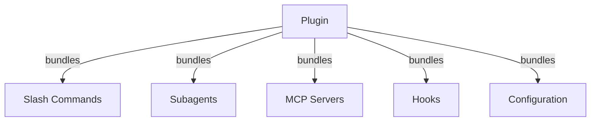

# Plugin 아키텍처

이 문서는 Claude Code plugin이 슬래시 커맨드, 서브에이전트, MCP 서버, hook, 설정을 어떻게 하나의 패키지로 묶는지 시각적으로 설명합니다. plugin이 처음이라면 어떤 구성 요소를 번들 가능한지 한눈에 파악할 때 먼저 읽으세요. 아키텍처를 이해하면 자신의 plugin을 설계할 때 어떤 자산을 포함시킬지 결정하기 쉬워집니다.

