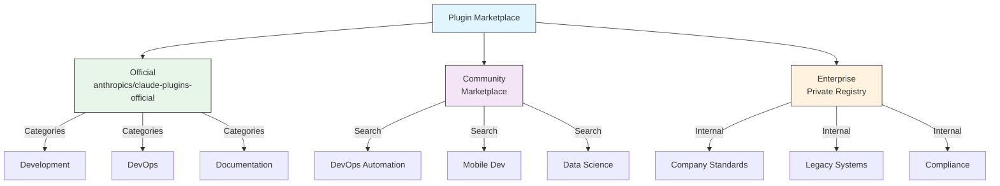

# Plugin 마켓플레이스

이 문서는 공식·커뮤니티·엔터프라이즈 plugin 마켓플레이스의 구조와 `.claude-plugin/marketplace.json`으로 자체 마켓플레이스를 정의하는 방법을 설명합니다. 회사 내부 plugin을 중앙에서 배포하거나, GitHub·git URL·npm·pip 등 여러 소스에서 plugin을 묶어 게시하려는 경우 참고하세요. Strict 모드와 `strictKnownMarketplaces`로 조직이 신뢰하는 마켓플레이스만 허용하는 통제도 함께 다룹니다.

공식 Anthropic 관리 plugin 디렉토리는 `anthropics/claude-plugins-official`입니다. 엔터프라이즈 관리자는 내부 배포를 위한 비공개 plugin 마켓플레이스도 만들 수 있습니다.



## 마켓플레이스 설정

엔터프라이즈 및 고급 사용자는 설정을 통해 마켓플레이스 동작을 제어할 수 있습니다:

| 설정 | 설명 |
|---------|-------------|
| `extraKnownMarketplaces` | 기본값 외에 추가 마켓플레이스 소스 추가 |
| `strictKnownMarketplaces` | 사용자가 추가할 수 있는 마켓플레이스 제어 |
| `deniedPlugins` | 특정 plugin의 설치를 방지하는 관리자 관리 차단 목록 |

## 추가 마켓플레이스 기능

- **기본 git 타임아웃**: 대규모 plugin 저장소를 위해 30초에서 120초로 증가
- **커스텀 npm 레지스트리**: plugin이 의존성 해결을 위한 커스텀 npm 레지스트리 URL 지정 가능
- **버전 고정**: 재현 가능한 환경을 위해 plugin을 특정 버전에 고정

## 마켓플레이스 정의 스키마

Plugin 마켓플레이스는 `.claude-plugin/marketplace.json`에 정의됩니다:

```json
{
  "name": "my-team-plugins",
  "owner": "my-org",
  "plugins": [
    {
      "name": "code-standards",
      "source": "./plugins/code-standards",
      "description": "Enforce team coding standards",
      "version": "1.2.0",
      "author": "platform-team"
    },
    {
      "name": "deploy-helper",
      "source": {
        "source": "github",
        "repo": "my-org/deploy-helper",
        "ref": "v2.0.0"
      },
      "description": "Deployment automation workflows"
    }
  ]
}
```

| 필드 | 필수 | 설명 |
|-------|----------|-------------|
| `name` | 예 | 케밥 케이스의 마켓플레이스 이름 |
| `owner` | 예 | 마켓플레이스를 관리하는 조직 또는 사용자 |
| `plugins` | 예 | plugin 항목 배열 |
| `plugins[].name` | 예 | Plugin 이름 (케밥 케이스) |
| `plugins[].source` | 예 | Plugin 소스 (경로 문자열 또는 소스 객체) |
| `plugins[].description` | 아니오 | 간단한 plugin 설명 |
| `plugins[].version` | 아니오 | 시맨틱 버전 문자열 |
| `plugins[].author` | 아니오 | Plugin 작성자 이름 |

## Plugin 소스 유형

Plugin은 여러 위치에서 가져올 수 있습니다:

| 소스 | 구문 | 예시 |
|--------|--------|---------|
| **상대 경로** | 문자열 경로 | `"./plugins/my-plugin"` |
| **GitHub** | `{ "source": "github", "repo": "owner/repo" }` | `{ "source": "github", "repo": "acme/lint-plugin", "ref": "v1.0" }` |
| **Git URL** | `{ "source": "url", "url": "..." }` | `{ "source": "url", "url": "https://git.internal/plugin.git" }` |
| **Git 하위 디렉토리** | `{ "source": "git-subdir", "url": "...", "path": "..." }` | `{ "source": "git-subdir", "url": "https://github.com/org/monorepo.git", "path": "packages/plugin" }` |
| **npm** | `{ "source": "npm", "package": "..." }` | `{ "source": "npm", "package": "@acme/claude-plugin", "version": "^2.0" }` |
| **pip** | `{ "source": "pip", "package": "..." }` | `{ "source": "pip", "package": "claude-data-plugin", "version": ">=1.0" }` |

GitHub 및 git 소스는 버전 고정을 위한 선택적 `ref`(브랜치/태그) 및 `sha`(커밋 해시) 필드를 지원합니다.

## 배포 방법

**GitHub (권장)**:

```bash
# Users add your marketplace
/plugin marketplace add owner/repo-name
```

**기타 git 서비스** (전체 URL 필요):

```bash
/plugin marketplace add https://gitlab.com/org/marketplace-repo.git
```

**비공개 저장소**: git 자격 증명 도우미 또는 환경 토큰을 통해 지원됩니다. 사용자는 저장소에 대한 읽기 접근 권한이 있어야 합니다.

## 원격 marketplace URL과 비GitHub 소스

GitHub shorthand는 편리하지만 유일한 배포 경로는 아닙니다. marketplace나 plugin이 GitHub 밖에 있다면:

- 전체 git URL 사용
- 필요한 credential 조건 명시
- install source가 repo root인지 subdirectory인지 명시
- 재현 가능성이 중요하면 branch, tag, commit을 고정

특히 private registry나 enterprise-controlled marketplace에서는 URL 형식 자체가 지원 계약의 일부가 됩니다.

**공식 마켓플레이스 제출**: 더 넓은 배포를 위해 Anthropic이 관리하는 마켓플레이스에 plugin을 제출하려면 [claude.ai/settings/plugins/submit](https://claude.ai/settings/plugins/submit) 또는 [platform.claude.com/plugins/submit](https://platform.claude.com/plugins/submit)을 이용하세요.

## Strict 모드

마켓플레이스 정의가 로컬 `plugin.json` 파일과 상호작용하는 방식을 제어합니다:

| 설정 | 동작 |
|---------|----------|
| `strict: true` (기본값) | 로컬 `plugin.json`이 권위적; 마켓플레이스 항목이 보완 |
| `strict: false` | 마켓플레이스 항목이 전체 plugin 정의 |

**`strictKnownMarketplaces`를 통한 조직 제한:**

| 값 | 효과 |
|-------|--------|
| 설정 안 됨 | 제한 없음 -- 사용자가 모든 마켓플레이스 추가 가능 |
| 빈 배열 `[]` | 잠금 -- 마켓플레이스 허용 안 됨 |
| 패턴 배열 | 허용 목록 -- 일치하는 마켓플레이스만 추가 가능 |

```json
{
  "strictKnownMarketplaces": [
    "my-org/*",
    "github.com/trusted-vendor/*"
  ]
}
```

[[TIP("경고")]]
`strictKnownMarketplaces`가 적용된 strict 모드에서는 사용자가 허용 목록에 있는 마켓플레이스에서만 plugin을 설치할 수 있습니다. 이는 통제된 plugin 배포가 필요한 엔터프라이즈 환경에 유용합니다.
[[/TIP]]
