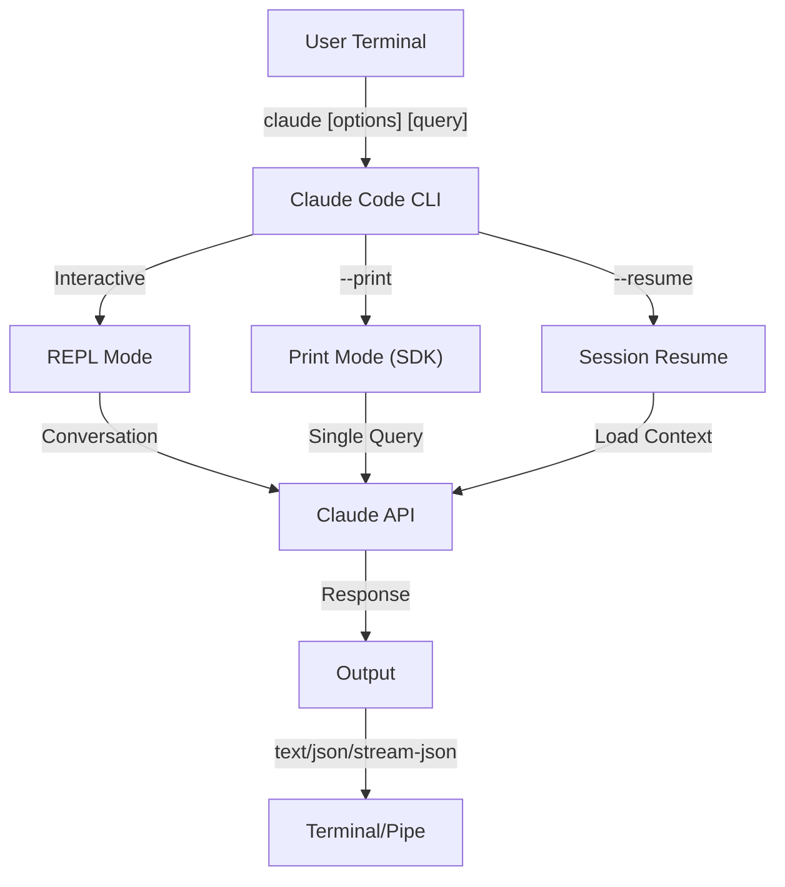
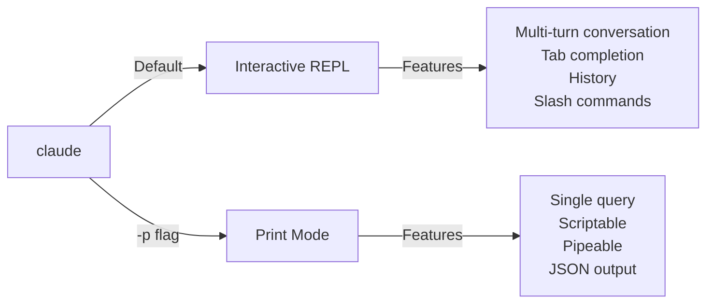

<picture>
  <source media="(prefers-color-scheme: dark)" srcset="../../resources/logos/claude-howto-logo-dark.svg">
  
</picture>

# CLI 참조

## 개요

Claude Code CLI(Command Line Interface)는 Claude Code와 상호 작용하는 주요 방법입니다. 쿼리 실행, 세션 관리, 모델 구성, Claude를 개발 워크플로우에 통합하기 위한 강력한 옵션을 제공합니다.

## 아키텍처



## CLI 명령어

| 명령어 | 설명 | 예시 |
|---------|-------------|---------|
| `claude` | 대화형 REPL 시작 | `claude` |
| `claude "query"` | 초기 프롬프트로 REPL 시작 | `claude "explain this project"` |
| `claude -p "query"` | Print mode - 쿼리 후 종료 | `claude -p "explain this function"` |
| `cat file \| claude -p "query"` | 파이프된 콘텐츠 처리 | `cat logs.txt \| claude -p "explain"` |
| `claude -c` | 가장 최근 대화 계속 | `claude -c` |
| `claude -c -p "query"` | Print mode에서 계속 | `claude -c -p "check for type errors"` |
| `claude -r "<session>" "query"` | ID 또는 이름으로 세션 재개 | `claude -r "auth-refactor" "finish this PR"` |
| `claude update` | 최신 버전으로 업데이트 | `claude update` |
| `claude mcp` | MCP 서버 구성 | [MCP 문서](../../05-mcp/) 참조 |
| `claude mcp serve` | Claude Code를 MCP 서버로 실행 | `claude mcp serve` |
| `claude agents` | 구성된 모든 subagent 나열 | `claude agents` |
| `claude auto-mode defaults` | Auto mode 기본 규칙을 JSON으로 출력 | `claude auto-mode defaults` |
| `claude remote-control` | Remote Control 서버 시작 | `claude remote-control` |
| `claude plugin` | plugin 관리 (설치, 활성화, 비활성화) | `claude plugin install my-plugin` |
| `claude auth login` | 로그인 (`--email`, `--sso` 지원) | `claude auth login --email user@example.com` |
| `claude auth logout` | 현재 계정에서 로그아웃 | `claude auth logout` |
| `claude auth status` | 인증 상태 확인 (로그인 시 exit 0, 아닐 시 1) | `claude auth status` |

## 핵심 플래그

| 플래그 | 설명 | 예시 |
|------|-------------|---------|
| `-p, --print` | 대화형 모드 없이 응답 출력 | `claude -p "query"` |
| `-c, --continue` | 가장 최근 대화 로드 | `claude --continue` |
| `-r, --resume` | ID 또는 이름으로 특정 세션 재개 | `claude --resume auth-refactor` |
| `-v, --version` | 버전 번호 출력 | `claude -v` |
| `-w, --worktree` | 격리된 git worktree에서 시작 | `claude -w` |
| `-n, --name` | 세션 표시 이름 | `claude -n "auth-refactor"` |
| `--from-pr <number>` | GitHub PR에 연결된 세션 재개 | `claude --from-pr 42` |
| `--remote "task"` | claude.ai에서 웹 세션 생성 | `claude --remote "implement API"` |
| `--remote-control, --rc` | Remote Control이 포함된 대화형 세션 | `claude --rc` |
| `--teleport` | 웹 세션을 로컬에서 재개 | `claude --teleport` |
| `--teammate-mode` | Agent team 표시 모드 | `claude --teammate-mode tmux` |
| `--bare` | 최소 모드 (hook, skill, plugin, MCP, 자동 메모리, CLAUDE.md 건너뜀) | `claude --bare` |
| `--enable-auto-mode` | Auto 권한 모드 잠금 해제 | `claude --enable-auto-mode` |
| `--channels` | MCP 채널 플러그인 구독 | `claude --channels discord,telegram` |
| `--chrome` / `--no-chrome` | Chrome 브라우저 통합 활성화/비활성화 | `claude --chrome` |
| `--effort` | Thinking 노력 수준 설정 | `claude --effort high` |
| `--init` / `--init-only` | 초기화 hook 실행 | `claude --init` |
| `--maintenance` | 유지보수 hook 실행 후 종료 | `claude --maintenance` |
| `--disable-slash-commands` | 모든 skill 및 slash command 비활성화 | `claude --disable-slash-commands` |
| `--no-session-persistence` | 세션 저장 비활성화 (print mode) | `claude -p --no-session-persistence "query"` |

### 대화형 모드 vs Print Mode



**대화형 모드** (기본):
```bash
# 대화형 세션 시작
claude

# 초기 프롬프트로 시작
claude "explain the authentication flow"
```

**Print Mode** (비대화형):
```bash
# 단일 쿼리 후 종료
claude -p "what does this function do?"

# 파일 내용 처리
cat error.log | claude -p "explain this error"

# 다른 도구와 체이닝
claude -p "list todos" | grep "URGENT"
```

## 모델 및 구성

| 플래그 | 설명 | 예시 |
|------|-------------|---------|
| `--model` | 모델 설정 (sonnet, opus, haiku 또는 전체 이름) | `claude --model opus` |
| `--fallback-model` | 과부하 시 자동 모델 폴백 | `claude -p --fallback-model sonnet "query"` |
| `--agent` | 세션에 사용할 agent 지정 | `claude --agent my-custom-agent` |
| `--agents` | JSON으로 사용자 정의 subagent 정의 | [Agent 구성](#agent-구성) 참조 |
| `--effort` | 노력 수준 설정 (low, medium, high, max) | `claude --effort high` |

### 모델 선택 예제

```bash
# 복잡한 작업에 Opus 4.6 사용
claude --model opus "design a caching strategy"

# 빠른 작업에 Haiku 4.5 사용
claude --model haiku -p "format this JSON"

# 전체 모델 이름
claude --model claude-sonnet-4-6-20250929 "review this code"

# 안정성을 위한 폴백 포함
claude -p --model opus --fallback-model sonnet "analyze architecture"

# opusplan 사용 (Opus가 계획, Sonnet이 실행)
claude --model opusplan "design and implement the caching layer"
```

## 시스템 프롬프트 사용자 정의

| 플래그 | 설명 | 예시 |
|------|-------------|---------|
| `--system-prompt` | 전체 기본 프롬프트 교체 | `claude --system-prompt "You are a Python expert"` |
| `--system-prompt-file` | 파일에서 프롬프트 로드 (print mode) | `claude -p --system-prompt-file ./prompt.txt "query"` |
| `--append-system-prompt` | 기본 프롬프트에 추가 | `claude --append-system-prompt "Always use TypeScript"` |

### 시스템 프롬프트 예제

```bash
# 완전한 사용자 정의 페르소나
claude --system-prompt "You are a senior security engineer. Focus on vulnerabilities."

# 특정 지시사항 추가
claude --append-system-prompt "Always include unit tests with code examples"

# 파일에서 복잡한 프롬프트 로드
claude -p --system-prompt-file ./prompts/code-reviewer.txt "review main.py"
```

### 시스템 프롬프트 플래그 비교

| 플래그 | 동작 | 대화형 | Print |
|------|----------|-------------|-------|
| `--system-prompt` | 전체 기본 시스템 프롬프트 교체 | ✅ | ✅ |
| `--system-prompt-file` | 파일의 프롬프트로 교체 | ❌ | ✅ |
| `--append-system-prompt` | 기본 시스템 프롬프트에 추가 | ✅ | ✅ |

**`--system-prompt-file`은 print mode에서만 사용합니다. 대화형 모드에서는 `--system-prompt` 또는 `--append-system-prompt`를 사용하세요.**

## 도구 및 권한 관리

| 플래그 | 설명 | 예시 |
|------|-------------|---------|
| `--tools` | 사용 가능한 내장 도구 제한 | `claude -p --tools "Bash,Edit,Read" "query"` |
| `--allowedTools` | 프롬프트 없이 실행되는 도구 | `"Bash(git log:*)" "Read"` |
| `--disallowedTools` | 컨텍스트에서 제거되는 도구 | `"Bash(rm:*)" "Edit"` |
| `--dangerously-skip-permissions` | 모든 권한 프롬프트 건너뛰기 | `claude --dangerously-skip-permissions` |
| `--permission-mode` | 지정된 권한 모드에서 시작 | `claude --permission-mode auto` |
| `--permission-prompt-tool` | 권한 처리를 위한 MCP 도구 | `claude -p --permission-prompt-tool mcp_auth "query"` |
| `--enable-auto-mode` | Auto 권한 모드 잠금 해제 | `claude --enable-auto-mode` |

### 권한 예제

```bash
# 코드 리뷰를 위한 읽기 전용 모드
claude --permission-mode plan "review this codebase"

# 안전한 도구만으로 제한
claude --tools "Read,Grep,Glob" -p "find all TODO comments"

# 특정 git 명령어를 프롬프트 없이 허용
claude --allowedTools "Bash(git status:*)" "Bash(git log:*)"

# 위험한 작업 차단
claude --disallowedTools "Bash(rm -rf:*)" "Bash(git push --force:*)"
```

## 출력 및 형식

| 플래그 | 설명 | 옵션 | 예시 |
|------|-------------|---------|---------|
| `--output-format` | 출력 형식 지정 (print mode) | `text`, `json`, `stream-json` | `claude -p --output-format json "query"` |
| `--input-format` | 입력 형식 지정 (print mode) | `text`, `stream-json` | `claude -p --input-format stream-json` |
| `--verbose` | 상세 로깅 활성화 | | `claude --verbose` |
| `--include-partial-messages` | 스트리밍 이벤트 포함 | `stream-json` 필요 | `claude -p --output-format stream-json --include-partial-messages "query"` |
| `--json-schema` | 스키마에 맞는 검증된 JSON 가져오기 | | `claude -p --json-schema '{"type":"object"}' "query"` |
| `--max-budget-usd` | Print mode의 최대 지출 | | `claude -p --max-budget-usd 5.00 "query"` |

### 출력 형식 예제

```bash
# 일반 텍스트 (기본)
claude -p "explain this code"

# 프로그래밍적 사용을 위한 JSON
claude -p --output-format json "list all functions in main.py"

# 실시간 처리를 위한 스트리밍 JSON
claude -p --output-format stream-json "generate a long report"

# 스키마 검증이 포함된 구조화된 출력
claude -p --json-schema '{"type":"object","properties":{"bugs":{"type":"array"}}}' \
  "find bugs in this code and return as JSON"
```

## 작업 공간 및 디렉토리

| 플래그 | 설명 | 예시 |
|------|-------------|---------|
| `--add-dir` | 추가 작업 디렉토리 추가 | `claude --add-dir ../apps ../lib` |
| `--setting-sources` | 쉼표로 구분된 설정 소스 | `claude --setting-sources user,project` |
| `--settings` | 파일 또는 JSON에서 설정 로드 | `claude --settings ./settings.json` |
| `--plugin-dir` | 디렉토리에서 plugin 로드 (반복 가능) | `claude --plugin-dir ./my-plugin` |

### 다중 디렉토리 예제

```bash
# 여러 프로젝트 디렉토리에서 작업
claude --add-dir ../frontend ../backend ../shared "find all API endpoints"

# 사용자 정의 설정 로드
claude --settings '{"model":"opus","verbose":true}' "complex task"
```

## MCP 구성

| 플래그 | 설명 | 예시 |
|------|-------------|---------|
| `--mcp-config` | JSON에서 MCP 서버 로드 | `claude --mcp-config ./mcp.json` |
| `--strict-mcp-config` | 지정된 MCP 설정만 사용 | `claude --strict-mcp-config --mcp-config ./mcp.json` |
| `--channels` | MCP 채널 플러그인 구독 | `claude --channels discord,telegram` |

### MCP 예제

```bash
# GitHub MCP 서버 로드
claude --mcp-config ./github-mcp.json "list open PRs"

# Strict 모드 - 지정된 서버만 사용
claude --strict-mcp-config --mcp-config ./production-mcp.json "deploy to staging"
```

## 세션 관리

| 플래그 | 설명 | 예시 |
|------|-------------|---------|
| `--session-id` | 특정 세션 ID 사용 (UUID) | `claude --session-id "550e8400-..."` |
| `--fork-session` | 재개 시 새 세션 생성 | `claude --resume abc123 --fork-session` |

### 세션 예제

```bash
# 마지막 대화 계속
claude -c

# 이름이 지정된 세션 재개
claude -r "feature-auth" "continue implementing login"

# 실험을 위해 세션 분기
claude --resume feature-auth --fork-session "try alternative approach"

# 특정 세션 ID 사용
claude --session-id "550e8400-e29b-41d4-a716-446655440000" "continue"
```

### 세션 분기

실험을 위해 기존 세션에서 브랜치를 생성합니다:

```bash
# 다른 접근 방식을 시도하기 위해 세션 분기
claude --resume abc123 --fork-session "try alternative implementation"

# 사용자 정의 메시지로 분기
claude -r "feature-auth" --fork-session "test with different architecture"
```

**사용 사례:**
- 원본 세션을 잃지 않고 대안적 구현 시도
- 병렬로 다른 접근 방식 실험
- 성공한 작업에서 변형을 위한 브랜치 생성
- 메인 세션에 영향을 주지 않고 파괴적 변경 테스트

원본 세션은 변경되지 않으며, 분기된 세션은 새로운 독립 세션이 됩니다.

## 고급 기능

| 플래그 | 설명 | 예시 |
|------|-------------|---------|
| `--chrome` | Chrome 브라우저 통합 활성화 | `claude --chrome` |
| `--no-chrome` | Chrome 브라우저 통합 비활성화 | `claude --no-chrome` |
| `--ide` | IDE가 사용 가능하면 자동 연결 | `claude --ide` |
| `--max-turns` | 에이전트 턴 제한 (비대화형) | `claude -p --max-turns 3 "query"` |
| `--debug` | 필터링이 포함된 디버그 모드 활성화 | `claude --debug "api,mcp"` |
| `--enable-lsp-logging` | 상세 LSP 로깅 활성화 | `claude --enable-lsp-logging` |
| `--betas` | API 요청을 위한 베타 헤더 | `claude --betas interleaved-thinking` |
| `--plugin-dir` | 디렉토리에서 plugin 로드 (반복 가능) | `claude --plugin-dir ./my-plugin` |
| `--enable-auto-mode` | Auto 권한 모드 잠금 해제 | `claude --enable-auto-mode` |
| `--effort` | Thinking 노력 수준 설정 | `claude --effort high` |
| `--bare` | 최소 모드 (hook, skill, plugin, MCP, 자동 메모리, CLAUDE.md 건너뜀) | `claude --bare` |
| `--channels` | MCP 채널 플러그인 구독 | `claude --channels discord` |
| `--tmux` | Worktree용 tmux 세션 생성 | `claude --tmux` |
| `--fork-session` | 재개 시 새 세션 ID 생성 | `claude --resume abc --fork-session` |
| `--max-budget-usd` | 최대 지출 (print mode) | `claude -p --max-budget-usd 5.00 "query"` |
| `--json-schema` | 검증된 JSON 출력 | `claude -p --json-schema '{"type":"object"}' "q"` |

### 고급 예제

```bash
# 자율 작업 제한
claude -p --max-turns 5 "refactor this module"

# API 호출 디버그
claude --debug "api" "test query"

# IDE 통합 활성화
claude --ide "help me with this file"
```

## Agent 구성

`--agents` 플래그는 세션에 대한 사용자 정의 subagent를 정의하는 JSON 객체를 받습니다.

### Agent JSON 형식

```json
{
  "agent-name": {
    "description": "Required: when to invoke this agent",
    "prompt": "Required: system prompt for the agent",
    "tools": ["Optional", "array", "of", "tools"],
    "model": "optional: sonnet|opus|haiku"
  }
}
```

**필수 필드:**
- `description` - 이 agent를 사용할 시기에 대한 자연어 설명
- `prompt` - agent의 역할과 동작을 정의하는 시스템 프롬프트

**선택 필드:**
- `tools` - 사용 가능한 도구 배열 (생략 시 모두 상속)
  - 형식: `["Read", "Grep", "Glob", "Bash"]`
- `model` - 사용할 모델: `sonnet`, `opus`, 또는 `haiku`

### 전체 Agent 예제

```json
{
  "code-reviewer": {
    "description": "Expert code reviewer. Use proactively after code changes.",
    "prompt": "You are a senior code reviewer. Focus on code quality, security, and best practices.",
    "tools": ["Read", "Grep", "Glob", "Bash"],
    "model": "sonnet"
  },
  "debugger": {
    "description": "Debugging specialist for errors and test failures.",
    "prompt": "You are an expert debugger. Analyze errors, identify root causes, and provide fixes.",
    "tools": ["Read", "Edit", "Bash", "Grep"],
    "model": "opus"
  },
  "documenter": {
    "description": "Documentation specialist for generating guides.",
    "prompt": "You are a technical writer. Create clear, comprehensive documentation.",
    "tools": ["Read", "Write"],
    "model": "haiku"
  }
}
```

### Agent 명령어 예제

```bash
# 인라인으로 사용자 정의 agent 정의
claude --agents '{
  "security-auditor": {
    "description": "Security specialist for vulnerability analysis",
    "prompt": "You are a security expert. Find vulnerabilities and suggest fixes.",
    "tools": ["Read", "Grep", "Glob"],
    "model": "opus"
  }
}' "audit this codebase for security issues"

# 파일에서 agent 로드
claude --agents "$(cat ~/.claude/agents.json)" "review the auth module"

# 다른 플래그와 결합
claude -p --agents "$(cat agents.json)" --model sonnet "analyze performance"
```

### Agent 우선순위

여러 agent 정의가 존재할 때, 다음 우선순위로 로드됩니다:
1. **CLI 정의** (`--agents` 플래그) - 세션별
2. **사용자 수준** (`~/.claude/agents/`) - 모든 프로젝트
3. **프로젝트 수준** (`.claude/agents/`) - 현재 프로젝트

CLI 정의 agent는 세션 동안 사용자 및 프로젝트 agent를 모두 재정의합니다.

---

## 고가치 사용 사례

### 1. CI/CD 통합

자동화된 코드 리뷰, 테스트, 문서화를 위해 CI/CD 파이프라인에서 Claude Code를 사용합니다.

**GitHub Actions 예제:**

```yaml
name: AI Code Review

on: [pull_request]

jobs:
  review:
    runs-on: ubuntu-latest
    steps:
      - uses: actions/checkout@v4

      - name: Install Claude Code
        run: npm install -g @anthropic-ai/claude-code

      - name: Run Code Review
        env:
          ANTHROPIC_API_KEY: ${{ secrets.ANTHROPIC_API_KEY }}
        run: |
          claude -p --output-format json \
            --max-turns 1 \
            "Review the changes in this PR for:
            - Security vulnerabilities
            - Performance issues
            - Code quality
            Output as JSON with 'issues' array" > review.json

      - name: Post Review Comment
        uses: actions/github-script@v7
        with:
          script: |
            const fs = require('fs');
            const review = JSON.parse(fs.readFileSync('review.json', 'utf8'));
            // Process and post review comments
```

**Jenkins Pipeline:**

```groovy
pipeline {
    agent any
    stages {
        stage('AI Review') {
            steps {
                sh '''
                    claude -p --output-format json \
                      --max-turns 3 \
                      "Analyze test coverage and suggest missing tests" \
                      > coverage-analysis.json
                '''
            }
        }
    }
}
```

### 2. 스크립트 파이핑

분석을 위해 파일, 로그, 데이터를 Claude를 통해 처리합니다.

**로그 분석:**

```bash
# 오류 로그 분석
tail -1000 /var/log/app/error.log | claude -p "summarize these errors and suggest fixes"

# 접근 로그에서 패턴 찾기
cat access.log | claude -p "identify suspicious access patterns"

# Git 이력 분석
git log --oneline -50 | claude -p "summarize recent development activity"
```

**코드 처리:**

```bash
# 특정 파일 리뷰
cat src/auth.ts | claude -p "review this authentication code for security issues"

# 문서 생성
cat src/api/*.ts | claude -p "generate API documentation in markdown"

# TODO 찾기 및 우선순위 지정
grep -r "TODO" src/ | claude -p "prioritize these TODOs by importance"
```

### 3. 다중 세션 워크플로우

여러 대화 스레드로 복잡한 프로젝트를 관리합니다.

```bash
# 기능 브랜치 세션 시작
claude -r "feature-auth" "let's implement user authentication"

# 나중에 세션 계속
claude -r "feature-auth" "add password reset functionality"

# 대안적 접근 방식을 시도하기 위해 분기
claude --resume feature-auth --fork-session "try OAuth instead"

# 다른 기능 세션으로 전환
claude -r "feature-payments" "continue with Stripe integration"
```

### 4. 사용자 정의 Agent 구성

팀의 워크플로우에 맞는 전문 agent를 정의합니다.

```bash
# Agent 설정을 파일에 저장
cat > ~/.claude/agents.json << 'EOF'
{
  "reviewer": {
    "description": "Code reviewer for PR reviews",
    "prompt": "Review code for quality, security, and maintainability.",
    "model": "opus"
  },
  "documenter": {
    "description": "Documentation specialist",
    "prompt": "Generate clear, comprehensive documentation.",
    "model": "sonnet"
  },
  "refactorer": {
    "description": "Code refactoring expert",
    "prompt": "Suggest and implement clean code refactoring.",
    "tools": ["Read", "Edit", "Glob"]
  }
}
EOF

# 세션에서 agent 사용
claude --agents "$(cat ~/.claude/agents.json)" "review the auth module"
```

### 5. 배치 처리

일관된 설정으로 여러 쿼리를 처리합니다.

```bash
# 여러 파일 처리
for file in src/*.ts; do
  echo "Processing $file..."
  claude -p --model haiku "summarize this file: $(cat $file)" >> summaries.md
done

# 배치 코드 리뷰
find src -name "*.py" -exec sh -c '
  echo "## $1" >> review.md
  cat "$1" | claude -p "brief code review" >> review.md
' _ {} \;

# 모든 모듈에 대한 테스트 생성
for module in $(ls src/modules/); do
  claude -p "generate unit tests for src/modules/$module" > "tests/$module.test.ts"
done
```

### 6. 보안 인식 개발

안전한 운영을 위해 권한 제어를 사용합니다.

```bash
# 읽기 전용 보안 감사
claude --permission-mode plan \
  --tools "Read,Grep,Glob" \
  "audit this codebase for security vulnerabilities"

# 위험한 명령어 차단
claude --disallowedTools "Bash(rm:*)" "Bash(curl:*)" "Bash(wget:*)" \
  "help me clean up this project"

# 제한된 자동화
claude -p --max-turns 2 \
  --allowedTools "Read" "Glob" \
  "find all hardcoded credentials"
```

### 7. JSON API 통합

`jq` 파싱을 사용하여 Claude를 도구의 프로그래밍 가능한 API로 활용합니다.

```bash
# 구조화된 분석 가져오기
claude -p --output-format json \
  --json-schema '{"type":"object","properties":{"functions":{"type":"array"},"complexity":{"type":"string"}}}' \
  "analyze main.py and return function list with complexity rating"

# jq와 통합하여 처리
claude -p --output-format json "list all API endpoints" | jq '.endpoints[]'

# 스크립트에서 사용
RESULT=$(claude -p --output-format json "is this code secure? answer with {secure: boolean, issues: []}" < code.py)
if echo "$RESULT" | jq -e '.secure == false' > /dev/null; then
  echo "Security issues found!"
  echo "$RESULT" | jq '.issues[]'
fi
```

### jq 파싱 예제

`jq`를 사용하여 Claude의 JSON 출력을 파싱하고 처리합니다:

```bash
# 특정 필드 추출
claude -p --output-format json "analyze this code" | jq '.result'

# 배열 요소 필터링
claude -p --output-format json "list issues" | jq -r '.issues[] | select(.severity=="high")'

# 여러 필드 추출
claude -p --output-format json "describe the project" | jq -r '.{name, version, description}'

# CSV로 변환
claude -p --output-format json "list functions" | jq -r '.functions[] | [.name, .lineCount] | @csv'

# 조건부 처리
claude -p --output-format json "check security" | jq 'if .vulnerabilities | length > 0 then "UNSAFE" else "SAFE" end'

# 중첩된 값 추출
claude -p --output-format json "analyze performance" | jq '.metrics.cpu.usage'

# 전체 배열 처리
claude -p --output-format json "find todos" | jq '.todos | length'

# 출력 변환
claude -p --output-format json "list improvements" | jq 'map({title: .title, priority: .priority})'
```

---

## 모델

Claude Code는 다양한 기능을 가진 여러 모델을 지원합니다:

| 모델 | ID | 컨텍스트 윈도우 | 참고 |
|-------|-----|----------------|-------|
| Opus 4.6 | `claude-opus-4-6` | 1M 토큰 | 가장 강력, 적응형 노력 수준 |
| Sonnet 4.6 | `claude-sonnet-4-6` | 1M 토큰 | 속도와 성능의 균형 |
| Haiku 4.5 | `claude-haiku-4-5` | 1M 토큰 | 가장 빠름, 빠른 작업에 최적 |

### 모델 선택

```bash
# 짧은 이름 사용
claude --model opus "complex architectural review"
claude --model sonnet "implement this feature"
claude --model haiku -p "format this JSON"

# opusplan 별칭 사용 (Opus가 계획, Sonnet이 실행)
claude --model opusplan "design and implement the API"

# 세션 중 빠른 모드 토글
/fast
```

### 노력 수준 (Opus 4.6)

Opus 4.6는 노력 수준에 따른 적응형 추론을 지원합니다:

```bash
# CLI 플래그로 노력 수준 설정
claude --effort high "complex review"

# Slash command로 노력 수준 설정
/effort high

# 환경 변수로 노력 수준 설정
export CLAUDE_CODE_EFFORT_LEVEL=high   # low, medium, high, or max (Opus 4.6 only)
```

프롬프트에서 "ultrathink" 키워드가 딥 추론을 활성화합니다. `max` 노력 수준은 Opus 4.6 전용입니다.

---

## 주요 환경 변수

| 변수 | 설명 |
|----------|-------------|
| `ANTHROPIC_API_KEY` | 인증을 위한 API 키 |
| `ANTHROPIC_MODEL` | 기본 모델 재정의 |
| `ANTHROPIC_CUSTOM_MODEL_OPTION` | API용 사용자 정의 모델 옵션 |
| `ANTHROPIC_DEFAULT_OPUS_MODEL` | 기본 Opus 모델 ID 재정의 |
| `ANTHROPIC_DEFAULT_SONNET_MODEL` | 기본 Sonnet 모델 ID 재정의 |
| `ANTHROPIC_DEFAULT_HAIKU_MODEL` | 기본 Haiku 모델 ID 재정의 |
| `MAX_THINKING_TOKENS` | Extended thinking 토큰 예산 설정 |
| `CLAUDE_CODE_EFFORT_LEVEL` | 노력 수준 설정 (`low`/`medium`/`high`/`max`) |
| `CLAUDE_CODE_SIMPLE` | 최소 모드, `--bare` 플래그로 설정 |
| `CLAUDE_CODE_DISABLE_AUTO_MEMORY` | 자동 CLAUDE.md 업데이트 비활성화 |
| `CLAUDE_CODE_DISABLE_BACKGROUND_TASKS` | Background task 실행 비활성화 |
| `CLAUDE_CODE_DISABLE_CRON` | 예약/cron 작업 비활성화 |
| `CLAUDE_CODE_DISABLE_GIT_INSTRUCTIONS` | Git 관련 안내 비활성화 |
| `CLAUDE_CODE_DISABLE_TERMINAL_TITLE` | 터미널 제목 업데이트 비활성화 |
| `CLAUDE_CODE_DISABLE_1M_CONTEXT` | 1M 토큰 컨텍스트 윈도우 비활성화 |
| `CLAUDE_CODE_DISABLE_NONSTREAMING_FALLBACK` | 비스트리밍 폴백 비활성화 |
| `CLAUDE_CODE_ENABLE_TASKS` | Task list 기능 활성화 |
| `CLAUDE_CODE_TASK_LIST_ID` | 세션 간 공유되는 이름이 지정된 작업 디렉토리 |
| `CLAUDE_CODE_ENABLE_PROMPT_SUGGESTION` | 프롬프트 제안 토글 (`true`/`false`) |
| `CLAUDE_CODE_EXPERIMENTAL_AGENT_TEAMS` | 실험적 agent teams 활성화 |
| `CLAUDE_CODE_NEW_INIT` | 새 초기화 플로우 사용 |
| `CLAUDE_CODE_SUBAGENT_MODEL` | Subagent 실행 모델 |
| `CLAUDE_CODE_PLUGIN_SEED_DIR` | Plugin 시드 파일 디렉토리 |
| `CLAUDE_CODE_SUBPROCESS_ENV_SCRUB` | 서브프로세스에서 제거할 환경 변수 |
| `CLAUDE_AUTOCOMPACT_PCT_OVERRIDE` | 자동 압축 비율 재정의 |
| `CLAUDE_STREAM_IDLE_TIMEOUT_MS` | 스트림 유휴 타임아웃 (밀리초) |
| `SLASH_COMMAND_TOOL_CHAR_BUDGET` | Slash command 도구 문자 예산 |
| `ENABLE_TOOL_SEARCH` | 도구 검색 기능 활성화 |
| `MAX_MCP_OUTPUT_TOKENS` | MCP 도구 출력 최대 토큰 |

---

## 빠른 참조

### 가장 많이 사용되는 명령어

```bash
# 대화형 세션
claude

# 빠른 질문
claude -p "how do I..."

# 대화 계속
claude -c

# 파일 처리
cat file.py | claude -p "review this"

# 스크립트용 JSON 출력
claude -p --output-format json "query"
```

### 플래그 조합

| 사용 사례 | 명령어 |
|----------|---------|
| 빠른 코드 리뷰 | `cat file | claude -p "review"` |
| 구조화된 출력 | `claude -p --output-format json "query"` |
| 안전한 탐색 | `claude --permission-mode plan` |
| 안전 가드레일이 있는 자율 작업 | `claude --enable-auto-mode --permission-mode auto` |
| CI/CD 통합 | `claude -p --max-turns 3 --output-format json` |
| 작업 재개 | `claude -r "session-name"` |
| 사용자 정의 모델 | `claude --model opus "complex task"` |
| 최소 모드 | `claude --bare "quick query"` |
| 예산 제한 실행 | `claude -p --max-budget-usd 2.00 "analyze code"` |

---

## 문제 해결

### 명령어를 찾을 수 없음

**문제:** `claude: command not found`

**해결 방법:**
- Claude Code 설치: `npm install -g @anthropic-ai/claude-code`
- PATH에 npm 전역 bin 디렉토리가 포함되어 있는지 확인
- 전체 경로로 실행 시도: `npx claude`

### API 키 문제

**문제:** 인증 실패

**해결 방법:**
- API 키 설정: `export ANTHROPIC_API_KEY=your-key`
- 키가 유효하고 충분한 크레딧이 있는지 확인
- 요청한 모델에 대한 키 권한 확인

### 세션을 찾을 수 없음

**문제:** 세션을 재개할 수 없음

**해결 방법:**
- 사용 가능한 세션 목록을 확인하여 올바른 이름/ID 찾기
- 세션이 비활성 기간 후 만료되었을 수 있음
- 가장 최근 세션을 계속하려면 `-c` 사용

### 출력 형식 문제

**문제:** JSON 출력이 올바르지 않음

**해결 방법:**
- `--json-schema`를 사용하여 구조 강제
- 프롬프트에 명시적인 JSON 지시사항 추가
- `--output-format json` 사용 (프롬프트에서 JSON을 요청하는 것만으로는 부족)

### 권한 거부

**문제:** 도구 실행이 차단됨

**해결 방법:**
- `--permission-mode` 설정 확인
- `--allowedTools` 및 `--disallowedTools` 플래그 검토
- 자동화에는 `--dangerously-skip-permissions` 사용 (주의하여)

---

## 추가 리소스

- **[공식 CLI 참조](https://code.claude.com/docs/en/cli-reference)** - 전체 명령어 참조
- **[Headless 모드 문서](https://code.claude.com/docs/en/headless)** - 자동화 실행
- **[Slash Command](../../01-slash-commands/)** - Claude 내 사용자 정의 단축키
- **[메모리 가이드](../../02-memory/)** - CLAUDE.md를 통한 영구 컨텍스트
- **[MCP 프로토콜](../../05-mcp/)** - 외부 도구 통합
- **[고급 기능](../../09-advanced-features/)** - Plan mode, extended thinking
- **[Subagent 가이드](../../04-subagents/)** - 위임 작업 실행

---

*[Claude How To](../../) 가이드 시리즈의 일부입니다*

---
**최종 업데이트**: 2026년 4월
**Claude Code 버전**: 2.1+
**호환 모델**: Claude Sonnet 4.6, Claude Opus 4.6, Claude Haiku 4.5
