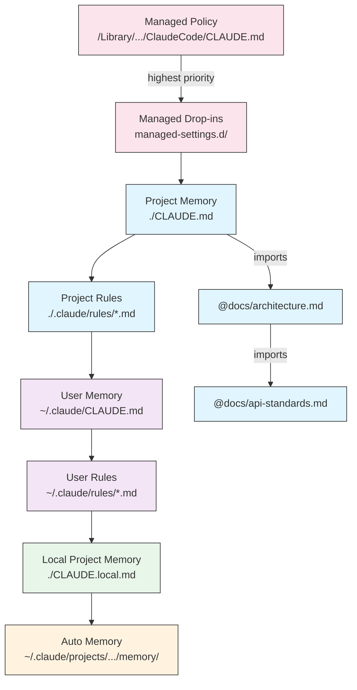

이 문서는 Claude Code가 시작될 때 어떤 순서로 Memory 파일을 읽고 어떤 파일이 우선권을 갖는지 정리합니다. 조직 정책부터 자동 Memory까지 8개의 티어가 충돌할 때 어느 쪽이 이기는지 확인해야 할 때 참고하세요. 새 Memory 파일을 어디에 두면 의도대로 적용되는지 결정할 때 이 계층을 기준으로 위치를 고르면 됩니다.

Claude Code는 다중 티어 계층적 memory 시스템을 사용합니다. Memory 파일은 Claude Code가 실행될 때 자동으로 로드되며, 상위 수준 파일이 우선권을 갖습니다.

**전체 Memory 계층 (우선순위 순서):**

1. **관리 정책** - 조직 전체 지시사항
   - macOS: `/Library/Application Support/ClaudeCode/CLAUDE.md`
   - Linux/WSL: `/etc/claude-code/CLAUDE.md`
   - Windows: `C:\Program Files\ClaudeCode\CLAUDE.md`

2. **관리 드롭인** - 알파벳순으로 병합되는 정책 파일 (v2.1.83+)
   - 관리 정책 CLAUDE.md와 같은 위치의 `managed-settings.d/` 디렉터리
   - 모듈식 정책 관리를 위해 알파벳순으로 파일 병합

3. **프로젝트 Memory** - 팀 공유 컨텍스트 (버전 관리됨)
   - `./.claude/CLAUDE.md` 또는 `./CLAUDE.md` (리포지토리 루트)

4. **프로젝트 규칙** - 모듈식, 주제별 프로젝트 지시사항
   - `./.claude/rules/*.md`

5. **사용자 Memory** - 개인 설정 (모든 프로젝트)
   - `~/.claude/CLAUDE.md`

6. **사용자 수준 규칙** - 개인 규칙 (모든 프로젝트)
   - `~/.claude/rules/*.md`

7. **로컬 프로젝트 Memory** - 개인 프로젝트별 설정
   - `./CLAUDE.local.md`

[[TIP("참고")]]
`CLAUDE.local.md`는 [공식 문서](https://code.claude.com/docs/ko/memory)에서 완전히 지원되고 문서화되어 있습니다. 버전 관리에 커밋되지 않는 개인 프로젝트별 설정을 제공합니다. `CLAUDE.local.md`를 `.gitignore`에 추가하십시오.
[[/TIP]]

8. **자동 Memory** - Claude의 자동 메모 및 학습 내용
   - `~/.claude/projects/<project>/memory/`

**Memory 탐색 동작:**

Claude는 다음 순서로 memory 파일을 검색하며, 앞에 있는 위치가 우선권을 갖습니다:

