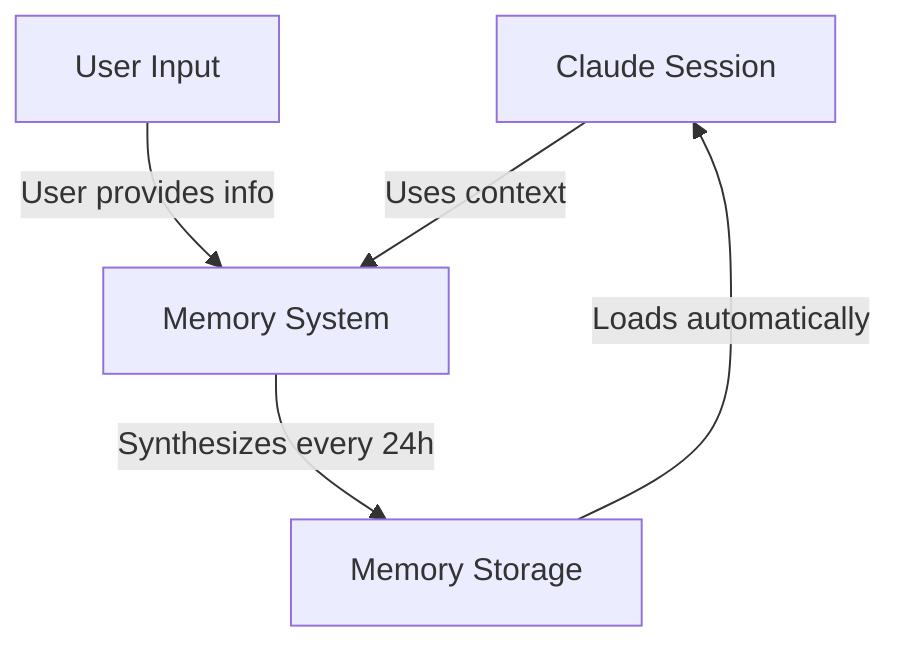
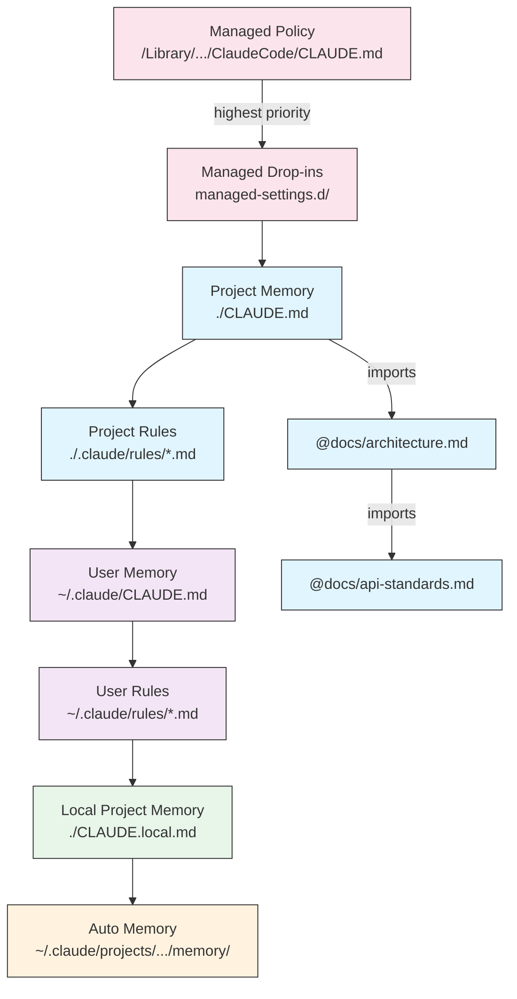
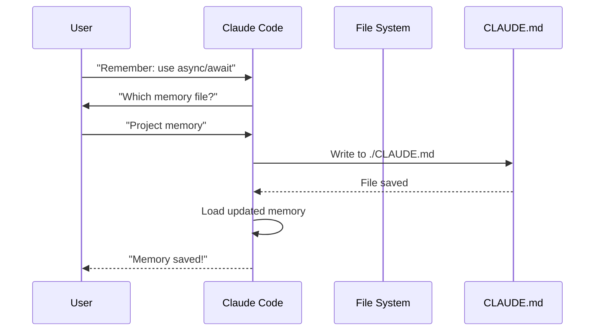
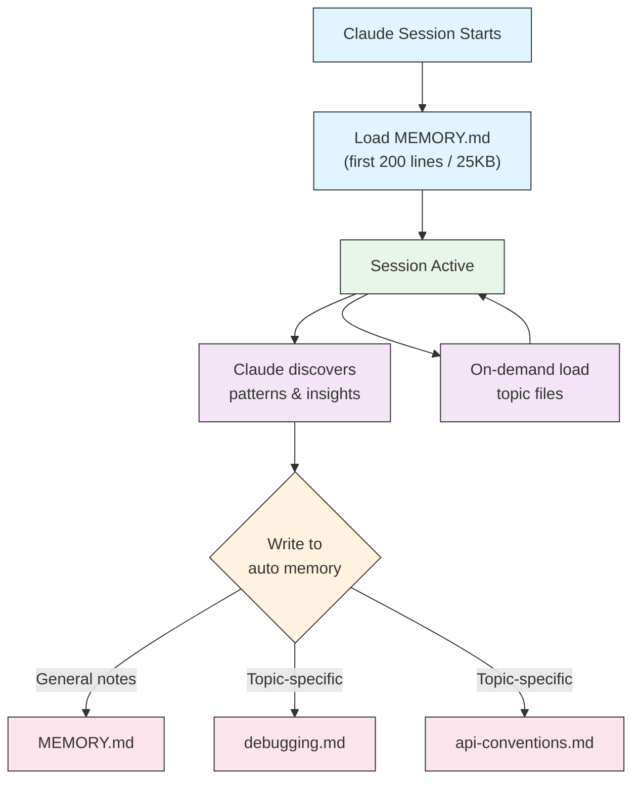
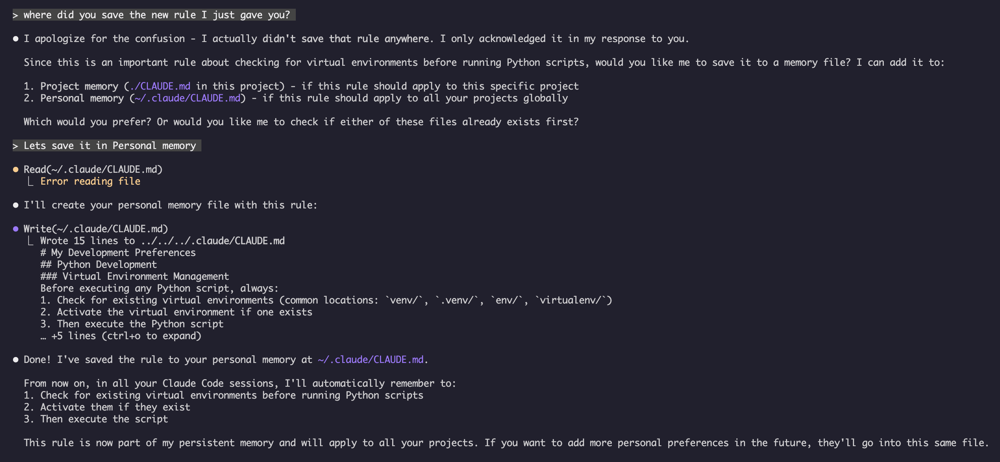

# 02. Memory 가이드

Memory는 Claude가 세션과 대화 간에 컨텍스트를 유지할 수 있게 합니다. claude.ai에서는 자동 합성 형태로, Claude Code에서는 파일 시스템 기반 CLAUDE.md 형태로 존재합니다.

## 언제 읽으면 좋은가

- 팀 표준이나 코드 스타일을 Claude가 매번 잊지 않게 하고 싶을 때
- 여러 프로젝트에서 개인 개발 설정을 일관되게 적용하고 싶을 때
- 디렉터리별로 다른 규칙(예: API 폴더 vs UI 폴더)을 자동 적용하고 싶을 때
- 긴 대화 중간에 자주 반복하는 지시사항을 영구 컨텍스트로 만들고 싶을 때

## 개요

Claude Code의 Memory는 여러 세션과 대화에 걸쳐 전달되는 영구 컨텍스트를 제공합니다. 임시 컨텍스트 윈도우와 달리 memory 파일을 통해 다음을 수행할 수 있습니다:

- 팀 전체에 프로젝트 표준 공유
- 개인 개발 설정 저장
- 디렉터리별 규칙 및 구성 유지
- 외부 문서 가져오기
- 프로젝트의 일부로 memory를 버전 관리

Memory 시스템은 전역 개인 설정부터 특정 하위 디렉터리까지 여러 수준에서 작동하며, Claude가 무엇을 기억하고 어떻게 해당 지식을 적용하는지에 대한 세밀한 제어가 가능합니다.

## Memory 명령 빠른 참조

| Command | 용도 | 사용법 | 사용 시기 |
|---------|---------|-------|-------------|
| `/init` | 프로젝트 memory 초기화 | `/init` | 새 프로젝트 시작, 최초 CLAUDE.md 설정 |
| `/memory` | 편집기에서 memory 파일 편집 | `/memory` | 대규모 업데이트, 재구성, 내용 검토 |
| `#` 접두사 | 빠른 한 줄 memory 추가 | `# Your rule here` | 대화 중 빠른 규칙 추가 |
| `# new rule into memory` | 명시적 memory 추가 | `# new rule into memory<br>Your detailed rule` | 복잡한 여러 줄 규칙 추가 |
| `# remember this` | 자연어 memory | `# remember this<br>Your instruction` | 대화형 memory 업데이트 |
| `@path/to/file` | 외부 콘텐츠 가져오기 | `@README.md` 또는 `@docs/api.md` | CLAUDE.md에서 기존 문서 참조 |

## 빠른 시작: Memory 초기화

### `/init` 명령

`/init` 명령은 Claude Code에서 프로젝트 memory를 설정하는 가장 빠른 방법입니다. 기본 프로젝트 문서가 포함된 CLAUDE.md 파일을 초기화합니다.

**사용법:**

```bash
/init
```

**기능:**

- 프로젝트에 새 CLAUDE.md 파일 생성 (일반적으로 `./CLAUDE.md` 또는 `./.claude/CLAUDE.md`)
- 프로젝트 규칙과 가이드라인 수립
- 세션 간 컨텍스트 지속을 위한 기반 설정
- 프로젝트 표준 문서화를 위한 템플릿 구조 제공

**향상된 대화형 모드:** `CLAUDE_CODE_NEW_INIT=1`을 설정하면 프로젝트 설정을 단계별로 안내하는 다단계 대화형 흐름이 활성화됩니다:

```bash
CLAUDE_CODE_NEW_INIT=1 claude
/init
```

**`/init` 사용 시기:**

- Claude Code로 새 프로젝트 시작
- 팀 코딩 표준 및 규칙 수립
- 코드베이스 구조에 대한 문서 생성
- 협업 개발을 위한 memory 계층 설정

**예시 워크플로:**

```markdown
# In your project directory
/init

# Claude creates CLAUDE.md with structure like:
# Project Configuration
## Project Overview
- Name: Your Project
- Tech Stack: [Your technologies]
- Team Size: [Number of developers]

## Development Standards
- Code style preferences
- Testing requirements
- Git workflow conventions
```

### `#`을 사용한 빠른 Memory 업데이트

대화 중 메시지를 `#`으로 시작하여 memory에 빠르게 정보를 추가할 수 있습니다:

**구문:**

```markdown
# Your memory rule or instruction here
```

**예시:**

```markdown
# Always use TypeScript strict mode in this project

# Prefer async/await over promise chains

# Run npm test before every commit

# Use kebab-case for file names
```

**작동 방식:**

1. `#` 뒤에 규칙을 입력하여 메시지 시작
2. Claude가 이를 memory 업데이트 요청으로 인식
3. Claude가 어떤 memory 파일을 업데이트할지 질문 (프로젝트 또는 개인)
4. 적절한 CLAUDE.md 파일에 규칙 추가
5. 이후 세션에서 이 컨텍스트를 자동으로 로드

**대안 패턴:**

```markdown
# new rule into memory
Always validate user input with Zod schemas

# remember this
Use semantic versioning for all releases

# add to memory
Database migrations must be reversible
```

### `/memory` 명령

`/memory` 명령은 Claude Code 세션 내에서 CLAUDE.md memory 파일을 직접 편집할 수 있는 접근을 제공합니다. 시스템 편집기에서 memory 파일을 열어 종합적인 편집이 가능합니다.

**사용법:**

```bash
/memory
```

**기능:**

- 시스템 기본 편집기에서 memory 파일 열기
- 대규모 추가, 수정, 재구성 수행 가능
- 계층 구조의 모든 memory 파일에 직접 접근
- 세션 간 영구 컨텍스트 관리 가능

**`/memory` 사용 시기:**

- 기존 memory 내용 검토
- 프로젝트 표준에 대한 대규모 업데이트
- Memory 구조 재구성
- 상세한 문서 또는 가이드라인 추가
- 프로젝트가 발전함에 따라 memory 유지 및 업데이트

**비교: `/memory` vs `/init`**

| 항목 | `/memory` | `/init` |
|--------|-----------|---------|
| **목적** | 기존 memory 파일 편집 | 새 CLAUDE.md 초기화 |
| **사용 시기** | 프로젝트 컨텍스트 업데이트/수정 | 새 프로젝트 시작 |
| **동작** | 편집기를 열어 변경 | 시작 템플릿 생성 |
| **워크플로** | 지속적인 유지보수 | 일회성 설정 |

**예시 워크플로:**

```markdown
# Open memory for editing
/memory

# Claude presents options:
# 1. Managed Policy Memory
# 2. Project Memory (./CLAUDE.md)
# 3. User Memory (~/.claude/CLAUDE.md)
# 4. Local Project Memory

# Choose option 2 (Project Memory)
# Your default editor opens with ./CLAUDE.md content

# Make changes, save, and close editor
# Claude automatically reloads the updated memory
```

**Memory Import 사용:**

CLAUDE.md 파일은 외부 콘텐츠를 포함하기 위해 `@path/to/file` 구문을 지원합니다:

```markdown
# Project Documentation
See @README.md for project overview
See @package.json for available npm commands
See @docs/architecture.md for system design

# Import from home directory using absolute path
@~/.claude/my-project-instructions.md
```

**Import 기능:**

- 상대 경로와 절대 경로 모두 지원 (예: `@docs/api.md` 또는 `@~/.claude/my-project-instructions.md`)
- 최대 깊이 5까지 재귀적 import 지원
- 외부 위치에서의 최초 import 시 보안을 위한 승인 대화 상자 표시
- 마크다운 코드 스팬이나 코드 블록 내에서는 import 지시문이 평가되지 않음 (예제에서 문서화해도 안전)
- 기존 문서를 참조하여 중복 방지
- 참조된 콘텐츠를 Claude의 컨텍스트에 자동 포함

## Memory 아키텍처

Claude Code의 Memory는 다른 범위가 다른 목적을 제공하는 계층적 시스템을 따릅니다:



## Claude Code의 Memory 계층

Claude Code는 다중 티어 계층적 memory 시스템을 사용합니다. Memory 파일은 Claude Code가 실행될 때 자동으로 로드되며, 상위 수준 파일이 우선권을 갖습니다.

**전체 Memory 계층 (우선순위 순서):**

1. **관리 정책** - 조직 전체 지시사항
   - macOS: `/Library/Application Support/ClaudeCode/CLAUDE.md`
   - Linux/WSL: `/etc/claude-code/CLAUDE.md`
   - Windows: `C:\Program Files\ClaudeCode\CLAUDE.md`

2. **관리 드롭인** - 알파벳순으로 병합되는 정책 파일 (v2.1.83+)
   - 관리 정책 CLAUDE.md와 같은 위치의 `managed-settings.d/` 디렉터리
   - 모듈식 정책 관리를 위해 알파벳순으로 파일 병합

3. **프로젝트 Memory** - 팀 공유 컨텍스트 (버전 관리됨)
   - `./.claude/CLAUDE.md` 또는 `./CLAUDE.md` (리포지토리 루트)

4. **프로젝트 규칙** - 모듈식, 주제별 프로젝트 지시사항
   - `./.claude/rules/*.md`

5. **사용자 Memory** - 개인 설정 (모든 프로젝트)
   - `~/.claude/CLAUDE.md`

6. **사용자 수준 규칙** - 개인 규칙 (모든 프로젝트)
   - `~/.claude/rules/*.md`

7. **로컬 프로젝트 Memory** - 개인 프로젝트별 설정
   - `./CLAUDE.local.md`

> **참고**: `CLAUDE.local.md`는 [공식 문서](https://code.claude.com/docs/ko/memory)에서 완전히 지원되고 문서화되어 있습니다. 버전 관리에 커밋되지 않는 개인 프로젝트별 설정을 제공합니다. `CLAUDE.local.md`를 `.gitignore`에 추가하십시오.

8. **자동 Memory** - Claude의 자동 메모 및 학습 내용
   - `~/.claude/projects/<project>/memory/`

**Memory 탐색 동작:**

Claude는 다음 순서로 memory 파일을 검색하며, 앞에 있는 위치가 우선권을 갖습니다:



## `claudeMdExcludes`로 CLAUDE.md 파일 제외하기

대규모 모노레포에서는 일부 CLAUDE.md 파일이 현재 작업과 관련이 없을 수 있습니다. `claudeMdExcludes` 설정을 사용하면 특정 CLAUDE.md 파일을 건너뛰어 컨텍스트에 로드되지 않게 할 수 있습니다:

```jsonc
// In ~/.claude/settings.json or .claude/settings.json
{
  "claudeMdExcludes": [
    "packages/legacy-app/CLAUDE.md",
    "vendors/**/CLAUDE.md"
  ]
}
```

패턴은 프로젝트 루트에 대한 상대 경로로 매칭됩니다. 다음과 같은 경우에 특히 유용합니다:

- 일부만 관련 있는 여러 하위 프로젝트가 있는 모노레포
- 벤더 또는 서드파티 CLAUDE.md 파일이 포함된 리포지토리
- 오래되었거나 관련 없는 지시사항을 제외하여 Claude 컨텍스트 윈도우의 노이즈 줄이기

## 설정 파일 계층

Claude Code 설정(`autoMemoryDirectory`, `claudeMdExcludes` 및 기타 구성 포함)은 5단계 계층에서 결정되며, 상위 수준이 우선합니다:

| 수준 | 위치 | 범위 |
|-------|----------|-------|
| 1 (최고) | 관리 정책 (시스템 수준) | 조직 전체 적용 |
| 2 | `managed-settings.d/` (v2.1.83+) | 모듈식 정책 드롭인, 알파벳순 병합 |
| 3 | `~/.claude/settings.json` | 사용자 설정 |
| 4 | `.claude/settings.json` | 프로젝트 수준 (git에 커밋) |
| 5 (최저) | `.claude/settings.local.json` | 로컬 오버라이드 (git 무시) |

**플랫폼별 구성 (v2.1.51+):**

설정은 다음을 통해서도 구성할 수 있습니다:
- **macOS**: Property list (plist) 파일
- **Windows**: Windows 레지스트리

이러한 플랫폼 네이티브 메커니즘은 JSON 설정 파일과 함께 읽히며 동일한 우선순위 규칙을 따릅니다.

## 모듈식 규칙 시스템

`.claude/rules/` 디렉터리 구조를 사용하여 체계적이고 경로별 규칙을 생성합니다. 규칙은 프로젝트 수준과 사용자 수준 모두에서 정의할 수 있습니다:

```
your-project/
├── .claude/
│   ├── CLAUDE.md
│   └── rules/
│       ├── code-style.md
│       ├── testing.md
│       ├── security.md
│       └── api/                  # Subdirectories supported
│           ├── conventions.md
│           └── validation.md

~/.claude/
├── CLAUDE.md
└── rules/                        # User-level rules (all projects)
    ├── personal-style.md
    └── preferred-patterns.md
```

규칙은 하위 디렉터리를 포함하여 `rules/` 디렉터리 내에서 재귀적으로 탐색됩니다. `~/.claude/rules/`의 사용자 수준 규칙은 프로젝트 수준 규칙보다 먼저 로드되어, 프로젝트가 오버라이드할 수 있는 개인 기본값을 제공합니다.

### YAML Frontmatter를 사용한 경로별 규칙

특정 파일 경로에만 적용되는 규칙을 정의합니다:

```markdown
---
paths: src/api/**/*.ts
---

# API Development Rules

- All API endpoints must include input validation
- Use Zod for schema validation
- Document all parameters and response types
- Include error handling for all operations
```

**Glob 패턴 예시:**

- `**/*.ts` - 모든 TypeScript 파일
- `src/**/*` - src/ 하위의 모든 파일
- `src/**/*.{ts,tsx}` - 여러 확장자
- `{src,lib}/**/*.ts, tests/**/*.test.ts` - 여러 패턴

### 하위 디렉터리 및 심볼릭 링크

`.claude/rules/`의 규칙은 두 가지 구성 기능을 지원합니다:

- **하위 디렉터리**: 규칙은 재귀적으로 탐색되므로 주제별 폴더로 구성할 수 있습니다 (예: `rules/api/`, `rules/testing/`, `rules/security/`)
- **심볼릭 링크**: 여러 프로젝트 간에 규칙을 공유하기 위해 심볼릭 링크가 지원됩니다. 예를 들어 중앙 위치의 공유 규칙 파일을 각 프로젝트의 `.claude/rules/` 디렉터리에 심볼릭 링크할 수 있습니다

## Memory 위치 테이블

| 위치 | 범위 | 우선순위 | 공유 | 접근 | 용도 |
|----------|-------|----------|--------|--------|----------|
| `/Library/Application Support/ClaudeCode/CLAUDE.md` (macOS) | 관리 정책 | 1 (최고) | 조직 | 시스템 | 회사 전체 정책 |
| `/etc/claude-code/CLAUDE.md` (Linux/WSL) | 관리 정책 | 1 (최고) | 조직 | 시스템 | 조직 표준 |
| `C:\Program Files\ClaudeCode\CLAUDE.md` (Windows) | 관리 정책 | 1 (최고) | 조직 | 시스템 | 기업 가이드라인 |
| `managed-settings.d/*.md` (정책 옆) | 관리 드롭인 | 1.5 | 조직 | 시스템 | 모듈식 정책 파일 (v2.1.83+) |
| `./CLAUDE.md` 또는 `./.claude/CLAUDE.md` | 프로젝트 Memory | 2 | 팀 | Git | 팀 표준, 공유 아키텍처 |
| `./.claude/rules/*.md` | 프로젝트 규칙 | 3 | 팀 | Git | 경로별, 모듈식 규칙 |
| `~/.claude/CLAUDE.md` | 사용자 Memory | 4 | 개인 | 파일시스템 | 개인 설정 (모든 프로젝트) |
| `~/.claude/rules/*.md` | 사용자 규칙 | 5 | 개인 | 파일시스템 | 개인 규칙 (모든 프로젝트) |
| `./CLAUDE.local.md` | 프로젝트 로컬 | 6 | 개인 | Git (무시) | 개인 프로젝트별 설정 |
| `~/.claude/projects/<project>/memory/` | 자동 Memory | 7 (최저) | 개인 | 파일시스템 | Claude의 자동 메모 및 학습 |

## Memory 업데이트 라이프사이클

Claude Code 세션에서 memory 업데이트가 진행되는 과정입니다:



## 자동 Memory

자동 memory는 Claude가 프로젝트와 작업하면서 학습한 내용, 패턴, 인사이트를 자동으로 기록하는 영구 디렉터리입니다. 사용자가 직접 작성하고 관리하는 CLAUDE.md 파일과 달리, 자동 memory는 세션 중에 Claude 자체가 작성합니다.

### 자동 Memory 작동 방식

- **위치**: `~/.claude/projects/<project>/memory/`
- **진입점**: `MEMORY.md`가 자동 memory 디렉터리의 메인 파일 역할
- **주제 파일**: 특정 주제를 위한 선택적 추가 파일 (예: `debugging.md`, `api-conventions.md`)
- **로딩 동작**: 세션 시작 시 `MEMORY.md`의 처음 200줄 (또는 처음 25KB 중 먼저 도달하는 쪽)이 컨텍스트에 로드됨. 주제 파일은 시작 시가 아닌 필요 시 로드
- **읽기/쓰기**: Claude가 세션 중 패턴과 프로젝트별 지식을 발견하면서 memory 파일을 읽고 씀

### 자동 Memory 아키텍처



### 자동 Memory 디렉터리 구조

```
~/.claude/projects/<project>/memory/
├── MEMORY.md              # Entrypoint (first 200 lines / 25KB loaded at startup)
├── debugging.md           # Topic file (loaded on demand)
├── api-conventions.md     # Topic file (loaded on demand)
└── testing-patterns.md    # Topic file (loaded on demand)
```

### 버전 요구사항

자동 memory는 **Claude Code v2.1.59 이상**이 필요합니다. 이전 버전을 사용 중이라면 먼저 업그레이드하십시오:

```bash
npm install -g @anthropic-ai/claude-code@latest
```

### 사용자 정의 자동 Memory 디렉터리

기본적으로 자동 memory는 `~/.claude/projects/<project>/memory/`에 저장됩니다. `autoMemoryDirectory` 설정을 사용하여 이 위치를 변경할 수 있습니다 (**v2.1.74**부터 사용 가능):

```jsonc
// In ~/.claude/settings.json or .claude/settings.local.json (user/local settings only)
{
  "autoMemoryDirectory": "/path/to/custom/memory/directory"
}
```

> **참고**: `autoMemoryDirectory`는 사용자 수준(`~/.claude/settings.json`) 또는 로컬 설정(`.claude/settings.local.json`)에서만 설정할 수 있으며, 프로젝트 또는 관리 정책 설정에서는 설정할 수 없습니다.

다음과 같은 경우에 유용합니다:

- 자동 memory를 공유 또는 동기화된 위치에 저장하려는 경우
- 자동 memory를 기본 Claude 구성 디렉터리와 분리하려는 경우
- 기본 계층 외부의 프로젝트별 경로를 사용하려는 경우

### 워크트리 및 리포지토리 공유

동일한 git 리포지토리 내의 모든 워크트리와 하위 디렉터리는 단일 자동 memory 디렉터리를 공유합니다. 즉, 워크트리 간 전환이나 같은 리포지토리의 다른 하위 디렉터리에서 작업할 때 동일한 memory 파일을 읽고 씁니다.

### Subagent Memory

Subagent(Task 또는 병렬 실행과 같은 도구를 통해 생성됨)는 자체 memory 컨텍스트를 가질 수 있습니다. Subagent 정의에서 `memory` frontmatter 필드를 사용하여 로드할 memory 범위를 지정합니다:

```yaml
memory: user      # Load user-level memory only
memory: project   # Load project-level memory only
memory: local     # Load local memory only
```

이를 통해 subagent가 전체 memory 계층을 상속하는 대신 집중된 컨텍스트로 작동할 수 있습니다.

> **참고**: Subagent도 자체 자동 memory를 유지할 수 있습니다. 자세한 내용은 [공식 subagent memory 문서](https://code.claude.com/docs/ko/sub-agents#enable-persistent-memory)를 참조하십시오.

### 자동 Memory 제어

Auto Memory를 비활성화하려면 `/memory`에서 토글하거나 프로젝트 설정에서 `autoMemoryEnabled`를 설정하세요:

```json
{
  "autoMemoryEnabled": false
}
```

환경 변수로도 제어할 수 있습니다: `CLAUDE_CODE_DISABLE_AUTO_MEMORY`

| 값 | 동작 |
|-------|----------|
| `0` | 자동 memory **강제 활성화** |
| `1` | 자동 memory **강제 비활성화** |
| *(미설정)* | 기본 동작 (자동 memory 활성화) |

```bash
# Disable auto memory for a session
CLAUDE_CODE_DISABLE_AUTO_MEMORY=1 claude

# Force auto memory on explicitly
CLAUDE_CODE_DISABLE_AUTO_MEMORY=0 claude
```

## `--add-dir`로 추가 디렉터리

`--add-dir` 플래그를 사용하면 Claude Code가 현재 작업 디렉터리 외의 추가 디렉터리에서 CLAUDE.md 파일을 로드할 수 있습니다. 모노레포나 다중 프로젝트 설정에서 다른 디렉터리의 컨텍스트가 필요할 때 유용합니다.

이 기능을 활성화하려면 환경 변수를 설정합니다:

```bash
CLAUDE_CODE_ADDITIONAL_DIRECTORIES_CLAUDE_MD=1
```

그런 다음 플래그와 함께 Claude Code를 실행합니다:

```bash
claude --add-dir /path/to/other/project
```

Claude가 현재 작업 디렉터리의 memory 파일과 함께 지정된 추가 디렉터리의 CLAUDE.md를 로드합니다.

## 실용적인 예시

### 예시 1: 프로젝트 Memory 구조

**파일:** `./CLAUDE.md`

```markdown
# Project Configuration

## Project Overview
- **Name**: E-commerce Platform
- **Tech Stack**: Node.js, PostgreSQL, React 18, Docker
- **Team Size**: 5 developers
- **Deadline**: Q4 2025

## Architecture
@docs/architecture.md
@docs/api-standards.md
@docs/database-schema.md

## Development Standards

### Code Style
- Use Prettier for formatting
- Use ESLint with airbnb config
- Maximum line length: 100 characters
- Use 2-space indentation

### Naming Conventions
- **Files**: kebab-case (user-controller.js)
- **Classes**: PascalCase (UserService)
- **Functions/Variables**: camelCase (getUserById)
- **Constants**: UPPER_SNAKE_CASE (API_BASE_URL)
- **Database Tables**: snake_case (user_accounts)

### Git Workflow
- Branch names: `feature/description` or `fix/description`
- Commit messages: Follow conventional commits
- PR required before merge
- All CI/CD checks must pass
- Minimum 1 approval required

### Testing Requirements
- Minimum 80% code coverage
- All critical paths must have tests
- Use Jest for unit tests
- Use Cypress for E2E tests
- Test filenames: `*.test.ts` or `*.spec.ts`

### API Standards
- RESTful endpoints only
- JSON request/response
- Use HTTP status codes correctly
- Version API endpoints: `/api/v1/`
- Document all endpoints with examples

### Database
- Use migrations for schema changes
- Never hardcode credentials
- Use connection pooling
- Enable query logging in development
- Regular backups required

### Deployment
- Docker-based deployment
- Kubernetes orchestration
- Blue-green deployment strategy
- Automatic rollback on failure
- Database migrations run before deploy

## Common Commands

| Command | Purpose |
|---------|---------|
| `npm run dev` | Start development server |
| `npm test` | Run test suite |
| `npm run lint` | Check code style |
| `npm run build` | Build for production |
| `npm run migrate` | Run database migrations |

## Team Contacts
- Tech Lead: Sarah Chen (@sarah.chen)
- Product Manager: Mike Johnson (@mike.j)
- DevOps: Alex Kim (@alex.k)

## Known Issues & Workarounds
- PostgreSQL connection pooling limited to 20 during peak hours
- Workaround: Implement query queuing
- Safari 14 compatibility issues with async generators
- Workaround: Use Babel transpiler

## Related Projects
- Analytics Dashboard: `/projects/analytics`
- Mobile App: `/projects/mobile`
- Admin Panel: `/projects/admin`
```

### 예시 2: 디렉터리별 Memory

**파일:** `./src/api/CLAUDE.md`

````markdown
# API Module Standards

This file overrides root CLAUDE.md for everything in /src/api/

## API-Specific Standards

### Request Validation
- Use Zod for schema validation
- Always validate input
- Return 400 with validation errors
- Include field-level error details

### Authentication
- All endpoints require JWT token
- Token in Authorization header
- Token expires after 24 hours
- Implement refresh token mechanism

### Response Format

All responses must follow this structure:

```json
{
  "success": true,
  "data": { /* actual data */ },
  "timestamp": "2025-11-06T10:30:00Z",
  "version": "1.0"
}
```

Error responses:
```json
{
  "success": false,
  "error": {
    "code": "VALIDATION_ERROR",
    "message": "User message",
    "details": { /* field errors */ }
  },
  "timestamp": "2025-11-06T10:30:00Z"
}
```

### Pagination
- Use cursor-based pagination (not offset)
- Include `hasMore` boolean
- Limit max page size to 100
- Default page size: 20

### Rate Limiting
- 1000 requests per hour for authenticated users
- 100 requests per hour for public endpoints
- Return 429 when exceeded
- Include retry-after header

### Caching
- Use Redis for session caching
- Cache duration: 5 minutes default
- Invalidate on write operations
- Tag cache keys with resource type
````

### 예시 3: 개인 Memory

**파일:** `~/.claude/CLAUDE.md`

```markdown
# My Development Preferences

## About Me
- **Experience Level**: 8 years full-stack development
- **Preferred Languages**: TypeScript, Python
- **Communication Style**: Direct, with examples
- **Learning Style**: Visual diagrams with code

## Code Preferences

### Error Handling
I prefer explicit error handling with try-catch blocks and meaningful error messages.
Avoid generic errors. Always log errors for debugging.

### Comments
Use comments for WHY, not WHAT. Code should be self-documenting.
Comments should explain business logic or non-obvious decisions.

### Testing
I prefer TDD (test-driven development).
Write tests first, then implementation.
Focus on behavior, not implementation details.

### Architecture
I prefer modular, loosely-coupled design.
Use dependency injection for testability.
Separate concerns (Controllers, Services, Repositories).

## Debugging Preferences
- Use console.log with prefix: `[DEBUG]`
- Include context: function name, relevant variables
- Use stack traces when available
- Always include timestamps in logs

## Communication
- Explain complex concepts with diagrams
- Show concrete examples before explaining theory
- Include before/after code snippets
- Summarize key points at the end

## Project Organization
I organize my projects as:

   project/
   ├── src/
   │   ├── api/
   │   ├── services/
   │   ├── models/
   │   └── utils/
   ├── tests/
   ├── docs/
   └── docker/

## Tooling
- **IDE**: VS Code with vim keybindings
- **Terminal**: Zsh with Oh-My-Zsh
- **Format**: Prettier (100 char line length)
- **Linter**: ESLint with airbnb config
- **Test Framework**: Jest with React Testing Library
```

_My Test_
Claude에게 새 규칙 저장 요청하기


어디에도 `Claude.md` 파일이 없어서 Claude가 규칙을 저장하지 못했습니다. 그 후 Claude에게 위치를 확인 요청했습니다.



### 예시 4: 세션 중 Memory 업데이트

활성 Claude Code 세션 중에 memory에 새 규칙을 추가할 수 있습니다. 두 가지 방법이 있습니다:

#### 방법 1: 직접 요청

```markdown
User: Remember that I prefer using React hooks instead of class components
     for all new components.

Claude: I'm adding that to your memory. Which memory file should this go in?
        1. Project memory (./CLAUDE.md)
        2. Personal memory (~/.claude/CLAUDE.md)

User: Project memory

Claude: ✅ Memory saved!

Added to ./CLAUDE.md:
---

### Component Development
- Use functional components with React Hooks
- Prefer hooks over class components
- Custom hooks for reusable logic
- Use useCallback for event handlers
- Use useMemo for expensive computations
```

#### 방법 2: "# new rule into memory" 패턴 사용

"# new rule into memory" 명시적 패턴을 사용하여 memory 업데이트를 트리거할 수도 있습니다:

```markdown
User: # new rule into memory
      Always validate user input with Zod schemas before processing.

Claude: I'm saving this rule to memory. Which memory file should I use?
        1. Project memory (./CLAUDE.md)
        2. Personal memory (~/.claude/CLAUDE.md)

User: Project memory

Claude: ✅ Memory saved!

Added to ./CLAUDE.md:
---

### Input Validation
- Always validate user input with Zod schemas before processing
- Define schemas at the top of each API handler file
- Return 400 status with validation errors
```

#### Memory 추가 팁

- 규칙을 구체적이고 실행 가능하게 작성
- 관련 규칙을 섹션 헤더 아래에 함께 그룹화
- 내용을 복제하는 대신 기존 섹션 업데이트
- 적절한 memory 범위 선택 (프로젝트 vs 개인)

## Memory 기능 비교

| 기능 | Claude 웹/데스크톱 | Claude Code (CLAUDE.md) |
|---------|-------------------|------------------------|
| 자동 합성 | 매 24시간 | 자동 memory |
| 프로젝트 간 | 공유 | 프로젝트별 |
| 팀 접근 | 공유 프로젝트 | Git 추적 |
| 검색 가능 | 내장 | `/memory`를 통해 |
| 편집 가능 | 채팅 내 | 직접 파일 편집 |
| 가져오기/내보내기 | 가능 | 복사/붙여넣기 |
| 영구 저장 | 24시간 이상 | 무기한 |

### Claude 웹/데스크톱의 Memory

#### Memory 합성 타임라인


**Memory 요약 예시:**

```markdown
## Claude's Memory of User

### Professional Background
- Senior full-stack developer with 8 years experience
- Focus on TypeScript/Node.js backends and React frontends
- Active open source contributor
- Interested in AI and machine learning

### Project Context
- Currently building e-commerce platform
- Tech stack: Node.js, PostgreSQL, React 18, Docker
- Working with team of 5 developers
- Using CI/CD and blue-green deployments

### Communication Preferences
- Prefers direct, concise explanations
- Likes visual diagrams and examples
- Appreciates code snippets
- Explains business logic in comments

### Current Goals
- Improve API performance
- Increase test coverage to 90%
- Implement caching strategy
- Document architecture
```

## 모범 사례

### 권장 사항 - 포함할 내용

- **구체적이고 상세하게**: 모호한 지침 대신 명확하고 상세한 지시사항 사용
  - 좋음: "모든 JavaScript 파일에 2칸 들여쓰기 사용"
  - 피해야 할 것: "모범 사례 따르기"

- **체계적으로 유지**: 명확한 마크다운 섹션과 제목으로 memory 파일 구성

- **적절한 계층 수준 사용**:
  - **관리 정책**: 회사 전체 정책, 보안 표준, 규정 준수 요구사항
  - **프로젝트 memory**: 팀 표준, 아키텍처, 코딩 규칙 (git에 커밋)
  - **사용자 memory**: 개인 설정, 커뮤니케이션 스타일, 도구 선택
  - **디렉터리 memory**: 모듈별 규칙 및 오버라이드

- **import 활용**: `@path/to/file` 구문으로 기존 문서 참조
  - 최대 5단계의 재귀적 중첩 지원
  - Memory 파일 간 중복 방지
  - 예: `See @README.md for project overview`

- **자주 사용하는 명령 문서화**: 반복적으로 사용하는 명령을 포함하여 시간 절약

- **프로젝트 memory 버전 관리**: 팀 이점을 위해 프로젝트 수준 CLAUDE.md 파일을 git에 커밋

- **주기적으로 검토**: 프로젝트가 발전하고 요구사항이 변경됨에 따라 memory를 정기적으로 업데이트

- **구체적인 예시 제공**: 코드 스니펫과 특정 시나리오 포함

### 비권장 사항 - 피해야 할 내용

- **시크릿 저장 금지**: API 키, 비밀번호, 토큰, 자격 증명을 절대 포함하지 않음

- **민감한 데이터 포함 금지**: PII, 개인 정보, 또는 독점 시크릿 없음

- **내용 복제 금지**: 대신 import(`@path`)를 사용하여 기존 문서 참조

- **모호함 금지**: "모범 사례 따르기" 또는 "좋은 코드 작성"과 같은 일반적인 문구 피하기

- **너무 길게 만들지 않기**: 개별 memory 파일을 집중적이고 500줄 이내로 유지

- **과도한 구성 금지**: 계층을 전략적으로 사용; 과도한 하위 디렉터리 오버라이드 생성하지 않기

- **업데이트 잊지 않기**: 오래된 memory는 혼란과 구식 관행을 유발할 수 있음

- **중첩 제한 초과 금지**: Memory import는 최대 5단계의 중첩 지원

### Memory 관리 팁

**올바른 memory 수준 선택:**

| 사용 사례 | Memory 수준 | 근거 |
|----------|-------------|-----------|
| 회사 보안 정책 | 관리 정책 | 조직 전체의 모든 프로젝트에 적용 |
| 팀 코드 스타일 가이드 | 프로젝트 | git을 통해 팀과 공유 |
| 개인 선호 편집기 단축키 | 사용자 | 공유되지 않는 개인 설정 |
| API 모듈 표준 | 디렉터리 | 해당 모듈에만 특정 |

**빠른 업데이트 워크플로:**

1. 단일 규칙: 대화에서 `#` 접두사 사용
2. 여러 변경: `/memory`로 편집기 열기
3. 초기 설정: `/init`로 템플릿 생성

**Import 모범 사례:**

```markdown
# Good: Reference existing docs
@README.md
@docs/architecture.md
@package.json

# Avoid: Copying content that exists elsewhere
# Instead of copying README content into CLAUDE.md, just import it
```

## 설치 가이드

### 프로젝트 Memory 설정

#### 방법 1: `/init` 명령 사용 (권장)

프로젝트 memory를 설정하는 가장 빠른 방법입니다:

1. **프로젝트 디렉터리로 이동:**
   ```bash
   cd /path/to/your/project
   ```

2. **Claude Code에서 init 명령 실행:**
   ```bash
   /init
   ```

3. **Claude가 CLAUDE.md를 생성하고 채움** 템플릿 구조로

4. **생성된 파일을 커스터마이즈** 프로젝트 필요에 맞게

5. **git에 커밋:**
   ```bash
   git add CLAUDE.md
   git commit -m "Initialize project memory with /init"
   ```

#### 방법 2: 수동 생성

수동 설정을 선호하는 경우:

1. **프로젝트 루트에 CLAUDE.md 생성:**
   ```bash
   cd /path/to/your/project
   touch CLAUDE.md
   ```

2. **프로젝트 표준 추가:**
   ```bash
   cat > CLAUDE.md << 'EOF'
   # Project Configuration

   ## Project Overview
   - **Name**: Your Project Name
   - **Tech Stack**: List your technologies
   - **Team Size**: Number of developers

   ## Development Standards
   - Your coding standards
   - Naming conventions
   - Testing requirements
   EOF
   ```

3. **git에 커밋:**
   ```bash
   git add CLAUDE.md
   git commit -m "Add project memory configuration"
   ```

#### 방법 3: `#`을 사용한 빠른 업데이트

CLAUDE.md가 존재하면 대화 중 빠르게 규칙을 추가할 수 있습니다:

```markdown
# Use semantic versioning for all releases

# Always run tests before committing

# Prefer composition over inheritance
```

Claude가 어떤 memory 파일을 업데이트할지 묻습니다.

### 개인 Memory 설정

1. **~/.claude 디렉터리 생성:**
   ```bash
   mkdir -p ~/.claude
   ```

2. **개인 CLAUDE.md 생성:**
   ```bash
   touch ~/.claude/CLAUDE.md
   ```

3. **설정 추가:**
   ```bash
   cat > ~/.claude/CLAUDE.md << 'EOF'
   # My Development Preferences

   ## About Me
   - Experience Level: [Your level]
   - Preferred Languages: [Your languages]
   - Communication Style: [Your style]

   ## Code Preferences
   - [Your preferences]
   EOF
   ```

### 디렉터리별 Memory 설정

1. **특정 디렉터리에 memory 생성:**
   ```bash
   mkdir -p /path/to/directory/.claude
   touch /path/to/directory/CLAUDE.md
   ```

2. **디렉터리별 규칙 추가:**
   ```bash
   cat > /path/to/directory/CLAUDE.md << 'EOF'
   # [Directory Name] Standards

   This file overrides root CLAUDE.md for this directory.

   ## [Specific Standards]
   EOF
   ```

3. **버전 관리에 커밋:**
   ```bash
   git add /path/to/directory/CLAUDE.md
   git commit -m "Add [directory] memory configuration"
   ```

### 설정 확인

1. **Memory 위치 확인:**
   ```bash
   # Project root memory
   ls -la ./CLAUDE.md

   # Personal memory
   ls -la ~/.claude/CLAUDE.md
   ```

2. **Claude Code가 자동으로 로드** 세션 시작 시 이러한 파일들을 로드합니다

3. **Claude Code로 테스트** 프로젝트에서 새 세션을 시작하여 확인합니다

## 공식 문서

최신 정보는 공식 Claude Code 문서를 참조하십시오:

- **[Memory 문서](https://code.claude.com/docs/ko/memory)** - Memory 시스템 전체 레퍼런스
- **[Slash Command 레퍼런스](https://code.claude.com/docs/ko/interactive-mode)** - `/init` 및 `/memory`를 포함한 모든 내장 명령
- **[CLI 레퍼런스](https://code.claude.com/docs/ko/cli-reference)** - 명령줄 인터페이스 문서

### 공식 문서의 주요 기술 세부사항

**Memory 로딩:**

- 모든 memory 파일은 Claude Code 실행 시 자동으로 로드됩니다
- Claude는 현재 작업 디렉터리에서 위쪽으로 순회하며 CLAUDE.md 파일을 탐색합니다
- 하위 트리 파일은 해당 디렉터리에 접근할 때 컨텍스트에 맞게 탐색 및 로드됩니다
- HTML 블록 주석(`<!-- ... -->`)은 로드 전 컨텍스트에서 제거됩니다

**Import 구문:**

- 외부 콘텐츠를 포함하려면 `@path/to/file`을 사용합니다 (예: `@~/.claude/my-project-instructions.md`)
- 상대 경로와 절대 경로 모두 지원
- 최대 깊이 5까지 재귀적 import 지원
- 최초 외부 import 시 승인 대화 상자 표시
- 마크다운 코드 스팬이나 코드 블록 내에서는 평가되지 않음
- 참조된 콘텐츠를 Claude의 컨텍스트에 자동 포함

**Memory 계층 우선순위:**

1. 관리 정책 (최고 우선순위)
2. 관리 드롭인 (`managed-settings.d/`, v2.1.83+)
3. 프로젝트 Memory
4. 프로젝트 규칙 (`.claude/rules/`)
5. 사용자 Memory
6. 사용자 수준 규칙 (`~/.claude/rules/`)
7. 로컬 프로젝트 Memory
8. 자동 Memory (최저 우선순위)

## 관련 개념 링크

### 통합 지점
- [MCP Protocol](05-mcp.md) - Memory와 함께 실시간 데이터 접근
- [Slash Command](01-slash-commands.md) - 세션별 단축 명령
- [Skill](03-skills.md) - Memory 컨텍스트를 활용한 자동화 워크플로

### 관련 Claude 기능
- [Claude 웹 Memory](https://claude.ai) - 자동 합성
- [공식 Memory 문서](https://code.claude.com/docs/ko/memory) - Anthropic 문서

---

---

<a id="02-memory-01-api-모듈-표준"></a>

## 02-01. API 모듈 표준

이 파일은 /src/api/ 내의 모든 항목에 대해 루트 CLAUDE.md를 오버라이드합니다

### API 전용 표준

#### 요청 유효성 검사
- 스키마 유효성 검사에 Zod 사용
- 항상 입력을 유효성 검사
- 유효성 검사 오류와 함께 400 반환
- 필드 수준 오류 세부사항 포함

#### 인증
- 모든 엔드포인트에 JWT 토큰 필요
- Authorization 헤더에 토큰 포함
- 토큰은 24시간 후 만료
- 리프레시 토큰 메커니즘 구현

#### 응답 형식

모든 응답은 다음 구조를 따라야 합니다:

```json
{
  "success": true,
  "data": { /* actual data */ },
  "timestamp": "2025-11-06T10:30:00Z",
  "version": "1.0"
}
```

오류 응답:
```json
{
  "success": false,
  "error": {
    "code": "VALIDATION_ERROR",
    "message": "User message",
    "details": { /* field errors */ }
  },
  "timestamp": "2025-11-06T10:30:00Z"
}
```

#### 페이지네이션
- 커서 기반 페이지네이션 사용 (오프셋 아님)
- `hasMore` 불리언 포함
- 최대 페이지 크기 100으로 제한
- 기본 페이지 크기: 20

#### 속도 제한
- 인증된 사용자: 시간당 1000 요청
- 공개 엔드포인트: 시간당 100 요청
- 초과 시 429 반환
- retry-after 헤더 포함

#### 캐싱
- 세션 캐싱에 Redis 사용
- 캐시 기간: 기본 5분
- 쓰기 작업 시 무효화
- 리소스 유형으로 캐시 키 태그 지정

---

---

<a id="02-memory-02-나의-개발-설정"></a>

## 02-02. 나의 개발 설정

### 소개
- **경력 수준**: 풀스택 개발 8년
- **선호 언어**: TypeScript, Python
- **커뮤니케이션 스타일**: 직접적, 예시 포함
- **학습 스타일**: 코드와 함께하는 시각적 다이어그램

### 코드 설정

#### 오류 처리
명시적인 try-catch 블록과 의미 있는 오류 메시지를 사용한 오류 처리를 선호합니다.
일반적인 오류를 피하십시오. 항상 디버깅을 위해 오류를 로깅합니다.

#### 주석
WHY에 대한 주석을 사용하고, WHAT에 대해서는 사용하지 않습니다. 코드는 자체 문서화되어야 합니다.
주석은 비즈니스 로직이나 명확하지 않은 결정을 설명해야 합니다.

#### 테스트
TDD(테스트 주도 개발)를 선호합니다.
먼저 테스트를 작성한 후 구현합니다.
구현 세부사항이 아닌 동작에 집중합니다.

#### 아키텍처
모듈식이고 느슨하게 결합된 설계를 선호합니다.
테스트 용이성을 위해 의존성 주입을 사용합니다.
관심사를 분리합니다 (Controllers, Services, Repositories).

### 디버깅 설정
- 접두사 `[DEBUG]`와 함께 console.log 사용
- 컨텍스트 포함: 함수 이름, 관련 변수
- 사용 가능할 때 스택 트레이스 사용
- 로그에 항상 타임스탬프 포함

### 커뮤니케이션
- 복잡한 개념은 다이어그램으로 설명
- 이론 설명 전에 구체적인 예시 제시
- 변경 전/후 코드 스니펫 포함
- 마지막에 핵심 포인트 요약

### 프로젝트 구성
프로젝트를 다음과 같이 구성합니다:
```
project/
  ├── src/
  │   ├── api/
  │   ├── services/
  │   ├── models/
  │   └── utils/
  ├── tests/
  ├── docs/
  └── docker/
```

### 도구
- **IDE**: vim 키 바인딩이 있는 VS Code
- **터미널**: Oh-My-Zsh가 있는 Zsh
- **포맷터**: Prettier (줄 길이 100자)
- **린터**: airbnb 설정의 ESLint
- **테스트 프레임워크**: React Testing Library가 있는 Jest

---

---

<a id="02-memory-03-프로젝트-구성"></a>

## 02-03. 프로젝트 구성

### 프로젝트 개요
- **이름**: E-commerce Platform
- **기술 스택**: Node.js, PostgreSQL, React 18, Docker
- **팀 규모**: 개발자 5명
- **마감일**: 2025년 4분기

### 아키텍처
@docs/architecture.md
@docs/api-standards.md
@docs/database-schema.md

### 개발 표준

#### 코드 스타일
- 포맷팅에 Prettier 사용
- airbnb 설정의 ESLint 사용
- 최대 줄 길이: 100자
- 2칸 들여쓰기 사용

#### 명명 규칙
- **파일**: kebab-case (user-controller.js)
- **클래스**: PascalCase (UserService)
- **함수/변수**: camelCase (getUserById)
- **상수**: UPPER_SNAKE_CASE (API_BASE_URL)
- **데이터베이스 테이블**: snake_case (user_accounts)

#### Git 워크플로
- 브랜치 이름: `feature/description` 또는 `fix/description`
- 커밋 메시지: conventional commits 따르기
- 병합 전 PR 필수
- 모든 CI/CD 검사 통과 필수
- 최소 1명의 승인 필요

#### 테스트 요구사항
- 최소 80% 코드 커버리지
- 모든 중요 경로에 테스트 필수
- 단위 테스트에 Jest 사용
- E2E 테스트에 Cypress 사용
- 테스트 파일명: `*.test.ts` 또는 `*.spec.ts`

#### API 표준
- RESTful 엔드포인트만 사용
- JSON 요청/응답
- HTTP 상태 코드 올바르게 사용
- API 엔드포인트 버전 관리: `/api/v1/`
- 모든 엔드포인트를 예시와 함께 문서화

#### 데이터베이스
- 스키마 변경에 마이그레이션 사용
- 자격 증명 하드코딩 금지
- 커넥션 풀링 사용
- 개발 환경에서 쿼리 로깅 활성화
- 정기적인 백업 필수

#### 배포
- Docker 기반 배포
- Kubernetes 오케스트레이션
- Blue-green 배포 전략
- 실패 시 자동 롤백
- 배포 전 데이터베이스 마이그레이션 실행

### 일반 명령

| Command | 용도 |
|---------|---------|
| `npm run dev` | 개발 서버 시작 |
| `npm test` | 테스트 스위트 실행 |
| `npm run lint` | 코드 스타일 검사 |
| `npm run build` | 프로덕션 빌드 |
| `npm run migrate` | 데이터베이스 마이그레이션 실행 |

### 팀 연락처
- 기술 리드: Sarah Chen (@sarah.chen)
- 프로덕트 매니저: Mike Johnson (@mike.j)
- DevOps: Alex Kim (@alex.k)

### 알려진 문제 및 해결 방법
- 피크 시간 동안 PostgreSQL 커넥션 풀링이 20개로 제한됨
- 해결 방법: 쿼리 큐잉 구현
- Safari 14에서 async generator 호환성 문제
- 해결 방법: Babel 트랜스파일러 사용

### 관련 프로젝트
- Analytics Dashboard: `/projects/analytics`
- Mobile App: `/projects/mobile`
- Admin Panel: `/projects/admin`

---
