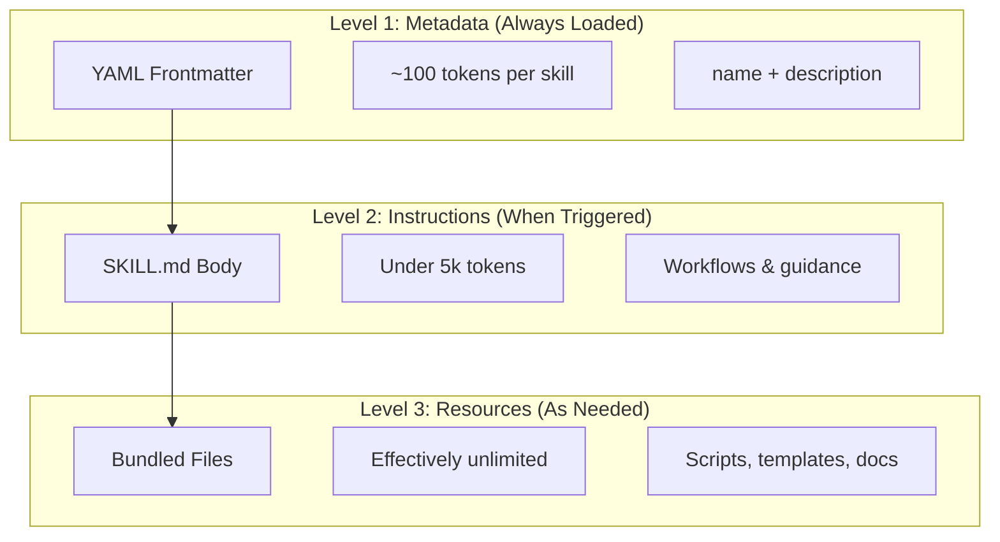
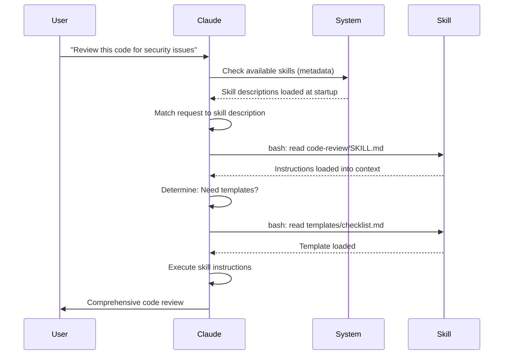

에이전트 스킬은 Claude의 기능을 확장하는 재사용 가능한 파일 시스템 기반 기능입니다. 도메인별 전문 지식, 워크플로, 모범 사례를 검색 가능한 컴포넌트로 패키징하여 Claude가 관련 상황에서 자동으로 사용합니다.

[TOC]

## 언제 읽으면 좋은가

- 코드 리뷰, 리팩토링, 문서화 같은 도메인별 워크플로를 자동화하고 싶을 때
- 팀이 공유하는 모범 사례를 한 번 정의해 모두가 같은 방식으로 호출하고 싶을 때
- 기존 사용자 정의 slash command를 더 강력한 skill 구조로 업그레이드해야 할 때
- 프로젝트나 조직의 도메인 지식을 Claude가 필요할 때만 자동으로 활용하게 하고 싶을 때

## 개요

**에이전트 스킬**은 범용 에이전트를 전문가로 변환하는 모듈식 기능입니다. 프롬프트(일회성 작업을 위한 대화 수준의 지시)와 달리, 스킬은 필요할 때 로드되며 여러 대화에서 동일한 안내를 반복적으로 제공할 필요를 없애줍니다.

### 주요 이점

- **Claude 특화**: 도메인별 작업에 맞게 기능을 맞춤 설정합니다
- **반복 감소**: 한 번 만들면 대화 전반에서 자동으로 사용됩니다
- **기능 조합**: 스킬을 결합하여 복잡한 워크플로를 구축합니다
- **워크플로 확장**: 여러 프로젝트와 팀에서 스킬을 재사용합니다
- **품질 유지**: 모범 사례를 워크플로에 직접 내장합니다

스킬은 여러 AI 도구에서 작동하는 [Agent Skills](https://agentskills.io) 오픈 표준을 따릅니다. Claude Code는 호출 제어, subagent 실행, 동적 컨텍스트 주입과 같은 추가 기능으로 이 표준을 확장합니다.

[[TIP("참고")]]
커스텀 slash command는 스킬로 통합되었습니다. `.claude/commands/` 파일은 여전히 작동하며 동일한 frontmatter 필드를 지원합니다. 새로운 개발에는 스킬을 권장합니다. 동일한 경로에 둘 다 존재하는 경우(예: `.claude/commands/review.md`와 `.claude/skills/review/SKILL.md`), 스킬이 우선합니다.
[[/TIP]]

## 스킬 작동 방식: 점진적 공개

스킬은 **점진적 공개(Progressive Disclosure)** 아키텍처를 활용합니다. Claude는 정보를 미리 모두 소비하는 대신, 필요에 따라 단계적으로 로드합니다. 이를 통해 무제한 확장성을 유지하면서 효율적인 컨텍스트 관리가 가능합니다.

### 세 단계의 로딩



| 레벨 | 로드 시점 | 토큰 비용 | 내용 |
|-------|------------|------------|---------|
| **레벨 1: 메타데이터** | 항상 (시작 시) | 스킬당 ~100 토큰 | YAML frontmatter의 `name` 및 `description` |
| **레벨 2: 지시사항** | 스킬이 트리거될 때 | 5k 토큰 미만 | 지시사항과 가이드가 포함된 SKILL.md 본문 |
| **레벨 3+: 리소스** | 필요할 때 | 사실상 무제한 | 컨텍스트에 내용을 로드하지 않고 bash를 통해 실행되는 번들 파일 |

이는 컨텍스트 비용 없이 많은 스킬을 설치할 수 있음을 의미합니다. Claude는 실제로 트리거되기 전까지 각 스킬의 존재 여부와 사용 시점만 알고 있습니다.

## 스킬 로딩 프로세스



## 스킬 유형 및 위치

| 유형 | 위치 | 범위 | 공유 | 적합한 용도 |
|------|----------|-------|--------|----------|
| **Enterprise** | 관리 설정 | 모든 조직 사용자 | 예 | 조직 전체 표준 |
| **Personal** | `~/.claude/skills/<skill-name>/SKILL.md` | 개인 | 아니오 | 개인 워크플로 |
| **Project** | `.claude/skills/<skill-name>/SKILL.md` | 팀 | 예 (git 통해) | 팀 표준 |
| **Plugin** | `<plugin>/skills/<skill-name>/SKILL.md` | 활성화된 곳 | 상황에 따라 | 플러그인과 번들 |

동일한 이름의 스킬이 여러 레벨에 존재하면 우선순위가 높은 위치가 적용됩니다: **enterprise > personal > project**. Plugin 스킬은 `plugin-name:skill-name` 네임스페이스를 사용하므로 충돌이 발생하지 않습니다.

### 자동 검색

**중첩 디렉토리**: 하위 디렉토리의 파일로 작업할 때, Claude Code는 중첩된 `.claude/skills/` 디렉토리에서 스킬을 자동으로 검색합니다. 예를 들어 `packages/frontend/`의 파일을 편집하는 경우, Claude Code는 `packages/frontend/.claude/skills/`에서도 스킬을 찾습니다. 이는 패키지별 스킬이 있는 모노레포 구성을 지원합니다.

**`--add-dir` 디렉토리**: `--add-dir`을 통해 추가된 디렉토리의 스킬은 실시간 변경 감지와 함께 자동으로 로드됩니다. 해당 디렉토리의 스킬 파일에 대한 수정은 Claude Code를 재시작하지 않아도 즉시 반영됩니다.

**설명 예산**: 스킬 설명(레벨 1 메타데이터)은 **컨텍스트 윈도우의 1%** (폴백: **8,000자**)로 제한됩니다. 많은 스킬이 설치된 경우 설명이 단축될 수 있습니다. 모든 스킬 이름은 항상 포함되지만, 설명은 맞도록 다듬어집니다. 설명에서 핵심 사용 사례를 앞에 배치하십시오. `SLASH_COMMAND_TOOL_CHAR_BUDGET` 환경 변수로 예산을 재정의할 수 있습니다.

## 커스텀 스킬 만들기

### 기본 디렉토리 구조

```
my-skill/
├── SKILL.md           # 주요 지시사항 (필수)
├── template.md        # Claude가 채울 템플릿
├── examples/
│   └── sample.md      # 예상 형식을 보여주는 예제 출력
└── scripts/
    └── validate.sh    # Claude가 실행할 수 있는 스크립트
```

### SKILL.md 형식

```yaml
---
name: your-skill-name
description: Brief description of what this Skill does and when to use it
---

# Your Skill Name

## Instructions
Provide clear, step-by-step guidance for Claude.

## Examples
Show concrete examples of using this Skill.
```

### 필수 필드

- **name**: 소문자, 숫자, 하이픈만 가능 (최대 64자).
- **description**: 스킬이 무엇을 하는지와 언제 사용하는지 (`when_to_use`와 합산하여 최대 1,536자). Claude가 스킬을 활성화할 시점을 아는 데 중요합니다.

### 선택적 Frontmatter 필드

```yaml
---
name: my-skill
description: What this skill does and when to use it
argument-hint: "[filename] [format]"        # 자동 완성을 위한 힌트
disable-model-invocation: true              # 사용자만 호출 가능
user-invocable: false                       # slash 메뉴에서 숨김
allowed-tools: Read, Grep, Glob             # 도구 접근 제한
model: opus                                 # 사용할 특정 모델
effort: high                                # 노력 수준 재정의 (low, medium, high, xhigh, max)
when_to_use: "사용자가 ...를 요청할 때"       # 호출을 위한 추가 맥락
context: fork                               # 격리된 subagent에서 실행
agent: Explore                              # 에이전트 유형 (context: fork와 함께)
shell: bash                                 # 명령어 셸: bash (기본) 또는 powershell
hooks:                                      # 스킬 범위 hook
  PreToolUse:
    - matcher: "Bash"
      hooks:
        - type: command
          command: "./scripts/validate.sh"
paths: "src/api/**/*.ts"               # 스킬 활성화를 제한하는 glob 패턴
---
```

| 필드 | 설명 |
|-------|-------------|
| `name` | 소문자, 숫자, 하이픈만 가능 (최대 64자). |
| `description` | 스킬이 무엇을 하는지와 언제 사용하는지 (`when_to_use`와 합산하여 최대 1,536자). 자동 호출 매칭에 중요합니다. |
| `argument-hint` | `/` 자동 완성 메뉴에 표시되는 힌트 (예: `"[filename] [format]"`). |
| `disable-model-invocation` | `true` = 사용자만 `/name`으로 호출 가능. Claude는 절대 자동 호출하지 않습니다. |
| `user-invocable` | `false` = `/` 메뉴에서 숨겨짐. Claude만 자동으로 호출할 수 있습니다. |
| `allowed-tools` | 스킬이 권한 프롬프트 없이 사용할 수 있는 도구의 쉼표로 구분된 목록. |
| `model` | 스킬이 활성 상태인 동안의 모델 재정의 (예: `opus`, `sonnet`). |
| `effort` | 스킬이 활성 상태인 동안의 노력 수준 재정의: `low`, `medium`, `high`, `xhigh`, 또는 `max`. |
| `context` | `fork`로 설정하면 자체 컨텍스트 윈도우를 가진 포크된 subagent 컨텍스트에서 스킬을 실행합니다. |
| `agent` | `context: fork` 시 subagent 유형 (예: `Explore`, `Plan`, `general-purpose`). |
| `shell` | `` !`command` `` 대체 및 스크립트에 사용되는 셸: `bash` (기본) 또는 `powershell`. |
| `hooks` | 이 스킬의 수명 주기에 한정된 hook (글로벌 hook과 동일한 형식). |
| `when_to_use` | Claude가 스킬을 호출해야 할 추가 맥락. `description`에 추가되어 스킬 목록에 표시되며 합산 1,536자 제한. |
| `paths` | 스킬이 자동 활성화되는 시점을 제한하는 glob 패턴. 쉼표로 구분된 문자열 또는 YAML 목록. 경로별 규칙과 동일한 형식. |

## 스킬 콘텐츠 유형

스킬에는 각각 다른 목적에 적합한 두 가지 유형의 콘텐츠가 포함될 수 있습니다:

### 참조 콘텐츠

Claude가 현재 작업에 적용하는 지식을 추가합니다 - 규칙, 패턴, 스타일 가이드, 도메인 지식. 대화 컨텍스트와 인라인으로 실행됩니다.

```yaml
---
name: api-conventions
description: API design patterns for this codebase
---

When writing API endpoints:
- Use RESTful naming conventions
- Return consistent error formats
- Include request validation
```

### 작업 콘텐츠

특정 작업에 대한 단계별 지시사항입니다. `/skill-name`으로 직접 호출되는 경우가 많습니다.

```yaml
---
name: deploy
description: Deploy the application to production
context: fork
disable-model-invocation: true
---

Deploy the application:
1. Run the test suite
2. Build the application
3. Push to the deployment target
```

## 스킬 호출 제어

기본적으로 사용자와 Claude 모두 모든 스킬을 호출할 수 있습니다. 두 개의 frontmatter 필드가 세 가지 호출 모드를 제어합니다:

| Frontmatter | 사용자 호출 가능 | Claude 호출 가능 |
|---|---|---|
| (기본) | 예 | 예 |
| `disable-model-invocation: true` | 예 | 아니오 |
| `user-invocable: false` | 아니오 | 예 |

**`disable-model-invocation: true`는** 부작용이 있는 워크플로에 사용합니다: `/commit`, `/deploy`, `/send-slack-message`. 코드가 준비되어 보인다고 Claude가 배포를 결정하는 것을 원하지 않을 것입니다.

**`user-invocable: false`는** 명령으로는 의미 없는 배경 지식에 사용합니다. `legacy-system-context` 스킬은 이전 시스템의 작동 방식을 설명합니다. Claude에게는 유용하지만, 사용자에게는 의미 있는 액션이 아닙니다.

## 문자열 대체

스킬은 스킬 콘텐츠가 Claude에 도달하기 전에 해석되는 동적 값을 지원합니다:

| 변수 | 설명 |
|----------|-------------|
| `$ARGUMENTS` | 스킬 호출 시 전달된 모든 인수 |
| `$ARGUMENTS[N]` 또는 `$N` | 인덱스로 특정 인수 접근 (0 기반) |
| `${CLAUDE_SESSION_ID}` | 현재 세션 ID |
| `${CLAUDE_SKILL_DIR}` | 스킬의 SKILL.md 파일이 포함된 디렉토리 |
| `` !`command` `` | 동적 컨텍스트 주입 - 셸 명령을 실행하고 출력을 인라인으로 삽입 |

**예시:**

```yaml
---
name: fix-issue
description: Fix a GitHub issue
---

Fix GitHub issue $ARGUMENTS following our coding standards.
1. Read the issue description
2. Implement the fix
3. Write tests
4. Create a commit
```

`/fix-issue 123`을 실행하면 `$ARGUMENTS`가 `123`으로 대체됩니다.

## 동적 컨텍스트 주입

`` !`command` `` 구문은 스킬 콘텐츠가 Claude에 전송되기 전에 셸 명령을 실행합니다:

```yaml
---
name: pr-summary
description: Summarize changes in a pull request
context: fork
agent: Explore
---

## Pull request context
- PR diff: !`gh pr diff`
- PR comments: !`gh pr view --comments`
- Changed files: !`gh pr diff --name-only`

## Your task
Summarize this pull request...
```

명령은 즉시 실행되며, Claude는 최종 출력만 봅니다. 기본적으로 명령은 `bash`에서 실행됩니다. PowerShell을 사용하려면 frontmatter에서 `shell: powershell`을 설정하십시오.

## Subagent에서 스킬 실행

`context: fork`를 추가하면 격리된 subagent 컨텍스트에서 스킬이 실행됩니다. 스킬 콘텐츠는 자체 컨텍스트 윈도우를 가진 전용 subagent의 작업이 되어 메인 대화를 깔끔하게 유지합니다.

`agent` 필드는 사용할 에이전트 유형을 지정합니다:

| 에이전트 유형 | 적합한 용도 |
|---|---|
| `Explore` | 읽기 전용 조사, 코드베이스 분석 |
| `Plan` | 구현 계획 작성 |
| `general-purpose` | 모든 도구가 필요한 광범위한 작업 |
| Custom agents | 구성에서 정의된 전문화된 에이전트 |

**frontmatter 예시:**

```yaml
---
context: fork
agent: Explore
---
```

**전체 스킬 예시:**

```yaml
---
name: deep-research
description: Research a topic thoroughly
context: fork
agent: Explore
---

Research $ARGUMENTS thoroughly:
1. Find relevant files using Glob and Grep
2. Read and analyze the code
3. Summarize findings with specific file references
```

## 실전 예시

### 예시 1: 코드 리뷰 스킬

**디렉토리 구조:**

```
~/.claude/skills/code-review/
├── SKILL.md
├── templates/
│   ├── review-checklist.md
│   └── finding-template.md
└── scripts/
    ├── analyze-metrics.py
    └── compare-complexity.py
```

**파일:** `~/.claude/skills/code-review/SKILL.md`

```yaml
---
name: code-review-specialist
description: Comprehensive code review with security, performance, and quality analysis. Use when users ask to review code, analyze code quality, evaluate pull requests, or mention code review, security analysis, or performance optimization.
---

# Code Review Skill

This skill provides comprehensive code review capabilities focusing on:

1. **Security Analysis**
   - Authentication/authorization issues
   - Data exposure risks
   - Injection vulnerabilities
   - Cryptographic weaknesses

2. **Performance Review**
   - Algorithm efficiency (Big O analysis)
   - Memory optimization
   - Database query optimization
   - Caching opportunities

3. **Code Quality**
   - SOLID principles
   - Design patterns
   - Naming conventions
   - Test coverage

4. **Maintainability**
   - Code readability
   - Function size (should be < 50 lines)
   - Cyclomatic complexity
   - Type safety

## Review Template

For each piece of code reviewed, provide:

### Summary
- Overall quality assessment (1-5)
- Key findings count
- Recommended priority areas

### Critical Issues (if any)
- **Issue**: Clear description
- **Location**: File and line number
- **Impact**: Why this matters
- **Severity**: Critical/High/Medium
- **Fix**: Code example

For detailed checklists, see [templates/review-checklist.md](templates/review-checklist.md).
```

### 예시 2: 코드베이스 시각화 스킬

인터랙티브 HTML 시각화를 생성하는 스킬입니다:

**디렉토리 구조:**

```
~/.claude/skills/codebase-visualizer/
├── SKILL.md
└── scripts/
    └── visualize.py
```

**파일:** `~/.claude/skills/codebase-visualizer/SKILL.md`

````yaml
---
name: codebase-visualizer
description: Generate an interactive collapsible tree visualization of your codebase. Use when exploring a new repo, understanding project structure, or identifying large files.
allowed-tools: Bash(python *)
---

# Codebase Visualizer

Generate an interactive HTML tree view showing your project's file structure.

## Usage

Run the visualization script from your project root:

```bash
python ~/.claude/skills/codebase-visualizer/scripts/visualize.py .
```

This creates `codebase-map.html` and opens it in your default browser.

## What the visualization shows

- **Collapsible directories**: Click folders to expand/collapse
- **File sizes**: Displayed next to each file
- **Colors**: Different colors for different file types
- **Directory totals**: Shows aggregate size of each folder
````

번들된 Python 스크립트가 실제 작업을 수행하고 Claude는 오케스트레이션을 담당합니다.

### 예시 3: 배포 스킬 (사용자 호출만 가능)

```yaml
---
name: deploy
description: Deploy the application to production
disable-model-invocation: true
allowed-tools: Bash(npm *), Bash(git *)
---

Deploy $ARGUMENTS to production:

1. Run the test suite: `npm test`
2. Build the application: `npm run build`
3. Push to the deployment target
4. Verify the deployment succeeded
5. Report deployment status
```

### 예시 4: 브랜드 보이스 스킬 (배경 지식)

```yaml
---
name: brand-voice
description: Ensure all communication matches brand voice and tone guidelines. Use when creating marketing copy, customer communications, or public-facing content.
user-invocable: false
---

## Tone of Voice
- **Friendly but professional** - approachable without being casual
- **Clear and concise** - avoid jargon
- **Confident** - we know what we're doing
- **Empathetic** - understand user needs

## Writing Guidelines
- Use "you" when addressing readers
- Use active voice
- Keep sentences under 20 words
- Start with value proposition

For templates, see [templates/](templates/).
```

### 예시 5: CLAUDE.md 생성기 스킬

```yaml
---
name: claude-md
description: Create or update CLAUDE.md files following best practices for optimal AI agent onboarding. Use when users mention CLAUDE.md, project documentation, or AI onboarding.
---

## Core Principles

**LLMs are stateless**: CLAUDE.md is the only file automatically included in every conversation.

### The Golden Rules

1. **Less is More**: Keep under 300 lines (ideally under 100)
2. **Universal Applicability**: Only include information relevant to EVERY session
3. **Don't Use Claude as a Linter**: Use deterministic tools instead
4. **Never Auto-Generate**: Craft it manually with careful consideration

## Essential Sections

- **Project Name**: Brief one-line description
- **Tech Stack**: Primary language, frameworks, database
- **Development Commands**: Install, test, build commands
- **Critical Conventions**: Only non-obvious, high-impact conventions
- **Known Issues / Gotchas**: Things that trip up developers
```

### 예시 6: 리팩토링 스킬과 스크립트

**디렉토리 구조:**

```
refactor/
├── SKILL.md
├── references/
│   ├── code-smells.md
│   └── refactoring-catalog.md
├── templates/
│   └── refactoring-plan.md
└── scripts/
    ├── analyze-complexity.py
    └── detect-smells.py
```

**파일:** `refactor/SKILL.md`

```yaml
---
name: code-refactor
description: Systematic code refactoring based on Martin Fowler's methodology. Use when users ask to refactor code, improve code structure, reduce technical debt, or eliminate code smells.
---

# Code Refactoring Skill

A phased approach emphasizing safe, incremental changes backed by tests.

## Workflow

Phase 1: Research & Analysis → Phase 2: Test Coverage Assessment →
Phase 3: Code Smell Identification → Phase 4: Refactoring Plan Creation →
Phase 5: Incremental Implementation → Phase 6: Review & Iteration

## Core Principles

1. **Behavior Preservation**: External behavior must remain unchanged
2. **Small Steps**: Make tiny, testable changes
3. **Test-Driven**: Tests are the safety net
4. **Continuous**: Refactoring is ongoing, not a one-time event

For code smell catalog, see [references/code-smells.md](references/code-smells.md).
For refactoring techniques, see [references/refactoring-catalog.md](references/refactoring-catalog.md).
```

## 지원 파일

스킬은 `SKILL.md` 외에 디렉토리에 여러 파일을 포함할 수 있습니다. 이러한 지원 파일(템플릿, 예제, 스크립트, 참조 문서)을 통해 메인 스킬 파일을 집중적으로 유지하면서 Claude에 필요에 따라 로드할 수 있는 추가 리소스를 제공합니다.

```
my-skill/
├── SKILL.md              # 주요 지시사항 (필수, 500줄 미만 유지)
├── templates/            # Claude가 채울 템플릿
│   └── output-format.md
├── examples/             # 예상 형식을 보여주는 예제 출력
│   └── sample-output.md
├── references/           # 도메인 지식 및 사양
│   └── api-spec.md
└── scripts/              # Claude가 실행할 수 있는 스크립트
    └── validate.sh
```

지원 파일 가이드라인:

- `SKILL.md`를 **500줄** 미만으로 유지하십시오. 상세한 참조 자료, 대규모 예제, 사양은 별도 파일로 이동하십시오.
- `SKILL.md`에서 추가 파일을 **상대 경로**로 참조하십시오 (예: `[API reference](references/api-spec.md)`).
- 지원 파일은 레벨 3(필요 시)에서 로드되므로 Claude가 실제로 읽을 때까지 컨텍스트를 소비하지 않습니다.

## 스킬 관리

### 사용 가능한 스킬 보기

Claude에 직접 물어보십시오:
```
What Skills are available?
```

또는 파일 시스템을 확인하십시오:
```bash
# 개인 스킬 목록
ls ~/.claude/skills/

# 프로젝트 스킬 목록
ls .claude/skills/
```

### 스킬 테스트

두 가지 테스트 방법이 있습니다:

**설명과 일치하는 요청을 통해 Claude가 자동으로 호출하게 합니다**:
```
Can you help me review this code for security issues?
```

**또는 스킬 이름으로 직접 호출합니다**:
```
/code-review src/auth/login.ts
```

### 스킬 업데이트

`SKILL.md` 파일을 직접 편집하십시오. 변경 사항은 다음 Claude Code 시작 시 적용됩니다.

```bash
# 개인 스킬
code ~/.claude/skills/my-skill/SKILL.md

# 프로젝트 스킬
code .claude/skills/my-skill/SKILL.md
```

### Claude의 스킬 접근 제한

Claude가 호출할 수 있는 스킬을 제어하는 세 가지 방법이 있습니다:

**모든 스킬 비활성화** `/permissions`에서:
```
# 거부 규칙에 추가:
Skill
```

**특정 스킬 허용 또는 거부**:
```
# 특정 스킬만 허용
Skill(commit)
Skill(review-pr *)

# 특정 스킬 거부
Skill(deploy *)
```

**개별 스킬 숨기기** frontmatter에 `disable-model-invocation: true`를 추가합니다.

## 모범 사례

### 1. 설명을 구체적으로 작성합니다

- **나쁜 예 (모호함)**: "Helps with documents"
- **좋은 예 (구체적)**: "Extract text and tables from PDF files, fill forms, merge documents. Use when working with PDF files or when the user mentions PDFs, forms, or document extraction."

### 2. 스킬을 집중적으로 유지합니다

- 하나의 스킬 = 하나의 기능
- "PDF form filling"
- "Document processing" (너무 광범위)

### 3. 트리거 용어를 포함합니다

사용자 요청과 일치하는 키워드를 설명에 추가합니다:
```yaml
description: Analyze Excel spreadsheets, generate pivot tables, create charts. Use when working with Excel files, spreadsheets, or .xlsx files.
```

### 4. SKILL.md를 500줄 미만으로 유지합니다

상세한 참조 자료는 Claude가 필요에 따라 로드하는 별도 파일로 이동합니다.

### 5. 지원 파일을 참조합니다

```markdown
## Additional resources

- For complete API details, see [reference.md](reference.md)
- For usage examples, see [examples.md](examples.md)
```

### 해야 할 것

- 명확하고 설명적인 이름을 사용합니다
- 포괄적인 지시사항을 포함합니다
- 구체적인 예제를 추가합니다
- 관련 스크립트와 템플릿을 패키징합니다
- 실제 시나리오로 테스트합니다
- 의존성을 문서화합니다

### 하지 말아야 할 것

- 일회성 작업을 위한 스킬을 만들지 마십시오
- 기존 기능을 중복하지 마십시오
- 스킬을 너무 광범위하게 만들지 마십시오
- 설명 필드를 건너뛰지 마십시오
- 신뢰할 수 없는 소스의 스킬을 감사 없이 설치하지 마십시오

## 문제 해결

### 빠른 참조

| 문제 | 해결 방법 |
|-------|----------|
| Claude가 스킬을 사용하지 않음 | 트리거 용어를 포함하여 설명을 더 구체적으로 만듭니다 |
| 스킬 파일을 찾을 수 없음 | 경로 확인: `~/.claude/skills/name/SKILL.md` |
| YAML 오류 | `---` 마커, 들여쓰기, 탭 없음을 확인합니다 |
| 스킬 충돌 | 설명에서 고유한 트리거 용어를 사용합니다 |
| 스크립트가 실행되지 않음 | 권한 확인: `chmod +x scripts/*.py` |
| Claude가 모든 스킬을 보지 못함 | 스킬이 너무 많음; `/context`에서 경고를 확인합니다 |

### 스킬이 트리거되지 않는 경우

Claude가 예상대로 스킬을 사용하지 않는 경우:

1. 설명에 사용자가 자연스럽게 말할 키워드가 포함되어 있는지 확인합니다
2. "What skills are available?"을 물어볼 때 스킬이 나타나는지 확인합니다
3. 설명에 맞게 요청을 다시 표현해 봅니다
4. `/skill-name`으로 직접 호출하여 테스트합니다

### 스킬이 너무 자주 트리거되는 경우

원하지 않을 때 Claude가 스킬을 사용하는 경우:

1. 설명을 더 구체적으로 만듭니다
2. 수동 호출만 가능하도록 `disable-model-invocation: true`를 추가합니다

### Claude가 모든 스킬을 보지 못하는 경우

스킬 설명은 **컨텍스트 윈도우의 1%** (폴백: **8,000자**)에서 로드됩니다. 각 항목(`description` + `when_to_use` 합산)은 예산에 관계없이 1,536자로 제한됩니다. `/context`를 실행하여 제외된 스킬에 대한 경고를 확인하십시오. `SLASH_COMMAND_TOOL_CHAR_BUDGET` 환경 변수로 예산을 재정의할 수 있습니다.

## 보안 고려사항

**신뢰할 수 있는 소스의 스킬만 사용하십시오.** 스킬은 지시사항과 코드를 통해 Claude에 기능을 제공합니다. 악의적인 스킬은 Claude가 도구를 호출하거나 해로운 방식으로 코드를 실행하도록 유도할 수 있습니다.

**주요 보안 고려사항:**

- **철저히 감사**: 스킬 디렉토리의 모든 파일을 검토합니다
- **외부 소스는 위험**: 외부 URL에서 가져오는 스킬은 손상될 수 있습니다
- **도구 오용**: 악의적인 스킬은 해로운 방식으로 도구를 호출할 수 있습니다
- **소프트웨어 설치처럼 취급**: 신뢰할 수 있는 소스의 스킬만 사용합니다

## 스킬 vs 다른 기능

| 기능 | 호출 방식 | 적합한 용도 |
|---------|------------|----------|
| **스킬** | 자동 또는 `/name` | 재사용 가능한 전문 지식, 워크플로 |
| **Slash Command** | 사용자 시작 `/name` | 빠른 단축키 (스킬로 통합됨) |
| **Subagent** | 자동 위임 | 격리된 작업 실행 |
| **Memory (CLAUDE.md)** | 항상 로드 | 영구적인 프로젝트 컨텍스트 |
| **MCP** | 실시간 | 외부 데이터/서비스 접근 |
| **Hook** | 이벤트 기반 | 자동화된 부작용 |

## 번들 스킬

Claude Code에는 설치 없이 항상 사용할 수 있는 여러 내장 스킬이 포함되어 있습니다:

| 스킬 | 설명 |
|-------|-------------|
| `/simplify` | 변경된 파일의 재사용성, 품질, 효율성을 검토합니다; 3개의 병렬 리뷰 에이전트를 생성합니다 |
| `/batch <instruction>` | git worktree를 사용하여 코드베이스 전반에 걸친 대규모 병렬 변경을 오케스트레이션합니다 |
| `/debug [description]` | 디버그 로그를 읽어 현재 세션의 문제를 해결합니다 |
| `/loop [interval] <prompt>` | 주어진 간격으로 프롬프트를 반복 실행합니다 (예: `/loop 5m check the deploy`) |
| `/claude-api` | Claude API/SDK 레퍼런스를 로드합니다; `anthropic`/`@anthropic-ai/sdk` import 시 자동 활성화됩니다 |

이 스킬들은 설치나 설정 없이 바로 사용할 수 있습니다. 커스텀 스킬과 동일한 SKILL.md 형식을 따릅니다.

## 스킬 공유

### 프로젝트 스킬 (팀 공유)

1. `.claude/skills/`에 스킬을 생성합니다
2. git에 커밋합니다
3. 팀원들이 변경 사항을 pull하면 스킬이 즉시 사용 가능합니다

### 개인 스킬

```bash
# 개인 디렉토리에 복사
cp -r my-skill ~/.claude/skills/

# 스크립트를 실행 가능하게 만들기
chmod +x ~/.claude/skills/my-skill/scripts/*.py
```

### Plugin 배포

더 넓은 배포를 위해 plugin의 `skills/` 디렉토리에 스킬을 패키징합니다.

## 추가 리소스

- [공식 스킬 문서](https://code.claude.com/docs/ko/skills)
- [에이전트 스킬 아키텍처 블로그](https://claude.com/blog/equipping-agents-for-the-real-world-with-agent-skills)
- [Slash Command 가이드](01-slash-commands.md) - 사용자 시작 단축키
- [Subagent 가이드](04-subagents.md) - 위임된 AI 에이전트
- [Memory 가이드](02-memory.md) - 영구적인 컨텍스트
- [MCP (Model Context Protocol)](05-mcp.md) - 실시간 외부 데이터
- [Hook 가이드](06-hooks.md) - 이벤트 기반 자동화

---

---

<a id="03-skills-01-블로그-초안-작성-스킬"></a>

## 03-01. 블로그 초안 작성 스킬

### 사용자 입력

```plaintext
$ARGUMENTS
```

진행하기 전에 사용자 입력을 **반드시** 고려해야 합니다. 사용자는 다음을 제공해야 합니다:
- **아이디어/주제**: 블로그 포스트의 주요 개념 또는 테마
- **리소스**: URL, 파일, 또는 참조할 자료 (선택 사항이지만 권장)
- **대상 독자**: 블로그 포스트의 대상 (선택 사항)
- **톤/스타일**: 격식체, 비격식체, 기술적 등 (선택 사항)

**중요**: 사용자가 **기존 블로그 포스트**의 업데이트를 요청하는 경우, 0-8단계를 건너뛰고 **9단계**에서 바로 시작하십시오. 먼저 기존 초안 파일을 읽은 다음 반복 프로세스를 진행합니다.

### 실행 흐름

다음 단계를 순서대로 따르십시오. **단계를 건너뛰거나 표시된 곳에서 사용자 승인 없이 진행하지 마십시오.**

#### 0단계: 프로젝트 폴더 생성

1. `YYYY-MM-DD-short-topic-name` 형식으로 폴더 이름을 생성합니다
   - 오늘 날짜를 사용합니다
   - 주제에서 짧고 URL 친화적인 슬러그를 만듭니다 (소문자, 하이픈, 최대 5단어)

2. 폴더 구조를 생성합니다:
   ```
   blog-posts/
   └── YYYY-MM-DD-short-topic-name/
       └── resources/
   ```

3. 진행하기 전에 사용자에게 폴더 생성을 확인합니다.

#### 1단계: 리서치 및 리소스 수집

1. 블로그 포스트 디렉토리에 `resources/` 하위 폴더를 생성합니다

2. 제공된 각 리소스에 대해:
   - **URL**: 핵심 정보를 가져와 마크다운 파일로 `resources/`에 저장합니다
   - **파일**: 읽고 `resources/`에 요약합니다
   - **주제**: 웹 검색을 사용하여 최신 정보를 수집합니다

3. 각 리소스에 대해 `resources/`에 요약 파일을 생성합니다:
   - `resources/source-1-[short-name].md`
   - `resources/source-2-[short-name].md`
   - 등

4. 각 요약에는 다음이 포함되어야 합니다:
   ```markdown
   # Source: [Title/URL]

   ## Key Points
   - Point 1
   - Point 2

   ## Relevant Quotes/Data
   - Quote or statistic 1
   - Quote or statistic 2

   ## How This Relates to Topic
   Brief explanation of relevance
   ```

5. 사용자에게 리서치 요약을 제시합니다.

#### 2단계: 브레인스토밍 및 명확화

1. 아이디어와 조사된 리소스를 기반으로 다음을 제시합니다:
   - 리서치에서 식별된 **주요 테마**
   - 블로그 포스트의 **잠재적 관점**
   - 다루어야 할 **핵심 포인트**
   - 명확화가 필요한 정보의 **공백**

2. 명확화 질문을 합니다:
   - 독자에게 전달하고 싶은 주요 시사점은 무엇입니까?
   - 리서치에서 강조하고 싶은 특정 포인트가 있습니까?
   - 목표 길이는? (짧음: 500-800단어, 중간: 1000-1500, 긴: 2000+)
   - 제외하고 싶은 포인트가 있습니까?

3. **진행하기 전에 사용자 응답을 기다립니다.**

#### 3단계: 아웃라인 제안

1. 다음을 포함하는 구조화된 아웃라인을 작성합니다:

   ```markdown
   # Blog Post Outline: [Title]

   ## Meta Information
   - **Target Audience**: [who]
   - **Tone**: [style]
   - **Target Length**: [word count]
   - **Main Takeaway**: [key message]

   ## Proposed Structure

   ### Hook/Introduction
   - Opening hook idea
   - Context setting
   - Thesis statement

   ### Section 1: [Title]
   - Key point A
   - Key point B
   - Supporting evidence from [source]

   ### Section 2: [Title]
   - Key point A
   - Key point B

   [Continue for all sections...]

   ### Conclusion
   - Summary of key points
   - Call to action or final thought

   ## Sources to Cite
   - Source 1
   - Source 2
   ```

2. 사용자에게 아웃라인을 제시하고 **승인 또는 수정을 요청합니다**.

#### 4단계: 승인된 아웃라인 저장

1. 사용자가 아웃라인을 승인하면 블로그 포스트 폴더에 `OUTLINE.md`로 저장합니다.

2. 아웃라인이 저장되었음을 확인합니다.

#### 5단계: 아웃라인 커밋 (git 저장소인 경우)

1. 현재 디렉토리가 git 저장소인지 확인합니다.

2. 예인 경우:
   - 새 파일을 스테이징합니다: 블로그 포스트 폴더, 리소스, OUTLINE.md
   - 커밋 메시지로 커밋합니다: `docs: Add outline for blog post - [topic-name]`
   - 원격에 푸시합니다

3. git 저장소가 아닌 경우 이 단계를 건너뛰고 사용자에게 알립니다.

#### 6단계: 초안 작성

1. 승인된 아웃라인을 기반으로 전체 블로그 포스트 초안을 작성합니다.

2. OUTLINE.md의 구조를 정확히 따릅니다.

3. 다음을 포함합니다:
   - 흥미로운 도입부와 도입 문구
   - 명확한 섹션 헤더
   - 리서치에서 나온 근거와 예시
   - 섹션 간 자연스러운 전환
   - 시사점이 있는 강력한 결론
   - **인용**: 모든 비교, 통계, 데이터 포인트, 사실적 주장은 원본 출처를 반드시 인용해야 합니다

4. 초안을 블로그 포스트 폴더에 `draft-v0.1.md`로 저장합니다.

5. 형식:
   ```markdown
   # [Blog Post Title]

   *[Optional: subtitle or tagline]*

   [Full content with inline citations...]

   ---

   ## References
   - [1] Source 1 Title - URL or Citation
   - [2] Source 2 Title - URL or Citation
   - [3] Source 3 Title - URL or Citation
   ```

6. **인용 요구사항**:
   - 모든 데이터 포인트, 통계 또는 비교에는 인라인 인용이 있어야 합니다
   - 번호가 매겨진 참조 [1], [2] 등 또는 이름이 있는 인용 [Source Name]을 사용합니다
   - 인용을 끝부분의 References 섹션에 연결합니다
   - 예: "Studies show that 65% of developers prefer TypeScript [1]"
   - 예: "React outperforms Vue in rendering speed by 20% [React Benchmarks 2024]"

#### 7단계: 초안 커밋 (git 저장소인 경우)

1. git 저장소인지 확인합니다.

2. 예인 경우:
   - 초안 파일을 스테이징합니다
   - 커밋 메시지로 커밋합니다: `docs: Add draft v0.1 for blog post - [topic-name]`
   - 원격에 푸시합니다

3. git 저장소가 아닌 경우 건너뛰고 사용자에게 알립니다.

#### 8단계: 리뷰를 위해 초안 제시

1. 사용자에게 초안 내용을 제시합니다.

2. 피드백을 요청합니다:
   - 전반적인 인상은?
   - 확장 또는 축소가 필요한 섹션은?
   - 톤 조정이 필요합니까?
   - 누락된 정보가 있습니까?
   - 특정 편집 또는 재작성이 필요합니까?

3. **사용자 응답을 기다립니다.**

#### 9단계: 반복 또는 확정

**사용자가 변경을 요청하는 경우:**
1. 요청된 모든 수정 사항을 기록합니다
2. 다음 조정 사항과 함께 6단계로 돌아갑니다:
   - 버전 번호 증가 (v0.2, v0.3 등)
   - 모든 피드백 반영
   - `draft-v[X.Y].md`로 저장
   - 7-8단계 반복

**사용자가 승인하는 경우:**
1. 최종 초안 버전을 확인합니다
2. 사용자가 요청하면 선택적으로 `final.md`로 이름을 변경합니다
3. 블로그 포스트 작성 프로세스를 요약합니다:
   - 생성된 총 버전 수
   - 버전 간 주요 변경 사항
   - 최종 단어 수
   - 생성된 파일

### 버전 추적

모든 초안은 증분 버전 관리로 보존됩니다:
- `draft-v0.1.md` - 초기 초안
- `draft-v0.2.md` - 첫 번째 피드백 반영 후
- `draft-v0.3.md` - 두 번째 피드백 반영 후
- 등

이를 통해 블로그 포스트의 진화를 추적하고 필요 시 되돌릴 수 있습니다.

### 출력 파일 구조

```
blog-posts/
└── YYYY-MM-DD-topic-name/
    ├── resources/
    │   ├── source-1-name.md
    │   ├── source-2-name.md
    │   └── ...
    ├── OUTLINE.md
    ├── draft-v0.1.md
    ├── draft-v0.2.md (반복 시)
    └── draft-v0.3.md (추가 반복 시)
```

### 품질을 위한 팁

- **도입 문구**: 질문, 놀라운 사실, 또는 공감 가능한 시나리오로 시작합니다
- **흐름**: 각 문단이 다음 문단으로 연결되어야 합니다
- **근거**: 리서치 데이터로 주장을 뒷받침합니다
- **인용**: 다음의 경우 항상 출처를 인용합니다:
  - 모든 통계 및 데이터 포인트 (예: "According to [Source], 75% of...")
  - 제품, 서비스, 접근 방식 간의 비교 (예: "X performs 2x faster than Y [Source]")
  - 시장 동향, 연구 결과, 벤치마크에 대한 사실적 주장
  - 인라인 인용 형식 사용: [Source Name] 또는 [Author, Year]
- **보이스**: 전체적으로 일관된 톤을 유지합니다
- **길이**: 목표 단어 수를 준수합니다
- **가독성**: 짧은 문단과 적절한 곳에 글머리 기호를 사용합니다
- **CTA**: 명확한 행동 촉구 또는 생각을 자극하는 질문으로 마무리합니다

### 참고 사항

- 지정된 체크포인트에서 항상 사용자 승인을 기다립니다
- 기록을 위해 모든 초안 버전을 보존합니다
- URL이 제공될 때 최신 정보를 위해 웹 검색을 사용합니다
- 리소스가 부족한 경우 사용자에게 추가 자료를 요청하거나 추가 리서치를 제안합니다
- 대상 독자에 따라 톤을 조정합니다 (기술적, 일반적, 비즈니스 등)

---

<a id="03-skills-02-블로그-초안-템플릿"></a>

## 03-02. 블로그 초안 템플릿

> 사용 시 첫 줄을 실제 "[블로그 포스트 제목]"으로 교체해 활용하세요.

*[부제목 또는 태그라인 - 선택 사항]*

**[저자 이름]** | [날짜]

---

[도입 문구 - 즉시 주의를 끕니다]

[배경 및 맥락 - 이것이 왜 중요한지]

[논제 진술 - 이 포스트가 다룰 내용]

---

### [섹션 1 제목]

[명확하고 매력적인 산문으로 작성된 섹션 내용]

[포인트를 뒷받침하는 근거, 예시, 또는 데이터 포함]

> "리서치에서 발췌한 관련 인용문" - 출처

[다음 섹션으로의 전환]

---

### [섹션 2 제목]

[주요 내용 계속]

**핵심 시사점:** [중요한 포인트를 굵은 글씨 또는 강조 박스로 표시]

[추가 뒷받침 내용]

---

### [섹션 3 제목]

[필요에 따라 추가 섹션]

#### 하위 섹션 (필요한 경우)

[하위 섹션 내용]

---

### 결론

[다룬 핵심 포인트 요약]

[주요 시사점 강화]

[행동 촉구 또는 생각을 자극하는 마무리 진술]

---

### 참고 문헌

1. [출처 제목](#)
2. [출처 제목](#)
3. [출처 제목](#)

---

*[선택 사항: 저자 소개 또는 관련 포스트 추천]*

---

<a id="03-skills-03-블로그-아웃라인-템플릿"></a>

## 03-03. 블로그 아웃라인 템플릿

> 사용 시 첫 줄 제목을 "블로그 포스트 아웃라인: [실제 제목]" 형식으로 변경해서 활용하세요.

### 메타 정보

| 속성 | 값 |
|-----------|-------|
| **대상 독자** | [누구를 위한 것인가?] |
| **톤** | [격식체/비격식체/기술적/대화체] |
| **목표 길이** | [단어 수 범위] |
| **주요 시사점** | [한 문장: 독자가 기억해야 할 것은?] |
| **키워드** | [관련 SEO 키워드] |

---

### 제안 구조

#### 1. 도입부 / 도입 문구

**도입 문구 옵션:**
- [ ] 독자에게 공감을 주는 질문
- [ ] 놀라운 통계 또는 사실
- [ ] 간략한 이야기 또는 시나리오
- [ ] 대담한 진술

**맥락 설정:**
- 필요한 배경 정보
- 이 주제가 지금 중요한 이유

**논제 진술:**
- 포스트가 다룰 내용에 대한 명확한 진술

---

#### 2. [섹션 제목]

**핵심 포인트:**
- 포인트 A: [설명]
- 포인트 B: [설명]

**뒷받침 근거:**
- [출처]에서: [관련 데이터/인용문]

**다음 섹션으로의 전환:**
- [다음 내용과 어떻게 연결되는지]

---

#### 3. [섹션 제목]

**핵심 포인트:**
- 포인트 A: [설명]
- 포인트 B: [설명]

**뒷받침 근거:**
- [출처]에서: [관련 데이터/인용문]

**다음 섹션으로의 전환:**
- [다음 내용과 어떻게 연결되는지]

---

#### 4. [섹션 제목] (필요에 따라 섹션 추가)

**핵심 포인트:**
- 포인트 A: [설명]
- 포인트 B: [설명]

**뒷받침 근거:**
- [출처]에서: [관련 데이터/인용문]

---

#### 5. 결론

**핵심 포인트 요약:**
- 요약 포인트 1
- 요약 포인트 2
- 요약 포인트 3

**마무리 생각 / 행동 촉구:**
- [독자가 다음으로 무엇을 해야 하거나 생각해야 하는가?]

---

### 인용할 출처

1. [출처 이름](#) - 용도: [어떤 정보]
2. [출처 이름](#) - 용도: [어떤 정보]
3. [출처 이름](#) - 용도: [어떤 정보]

---

### 초안 작성 참고 사항

- [특정 요구사항 또는 제약 사항]
- [강조할 사항]
- [피해야 할 사항]

---

<a id="03-skills-04-브랜드-보이스-스킬"></a>

## 03-04. 브랜드 보이스 스킬

### 개요
이 스킬은 모든 커뮤니케이션이 일관된 브랜드 보이스, 톤, 메시지를 유지하도록 보장합니다.

### 브랜드 아이덴티티

#### 미션
AI를 통해 팀의 개발 워크플로 자동화를 지원합니다

#### 가치
- **단순성**: 복잡한 것을 단순하게 만듭니다
- **신뢰성**: 견고한 실행
- **역량 강화**: 인간의 창의성을 활성화합니다

#### 톤 오브 보이스
- **친근하지만 전문적** - 격식을 갖추지 않으면서 접근하기 쉽습니다
- **명확하고 간결** - 전문 용어를 피하고 기술 개념을 쉽게 설명합니다
- **자신감 있는** - 우리가 무엇을 하는지 알고 있습니다
- **공감하는** - 사용자의 필요와 고충을 이해합니다

### 작성 가이드라인

#### 해야 할 것
- 독자를 지칭할 때 "you"를 사용합니다
- 능동태를 사용합니다: "Claude generates reports" (O) "Reports are generated by Claude" (X)
- 가치 제안으로 시작합니다
- 구체적인 예시를 사용합니다
- 문장을 20단어 미만으로 유지합니다
- 명확성을 위해 목록을 사용합니다
- 행동 촉구를 포함합니다

#### 하지 말아야 할 것
- 기업 전문 용어를 사용하지 마십시오
- 무시하거나 지나치게 단순화하지 마십시오
- "we believe" 또는 "we think"를 사용하지 마십시오
- 강조 외에는 대문자를 사용하지 마십시오
- 텍스트 벽을 만들지 마십시오
- 기술 지식을 가정하지 마십시오

### 어휘

#### 선호 용어
- Claude ("the Claude AI" 대신)
- Code generation ("auto-coding" 대신)
- Agent ("bot" 대신)
- Streamline ("revolutionize" 대신)
- Integrate ("synergize" 대신)

#### 피해야 할 용어
- "Cutting-edge" (과도하게 사용됨)
- "Game-changer" (모호함)
- "Leverage" (기업체 용어)
- "Utilize" ("use"를 사용)
- "Paradigm shift" (불명확)

### 예시

#### 좋은 예시
"Claude automates your code review process. Instead of manually checking each PR, Claude reviews security, performance, and quality—saving your team hours every week."

효과적인 이유: 명확한 가치, 구체적인 이점, 행동 지향적

#### 나쁜 예시
"Claude leverages cutting-edge AI to provide comprehensive software development solutions."

효과적이지 않은 이유: 모호함, 기업 전문 용어, 구체적인 가치 없음

---

<a id="03-skills-05-브랜드-보이스-톤-예시"></a>

## 03-05. 브랜드 보이스 톤 예시

### 흥미로운 발표
"Save 8 hours per week on code reviews. Claude reviews your PRs automatically."

### 공감하는 지원
"We know deployments can be stressful. Claude handles testing so you don't have to worry."

### 자신감 있는 제품 기능
"Claude doesn't just suggest code. It understands your architecture and maintains consistency."

### 교육적 블로그 포스트
"Let's explore how agents improve code review workflows. Here's what we learned..."

---

<a id="03-skills-06-claude-md-작성-스킬"></a>

## 03-06. CLAUDE.md 작성 스킬

### 사용자 입력

```plaintext
$ARGUMENTS
```

진행하기 전에 사용자 입력을 **반드시** 고려해야 합니다 (비어있지 않은 경우). 사용자는 다음을 지정할 수 있습니다:
- `create` - 새 CLAUDE.md를 처음부터 작성합니다
- `update` - 기존 CLAUDE.md를 개선합니다
- `audit` - 현재 CLAUDE.md 품질을 분석하고 보고합니다
- 특정 경로를 지정하여 생성/업데이트합니다 (예: 디렉토리별 지시사항을 위한 `src/api/CLAUDE.md`)

### 핵심 원칙

**LLM은 상태를 유지하지 않습니다**: CLAUDE.md는 모든 대화에 자동으로 포함되는 유일한 파일입니다. AI 에이전트를 코드베이스에 온보딩하는 주요 문서 역할을 합니다.

#### 골든 룰

1. **적을수록 좋습니다**: 프론티어 LLM은 ~150-200개의 지시사항을 따를 수 있습니다. Claude Code의 시스템 프롬프트는 이미 ~50개를 사용합니다. CLAUDE.md를 집중적이고 간결하게 유지하십시오.

2. **보편적 적용 가능성**: 모든 세션에 관련된 정보만 포함합니다. 작업별 지시사항은 별도 파일에 넣습니다.

3. **Claude를 린터로 사용하지 마십시오**: 스타일 가이드라인은 컨텍스트를 부풀리고 지시 따르기 성능을 저하시킵니다. 결정적 도구(prettier, eslint 등)를 대신 사용하십시오.

4. **절대 자동 생성하지 마십시오**: CLAUDE.md는 AI 하니스의 가장 높은 레버리지 포인트입니다. 신중한 고려를 통해 수동으로 작성하십시오.

### 실행 흐름

#### 1. 프로젝트 분석

먼저 현재 프로젝트 상태를 분석합니다:

1. 기존 CLAUDE.md 파일을 확인합니다:
   - 루트 레벨: `./CLAUDE.md` 또는 `.claude/CLAUDE.md`
   - 디렉토리별: `**/CLAUDE.md`
   - 글로벌 사용자 구성: `~/.claude/CLAUDE.md`

2. 프로젝트 구조를 파악합니다:
   - 기술 스택 (언어, 프레임워크)
   - 프로젝트 유형 (모노레포, 단일 앱, 라이브러리)
   - 개발 도구 (패키지 매니저, 빌드 시스템, 테스트 러너)

3. 기존 문서를 검토합니다:
   - README.md
   - CONTRIBUTING.md
   - package.json, pyproject.toml, Cargo.toml 등

#### 2. 콘텐츠 전략 (WHAT, WHY, HOW)

CLAUDE.md를 세 가지 차원으로 구조화합니다:

##### WHAT - 기술 및 구조
- 기술 스택 개요
- 프로젝트 구성 (특히 모노레포에서 중요)
- 주요 디렉토리와 그 목적

##### WHY - 목적 및 맥락
- 프로젝트가 무엇을 하는지
- 특정 아키텍처 결정이 왜 내려졌는지
- 각 주요 컴포넌트의 책임

##### HOW - 워크플로 및 관례
- 개발 워크플로 (bun vs node, pip vs uv 등)
- 테스트 절차 및 명령어
- 검증 및 빌드 방법
- 중요한 "함정" 또는 비직관적 요구사항

#### 3. 점진적 공개 전략

대규모 프로젝트의 경우 `agent_docs/` 폴더 생성을 권장합니다:

```
agent_docs/
  |- building_the_project.md
  |- running_tests.md
  |- code_conventions.md
  |- architecture_decisions.md
```

CLAUDE.md에서 다음과 같은 지시사항으로 이 파일들을 참조합니다:
```markdown
For detailed build instructions, refer to `agent_docs/building_the_project.md`
```

**중요**: 오래된 컨텍스트를 방지하기 위해 코드 조각 대신 `file:line` 참조를 사용하십시오.

#### 4. 품질 제약 조건

CLAUDE.md를 생성하거나 업데이트할 때:

1. **목표 길이**: 300줄 미만 (이상적으로 100줄 미만)
2. **스타일 규칙 없음**: 린팅/포매팅 지시사항을 제거합니다
3. **작업별 지시사항 없음**: 별도 파일로 이동합니다
4. **코드 조각 없음**: 파일 참조를 대신 사용합니다
5. **중복 정보 없음**: package.json이나 README에 있는 내용을 반복하지 마십시오

#### 5. 필수 섹션

잘 구조화된 CLAUDE.md는 다음을 포함해야 합니다:

```markdown
## Project Name

Brief one-line description.

### Tech Stack
- Primary language and version
- Key frameworks/libraries
- Database/storage (if any)

### Project Structure
[Only for monorepos or complex structures]
- `apps/` - Application entry points
- `packages/` - Shared libraries

### Development Commands
- Install: `command`
- Test: `command`
- Build: `command`

### Critical Conventions
[Only non-obvious, high-impact conventions]
- Convention 1 with brief explanation
- Convention 2 with brief explanation

### Known Issues / Gotchas
[Things that consistently trip up developers]
- Issue 1
- Issue 2
```

#### 6. 피해야 할 안티 패턴

**포함하지 말아야 할 것:**
- 코드 스타일 가이드라인 (린터 사용)
- Claude 사용 방법에 대한 문서
- 명백한 패턴에 대한 긴 설명
- 복사-붙여넣기한 코드 예제
- 일반적인 모범 사례 ("write clean code")
- 특정 작업에 대한 지시사항
- 자동 생성된 콘텐츠
- 광범위한 TODO 목록

#### 7. 검증 체크리스트

최종화 전에 확인합니다:

- [ ] 300줄 미만 (가급적 100줄 미만)
- [ ] 모든 줄이 모든 세션에 적용됨
- [ ] 스타일/포매팅 규칙 없음
- [ ] 코드 조각 없음 (파일 참조 사용)
- [ ] 명령어가 작동하는지 확인됨
- [ ] 복잡한 프로젝트에 점진적 공개 사용
- [ ] 중요한 함정이 문서화됨
- [ ] README.md와 중복 없음

### 출력 형식

#### `create` 또는 기본값의 경우:

1. 프로젝트를 분석합니다
2. 위 구조에 따라 CLAUDE.md 초안을 작성합니다
3. 리뷰를 위해 초안을 제시합니다
4. 승인 후 적절한 위치에 작성합니다

#### `update`의 경우:

1. 기존 CLAUDE.md를 읽습니다
2. 모범 사례에 대해 감사합니다
3. 다음을 식별합니다:
   - 제거할 콘텐츠 (스타일 규칙, 코드 조각, 작업별)
   - 축약할 콘텐츠
   - 누락된 필수 정보
4. 리뷰를 위해 변경 사항을 제시합니다
5. 승인 후 변경 사항을 적용합니다

#### `audit`의 경우:

1. 기존 CLAUDE.md를 읽습니다
2. 다음을 포함하는 보고서를 생성합니다:
   - 현재 줄 수 vs 목표
   - 보편적으로 적용 가능한 콘텐츠의 비율
   - 발견된 안티 패턴 목록
   - 개선 권장 사항
3. 파일을 수정하지 말고 보고서만 작성합니다

### AGENTS.md 처리

사용자가 AGENTS.md 생성/업데이트를 요청하는 경우:

AGENTS.md는 전문화된 에이전트 동작을 정의하는 데 사용됩니다. 프로젝트 컨텍스트를 위한 CLAUDE.md와 달리 AGENTS.md는 다음을 정의합니다:
- 커스텀 에이전트 역할 및 기능
- 에이전트별 지시사항 및 제약 조건
- 멀티 에이전트 시나리오를 위한 워크플로 정의

유사한 원칙을 적용합니다:
- 집중적이고 간결하게 유지합니다
- 점진적 공개를 사용합니다
- 콘텐츠를 내장하는 대신 외부 문서를 참조합니다

### 참고 사항

- 포함하기 전에 항상 명령어가 작동하는지 확인합니다
- 의심스러우면 빼십시오 - 적을수록 좋습니다
- 시스템 리마인더는 Claude에게 CLAUDE.md가 "관련이 있을 수도 있고 없을 수도 있다"고 알려줍니다 - 노이즈가 많을수록 더 무시됩니다
- 모노레포는 명확한 WHAT/WHY/HOW 구조에서 가장 큰 이점을 얻습니다
- 디렉토리별 CLAUDE.md 파일은 더욱 집중적이어야 합니다

---

<a id="03-skills-07-코드-리뷰-스킬"></a>

## 03-07. 코드 리뷰 스킬

이 스킬은 다음에 초점을 맞춘 포괄적인 코드 리뷰 기능을 제공합니다:

1. **보안 분석**
   - 인증/인가 문제
   - 데이터 노출 위험
   - 인젝션 취약점
   - 암호화 약점
   - 민감한 데이터 로깅

2. **성능 리뷰**
   - 알고리즘 효율성 (Big O 분석)
   - 메모리 최적화
   - 데이터베이스 쿼리 최적화
   - 캐싱 기회
   - 동시성 문제

3. **코드 품질**
   - SOLID 원칙
   - 디자인 패턴
   - 네이밍 규칙
   - 문서화
   - 테스트 커버리지

4. **유지보수성**
   - 코드 가독성
   - 함수 크기 (50줄 미만이어야 함)
   - 순환 복잡도
   - 의존성 관리
   - 타입 안전성

### 리뷰 템플릿

검토하는 각 코드에 대해 다음을 제공합니다:

#### 요약
- 전반적인 품질 평가 (1-5)
- 주요 발견 사항 수
- 권장 우선순위 영역

#### 치명적 문제 (해당하는 경우)
- **문제**: 명확한 설명
- **위치**: 파일 및 줄 번호
- **영향**: 이것이 왜 중요한지
- **심각도**: Critical/High/Medium
- **수정**: 코드 예시

#### 카테고리별 발견 사항

##### 보안 (문제가 발견된 경우)
예시와 함께 보안 취약점을 나열합니다

##### 성능 (문제가 발견된 경우)
복잡도 분석과 함께 성능 문제를 나열합니다

##### 품질 (문제가 발견된 경우)
리팩토링 제안과 함께 코드 품질 문제를 나열합니다

##### 유지보수성 (문제가 발견된 경우)
개선 사항과 함께 유지보수성 문제를 나열합니다

### 버전 기록

- v1.0.0 (2024-12-10): 보안, 성능, 품질, 유지보수성 분석이 포함된 초기 릴리스

---

<a id="03-skills-08-코드-리뷰-발견-사항-템플릿"></a>

## 03-08. 코드 리뷰 발견 사항 템플릿

코드 리뷰 중 발견된 각 문제를 문서화할 때 이 템플릿을 사용합니다.

---

### 문제: [제목]

#### 심각도
- [ ] Critical (배포 차단)
- [ ] High (머지 전 수정 필요)
- [ ] Medium (곧 수정 필요)
- [ ] Low (있으면 좋음)

#### 카테고리
- [ ] 보안
- [ ] 성능
- [ ] 코드 품질
- [ ] 유지보수성
- [ ] 테스트
- [ ] 디자인 패턴
- [ ] 문서화

#### 위치
**파일:** `src/components/UserCard.tsx`

**줄:** 45-52

**함수/메서드:** `renderUserDetails()`

#### 문제 설명

**무엇:** 문제가 무엇인지 설명합니다.

**왜 중요한지:** 영향을 설명하고 왜 수정이 필요한지 설명합니다.

**현재 동작:** 문제가 있는 코드 또는 동작을 보여줍니다.

**예상 동작:** 대신 어떻게 되어야 하는지 설명합니다.

#### 코드 예시

##### 현재 (문제가 있는 코드)

```typescript
// N+1 쿼리 문제를 보여줍니다
const users = fetchUsers();
users.forEach(user => {
  const posts = fetchUserPosts(user.id); // 사용자당 쿼리 발생!
  renderUserPosts(posts);
});
```

##### 제안된 수정

```typescript
// JOIN 쿼리로 최적화
const usersWithPosts = fetchUsersWithPosts();
usersWithPosts.forEach(({ user, posts }) => {
  renderUserPosts(posts);
});
```

#### 영향 분석

| 측면 | 영향 | 심각도 |
|--------|--------|----------|
| 성능 | 20명의 사용자에 대해 100+ 쿼리 | High |
| 사용자 경험 | 느린 페이지 로드 | High |
| 확장성 | 규모가 커지면 문제 발생 | Critical |
| 유지보수성 | 디버깅 어려움 | Medium |

#### 관련 문제

- `AdminUserList.tsx` 120줄에 유사한 문제
- 관련 PR: #456
- 관련 이슈: #789

#### 추가 리소스

- [N+1 Query Problem](https://en.wikipedia.org/wiki/N%2B1_problem)
- [Database Join Documentation](https://docs.example.com/joins)

#### 리뷰어 메모

- 이 코드베이스에서 흔히 발견되는 패턴입니다
- 코드 스타일 가이드에 추가하는 것을 고려하십시오
- 헬퍼 함수를 만드는 것이 좋을 수 있습니다

#### 작성자 응답 (피드백용)

*코드 작성자가 작성:*

- [ ] 수정이 커밋에 구현됨: `abc123`
- [ ] 수정 상태: 완료 / 진행 중 / 논의 필요
- [ ] 질문 또는 우려 사항: (설명)

---

### 발견 사항 통계 (리뷰어용)

여러 발견 사항을 검토할 때 추적합니다:

- **총 발견된 문제:** X
- **Critical:** X
- **High:** X
- **Medium:** X
- **Low:** X

**권장 사항:** Approve / Request Changes / Needs Discussion

**전반적인 코드 품질:** 1-5점

---

<a id="03-skills-09-코드-리뷰-체크리스트"></a>

## 03-09. 코드 리뷰 체크리스트

### 보안 체크리스트
- [ ] 하드코딩된 자격 증명 또는 비밀 없음
- [ ] 모든 사용자 입력에 대한 입력 유효성 검사
- [ ] SQL 인젝션 방지 (파라미터화된 쿼리)
- [ ] 상태 변경 작업에 대한 CSRF 보호
- [ ] 적절한 이스케이핑을 통한 XSS 방지
- [ ] 보호된 엔드포인트에 대한 인증 확인
- [ ] 리소스에 대한 인가 확인
- [ ] 안전한 비밀번호 해싱 (bcrypt, argon2)
- [ ] 로그에 민감한 데이터 없음
- [ ] HTTPS 적용

### 성능 체크리스트
- [ ] N+1 쿼리 없음
- [ ] 인덱스의 적절한 사용
- [ ] 유효한 곳에 캐싱 구현
- [ ] 메인 스레드에서 블로킹 작업 없음
- [ ] async/await 올바르게 사용
- [ ] 대규모 데이터셋 페이지네이션
- [ ] 데이터베이스 커넥션 풀링
- [ ] 정규 표현식 최적화
- [ ] 불필요한 객체 생성 없음
- [ ] 메모리 누수 방지

### 품질 체크리스트
- [ ] 함수 50줄 미만
- [ ] 명확한 변수 네이밍
- [ ] 중복 코드 없음
- [ ] 적절한 에러 처리
- [ ] 주석은 WHAT이 아닌 WHY를 설명
- [ ] 프로덕션에 console.log 없음
- [ ] 타입 체킹 (TypeScript/JSDoc)
- [ ] SOLID 원칙 준수
- [ ] 디자인 패턴 올바르게 적용
- [ ] 자기 문서화 코드

### 테스트 체크리스트
- [ ] 단위 테스트 작성됨
- [ ] 엣지 케이스 커버됨
- [ ] 에러 시나리오 테스트됨
- [ ] 통합 테스트 존재
- [ ] 커버리지 80% 이상
- [ ] 불안정한 테스트 없음
- [ ] 외부 의존성 모킹
- [ ] 명확한 테스트 이름

---

<a id="03-skills-10-api-문서-생성기-스킬"></a>

## 03-10. API 문서 생성기 스킬

### 생성 항목

- OpenAPI/Swagger 사양
- API 엔드포인트 문서
- SDK 사용 예시
- 통합 가이드
- 에러 코드 레퍼런스
- 인증 가이드

### 문서 구조

#### 각 엔드포인트에 대해

```markdown
### GET /api/v1/users/:id

#### Description
Brief explanation of what this endpoint does

#### Parameters

| Name | Type | Required | Description |
|------|------|----------|-------------|
| id | string | Yes | User ID |

#### Response

**200 Success**
```json
{
  "id": "usr_123",
  "name": "John Doe",
  "email": "john@example.com",
  "created_at": "2025-01-15T10:30:00Z"
}
```

**404 Not Found**
```json
{
  "error": "USER_NOT_FOUND",
  "message": "User does not exist"
}
```

#### Examples

**cURL**
```bash
curl -X GET "https://api.example.com/api/v1/users/usr_123" \
  -H "Authorization: Bearer YOUR_TOKEN"
```

**JavaScript**
```javascript
const user = await fetch('/api/v1/users/usr_123', {
  headers: { 'Authorization': 'Bearer token' }
}).then(r => r.json());
```

**Python**
```python
response = requests.get(
    'https://api.example.com/api/v1/users/usr_123',
    headers={'Authorization': 'Bearer token'}
)
user = response.json()
```
```

---

<a id="03-skills-11-코드-리팩토링-스킬"></a>

## 03-11. 코드 리팩토링 스킬

Martin Fowler의 *Refactoring: Improving the Design of Existing Code* (제2판)에 기반한 체계적인 리팩토링 접근법입니다. 이 스킬은 테스트로 뒷받침되는 안전하고 점진적인 변경을 강조합니다.

> "리팩토링은 코드의 외부 동작을 변경하지 않으면서 내부 구조를 개선하는 방식으로 소프트웨어 시스템을 변경하는 프로세스입니다." -- Martin Fowler

### 핵심 원칙

1. **동작 보존**: 외부 동작은 반드시 변경되지 않아야 합니다
2. **작은 단계**: 작고 테스트 가능한 변경을 합니다
3. **테스트 주도**: 테스트가 안전망입니다
4. **지속적**: 리팩토링은 일회성 이벤트가 아니라 지속적인 것입니다
5. **협력적**: 각 단계에서 사용자 승인이 필요합니다

### 워크플로 개요

```
Phase 1: Research & Analysis
    ↓
Phase 2: Test Coverage Assessment
    ↓
Phase 3: Code Smell Identification
    ↓
Phase 4: Refactoring Plan Creation
    ↓
Phase 5: Incremental Implementation
    ↓
Phase 6: Review & Iteration
```

---

### 1단계: 리서치 및 분석

#### 목표
- 코드베이스 구조와 목적 이해
- 리팩토링 범위 파악
- 비즈니스 요구사항에 대한 컨텍스트 수집

#### 사용자에게 할 질문
시작하기 전에 명확히 합니다:

1. **범위**: 어떤 파일/모듈/함수를 리팩토링해야 합니까?
2. **목표**: 어떤 문제를 해결하려고 합니까? (가독성, 성능, 유지보수성)
3. **제약 조건**: 변경하면 안 되는 영역이 있습니까?
4. **일정 압박**: 다른 작업을 차단하고 있습니까?
5. **테스트 상태**: 테스트가 존재합니까? 통과하고 있습니까?

#### 액션
- [ ] 대상 코드를 읽고 이해합니다
- [ ] 의존성 및 통합을 파악합니다
- [ ] 현재 아키텍처를 문서화합니다
- [ ] 기존 기술 부채 마커를 기록합니다 (TODO, FIXME)

#### 출력
사용자에게 발견 사항을 제시합니다:
- 코드 구조 요약
- 식별된 문제 영역
- 초기 권장 사항
- **진행 승인 요청**

---

### 2단계: 테스트 커버리지 평가

#### 테스트가 중요한 이유
> "테스트 없이 리팩토링하는 것은 안전벨트 없이 운전하는 것과 같습니다." -- Martin Fowler

테스트는 안전한 리팩토링의 **핵심 요소**입니다. 테스트 없이는 버그를 도입할 위험이 있습니다.

#### 평가 단계

1. **기존 테스트 확인**
   ```bash
   # 테스트 파일 찾기
   find . -name "*test*" -o -name "*spec*" | head -20
   ```

2. **기존 테스트 실행**
   ```bash
   # JavaScript/TypeScript
   npm test

   # Python
   pytest -v

   # Java
   mvn test
   ```

3. **커버리지 확인 (가능한 경우)**
   ```bash
   # JavaScript
   npm run test:coverage

   # Python
   pytest --cov=.
   ```

#### 결정 시점: 사용자에게 질문

**테스트가 존재하고 통과하는 경우:**
- 3단계로 진행합니다

**테스트가 없거나 불완전한 경우:**
옵션을 제시합니다:
1. 먼저 테스트를 작성합니다 (권장)
2. 리팩토링 중 점진적으로 테스트를 추가합니다
3. 테스트 없이 진행합니다 (위험 - 사용자 확인 필요)

**테스트가 실패하는 경우:**
- 중지합니다. 리팩토링 전에 실패하는 테스트를 수정합니다
- 사용자에게 질문합니다: 먼저 테스트를 수정해야 할까요?

#### 테스트 작성 가이드라인 (필요한 경우)

리팩토링되는 각 함수에 대해 테스트가 다음을 커버하도록 합니다:
- 정상 경로 (정상 작동)
- 엣지 케이스 (빈 입력, null, 경계값)
- 에러 시나리오 (잘못된 입력, 예외)

"red-green-refactor" 사이클을 사용합니다:
1. 실패하는 테스트 작성 (red)
2. 통과시키기 (green)
3. 리팩토링

---

### 3단계: 코드 스멜 식별

#### 코드 스멜이란?
코드의 더 깊은 문제의 증상입니다. 버그는 아니지만 코드를 개선할 수 있다는 지표입니다.

#### 확인할 일반적인 코드 스멜

전체 카탈로그는 [references/code-smells.md](03-skills.md#03-skills-12-코드-스멜-카탈로그)를 참조하십시오.

##### 빠른 참조

| 스멜 | 징후 | 영향 |
|-------|-------|--------|
| **Long Method** | 30-50줄 이상의 메서드 | 이해, 테스트, 유지보수가 어려움 |
| **Duplicated Code** | 여러 곳에 동일한 로직 | 여러 곳에서 버그 수정 필요 |
| **Large Class** | 책임이 너무 많은 클래스 | 단일 책임 원칙 위반 |
| **Feature Envy** | 다른 클래스의 데이터를 더 많이 사용하는 메서드 | 캡슐화 부족 |
| **Primitive Obsession** | 객체 대신 기본형의 과도한 사용 | 도메인 개념 누락 |
| **Long Parameter List** | 4개 이상의 파라미터를 가진 메서드 | 올바르게 호출하기 어려움 |
| **Data Clumps** | 함께 나타나는 동일한 데이터 항목 | 추상화 누락 |
| **Switch Statements** | 복잡한 switch/if-else 체인 | 확장하기 어려움 |
| **Speculative Generality** | "만약을 대비한" 코드 | 불필요한 복잡성 |
| **Dead Code** | 사용되지 않는 코드 | 혼란, 유지보수 부담 |

#### 분석 단계

1. **자동화된 분석** (스크립트를 사용할 수 있는 경우)
   ```bash
   python scripts/detect-smells.py <file>
   ```

2. **수동 리뷰**
   - 코드를 체계적으로 살펴봅니다
   - 각 스멜의 위치와 심각도를 기록합니다
   - 영향별로 분류합니다 (Critical/High/Medium/Low)

3. **우선순위 결정**
   다음과 같은 스멜에 집중합니다:
   - 현재 개발을 차단하는 것
   - 버그나 혼란을 일으키는 것
   - 가장 자주 변경되는 코드 경로에 영향을 주는 것

#### 출력: 스멜 보고서

사용자에게 제시합니다:
- 위치가 포함된 식별된 스멜 목록
- 각각의 심각도 평가
- 권장 우선순위 순서
- **우선순위에 대한 승인 요청**

---

### 4단계: 리팩토링 계획 작성

#### 리팩토링 선택

각 스멜에 대해 카탈로그에서 적절한 리팩토링을 선택합니다.

전체 목록은 [references/refactoring-catalog.md](03-skills.md#03-skills-13-리팩토링-카탈로그)를 참조하십시오.

##### 스멜-리팩토링 매핑

| 코드 스멜 | 권장 리팩토링 |
|------------|---------------------------|
| Long Method | Extract Method, Replace Temp with Query |
| Duplicated Code | Extract Method, Pull Up Method, Form Template Method |
| Large Class | Extract Class, Extract Subclass |
| Feature Envy | Move Method, Move Field |
| Primitive Obsession | Replace Primitive with Object, Replace Type Code with Class |
| Long Parameter List | Introduce Parameter Object, Preserve Whole Object |
| Data Clumps | Extract Class, Introduce Parameter Object |
| Switch Statements | Replace Conditional with Polymorphism |
| Speculative Generality | Collapse Hierarchy, Inline Class, Remove Dead Code |
| Dead Code | Remove Dead Code |

#### 계획 구조

[templates/refactoring-plan.md](03-skills.md#03-skills-14-리팩토링-계획-템플릿)의 템플릿을 사용합니다.

각 리팩토링에 대해:
1. **대상**: 어떤 코드가 변경될 것인지
2. **스멜**: 어떤 문제를 해결하는지
3. **리팩토링**: 어떤 기법을 적용할 것인지
4. **단계**: 상세한 마이크로 단계
5. **위험**: 무엇이 잘못될 수 있는지
6. **롤백**: 필요 시 어떻게 취소할 것인지

#### 단계적 접근

**중요**: 리팩토링을 단계적으로 점진 도입합니다.

**Phase A: 빠른 성과** (낮은 위험, 높은 가치)
- 명확성을 위해 변수 이름 변경
- 명백한 중복 코드 추출
- 죽은 코드 제거

**Phase B: 구조적 개선** (중간 위험)
- 긴 함수에서 메서드 추출
- 파라미터 객체 도입
- 적절한 클래스로 메서드 이동

**Phase C: 아키텍처 변경** (높은 위험)
- 조건문을 다형성으로 교체
- 클래스 추출
- 디자인 패턴 도입

#### 결정 시점: 사용자에게 계획 제시

구현 전에:
- 완전한 리팩토링 계획을 보여줍니다
- 각 단계와 위험을 설명합니다
- 각 단계에 대한 명시적 승인을 받습니다
- **질문합니다**: "Phase A를 진행할까요?"

---

### 5단계: 점진적 구현

#### 골든 룰
> "변경 -> 테스트 -> 녹색? -> 커밋 -> 다음 단계"

#### 구현 리듬

각 리팩토링 단계에 대해:

1. **사전 확인**
   - 테스트가 통과 중 (녹색)
   - 코드가 컴파일됨

2. **하나의 작은 변경 수행**
   - 카탈로그의 메커니즘을 따릅니다
   - 변경을 최소한으로 유지합니다

3. **검증**
   - 즉시 테스트를 실행합니다
   - 컴파일 에러를 확인합니다

4. **테스트 통과 시 (녹색)**
   - 설명적인 메시지와 함께 커밋합니다
   - 다음 단계로 이동합니다

5. **테스트 실패 시 (빨간색)**
   - 즉시 중지합니다
   - 변경을 취소합니다
   - 무엇이 잘못되었는지 분석합니다
   - 불확실한 경우 사용자에게 질문합니다

#### 커밋 전략

각 커밋은 다음과 같아야 합니다:
- **원자적**: 하나의 논리적 변경
- **되돌릴 수 있는**: 쉽게 되돌릴 수 있음
- **설명적인**: 명확한 커밋 메시지

커밋 메시지 예시:
```
refactor: Extract calculateTotal() from processOrder()
refactor: Rename 'x' to 'customerCount' for clarity
refactor: Remove unused validateOldFormat() method
```

#### 진행 보고

각 하위 단계 후 사용자에게 보고합니다:
- 수행된 변경 사항
- 테스트가 여전히 통과하는지?
- 발생한 문제
- **질문합니다**: "다음 배치를 계속할까요?"

---

### 6단계: 리뷰 및 반복

#### 리팩토링 후 체크리스트

- [ ] 모든 테스트 통과
- [ ] 새로운 경고/에러 없음
- [ ] 코드가 성공적으로 컴파일됨
- [ ] 동작 변경 없음 (수동 검증)
- [ ] 필요한 경우 문서 업데이트됨
- [ ] 커밋 기록이 깔끔함

#### 메트릭 비교

전후 복잡도 분석을 실행합니다:
```bash
python scripts/analyze-complexity.py <file>
```

개선 사항을 제시합니다:
- 코드 줄 수 변화
- 순환 복잡도 변화
- 유지보수성 지수 변화

#### 사용자 리뷰

최종 결과를 제시합니다:
- 모든 변경 사항 요약
- 전/후 코드 비교
- 메트릭 개선
- 남아 있는 기술 부채
- **질문합니다**: "이 변경 사항에 만족하십니까?"

#### 다음 단계

사용자와 논의합니다:
- 해결해야 할 추가 스멜?
- 후속 리팩토링 일정?
- 다른 곳에 유사한 변경 적용?

---

### 중요 가이드라인

#### 중지하고 질문해야 할 때

항상 일시 중지하고 사용자에게 상담합니다:
- 비즈니스 로직이 불확실할 때
- 변경이 외부 API에 영향을 줄 수 있을 때
- 테스트 커버리지가 부족할 때
- 중요한 아키텍처 결정이 필요할 때
- 위험 수준이 증가할 때
- 예상치 못한 복잡성을 만났을 때

#### 안전 규칙

1. **테스트 없이 절대 리팩토링하지 마십시오** (사용자가 명시적으로 위험을 인정하지 않는 한)
2. **큰 변경을 절대 하지 마십시오** - 작은 단계로 나눕니다
3. **각 변경 후 테스트 실행을 절대 건너뛰지 마십시오**
4. **테스트가 실패하면 절대 계속하지 마십시오** - 먼저 수정하거나 롤백합니다
5. **절대 가정하지 마십시오** - 의심스러우면 질문합니다

#### 하지 말아야 할 것

- 리팩토링과 기능 추가를 결합하지 마십시오
- 프로덕션 긴급 상황 중에 리팩토링하지 마십시오
- 이해하지 못하는 코드를 리팩토링하지 마십시오
- 과도하게 엔지니어링하지 마십시오 - 단순하게 유지합니다
- 모든 것을 한 번에 리팩토링하지 마십시오

---

### 빠른 시작 예시

#### 시나리오: 중복이 있는 긴 메서드

**이전:**
```javascript
function processOrder(order) {
  // 다음을 포함하는 150줄의 코드:
  // - 중복된 유효성 검사 로직
  // - 인라인 계산
  // - 혼합된 책임
}
```

**리팩토링 단계:**

1. processOrder()에 대한 **테스트가 존재하는지 확인**합니다
2. 유효성 검사를 validateOrder()로 **추출**합니다
3. **테스트** - 통과해야 합니다
4. 계산을 calculateOrderTotal()로 **추출**합니다
5. **테스트** - 통과해야 합니다
6. 알림을 notifyCustomer()로 **추출**합니다
7. **테스트** - 통과해야 합니다
8. **리뷰** - processOrder()가 이제 3개의 명확한 함수를 오케스트레이션합니다

**이후:**
```javascript
function processOrder(order) {
  validateOrder(order);
  const total = calculateOrderTotal(order);
  notifyCustomer(order, total);
  return { order, total };
}
```

---

### 참고 자료

- [코드 스멜 카탈로그](03-skills.md#03-skills-12-코드-스멜-카탈로그) - 코드 스멜 전체 목록
- [리팩토링 카탈로그](03-skills.md#03-skills-13-리팩토링-카탈로그) - 리팩토링 기법
- [리팩토링 계획 템플릿](03-skills.md#03-skills-14-리팩토링-계획-템플릿) - 계획 템플릿

### 스크립트

- `scripts/analyze-complexity.py` - 코드 복잡도 메트릭 분석
- `scripts/detect-smells.py` - 자동화된 스멜 감지

### 버전 기록

- v1.0.0 (2025-01-15): Fowler 방법론, 단계적 접근, 사용자 상담 포인트가 포함된 초기 릴리스

---

<a id="03-skills-12-코드-스멜-카탈로그"></a>

## 03-12. 코드 스멜 카탈로그

Martin Fowler의 *Refactoring* (제2판)에 기반한 코드 스멜의 종합 참조입니다. 코드 스멜은 더 깊은 문제의 증상으로, 코드 설계에 문제가 있을 수 있음을 나타냅니다.

> "코드 스멜은 보통 시스템의 더 깊은 문제에 대응하는 표면적 지표입니다." -- Martin Fowler

---

### Bloaters

효과적으로 다루기에 너무 커진 것을 나타내는 코드 스멜입니다.

#### Long Method

**징후:**
- 30-50줄을 초과하는 메서드
- 전체 메서드를 보려면 스크롤해야 함
- 여러 수준의 중첩
- 섹션이 무엇을 하는지 설명하는 주석

**왜 나쁜가:**
- 이해하기 어려움
- 격리된 상태에서 테스트하기 어려움
- 변경이 의도하지 않은 결과를 초래함
- 내부에 중복 로직이 숨어 있음

**리팩토링:**
- Extract Method
- Replace Temp with Query
- Introduce Parameter Object
- Replace Method with Method Object
- Decompose Conditional

**예시 (이전):**
```javascript
function processOrder(order) {
  // 주문 유효성 검사 (20줄)
  if (!order.items) throw new Error('No items');
  if (order.items.length === 0) throw new Error('Empty order');
  // ... 추가 유효성 검사

  // 합계 계산 (30줄)
  let subtotal = 0;
  for (const item of order.items) {
    subtotal += item.price * item.quantity;
  }
  // ... 세금, 배송, 할인

  // 알림 전송 (20줄)
  // ... 이메일 로직
}
```

**예시 (이후):**
```javascript
function processOrder(order) {
  validateOrder(order);
  const totals = calculateOrderTotals(order);
  sendOrderNotifications(order, totals);
  return { order, totals };
}
```

---

#### Large Class

**징후:**
- 인스턴스 변수가 많음 (7-10개 이상)
- 메서드가 많음 (15-20개 이상)
- 클래스 이름이 모호함 (Manager, Handler, Processor)
- 메서드가 모든 인스턴스 변수를 사용하지 않음

**왜 나쁜가:**
- 단일 책임 원칙 위반
- 테스트하기 어려움
- 변경이 관련 없는 기능에 파급됨
- 부분을 재사용하기 어려움

**리팩토링:**
- Extract Class
- Extract Subclass
- Extract Interface

**감지:**
```
Lines of code > 300
Number of methods > 15
Number of fields > 10
```

---

#### Primitive Obsession

**징후:**
- 도메인 개념에 기본형 사용 (이메일에 string, 금액에 int)
- 객체 대신 기본형 배열
- 타입 코드를 위한 문자열 상수
- 매직 넘버/문자열

**왜 나쁜가:**
- 타입 수준에서 유효성 검사 없음
- 로직이 코드베이스에 분산됨
- 잘못된 값을 전달하기 쉬움
- 도메인 개념 누락

**리팩토링:**
- Replace Primitive with Object
- Replace Type Code with Class
- Replace Type Code with Subclasses
- Replace Type Code with State/Strategy

**예시 (이전):**
```javascript
const user = {
  email: 'john@example.com',     // 단순 문자열
  phone: '1234567890',           // 단순 문자열
  status: 'active',              // 매직 문자열
  balance: 10050                 // 센트를 정수로
};
```

**예시 (이후):**
```javascript
const user = {
  email: new Email('john@example.com'),
  phone: new PhoneNumber('1234567890'),
  status: UserStatus.ACTIVE,
  balance: Money.cents(10050)
};
```

---

#### Long Parameter List

**징후:**
- 4개 이상의 파라미터를 가진 메서드
- 항상 함께 나타나는 파라미터
- 메서드 동작을 변경하는 불리언 플래그
- null/undefined가 자주 전달됨

**왜 나쁜가:**
- 올바르게 호출하기 어려움
- 파라미터 순서 혼동
- 메서드가 너무 많은 일을 한다는 징후
- 새 파라미터를 추가하기 어려움

**리팩토링:**
- Introduce Parameter Object
- Preserve Whole Object
- Replace Parameter with Method Call
- Remove Flag Argument

**예시 (이전):**
```javascript
function createUser(firstName, lastName, email, phone,
                    street, city, state, zip,
                    isAdmin, isActive, createdBy) {
  // ...
}
```

**예시 (이후):**
```javascript
function createUser(personalInfo, address, options) {
  // personalInfo: { firstName, lastName, email, phone }
  // address: { street, city, state, zip }
  // options: { isAdmin, isActive, createdBy }
}
```

---

#### Data Clumps

**징후:**
- 동일한 3개 이상의 필드가 반복적으로 함께 나타남
- 항상 함께 이동하는 파라미터
- 함께 속하는 필드 하위 집합을 가진 클래스

**왜 나쁜가:**
- 중복된 처리 로직
- 추상화 누락
- 확장하기 어려움
- 숨겨진 클래스를 나타냄

**리팩토링:**
- Extract Class
- Introduce Parameter Object
- Preserve Whole Object

**예시:**
```javascript
// 데이터 덩어리: (x, y, z) 좌표
function movePoint(x, y, z, dx, dy, dz) { }
function scalePoint(x, y, z, factor) { }
function distanceBetween(x1, y1, z1, x2, y2, z2) { }

// Point3D 클래스 추출
class Point3D {
  constructor(x, y, z) { }
  move(delta) { }
  scale(factor) { }
  distanceTo(other) { }
}
```

---

### Object-Orientation Abusers

OOP 원칙의 불완전하거나 잘못된 사용을 나타내는 스멜입니다.

#### Switch Statements

**징후:**
- 긴 switch/case 또는 if/else 체인
- 여러 곳에 동일한 switch
- 타입 코드에 대한 switch
- 새 케이스를 추가하려면 모든 곳에서 변경 필요

**왜 나쁜가:**
- 개방/폐쇄 원칙 위반
- 변경이 모든 switch 위치에 파급됨
- 확장하기 어려움
- 종종 누락된 다형성을 나타냄

**리팩토링:**
- Replace Conditional with Polymorphism
- Replace Type Code with Subclasses
- Replace Type Code with State/Strategy

**예시 (이전):**
```javascript
function calculatePay(employee) {
  switch (employee.type) {
    case 'hourly':
      return employee.hours * employee.rate;
    case 'salaried':
      return employee.salary / 12;
    case 'commissioned':
      return employee.sales * employee.commission;
  }
}
```

**예시 (이후):**
```javascript
class HourlyEmployee {
  calculatePay() {
    return this.hours * this.rate;
  }
}

class SalariedEmployee {
  calculatePay() {
    return this.salary / 12;
  }
}
```

---

#### Temporary Field

**징후:**
- 일부 메서드에서만 사용되는 인스턴스 변수
- 조건부로 설정되는 필드
- 특정 경우에만 복잡한 초기화

**왜 나쁜가:**
- 혼란스러움 -- 필드가 존재하지만 null일 수 있음
- 객체 상태를 이해하기 어려움
- 숨겨진 조건 로직을 나타냄

**리팩토링:**
- Extract Class
- Introduce Null Object
- Replace Temp Field with Local

---

#### Refused Bequest

**징후:**
- 하위 클래스가 상속된 메서드/데이터를 사용하지 않음
- 하위 클래스가 아무것도 하지 않도록 오버라이드함
- 코드 재사용을 위해 상속을 사용하되, IS-A 관계가 아님

**왜 나쁜가:**
- 잘못된 추상화
- Liskov 치환 원칙 위반
- 오도하는 계층 구조

**리팩토링:**
- Push Down Method/Field
- Replace Subclass with Delegate
- Replace Inheritance with Delegation

---

#### Alternative Classes with Different Interfaces

**징후:**
- 유사한 일을 하는 두 클래스
- 같은 개념에 대해 다른 메서드 이름
- 상호 교환적으로 사용될 수 있음

**왜 나쁜가:**
- 중복된 구현
- 공통 인터페이스 없음
- 전환하기 어려움

**리팩토링:**
- Rename Method
- Move Method
- Extract Superclass
- Extract Interface

---

### Change Preventers

변경을 어렵게 만드는 스멜입니다 -- 한 가지를 변경하면 다른 많은 것도 변경해야 합니다.

#### Divergent Change

**징후:**
- 여러 다른 이유로 변경되는 하나의 클래스
- 다른 영역의 변경이 동일한 클래스 수정을 촉발함
- 클래스가 "God 클래스"임

**왜 나쁜가:**
- 단일 책임 위반
- 높은 변경 빈도
- 머지 충돌

**리팩토링:**
- Extract Class
- Extract Superclass
- Extract Subclass

**예시:**
`User` 클래스가 다음을 위해 변경됨:
- 인증 변경
- 프로필 변경
- 결제 변경
- 알림 변경

-> 추출: `AuthService`, `ProfileService`, `BillingService`, `NotificationService`

---

#### Shotgun Surgery

**징후:**
- 하나의 변경이 많은 클래스에서 편집을 요구함
- 작은 기능이 10개 이상의 파일을 건드려야 함
- 변경이 분산되어 있어 모두 찾기 어려움

**왜 나쁜가:**
- 한 곳을 놓치기 쉬움
- 높은 결합도
- 변경이 에러를 유발하기 쉬움

**리팩토링:**
- Move Method
- Move Field
- Inline Class

**감지:**
하나의 필드를 추가하면 5개 이상의 파일에서 변경이 필요한지 찾습니다.

---

#### Parallel Inheritance Hierarchies

**징후:**
- 하나의 계층에서 하위 클래스를 생성하면 다른 계층에서도 하위 클래스가 필요함
- 클래스 접두사가 일치함 (예: `DatabaseOrder`, `DatabaseProduct`)

**왜 나쁜가:**
- 유지보수가 두 배
- 계층 간 결합
- 한쪽을 잊기 쉬움

**리팩토링:**
- Move Method
- Move Field
- 하나의 계층 제거

---

### Dispensables

제거되어야 하는 불필요한 것입니다.

#### Comments (과도한)

**징후:**
- 코드가 무엇을 하는지 설명하는 주석
- 주석 처리된 코드
- 영원히 남아있는 TODO/FIXME
- 주석의 사과

**왜 나쁜가:**
- 주석은 거짓말함 (동기화에서 벗어남)
- 코드가 자기 문서화되어야 함
- 죽은 코드가 혼란을 야기함

**리팩토링:**
- Extract Method (이름이 무엇을 설명)
- Rename (주석 없이 명확성)
- 주석 처리된 코드 제거
- Introduce Assertion

**좋은 주석 vs 나쁜 주석:**
```javascript
// 나쁨: 무엇을 설명
// Loop through users and check if active
for (const user of users) {
  if (user.status === 'active') { }
}

// 좋음: 왜를 설명
// Active users only - inactive are handled by cleanup job
const activeUsers = users.filter(u => u.isActive);
```

---

#### Duplicate Code

**징후:**
- 여러 곳에 동일한 코드
- 작은 차이가 있는 유사한 코드
- 복사-붙여넣기 패턴

**왜 나쁜가:**
- 여러 곳에서 버그 수정 필요
- 불일치 위험
- 부풀어진 코드베이스

**리팩토링:**
- Extract Method
- Extract Class
- Pull Up Method (계층에서)
- Form Template Method

**감지 규칙:**
3번 이상 중복된 코드는 추출되어야 합니다.

---

#### Lazy Class

**징후:**
- 존재를 정당화할 만큼 충분히 하지 않는 클래스
- 추가 가치 없는 래퍼
- 과도한 엔지니어링의 결과

**왜 나쁜가:**
- 유지보수 오버헤드
- 불필요한 간접 참조
- 이점 없는 복잡성

**리팩토링:**
- Inline Class
- Collapse Hierarchy

---

#### Dead Code

**징후:**
- 도달할 수 없는 코드
- 사용되지 않는 변수/메서드/클래스
- 주석 처리된 코드
- 불가능한 조건 뒤의 코드

**왜 나쁜가:**
- 혼란
- 유지보수 부담
- 이해 속도 저하

**리팩토링:**
- Remove Dead Code
- Safe Delete

**감지:**
```bash
## 사용되지 않는 export 찾기
## 참조되지 않는 함수 찾기
## IDE의 "unused" 경고
```

---

#### Speculative Generality

**징후:**
- 하위 클래스가 하나뿐인 추상 클래스
- "미래를 위한" 사용되지 않는 파라미터
- 위임만 하는 메서드
- 하나의 사용 사례를 위한 "프레임워크"

**왜 나쁜가:**
- 이점 없는 복잡성
- YAGNI (You Ain't Gonna Need It)
- 이해하기 어려움

**리팩토링:**
- Collapse Hierarchy
- Inline Class
- Remove Parameter
- Rename Method

---

### Couplers

클래스 간 과도한 결합을 나타내는 스멜입니다.

#### Feature Envy

**징후:**
- 자신의 클래스보다 다른 클래스의 데이터를 더 많이 사용하는 메서드
- 다른 객체에 대한 많은 getter 호출
- 데이터와 동작이 분리되어 있음

**왜 나쁜가:**
- 동작의 위치가 잘못됨
- 캡슐화 부족
- 유지보수하기 어려움

**리팩토링:**
- Move Method
- Move Field
- Extract Method (그런 다음 이동)

**예시 (이전):**
```javascript
class Order {
  getDiscountedPrice(customer) {
    // 고객 데이터를 많이 사용
    if (customer.loyaltyYears > 5) {
      return this.price * customer.discountRate;
    }
    return this.price;
  }
}
```

**예시 (이후):**
```javascript
class Customer {
  getDiscountedPriceFor(price) {
    if (this.loyaltyYears > 5) {
      return price * this.discountRate;
    }
    return price;
  }
}
```

---

#### Inappropriate Intimacy

**징후:**
- 클래스가 서로의 private 부분에 접근함
- 양방향 참조
- 하위 클래스가 부모에 대해 너무 많이 알고 있음

**왜 나쁜가:**
- 높은 결합도
- 변경이 연쇄됨
- 하나를 수정하지 않고 다른 하나를 수정하기 어려움

**리팩토링:**
- Move Method
- Move Field
- Change Bidirectional to Unidirectional
- Extract Class
- Hide Delegate

---

#### Message Chains

**징후:**
- 긴 메서드 호출 체인: `a.getB().getC().getD().getValue()`
- 클라이언트가 내비게이션 구조에 의존함
- "기차 충돌" 코드

**왜 나쁜가:**
- 깨지기 쉬움 -- 어떤 변경이든 체인을 깨뜨림
- 디미터 법칙 위반
- 구조에 대한 결합

**리팩토링:**
- Hide Delegate
- Extract Method
- Move Method

**예시:**
```javascript
// 나쁨: 메시지 체인
const managerName = employee.getDepartment().getManager().getName();

// 나음: 위임 숨기기
const managerName = employee.getManagerName();
```

---

#### Middle Man

**징후:**
- 다른 클래스에만 위임하는 클래스
- 메서드의 절반이 위임
- 추가 가치 없음

**왜 나쁜가:**
- 불필요한 간접 참조
- 유지보수 오버헤드
- 혼란스러운 아키텍처

**리팩토링:**
- Remove Middle Man
- Inline Method

---

### 스멜 심각도 가이드

| 심각도 | 설명 | 조치 |
|----------|-------------|--------|
| **Critical** | 개발을 차단하고 버그를 유발 | 즉시 수정 |
| **High** | 상당한 유지보수 부담 | 현재 스프린트에서 수정 |
| **Medium** | 눈에 띄지만 관리 가능 | 가까운 미래에 계획 |
| **Low** | 사소한 불편 | 기회가 있을 때 수정 |

---

### 빠른 감지 체크리스트

코드를 스캔할 때 이 체크리스트를 사용합니다:

- [ ] 30줄을 초과하는 메서드가 있는가?
- [ ] 300줄을 초과하는 클래스가 있는가?
- [ ] 4개 이상의 파라미터를 가진 메서드가 있는가?
- [ ] 중복된 코드 블록이 있는가?
- [ ] 타입 코드에 대한 switch/case가 있는가?
- [ ] 사용되지 않는 코드가 있는가?
- [ ] 다른 클래스의 데이터를 많이 사용하는 메서드가 있는가?
- [ ] 긴 메서드 호출 체인이 있는가?
- [ ] "왜"가 아닌 "무엇"을 설명하는 주석이 있는가?
- [ ] 객체여야 할 기본형이 있는가?

---

### 더 읽을거리

- Fowler, M. (2018). *Refactoring: Improving the Design of Existing Code* (2nd ed.)
- Kerievsky, J. (2004). *Refactoring to Patterns*
- Feathers, M. (2004). *Working Effectively with Legacy Code*

---

<a id="03-skills-13-리팩토링-카탈로그"></a>

## 03-13. 리팩토링 카탈로그

Martin Fowler의 *Refactoring* (제2판)에서 발췌한 리팩토링 기법의 선별 카탈로그입니다. 각 리팩토링은 동기, 단계별 메커니즘, 예시를 포함합니다.

> "리팩토링은 그 메커니즘 -- 변경을 수행하기 위해 따르는 정확한 단계의 순서 -- 에 의해 정의됩니다." -- Martin Fowler

---

### 이 카탈로그 사용 방법

1. 코드 스멜 참조를 사용하여 **스멜을 식별**합니다
2. 이 카탈로그에서 **일치하는 리팩토링을 찾습니다**
3. **메커니즘을 단계별로 따릅니다**
4. **각 단계 후 테스트**하여 동작이 보존되었는지 확인합니다

**골든 룰**: 어떤 단계든 10분 이상 걸리면 더 작은 단계로 나눕니다.

---

### 가장 일반적인 리팩토링

#### Extract Method

**사용 시기**: 긴 메서드, 중복 코드, 개념의 이름이 필요할 때

**동기**: 코드 조각을 목적을 설명하는 이름의 메서드로 변환합니다.

**메커니즘**:
1. 무엇을 하는지(어떻게가 아닌)에 대해 이름을 붙인 새 메서드를 생성합니다
2. 코드 조각을 새 메서드에 복사합니다
3. 조각에서 사용되는 로컬 변수를 스캔합니다
4. 로컬 변수를 파라미터로 전달합니다 (또는 메서드에서 선언)
5. 반환 값을 적절히 처리합니다
6. 원래 조각을 새 메서드 호출로 교체합니다
7. 테스트합니다

**이전**:
```javascript
function printOwing(invoice) {
  let outstanding = 0;

  console.log("***********************");
  console.log("**** Customer Owes ****");
  console.log("***********************");

  // Calculate outstanding
  for (const order of invoice.orders) {
    outstanding += order.amount;
  }

  // Print details
  console.log(`name: ${invoice.customer}`);
  console.log(`amount: ${outstanding}`);
}
```

**이후**:
```javascript
function printOwing(invoice) {
  printBanner();
  const outstanding = calculateOutstanding(invoice);
  printDetails(invoice, outstanding);
}

function printBanner() {
  console.log("***********************");
  console.log("**** Customer Owes ****");
  console.log("***********************");
}

function calculateOutstanding(invoice) {
  return invoice.orders.reduce((sum, order) => sum + order.amount, 0);
}

function printDetails(invoice, outstanding) {
  console.log(`name: ${invoice.customer}`);
  console.log(`amount: ${outstanding}`);
}
```

---

#### Inline Method

**사용 시기**: 메서드 본문이 이름만큼 명확할 때, 과도한 위임

**동기**: 메서드가 가치를 추가하지 않을 때 불필요한 간접 참조를 제거합니다.

**메커니즘**:
1. 메서드가 다형적이지 않은지 확인합니다
2. 메서드에 대한 모든 호출을 찾습니다
3. 각 호출을 메서드 본문으로 교체합니다
4. 각 교체 후 테스트합니다
5. 메서드 정의를 제거합니다

**이전**:
```javascript
function getRating(driver) {
  return moreThanFiveLateDeliveries(driver) ? 2 : 1;
}

function moreThanFiveLateDeliveries(driver) {
  return driver.numberOfLateDeliveries > 5;
}
```

**이후**:
```javascript
function getRating(driver) {
  return driver.numberOfLateDeliveries > 5 ? 2 : 1;
}
```

---

#### Extract Variable

**사용 시기**: 이해하기 어려운 복잡한 표현식

**동기**: 복잡한 표현식의 일부에 이름을 부여합니다.

**메커니즘**:
1. 표현식에 부작용이 없는지 확인합니다
2. 불변 변수를 선언합니다
3. 표현식의 결과(또는 일부)로 설정합니다
4. 원래 표현식을 변수로 교체합니다
5. 테스트합니다

**이전**:
```javascript
return order.quantity * order.itemPrice -
  Math.max(0, order.quantity - 500) * order.itemPrice * 0.05 +
  Math.min(order.quantity * order.itemPrice * 0.1, 100);
```

**이후**:
```javascript
const basePrice = order.quantity * order.itemPrice;
const quantityDiscount = Math.max(0, order.quantity - 500) * order.itemPrice * 0.05;
const shipping = Math.min(basePrice * 0.1, 100);
return basePrice - quantityDiscount + shipping;
```

---

#### Inline Variable

**사용 시기**: 변수 이름이 표현식보다 더 많은 것을 전달하지 않을 때

**동기**: 불필요한 간접 참조를 제거합니다.

**메커니즘**:
1. 우변에 부작용이 없는지 확인합니다
2. 변수가 불변이 아니면 불변으로 만들고 테스트합니다
3. 첫 번째 참조를 찾아 표현식으로 교체합니다
4. 테스트합니다
5. 모든 참조에 대해 반복합니다
6. 선언과 할당을 제거합니다
7. 테스트합니다

---

#### Rename Variable

**사용 시기**: 이름이 목적을 명확히 전달하지 않을 때

**동기**: 좋은 이름은 깨끗한 코드에 중요합니다.

**메커니즘**:
1. 변수가 널리 사용되면 캡슐화를 고려합니다
2. 모든 참조를 찾습니다
3. 각 참조를 변경합니다
4. 테스트합니다

**팁**:
- 의도를 드러내는 이름을 사용합니다
- 약어를 피합니다
- 도메인 용어를 사용합니다

```javascript
// 나쁨
const d = 30;
const x = users.filter(u => u.a);

// 좋음
const daysSinceLastLogin = 30;
const activeUsers = users.filter(user => user.isActive);
```

---

#### Change Function Declaration

**사용 시기**: 함수 이름이 목적을 설명하지 않을 때, 파라미터 변경이 필요할 때

**동기**: 좋은 함수 이름은 코드를 자기 문서화합니다.

**메커니즘 (단순)**:
1. 필요 없는 파라미터를 제거합니다
2. 이름을 변경합니다
3. 필요한 파라미터를 추가합니다
4. 테스트합니다

**메커니즘 (마이그레이션 - 복잡한 변경용)**:
1. 파라미터를 제거하는 경우 사용되지 않는지 확인합니다
2. 원하는 선언으로 새 함수를 생성합니다
3. 이전 함수가 새 함수를 호출하게 합니다
4. 테스트합니다
5. 호출자를 새 함수를 사용하도록 변경합니다
6. 각각 테스트합니다
7. 이전 함수를 제거합니다

**이전**:
```javascript
function circum(radius) {
  return 2 * Math.PI * radius;
}
```

**이후**:
```javascript
function circumference(radius) {
  return 2 * Math.PI * radius;
}
```

---

#### Encapsulate Variable

**사용 시기**: 여러 곳에서 데이터에 직접 접근할 때

**동기**: 데이터 조작을 위한 명확한 접근 포인트를 제공합니다.

**메커니즘**:
1. getter와 setter 함수를 생성합니다
2. 모든 참조를 찾습니다
3. 읽기를 getter로 교체합니다
4. 쓰기를 setter로 교체합니다
5. 각 변경 후 테스트합니다
6. 변수의 가시성을 제한합니다

**이전**:
```javascript
let defaultOwner = { firstName: "Martin", lastName: "Fowler" };

// 많은 곳에서 사용됨
spaceship.owner = defaultOwner;
```

**이후**:
```javascript
let defaultOwnerData = { firstName: "Martin", lastName: "Fowler" };

function defaultOwner() { return defaultOwnerData; }
function setDefaultOwner(arg) { defaultOwnerData = arg; }

spaceship.owner = defaultOwner();
```

---

#### Introduce Parameter Object

**사용 시기**: 자주 함께 나타나는 여러 파라미터

**동기**: 자연스럽게 함께 속하는 데이터를 그룹화합니다.

**메커니즘**:
1. 그룹화된 파라미터를 위한 새 클래스/구조체를 생성합니다
2. 테스트합니다
3. Change Function Declaration을 사용하여 새 객체를 추가합니다
4. 테스트합니다
5. 그룹의 각 파라미터에 대해, 함수에서 제거하고 새 객체를 사용합니다
6. 각각 테스트합니다

**이전**:
```javascript
function amountInvoiced(startDate, endDate) { ... }
function amountReceived(startDate, endDate) { ... }
function amountOverdue(startDate, endDate) { ... }
```

**이후**:
```javascript
class DateRange {
  constructor(start, end) {
    this.start = start;
    this.end = end;
  }
}

function amountInvoiced(dateRange) { ... }
function amountReceived(dateRange) { ... }
function amountOverdue(dateRange) { ... }
```

---

#### Combine Functions into Class

**사용 시기**: 여러 함수가 동일한 데이터에 대해 작동할 때

**동기**: 함수를 그것이 작동하는 데이터와 그룹화합니다.

**메커니즘**:
1. 공통 데이터에 Encapsulate Record를 적용합니다
2. 각 함수를 클래스로 이동합니다
3. 각 이동 후 테스트합니다
4. 데이터 인수를 클래스 필드 사용으로 교체합니다

**이전**:
```javascript
function base(reading) { ... }
function taxableCharge(reading) { ... }
function calculateBaseCharge(reading) { ... }
```

**이후**:
```javascript
class Reading {
  constructor(data) { this._data = data; }

  get base() { ... }
  get taxableCharge() { ... }
  get calculateBaseCharge() { ... }
}
```

---

#### Split Phase

**사용 시기**: 코드가 두 가지 다른 것을 다룰 때

**동기**: 코드를 명확한 경계를 가진 별도의 단계로 분리합니다.

**메커니즘**:
1. 두 번째 단계를 위한 두 번째 함수를 생성합니다
2. 테스트합니다
3. 단계 사이에 중간 데이터 구조를 도입합니다
4. 테스트합니다
5. 첫 번째 단계를 자체 함수로 추출합니다
6. 테스트합니다

**이전**:
```javascript
function priceOrder(product, quantity, shippingMethod) {
  const basePrice = product.basePrice * quantity;
  const discount = Math.max(quantity - product.discountThreshold, 0)
    * product.basePrice * product.discountRate;
  const shippingPerCase = (basePrice > shippingMethod.discountThreshold)
    ? shippingMethod.discountedFee : shippingMethod.feePerCase;
  const shippingCost = quantity * shippingPerCase;
  return basePrice - discount + shippingCost;
}
```

**이후**:
```javascript
function priceOrder(product, quantity, shippingMethod) {
  const priceData = calculatePricingData(product, quantity);
  return applyShipping(priceData, shippingMethod);
}

function calculatePricingData(product, quantity) {
  const basePrice = product.basePrice * quantity;
  const discount = Math.max(quantity - product.discountThreshold, 0)
    * product.basePrice * product.discountRate;
  return { basePrice, quantity, discount };
}

function applyShipping(priceData, shippingMethod) {
  const shippingPerCase = (priceData.basePrice > shippingMethod.discountThreshold)
    ? shippingMethod.discountedFee : shippingMethod.feePerCase;
  const shippingCost = priceData.quantity * shippingPerCase;
  return priceData.basePrice - priceData.discount + shippingCost;
}
```

---

### 기능 이동

#### Move Method

**사용 시기**: 메서드가 자신의 클래스보다 다른 클래스의 기능을 더 많이 사용할 때

**동기**: 함수를 가장 많이 사용하는 데이터와 함께 배치합니다.

**메커니즘**:
1. 메서드의 클래스에서 사용되는 모든 프로그램 요소를 검사합니다
2. 메서드가 다형적인지 확인합니다
3. 메서드를 대상 클래스에 복사합니다
4. 새 컨텍스트에 맞게 조정합니다
5. 원래 메서드가 대상으로 위임하게 합니다
6. 테스트합니다
7. 원래 메서드 제거를 고려합니다

---

#### Move Field

**사용 시기**: 필드가 다른 클래스에서 더 많이 사용될 때

**동기**: 데이터를 그것을 사용하는 함수와 함께 유지합니다.

**메커니즘**:
1. 필드가 아직 캡슐화되지 않았다면 캡슐화합니다
2. 테스트합니다
3. 대상에 필드를 생성합니다
4. 참조를 대상 필드를 사용하도록 업데이트합니다
5. 테스트합니다
6. 원래 필드를 제거합니다

---

#### Move Statements into Function

**사용 시기**: 동일한 코드가 항상 함수 호출과 함께 나타날 때

**동기**: 반복되는 코드를 함수에 이동하여 중복을 제거합니다.

**메커니즘**:
1. 반복되는 코드를 아직 함수로 추출하지 않았다면 추출합니다
2. 문장을 해당 함수로 이동합니다
3. 테스트합니다
4. 호출자가 더 이상 독립 문장이 필요하지 않으면 제거합니다

---

#### Move Statements to Callers

**사용 시기**: 공통 동작이 호출자 간에 다를 때

**동기**: 동작이 달라야 할 때 함수에서 이동합니다.

**메커니즘**:
1. 이동할 코드에 Extract Method를 사용합니다
2. 원래 함수에 Inline Method를 사용합니다
3. 인라인된 호출을 제거합니다
4. 추출된 코드를 각 호출자로 이동합니다
5. 테스트합니다

---

### 데이터 구성

#### Replace Primitive with Object

**사용 시기**: 데이터 항목이 단순 값 이상의 동작이 필요할 때

**동기**: 데이터를 동작과 함께 캡슐화합니다.

**메커니즘**:
1. Encapsulate Variable를 적용합니다
2. 단순 값 클래스를 생성합니다
3. setter를 새 인스턴스를 생성하도록 변경합니다
4. getter를 값을 반환하도록 변경합니다
5. 테스트합니다
6. 새 클래스에 풍부한 동작을 추가합니다

**이전**:
```javascript
class Order {
  constructor(data) {
    this.priority = data.priority; // 문자열: "high", "rush" 등
  }
}

// 사용
if (order.priority === "high" || order.priority === "rush") { ... }
```

**이후**:
```javascript
class Priority {
  constructor(value) {
    if (!Priority.legalValues().includes(value))
      throw new Error(`Invalid priority: ${value}`);
    this._value = value;
  }

  static legalValues() { return ['low', 'normal', 'high', 'rush']; }
  get value() { return this._value; }

  higherThan(other) {
    return Priority.legalValues().indexOf(this._value) >
           Priority.legalValues().indexOf(other._value);
  }
}

// 사용
if (order.priority.higherThan(new Priority("normal"))) { ... }
```

---

#### Replace Temp with Query

**사용 시기**: 임시 변수가 표현식의 결과를 보유할 때

**동기**: 표현식을 함수로 추출하여 코드를 더 명확하게 만듭니다.

**메커니즘**:
1. 변수가 한 번만 할당되는지 확인합니다
2. 할당의 우변을 메서드로 추출합니다
3. 임시 변수에 대한 참조를 메서드 호출로 교체합니다
4. 테스트합니다
5. 임시 변수 선언과 할당을 제거합니다

**이전**:
```javascript
const basePrice = this._quantity * this._itemPrice;
if (basePrice > 1000) {
  return basePrice * 0.95;
} else {
  return basePrice * 0.98;
}
```

**이후**:
```javascript
get basePrice() {
  return this._quantity * this._itemPrice;
}

// 메서드에서
if (this.basePrice > 1000) {
  return this.basePrice * 0.95;
} else {
  return this.basePrice * 0.98;
}
```

---

### 조건 로직 단순화

#### Decompose Conditional

**사용 시기**: 복잡한 조건문 (if-then-else)

**동기**: 조건과 액션을 추출하여 의도를 명확하게 만듭니다.

**메커니즘**:
1. 조건에 Extract Method를 적용합니다
2. then 브랜치에 Extract Method를 적용합니다
3. else 브랜치에 Extract Method를 적용합니다 (있는 경우)

**이전**:
```javascript
if (!aDate.isBefore(plan.summerStart) && !aDate.isAfter(plan.summerEnd)) {
  charge = quantity * plan.summerRate;
} else {
  charge = quantity * plan.regularRate + plan.regularServiceCharge;
}
```

**이후**:
```javascript
if (isSummer(aDate, plan)) {
  charge = summerCharge(quantity, plan);
} else {
  charge = regularCharge(quantity, plan);
}

function isSummer(date, plan) {
  return !date.isBefore(plan.summerStart) && !date.isAfter(plan.summerEnd);
}

function summerCharge(quantity, plan) {
  return quantity * plan.summerRate;
}

function regularCharge(quantity, plan) {
  return quantity * plan.regularRate + plan.regularServiceCharge;
}
```

---

#### Consolidate Conditional Expression

**사용 시기**: 동일한 결과를 가진 여러 조건

**동기**: 조건이 하나의 검사임을 명확하게 만듭니다.

**메커니즘**:
1. 조건에 부작용이 없는지 확인합니다
2. `and` 또는 `or`를 사용하여 조건을 결합합니다
3. 결합된 조건에 Extract Method를 고려합니다

**이전**:
```javascript
if (employee.seniority < 2) return 0;
if (employee.monthsDisabled > 12) return 0;
if (employee.isPartTime) return 0;
```

**이후**:
```javascript
if (isNotEligibleForDisability(employee)) return 0;

function isNotEligibleForDisability(employee) {
  return employee.seniority < 2 ||
         employee.monthsDisabled > 12 ||
         employee.isPartTime;
}
```

---

#### Replace Nested Conditional with Guard Clauses

**사용 시기**: 깊게 중첩된 조건문으로 흐름을 따라가기 어려울 때

**동기**: 특수 사례에 가드 절을 사용하여 정상 흐름을 명확하게 유지합니다.

**메커니즘**:
1. 특수 사례 조건을 찾습니다
2. 조기 반환하는 가드 절로 교체합니다
3. 각 변경 후 테스트합니다

**이전**:
```javascript
function payAmount(employee) {
  let result;
  if (employee.isSeparated) {
    result = { amount: 0, reasonCode: "SEP" };
  } else {
    if (employee.isRetired) {
      result = { amount: 0, reasonCode: "RET" };
    } else {
      result = calculateNormalPay(employee);
    }
  }
  return result;
}
```

**이후**:
```javascript
function payAmount(employee) {
  if (employee.isSeparated) return { amount: 0, reasonCode: "SEP" };
  if (employee.isRetired) return { amount: 0, reasonCode: "RET" };
  return calculateNormalPay(employee);
}
```

---

#### Replace Conditional with Polymorphism

**사용 시기**: 타입에 기반한 switch/case, 타입에 따라 다른 조건 로직

**동기**: 객체가 자신의 동작을 처리하게 합니다.

**메커니즘**:
1. 클래스 계층을 생성합니다 (없는 경우)
2. 객체 생성에 Factory Function을 사용합니다
3. 조건 로직을 슈퍼클래스 메서드로 이동합니다
4. 각 케이스에 대해 서브클래스 메서드를 생성합니다
5. 원래 조건문을 제거합니다

**이전**:
```javascript
function plumages(birds) {
  return birds.map(b => plumage(b));
}

function plumage(bird) {
  switch (bird.type) {
    case 'EuropeanSwallow':
      return "average";
    case 'AfricanSwallow':
      return (bird.numberOfCoconuts > 2) ? "tired" : "average";
    case 'NorwegianBlueParrot':
      return (bird.voltage > 100) ? "scorched" : "beautiful";
    default:
      return "unknown";
  }
}
```

**이후**:
```javascript
class Bird {
  get plumage() { return "unknown"; }
}

class EuropeanSwallow extends Bird {
  get plumage() { return "average"; }
}

class AfricanSwallow extends Bird {
  get plumage() {
    return (this.numberOfCoconuts > 2) ? "tired" : "average";
  }
}

class NorwegianBlueParrot extends Bird {
  get plumage() {
    return (this.voltage > 100) ? "scorched" : "beautiful";
  }
}

function createBird(data) {
  switch (data.type) {
    case 'EuropeanSwallow': return new EuropeanSwallow(data);
    case 'AfricanSwallow': return new AfricanSwallow(data);
    case 'NorwegianBlueParrot': return new NorwegianBlueParrot(data);
    default: return new Bird(data);
  }
}
```

---

#### Introduce Special Case (Null Object)

**사용 시기**: 특수 사례에 대한 반복적인 null 검사

**동기**: 특수 사례를 처리하는 특수 객체를 반환합니다.

**메커니즘**:
1. 예상 인터페이스를 가진 특수 사례 클래스를 생성합니다
2. isSpecialCase 검사를 추가합니다
3. 팩토리 메서드를 도입합니다
4. null 검사를 특수 사례 객체 사용으로 교체합니다
5. 테스트합니다

**이전**:
```javascript
const customer = site.customer;
// ... 많은 곳에서 검사
if (customer === "unknown") {
  customerName = "occupant";
} else {
  customerName = customer.name;
}
```

**이후**:
```javascript
class UnknownCustomer {
  get name() { return "occupant"; }
  get billingPlan() { return registry.defaultPlan; }
}

// 팩토리 메서드
function customer(site) {
  return site.customer === "unknown"
    ? new UnknownCustomer()
    : site.customer;
}

// 사용 - null 검사 불필요
const customerName = customer.name;
```

---

### API 리팩토링

#### Separate Query from Modifier

**사용 시기**: 함수가 값을 반환하면서 부작용도 있을 때

**동기**: 어떤 연산이 부작용을 가지는지 명확하게 만듭니다.

**메커니즘**:
1. 새 쿼리 함수를 생성합니다
2. 원래 함수의 반환 로직을 복사합니다
3. 원래 함수를 void를 반환하도록 수정합니다
4. 반환 값을 사용하는 호출을 교체합니다
5. 테스트합니다

**이전**:
```javascript
function alertForMiscreant(people) {
  for (const p of people) {
    if (p === "Don") {
      setOffAlarms();
      return "Don";
    }
    if (p === "John") {
      setOffAlarms();
      return "John";
    }
  }
  return "";
}
```

**이후**:
```javascript
function findMiscreant(people) {
  for (const p of people) {
    if (p === "Don") return "Don";
    if (p === "John") return "John";
  }
  return "";
}

function alertForMiscreant(people) {
  if (findMiscreant(people) !== "") setOffAlarms();
}
```

---

#### Parameterize Function

**사용 시기**: 여러 함수가 다른 값으로 유사한 작업을 할 때

**동기**: 파라미터를 추가하여 중복을 제거합니다.

**메커니즘**:
1. 하나의 함수를 선택합니다
2. 다른 리터럴에 대한 파라미터를 추가합니다
3. 파라미터를 사용하도록 본문을 변경합니다
4. 테스트합니다
5. 호출자를 파라미터화된 버전을 사용하도록 변경합니다
6. 이제 사용되지 않는 함수를 제거합니다

**이전**:
```javascript
function tenPercentRaise(person) {
  person.salary = person.salary * 1.10;
}

function fivePercentRaise(person) {
  person.salary = person.salary * 1.05;
}
```

**이후**:
```javascript
function raise(person, factor) {
  person.salary = person.salary * (1 + factor);
}

// 사용
raise(person, 0.10);
raise(person, 0.05);
```

---

#### Remove Flag Argument

**사용 시기**: 함수 동작을 변경하는 불리언 파라미터

**동기**: 별도의 함수를 통해 동작을 명시적으로 만듭니다.

**메커니즘**:
1. 각 플래그 값에 대한 명시적 함수를 생성합니다
2. 각 호출을 적절한 새 함수로 교체합니다
3. 각 변경 후 테스트합니다
4. 원래 함수를 제거합니다

**이전**:
```javascript
function bookConcert(customer, isPremium) {
  if (isPremium) {
    // 프리미엄 예약 로직
  } else {
    // 일반 예약 로직
  }
}

bookConcert(customer, true);
bookConcert(customer, false);
```

**이후**:
```javascript
function bookPremiumConcert(customer) {
  // 프리미엄 예약 로직
}

function bookRegularConcert(customer) {
  // 일반 예약 로직
}

bookPremiumConcert(customer);
bookRegularConcert(customer);
```

---

### 상속 다루기

#### Pull Up Method

**사용 시기**: 여러 서브클래스에 동일한 메서드가 있을 때

**동기**: 클래스 계층에서 중복을 제거합니다.

**메커니즘**:
1. 메서드가 동일한지 검사합니다
2. 시그니처가 동일한지 확인합니다
3. 슈퍼클래스에 새 메서드를 생성합니다
4. 하나의 서브클래스에서 본문을 복사합니다
5. 하나의 서브클래스 메서드를 삭제하고 테스트합니다
6. 다른 서브클래스 메서드를 삭제하고 각각 테스트합니다

---

#### Push Down Method

**사용 시기**: 동작이 서브클래스의 하위 집합에만 관련될 때

**동기**: 메서드를 사용되는 곳에 배치합니다.

**메커니즘**:
1. 필요한 각 서브클래스에 메서드를 복사합니다
2. 슈퍼클래스에서 메서드를 제거합니다
3. 테스트합니다
4. 필요하지 않은 서브클래스에서 제거합니다
5. 테스트합니다

---

#### Replace Subclass with Delegate

**사용 시기**: 상속이 잘못 사용되고 있을 때, 더 많은 유연성이 필요할 때

**동기**: 적절한 경우 상속보다 합성을 선호합니다.

**메커니즘**:
1. 위임을 위한 빈 클래스를 생성합니다
2. 위임을 보유하는 필드를 호스트 클래스에 추가합니다
3. 호스트에서 호출되는 위임의 생성자를 생성합니다
4. 기능을 위임으로 이동합니다
5. 각 이동 후 테스트합니다
6. 상속을 위임으로 교체합니다

---

### Extract Class

**사용 시기**: 여러 책임을 가진 큰 클래스

**동기**: 단일 책임을 유지하기 위해 클래스를 분할합니다.

**메커니즘**:
1. 책임을 어떻게 분할할지 결정합니다
2. 새 클래스를 생성합니다
3. 원래 클래스에서 새 클래스로 필드를 이동합니다
4. 테스트합니다
5. 원래 클래스에서 새 클래스로 메서드를 이동합니다
6. 각 이동 후 테스트합니다
7. 두 클래스를 검토하고 이름을 변경합니다
8. 새 클래스를 어떻게 노출할지 결정합니다

**이전**:
```javascript
class Person {
  get name() { return this._name; }
  set name(arg) { this._name = arg; }
  get officeAreaCode() { return this._officeAreaCode; }
  set officeAreaCode(arg) { this._officeAreaCode = arg; }
  get officeNumber() { return this._officeNumber; }
  set officeNumber(arg) { this._officeNumber = arg; }

  get telephoneNumber() {
    return `(${this._officeAreaCode}) ${this._officeNumber}`;
  }
}
```

**이후**:
```javascript
class Person {
  constructor() {
    this._telephoneNumber = new TelephoneNumber();
  }
  get name() { return this._name; }
  set name(arg) { this._name = arg; }
  get telephoneNumber() { return this._telephoneNumber.toString(); }
  get officeAreaCode() { return this._telephoneNumber.areaCode; }
  set officeAreaCode(arg) { this._telephoneNumber.areaCode = arg; }
}

class TelephoneNumber {
  get areaCode() { return this._areaCode; }
  set areaCode(arg) { this._areaCode = arg; }
  get number() { return this._number; }
  set number(arg) { this._number = arg; }
  toString() { return `(${this._areaCode}) ${this._number}`; }
}
```

---

### 빠른 참조: 스멜에서 리팩토링으로

| 코드 스멜 | 주요 리팩토링 | 대안 |
|------------|-------------------|-------------|
| Long Method | Extract Method | Replace Temp with Query |
| Duplicate Code | Extract Method | Pull Up Method |
| Large Class | Extract Class | Extract Subclass |
| Long Parameter List | Introduce Parameter Object | Preserve Whole Object |
| Feature Envy | Move Method | Extract Method + Move |
| Data Clumps | Extract Class | Introduce Parameter Object |
| Primitive Obsession | Replace Primitive with Object | Replace Type Code |
| Switch Statements | Replace Conditional with Polymorphism | Replace Type Code |
| Temporary Field | Extract Class | Introduce Null Object |
| Message Chains | Hide Delegate | Extract Method |
| Middle Man | Remove Middle Man | Inline Method |
| Divergent Change | Extract Class | Split Phase |
| Shotgun Surgery | Move Method | Inline Class |
| Dead Code | Remove Dead Code | - |
| Speculative Generality | Collapse Hierarchy | Inline Class |

---

### 더 읽을거리

- Fowler, M. (2018). *Refactoring: Improving the Design of Existing Code* (2nd ed.)
- 온라인 카탈로그: https://refactoring.com/catalog/

---

<a id="03-skills-14-리팩토링-계획-템플릿"></a>

## 03-14. 리팩토링 계획 템플릿

리팩토링 작업을 문서화하고 추적하기 위해 이 템플릿을 사용합니다.

---

### 프로젝트 정보

| 필드 | 값 |
|-------|-------|
| **프로젝트/모듈** | [프로젝트 이름] |
| **대상 파일** | [리팩토링할 파일 목록] |
| **작성일** | [날짜] |
| **작성자** | [이름] |
| **상태** | Draft / In Review / Approved / In Progress / Completed |

---

### 요약

#### 목표
- [ ] [주요 목표: 예: 결제 처리의 가독성 개선]
- [ ] [보조 목표: 예: 코드 중복 감소]
- [ ] [부가 목표: 예: 테스트 용이성 개선]

#### 제약 조건
- [ ] [제약 1: 예: 공개 API를 변경할 수 없음]
- [ ] [제약 2: 예: 하위 호환성을 유지해야 함]
- [ ] [제약 3: 예: 데이터베이스 스키마 변경 없음]

#### 위험 수준
- [ ] Low - 사소한 변경, 잘 테스트된 코드
- [ ] Medium - 중간 정도의 변경, 일부 위험
- [ ] High - 상당한 변경, 주의가 필요

---

### 리팩토링 전 체크리스트

#### 테스트 커버리지 평가

| 메트릭 | 현재 | 목표 | 상태 |
|--------|---------|--------|--------|
| 단위 테스트 커버리지 | __% | >=80% | |
| 통합 테스트 | 예/아니오 | 예 | |
| 모든 테스트 통과 | 예/아니오 | 예 | |

#### 시작 전 필수 사항
- [ ] 모든 테스트 통과
- [ ] 코드 검토 및 이해 완료
- [ ] 백업/버전 관리 준비 완료
- [ ] 사용자 승인 획득

---

### 식별된 코드 스멜

#### 요약

| # | 스멜 | 위치 | 심각도 | 우선순위 |
|---|-------|----------|----------|----------|
| 1 | [예: Long Method] | [file:line] | High | P1 |
| 2 | [예: Duplicate Code] | [file:line] | Medium | P2 |
| 3 | [예: Feature Envy] | [file:line] | Low | P3 |

#### 상세 분석

##### 스멜 #1: [이름]

**위치**: `path/to/file.js:45-120`

**설명**: [문제에 대한 상세 설명]

**영향**:
- [영향 1]
- [영향 2]

**제안된 해결 방법**: [수정 방법에 대한 간략한 개요]

---

### 리팩토링 단계

#### Phase A: 빠른 성과 (낮은 위험)

**목표**: 즉각적인 가치를 가진 간단한 개선

**예상 변경**: [X 파일, Y 메서드]

**사용자 승인 필요**: 예 / 아니오

| # | 작업 | 파일 | 리팩토링 | 상태 |
|---|------|------|-------------|--------|
| A1 | 변수 `x`를 `userCount`로 이름 변경 | utils.js:15 | Rename Variable | [ ] |
| A2 | 사용되지 않는 `oldHandler()` 제거 | api.js:89 | Remove Dead Code | [ ] |
| A3 | 중복 유효성 검사 추출 | form.js:23,67 | Extract Method | [ ] |

**롤백 계획**: 커밋 A1-A3 되돌리기

---

#### Phase B: 구조적 개선 (중간 위험)

**목표**: 코드 구성 및 명확성 개선

**예상 변경**: [X 파일, Y 메서드]

**사용자 승인 필요**: 예

**의존성**: Phase A가 완료되어야 함

| # | 작업 | 파일 | 리팩토링 | 상태 |
|---|------|------|-------------|--------|
| B1 | 긴 메서드에서 `calculatePrice()` 추출 | order.js:45 | Extract Method | [ ] |
| B2 | `OrderDetails` 파라미터 객체 도입 | order.js:12 | Introduce Parameter Object | [ ] |
| B3 | `formatAddress()`를 Address 클래스로 이동 | customer.js:78 | Move Method | [ ] |

**롤백 계획**: Phase A 완료 후 커밋으로 되돌리기

---

#### Phase C: 아키텍처 변경 (높은 위험)

**목표**: 더 깊은 구조적 문제 해결

**예상 변경**: [X 파일, Y 메서드]

**사용자 승인 필요**: 예

**의존성**: Phase A와 B가 완료되어야 함

| # | 작업 | 파일 | 리팩토링 | 상태 |
|---|------|------|-------------|--------|
| C1 | 가격 switch를 다형성으로 교체 | pricing.js:30 | Replace Conditional with Polymorphism | [ ] |
| C2 | `NotificationService` 클래스 추출 | user.js:100 | Extract Class | [ ] |

**롤백 계획**: Phase B 완료 후 커밋으로 되돌리기

---

### 상세 리팩토링 단계

#### 작업 [ID]: [작업 이름]

**해결할 스멜**: [스멜 이름]

**리팩토링 기법**: [기법 이름]

**위험 수준**: Low / Medium / High

##### 컨텍스트

**이전** (현재 상태):
```javascript
// 현재 코드를 여기에 붙여넣기
```

**이후** (예상 상태):
```javascript
// 예상 코드를 여기에 붙여넣기
```

##### 단계별 메커니즘

1. [ ] **1단계**: [설명]
   - 테스트: 이 단계 후 테스트 실행
   - 예상: 모든 테스트 통과

2. [ ] **2단계**: [설명]
   - 테스트: 이 단계 후 테스트 실행
   - 예상: 모든 테스트 통과

3. [ ] **3단계**: [설명]
   - 테스트: 이 단계 후 테스트 실행
   - 예상: 모든 테스트 통과

##### 검증

- [ ] 모든 테스트 통과
- [ ] 동작 변경 없음
- [ ] 코드 컴파일됨
- [ ] 새로운 경고 없음

##### 커밋 메시지
```
refactor: [리팩토링 설명]
```

---

### 진행 추적

#### 단계 상태

| Phase | 상태 | 시작일 | 완료일 | 테스트 통과 |
|-------|--------|---------|-----------|---------------|
| A | Not Started / In Progress / Done | | | |
| B | Not Started / In Progress / Done | | | |
| C | Not Started / In Progress / Done | | | |

#### 발생한 문제

| # | 문제 | 해결 방법 | 상태 |
|---|-------|------------|--------|
| 1 | [설명] | [해결 방법] | Open / Resolved |

---

### 메트릭 비교

#### 리팩토링 이전

| 메트릭 | 파일 1 | 파일 2 | 합계 |
|--------|--------|--------|-------|
| 코드 줄 수 | | | |
| 순환 복잡도 | | | |
| 유지보수성 지수 | | | |
| 메서드 수 | | | |
| 평균 메서드 길이 | | | |

#### 리팩토링 이후

| 메트릭 | 파일 1 | 파일 2 | 합계 | 변화 |
|--------|--------|--------|-------|--------|
| 코드 줄 수 | | | | |
| 순환 복잡도 | | | | |
| 유지보수성 지수 | | | | |
| 메서드 수 | | | | |
| 평균 메서드 길이 | | | | |

---

### 리팩토링 후 체크리스트

- [ ] 모든 테스트 통과
- [ ] 새로운 경고 또는 에러 없음
- [ ] 코드가 성공적으로 컴파일됨
- [ ] 수동 검증 완료
- [ ] 문서 업데이트됨 (필요한 경우)
- [ ] 코드 리뷰 완료
- [ ] 메트릭 개선됨
- [ ] 사용자 승인 획득

---

### 교훈

#### 잘된 점
- [항목 1]
- [항목 2]

#### 개선할 수 있는 점
- [항목 1]
- [항목 2]

#### 향후 권장 사항
- [항목 1]
- [항목 2]

---

### 승인

| 역할 | 이름 | 날짜 | 서명 |
|------|------|------|-----------|
| 계획 작성자 | | | |
| 기술 리드 | | | |
| 프로덕트 오너 | | | |

---

### 부록

#### A. 관련 문서
- [관련 문서 링크]

#### B. 참고 자료
- [코드 스멜 카탈로그 링크]
- [리팩토링 카탈로그 링크]

#### C. 사용된 도구
- [테스팅 프레임워크]
- [린팅 도구]
- [복잡도 분석 도구]
