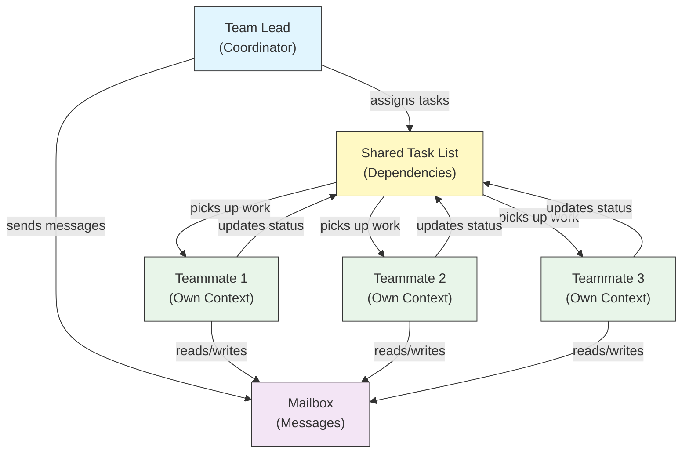

이 문서는 자체 컨텍스트 윈도우를 가진 여러 Claude Code 인스턴스를 메일박스 시스템으로 협업시키는 실험적 기능을 정리합니다.
PR 리뷰·디버깅처럼 여러 관점이 동시에 필요하거나 팀원끼리 직접 메시지를 주고받아야 하는 작업에 적합합니다.
입문 수준의 개요는 agent-teams.md를 참고하고, 본 문서는 활성화·표시 모드·작업 의존성·hook까지 상세 설정에 집중합니다.

Agent Teams는 복잡한 작업에서 함께 일하는 여러 Claude Code 인스턴스를 조율합니다. subagent(하위 작업을 위임받고 결과를 반환)와 달리, 팀원은 자체 컨텍스트 윈도우를 가지고 독립적으로 작업하며 공유 메일박스 시스템을 통해 서로 직접 메시지를 보낼 수 있습니다.

> **공식 문서**: [code.claude.com/docs/ko/agent-teams](https://code.claude.com/docs/ko/agent-teams)

[[TIP("참고")]]
Agent Teams는 실험적 기능이며 기본적으로 비활성화되어 있습니다. Claude Code v2.1.32+가 필요합니다. 사용 전에 활성화하세요.
[[/TIP]]

## Subagent vs Agent Teams

| 측면 | Subagent | Agent Teams |
|--------|-----------|-------------|
| **위임 모델** | 부모가 하위 작업을 위임하고 결과를 기다림 | 팀 리더가 작업을 조율하고 팀원이 독립적으로 실행 |
| **컨텍스트** | 하위 작업마다 새 컨텍스트, 결과를 요약하여 반환 | 각 팀원이 자체 영구 컨텍스트 윈도우 유지 |
| **조율** | 순차 또는 병렬, 부모가 관리 | 자동 의존성 관리가 있는 공유 작업 목록 |
| **통신** | 결과가 부모에게만 반환됨 (agent 간 메시징 없음) | 팀원이 메일박스를 통해 직접 메시지를 보낼 수 있음 |
| **세션 재개** | 지원됨 | 인프로세스 팀원은 지원되지 않음 |
| **적합한 용도** | 집중적이고 잘 정의된 하위 작업 | agent 간 통신과 병렬 실행이 필요한 복잡한 작업 |

## Agent Teams 활성화

환경 변수를 설정하거나 `settings.json`에 추가합니다:

```bash
export CLAUDE_CODE_EXPERIMENTAL_AGENT_TEAMS=1
```

또는 `settings.json`에서:

```json
{
  "env": {
    "CLAUDE_CODE_EXPERIMENTAL_AGENT_TEAMS": "1"
  }
}
```

## 팀 시작

활성화하면 프롬프트에서 Claude에게 팀원과 함께 작업하도록 요청합니다:

```
User: Build the authentication module. Use a team — one teammate for the API endpoints,
      one for the database schema, and one for the test suite.
```

Claude가 자동으로 팀을 생성하고 작업을 할당하며 작업을 조율합니다.

## 표시 모드

팀원 활동 표시 방식을 제어합니다:

| 모드 | 플래그 | 설명 |
|------|------|-------------|
| **Auto** | `--teammate-mode auto` | 터미널에 가장 적합한 표시 모드를 자동으로 선택합니다 |
| **In-process** (기본값) | `--teammate-mode in-process` | 현재 터미널에 팀원 출력을 인라인으로 표시합니다 |
| **Split-panes** | `--teammate-mode tmux` | 각 팀원을 별도의 tmux 또는 iTerm2 패널에서 엽니다 |

```bash
claude --teammate-mode tmux
```

`settings.json`에서도 표시 모드를 설정할 수 있습니다:

```json
{
  "teammateMode": "tmux"
}
```

[[TIP("참고")]]
Split-pane 모드는 tmux 또는 iTerm2가 필요합니다. VS Code 터미널, Windows Terminal, 또는 Ghostty에서는 사용할 수 없습니다. iTerm2에서는 `tmux -CC`를 사용하는 것이 권장됩니다.
[[/TIP]]

## 팀원에게 직접 메시지 보내기

각 팀원은 완전히 독립적인 Claude Code 세션입니다. 추가 지침을 주거나, 후속 질문을 하거나, 접근 방식을 변경하도록 직접 메시지를 보낼 수 있습니다.

- **In-process 모드**: `Shift+Down`을 사용하여 팀원 간을 순환하고, 직접 메시지를 입력합니다. `Enter`를 눌러 팀원의 세션을 보고, `Escape`로 현재 턴을 중단합니다. `Ctrl+T`로 작업 목록을 토글합니다.
- **Split-pane 모드**: 팀원의 패널을 클릭하여 해당 세션과 직접 상호작용합니다. 각 팀원은 자체 터미널을 완전히 볼 수 있습니다.

## 작업 의존성 관리

공유 작업 목록은 자동 의존성 추적을 지원합니다:

- 작업은 다른 작업에 대한 **의존성**을 가질 수 있습니다
- 의존성이 해결되지 않은 대기 중인 작업은 의존성이 완료될 때까지 **자동으로 차단**됩니다
- 팀원이 의존성이 있는 작업을 완료하면 차단된 작업이 수동 개입 없이 **자동으로 해제**됩니다
- 작업 할당은 여러 팀원이 동시에 같은 작업을 선택하려는 경쟁 조건을 방지하기 위해 **파일 잠금**을 사용합니다

## 계획 승인 워크플로우 상세

복잡하거나 위험한 작업의 경우, 팀원이 구현하기 전에 계획을 수립하도록 요구할 수 있습니다:

```
팀원에게 인증 모듈을 리팩토링하도록 지시하세요.
변경하기 전에 계획 승인을 요구하세요.
```

- 팀원은 리더가 승인할 때까지 **읽기 전용 plan 모드**에서 작업합니다
- 리더가 계획을 **검토하고 승인 또는 거부**합니다
- 거부 시 팀원은 피드백을 바탕으로 수정하고 다시 제출합니다
- 승인 후 팀원은 plan 모드를 종료하고 구현을 시작합니다
- 리더의 판단에 영향을 주려면 프롬프트에 기준을 포함하세요 (예: "테스트 커버리지를 포함하는 계획만 승인")

## Subagent 정의를 팀원으로 사용

기존 subagent 정의를 팀원 역할로 재사용할 수 있습니다. 팀원을 생성할 때 subagent 유형을 이름으로 참조합니다:

```
security-reviewer agent 유형을 사용하여 인증 모듈을 감사할 팀원을 생성하세요.
```

- 팀원은 해당 정의의 `tools` 허용 목록과 `model`을 따릅니다
- 정의의 본문은 팀원의 시스템 프롬프트를 **대체하지 않고 추가**됩니다
- `SendMessage` 및 작업 관리 도구와 같은 팀 조율 도구는 `tools` 제한과 관계없이 **항상 사용 가능**합니다
- `skills` 및 `mcpServers` frontmatter 필드는 팀원으로 실행될 때 적용되지 않습니다

## 팀 구성

팀 구성은 `~/.claude/teams/{team-name}/config.json`에 저장됩니다.

## 아키텍처



**핵심 구성 요소**:

- **Team Lead**: 팀을 생성하고 작업을 할당하며 조율하는 메인 Claude Code 세션
- **Shared Task List**: 자동 의존성 추적이 있는 동기화된 작업 목록
- **Mailbox**: 팀원이 상태를 전달하고 조율하기 위한 agent 간 메시징 시스템
- **Teammates**: 각각 자체 컨텍스트 윈도우를 가진 독립적인 Claude Code 인스턴스

## 작업 할당 및 메시징

팀 리더가 작업을 분해하여 팀원에게 할당합니다. 공유 작업 목록은 다음을 처리합니다:

- **자동 의존성 관리** -- 작업은 의존성이 완료될 때까지 대기합니다
- **상태 추적** -- 팀원이 작업하면서 작업 상태를 업데이트합니다
- **agent 간 메시징** -- 팀원이 조율을 위해 메일박스를 통해 메시지를 보냅니다 (예: "데이터베이스 스키마가 준비되었습니다. 쿼리 작성을 시작할 수 있습니다")

## 계획 승인 워크플로우

복잡한 작업의 경우, 팀 리더가 팀원이 작업을 시작하기 전에 실행 계획을 작성합니다. 사용자가 계획을 검토하고 승인하여, 코드 변경 전에 팀의 접근 방식이 기대에 부합하는지 확인합니다.

## 팀을 위한 Hook 이벤트

Agent Teams는 세 가지 추가 hook 이벤트를 도입합니다. 종료 코드 2는 해당 동작을 차단합니다:

| 이벤트 | 발생 시점 | 사용 사례 |
|-------|-----------|----------|
| `TeammateIdle` | 팀원이 현재 작업을 완료하고 유휴 상태가 되려고 할 때 | 유휴 방지, 후속 작업 할당. 종료 코드 2로 팀원이 계속 작업하도록 합니다 |
| `TaskCreated` | `TaskCreate`를 통해 작업이 생성될 때 | 명명 규칙 강제, 설명 요구, 작업 생성 방지 |
| `TaskCompleted` | 공유 작업 목록의 작업이 완료로 표시될 때 | 완료 기준 검증, 대시보드 업데이트, 조기 완료 방지 |

## 비용 고려 사항

Agent Teams는 단일 세션보다 **상당히 더 많은 토큰**을 사용합니다:

- **토큰 비용은 선형으로 증가**: 각 팀원이 자체 컨텍스트 윈도우를 가지고 독립적으로 토큰을 소비합니다
- **권장 팀 규모**: 대부분의 워크플로우에서 **3-5명**의 팀원으로 시작하세요
- **최적 작업 수**: 팀원당 **5-6개 작업**이 과도한 컨텍스트 전환 없이 생산성을 유지하는 최적의 수준입니다
- 리서치, 리뷰, 새 기능 작업에서는 추가 토큰이 충분한 가치가 있습니다
- 일상적인 작업에는 단일 세션이 더 비용 효율적입니다

## 사용 사례 예제

### 예제 1: 병렬 코드 리뷰

단일 리뷰어는 한 번에 한 유형의 이슈에 집중하는 경향이 있습니다. 리뷰 기준을 독립적인 도메인으로 분리하면 보안, 성능, 테스트 커버리지 모두 동시에 철저한 검토를 받습니다:

```
PR #142를 리뷰할 agent team을 생성하세요. 세 명의 리뷰어를 생성하세요:
- 보안 영향에 초점을 맞추는 리뷰어
- 성능 영향을 확인하는 리뷰어
- 테스트 커버리지를 검증하는 리뷰어
각자 리뷰하고 발견 사항을 보고하도록 하세요.
```

각 리뷰어가 같은 PR에서 작업하지만 서로 다른 관점을 적용합니다. 리더가 모든 리뷰어의 발견 사항을 종합합니다.

### 예제 2: 경쟁 가설 디버깅

근본 원인이 불분명할 때, 단일 에이전트는 하나의 그럴듯한 설명을 찾고 탐색을 중단하는 경향이 있습니다. 팀원들을 명시적으로 적대적으로 만들어 각자의 이론을 조사할 뿐만 아니라 다른 팀원의 이론에 반박하도록 합니다:

```
사용자가 앱이 하나의 메시지 후에 종료된다고 보고합니다.
서로 다른 가설을 조사할 5명의 agent 팀원을 생성하세요.
서로의 이론을 반증하려고 과학적 토론처럼 대화하도록 하세요.
합의가 도출되면 발견 사항 문서를 업데이트하세요.
```

토론 구조가 핵심 메커니즘입니다. 순차적 조사는 앵커링 편향의 영향을 받습니다. 여러 독립적인 조사관이 서로의 이론을 적극적으로 반증하려고 하면, 살아남는 이론이 실제 근본 원인일 가능성이 훨씬 높습니다.

## 모범 사례

- **팀 규모**: 최적의 조율을 위해 3-5명의 팀원을 유지하세요
- **작업 규모**: 작업을 각각 5-15분 소요되는 단위로 분할하세요 -- 병렬화할 수 있을 만큼 작고, 의미 있을 만큼 큰 단위. 팀원당 5-6개 작업이 최적입니다
- **파일 충돌 방지**: 병합 충돌을 방지하기 위해 서로 다른 파일이나 디렉토리를 서로 다른 팀원에게 할당하세요
- **간단하게 시작**: 첫 번째 팀에는 in-process 모드를 사용하세요; 익숙해지면 split-pane으로 전환하세요
- **명확한 작업 설명**: 팀원이 독립적으로 작업할 수 있도록 구체적이고 실행 가능한 작업 설명을 제공하세요
- **리서치와 리뷰부터 시작**: Agent Teams가 처음이라면 코드 작성이 필요 없는 명확한 경계가 있는 작업부터 시작하세요
- **팀원 모니터링**: 진행 상황을 확인하고, 효과적이지 않은 접근 방식을 수정하고, 결과를 종합하세요

## 제한 사항

- **실험적**: 향후 릴리스에서 기능 동작이 변경될 수 있습니다
- **세션 재개 불가**: 인프로세스 팀원은 세션 종료 후 재개할 수 없습니다
- **세션당 하나의 팀**: 단일 세션에서 중첩된 팀이나 여러 팀을 만들 수 없습니다
- **고정된 리더십**: 팀 리더 역할은 팀원에게 이전할 수 없습니다
- **Split-pane 제한**: tmux/iTerm2 필수; VS Code 터미널, Windows Terminal, 또는 Ghostty에서는 사용 불가
- **크로스 세션 팀 불가**: 팀원은 현재 세션 내에서만 존재합니다

[[TIP("경고")]]
Agent Teams는 실험적 기능입니다. 먼저 중요하지 않은 작업에서 테스트하고 예상치 못한 동작에 대해 팀원 조율을 모니터링하세요.
[[/TIP]]
