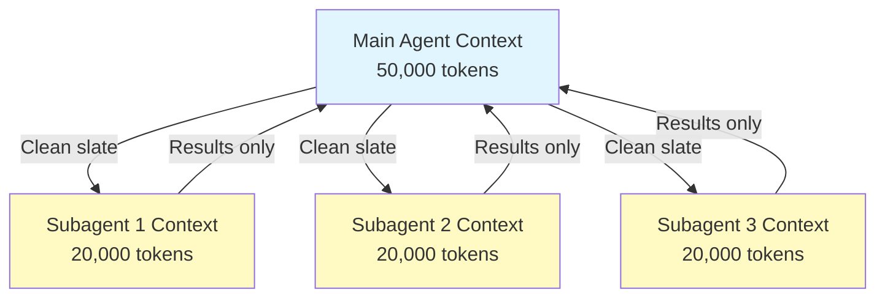

이 문서는 subagent가 메인 컨텍스트를 어떻게 보호하는지, 그리고 자동 압축·트랜스크립트·중첩 제한 같은 주요 동작을 정리합니다.
장시간 세션에서 토큰 소진을 막고 싶거나, subagent의 격리 정책을 이해하고 싶을 때 봅니다.
"각 subagent가 새 컨텍스트 윈도우를 받는다"는 점이 핵심 — 이게 깨지면 격리 자체가 무너집니다.

## 핵심 사항

- 각 subagent는 메인 대화 기록 없이 **새로운 컨텍스트 윈도우**를 받습니다
- 특정 작업에 **관련된 컨텍스트만** subagent에 전달됩니다
- 결과는 메인 agent에 **요약되어** 반환됩니다
- 이는 장기 프로젝트에서 **컨텍스트 토큰 소진을 방지**합니다

## 성능 고려 사항

- **컨텍스트 효율성** - Agent가 메인 컨텍스트를 보존하여 더 긴 세션이 가능합니다
- **지연 시간** - Subagent는 깨끗한 상태에서 시작하며 초기 컨텍스트 수집 시 지연이 추가될 수 있습니다

## 주요 동작

- **중첩 생성 불가** - Subagent는 다른 subagent를 생성할 수 없습니다. `tools` 필드의 `Agent(agent_type)` 구문은 `claude --agent`로 메인 스레드에서 실행하는 에이전트에만 적용되며, subagent 정의에서는 효과가 없습니다
- **백그라운드 권한** - 백그라운드 subagent는 사전 승인되지 않은 모든 권한을 자동으로 거부합니다
- **백그라운드 전환** - `Ctrl+B`를 눌러 현재 실행 중인 작업을 백그라운드로 전환합니다
- **트랜스크립트** - Subagent 트랜스크립트는 `~/.claude/projects/{project}/{sessionId}/subagents/agent-{agentId}.jsonl`에 저장됩니다
- **자동 압축** - Subagent 컨텍스트는 약 95% 용량에서 자동 압축됩니다 (`CLAUDE_AUTOCOMPACT_PCT_OVERRIDE` 환경 변수로 재정의 가능)
