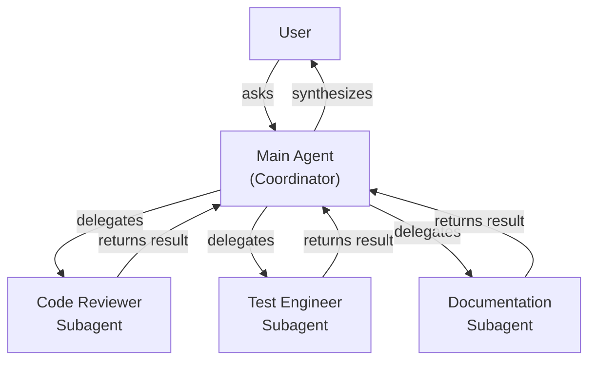
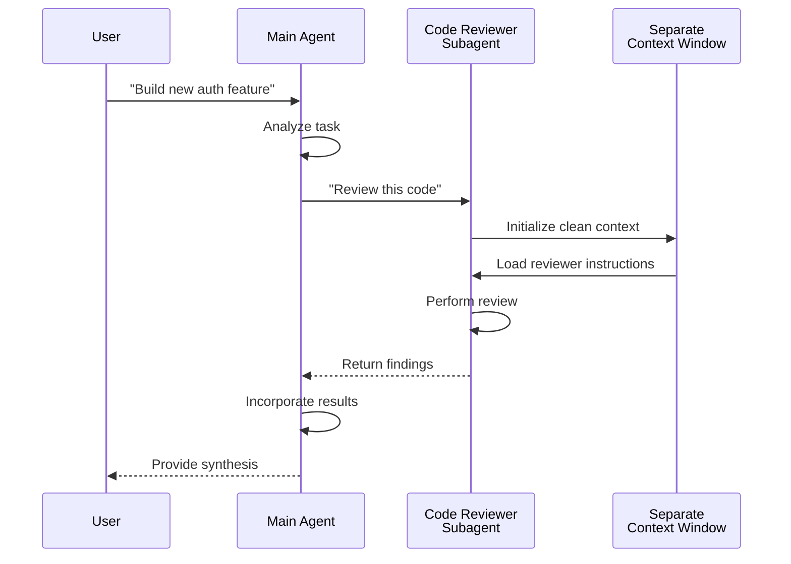

이 문서는 메인 agent와 subagent의 위임 관계, 그리고 한 라이프사이클 안에서 일어나는 일을 두 개의 다이어그램으로 보여줍니다.
"내부적으로 subagent가 어떻게 호출·실행·반환되는지"를 시각적으로 이해하고 싶을 때 보세요.
컨텍스트 격리·결과 종합 흐름을 이해하면 위임 패턴 설계가 쉬워집니다.

## 상위 수준 아키텍처

## Subagent 라이프사이클

