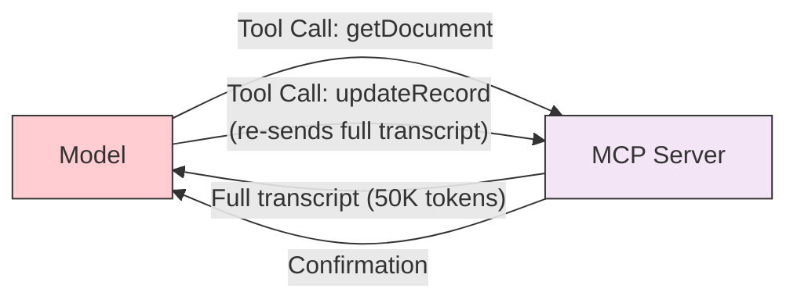
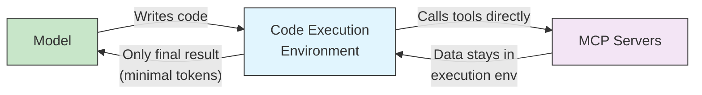

이 페이지는 수십 개 MCP 서버를 붙였을 때 발생하는 컨텍스트 팽창을 코드 실행 환경에서 해결하는 Anthropic 엔지니어링 패턴을 정리한다. 도구 정의 사전 로딩과 중간 결과 왕복으로 토큰이 폭주하는 문제를 만났다면 이 페이지가 핵심이다. 보일러플레이트 없이 이 패턴을 구현하는 도구로 MCPorter도 함께 다룬다. 단순한 출력 한도 조정은 [mcp-output-limits.md](05-15-mcp-output-limits.md), tool surface 자체 축소는 [mcp-tool-search.md](05-30-mcp-tool-search.md)에서 다룬다.

MCP 채택이 확대됨에 따라, 수십 개의 서버와 수백 또는 수천 개의 도구에 연결하면 심각한 문제가 발생합니다: **컨텍스트 팽창**. 이는 대규모 MCP에서 가장 큰 문제이며, Anthropic의 엔지니어링 팀은 우아한 해결책을 제안했습니다 -- 직접 도구 호출 대신 코드 실행을 사용하는 것입니다.

> **출처**: [Code Execution with MCP: Building More Efficient Agents](https://www.anthropic.com/engineering/code-execution-with-mcp) -- Anthropic 엔지니어링 블로그

## 문제: 두 가지 토큰 낭비 원인

**1. 도구 정의가 컨텍스트 윈도우를 과부하함**

대부분의 MCP 클라이언트는 모든 도구 정의를 사전에 로드합니다. 수천 개의 도구에 연결되면, 모델은 사용자의 요청을 읽기도 전에 수십만 토큰을 처리해야 합니다.

**2. 중간 결과가 추가 토큰을 소비함**

모든 중간 도구 결과가 모델의 컨텍스트를 통과합니다. 회의 트랜스크립트를 Google Drive에서 Salesforce로 전송하는 경우를 생각해보세요 -- 전체 트랜스크립트가 컨텍스트를 **두 번** 통과합니다: 읽을 때 한 번, 대상에 쓸 때 한 번. 2시간짜리 회의 트랜스크립트는 50,000개 이상의 추가 토큰을 의미할 수 있습니다.



## 해결책: MCP 도구를 코드 API로

도구 정의와 결과를 컨텍스트 윈도우를 통해 전달하는 대신, agent가 MCP 도구를 API로 호출하는 **코드를 작성**합니다. 코드는 샌드박스된 실행 환경에서 실행되며, 최종 결과만 모델에 반환됩니다.



### 작동 방식

MCP 도구는 타입이 지정된 함수의 파일 트리로 제공됩니다:

```text
servers/
├── google-drive/
│   ├── getDocument.ts
│   └── index.ts
├── salesforce/
│   ├── updateRecord.ts
│   └── index.ts
└── ...
```

각 도구 파일에는 타입이 지정된 래퍼가 포함됩니다:

```typescript
// ./servers/google-drive/getDocument.ts
import { callMCPTool } from "../../../client.js";

interface GetDocumentInput {
  documentId: string;
}

interface GetDocumentResponse {
  content: string;
}

export async function getDocument(
  input: GetDocumentInput
): Promise<GetDocumentResponse> {
  return callMCPTool<GetDocumentResponse>(
    'google_drive__get_document', input
  );
}
```

그런 다음 agent가 도구를 조율하는 코드를 작성합니다:

```typescript
import * as gdrive from './servers/google-drive';
import * as salesforce from './servers/salesforce';

// Data flows directly between tools — never through the model
const transcript = (
  await gdrive.getDocument({ documentId: 'abc123' })
).content;

await salesforce.updateRecord({
  objectType: 'SalesMeeting',
  recordId: '00Q5f000001abcXYZ',
  data: { Notes: transcript }
});
```

**결과: 토큰 사용량이 약 150,000에서 약 2,000으로 감소 -- 98.7% 절감.**

## 주요 이점

| 이점 | 설명 |
|---------|-------------|
| **Progressive Disclosure** | Agent가 모든 도구를 사전에 로드하는 대신, 필요한 도구 정의만 파일시스템을 탐색하여 로드합니다 |
| **Context-Efficient Results** | 모델에 반환되기 전에 실행 환경에서 데이터가 필터링/변환됩니다 |
| **Powerful Control Flow** | 루프, 조건문, 오류 처리가 모델을 거치지 않고 코드에서 실행됩니다 |
| **Privacy Preservation** | 중간 데이터(PII, 민감한 레코드)가 실행 환경에 머물며 모델 컨텍스트에 들어가지 않습니다 |
| **State Persistence** | Agent가 중간 결과를 파일로 저장하고 재사용 가능한 skill 함수를 구축할 수 있습니다 |

### 예제: 대규모 데이터셋 필터링

```typescript
// Without code execution — all 10,000 rows flow through context
// TOOL CALL: gdrive.getSheet(sheetId: 'abc123')
//   -> returns 10,000 rows in context

// With code execution — filter in the execution environment
const allRows = await gdrive.getSheet({ sheetId: 'abc123' });
const pendingOrders = allRows.filter(
  row => row["Status"] === 'pending'
);
console.log(`Found ${pendingOrders.length} pending orders`);
console.log(pendingOrders.slice(0, 5)); // Only 5 rows reach the model
```

### 예제: 왕복 없는 루프

```typescript
// Poll for a deployment notification — runs entirely in code
let found = false;
while (!found) {
  const messages = await slack.getChannelHistory({
    channel: 'C123456'
  });
  found = messages.some(
    m => m.text.includes('deployment complete')
  );
  if (!found) await new Promise(r => setTimeout(r, 5000));
}
console.log('Deployment notification received');
```

## 고려해야 할 트레이드오프

코드 실행은 자체적인 복잡성을 도입합니다. agent가 생성한 코드를 실행하려면 다음이 필요합니다:

- 적절한 리소스 제한이 있는 **안전한 샌드박스 실행 환경**
- 실행된 코드의 **모니터링 및 로깅**
- 직접 도구 호출에 비해 추가적인 **인프라 오버헤드**

토큰 비용 절감, 낮은 지연 시간, 향상된 도구 구성의 이점은 이러한 구현 비용과 비교하여 평가해야 합니다. 소수의 MCP 서버만 있는 agent의 경우, 직접 도구 호출이 더 간단할 수 있습니다. 대규모 agent(수십 개의 서버, 수백 개의 도구)의 경우, 코드 실행은 상당한 개선입니다.

## MCPorter: MCP 도구 구성을 위한 런타임

[MCPorter](https://github.com/steipete/mcporter)는 보일러플레이트 없이 MCP 서버 호출을 실용적으로 만드는 TypeScript 런타임 및 CLI 도구 키트입니다 -- 선택적 도구 노출과 타입이 지정된 래퍼를 통해 컨텍스트 팽창을 줄이는 데 도움을 줍니다.

**해결하는 문제:** 모든 MCP 서버의 모든 도구 정의를 사전에 로드하는 대신, MCPorter를 사용하면 특정 도구를 요청 시 검색, 검사 및 호출할 수 있어 컨텍스트를 가볍게 유지합니다.

**주요 기능:**

| 기능 | 설명 |
|---------|-------------|
| **Zero-config discovery** | Cursor, Claude, Codex 또는 로컬 설정에서 MCP 서버를 자동 검색합니다 |
| **Typed tool clients** | `mcporter emit-ts`가 `.d.ts` 인터페이스와 바로 실행 가능한 래퍼를 생성합니다 |
| **Composable API** | `createServerProxy()`가 `.text()`, `.json()`, `.markdown()` 헬퍼와 함께 camelCase 메서드로 도구를 노출합니다 |
| **CLI generation** | `mcporter generate-cli`가 MCP 서버를 `--include-tools` / `--exclude-tools` 필터링이 있는 독립형 CLI로 변환합니다 |
| **Parameter hiding** | 선택적 매개변수가 기본적으로 숨겨져 스키마 장황함을 줄입니다 |

**설치:**

```bash
npx mcporter list          # No install required — discover servers instantly
pnpm add mcporter          # Add to a project
brew install steipete/tap/mcporter  # macOS via Homebrew
```

**예제 -- TypeScript에서 도구 구성:**

```typescript
import { createRuntime, createServerProxy } from "mcporter";

const runtime = await createRuntime();
const gdrive = createServerProxy(runtime, "google-drive");
const salesforce = createServerProxy(runtime, "salesforce");

// Data flows between tools without passing through the model context
const doc = await gdrive.getDocument({ documentId: "abc123" });
await salesforce.updateRecord({
  objectType: "SalesMeeting",
  recordId: "00Q5f000001abcXYZ",
  data: { Notes: doc.text() }
});
```

**예제 -- CLI 도구 호출:**

```bash
# Call a specific tool directly
npx mcporter call linear.create_comment issueId:ENG-123 body:'Looks good!'

# List available servers and tools
npx mcporter list
```

MCPorter는 위에서 설명한 코드 실행 접근 방식을 보완하여 MCP 도구를 타입이 지정된 API로 호출하기 위한 런타임 인프라를 제공합니다 -- 중간 데이터를 모델 컨텍스트에서 벗어나게 유지하는 것을 간단하게 만듭니다.
