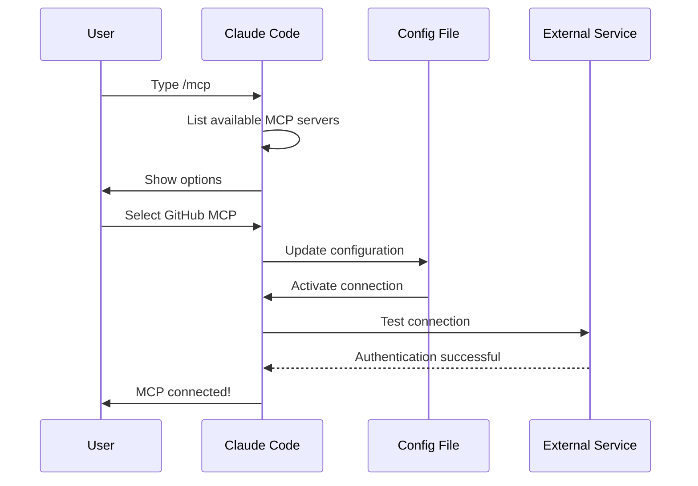

이 페이지는 사용자가 `/mcp` 명령으로 MCP 서버를 선택해 활성화하는 표준 흐름을 sequence diagram으로 보여 준다. CLI 명령을 외우기 전에 "어떤 단계에서 무슨 일이 일어나는지" 흐름을 먼저 잡고 싶을 때 이 페이지를 본다. 실제 명령어 레퍼런스는 mcp-installation.md, 운영 단계 명령은 mcp-management.md에서 다룬다.

