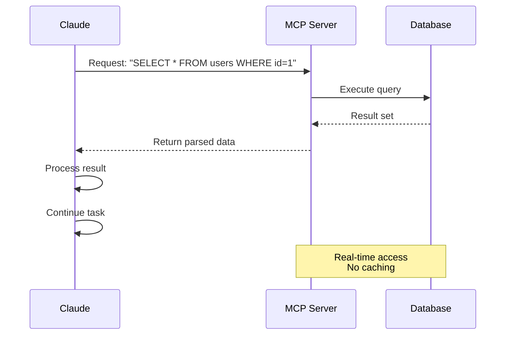

이 페이지는 Claude → MCP 서버 → 외부 시스템(예: Database)으로 이어지는 요청/응답 흐름을 sequence diagram으로 보여 준다. MCP가 캐시 없이 매번 실시간으로 동작한다는 핵심 성질을 시각적으로 잡고 싶을 때 본다. 큰 그림 아키텍처는 [mcp-architecture.md](05-02-mcp-architecture.md), 응답 토큰 한도 처리는 [mcp-output-limits.md](05-15-mcp-output-limits.md)에서 다룬다.

