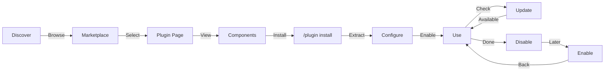

이 문서는 plugin이 발견·선택·설치·구성·활성화·업데이트·비활성화·재활성화되는 전체 수명 주기를 다이어그램으로 보여 줍니다. plugin을 처음 다룰 때 어떤 단계에 어떤 명령이 사용되는지 한눈에 파악할 때 참고하세요. 운영 중 어느 단계에 멈춰 있는지를 알면 다음 명령을 결정하기 쉬워집니다.

```mermaid
graph LR
    A["Discover"] -->|Browse| B["Marketplace"]
    B -->|Select| C["Plugin Page"]
    C -->|View| D["Components"]
    D -->|Install| E["/plugin install"]
    E -->|Extract| F["Configure"]
    F -->|Enable| G["Use"]
    G -->|Check| H["Update"]
    H -->|Available| G
    G -->|Done| I["Disable"]
    I -->|Later| J["Enable"]
    J -->|Back| G
```
