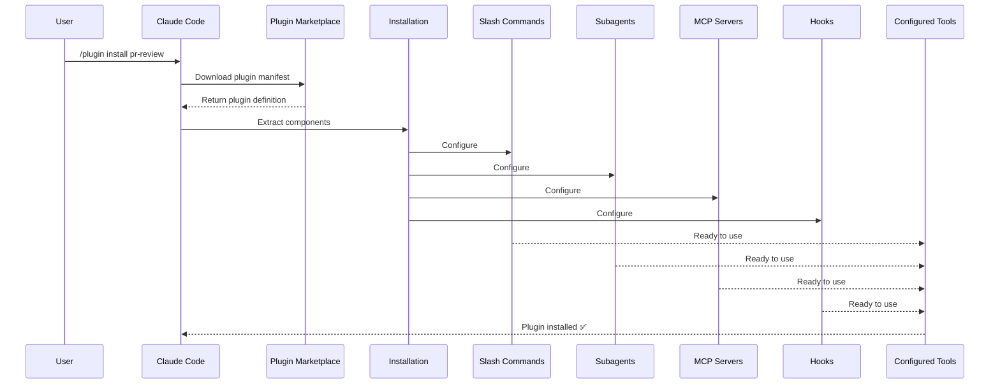

이 문서는 사용자가 `/plugin install` 명령을 실행한 순간부터 모든 구성 요소가 사용 가능 상태가 되기까지의 흐름을 시퀀스 다이어그램으로 정리합니다. 마켓플레이스에서 plugin이 어떻게 다운로드되고, 어떤 단계로 슬래시 커맨드/서브에이전트/MCP 서버/hook이 구성되는지 추적할 때 참고하세요. 디버깅이나 plugin 설치 실패 진단 시 어느 단계에서 문제가 발생했는지 좁히는 데 유용합니다.

