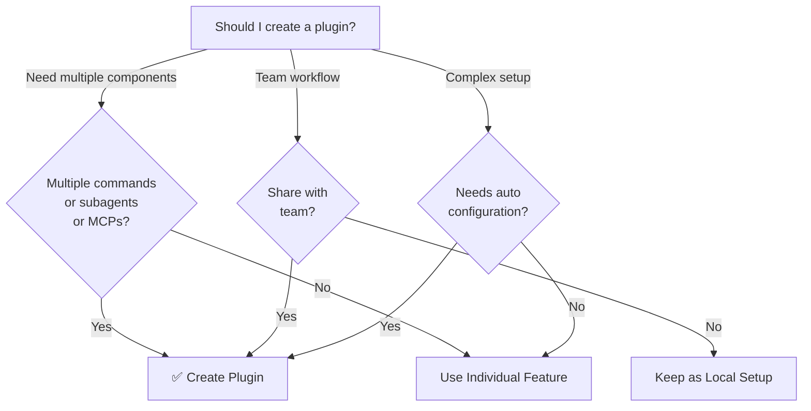

이 문서는 새로운 customization을 plugin으로 만들지, 단순한 슬래시 커맨드나 skill로 둘지 결정하는 의사결정 트리를 제공합니다. 여러 구성요소를 묶어야 하거나 팀과 공유하거나 자동 구성이 필요할 때 plugin이 적합한지 판단할 때 참고하세요. 단일 도메인 작업이라면 plugin 대신 더 가벼운 옵션을 권장하는 사용 사례 표도 함께 다룹니다.

## Plugin 사용 사례

| 사용 사례 | 권장 | 이유 |
|----------|-----------------|-----|
| **팀 온보딩** | ✅ Plugin 사용 | 즉시 설정, 모든 구성 포함 |
| **프레임워크 설정** | ✅ Plugin 사용 | 프레임워크별 명령 번들 |
| **엔터프라이즈 표준** | ✅ Plugin 사용 | 중앙 배포, 버전 관리 |
| **빠른 작업 자동화** | ❌ Command 사용 | 과도한 복잡성 |
| **단일 도메인 전문성** | ❌ Skill 사용 | 너무 무거움, skill 대신 사용 |
| **전문 분석** | ❌ Subagent 사용 | 수동으로 생성하거나 skill 사용 |
| **실시간 데이터 접근** | ❌ MCP 사용 | 독립형, 번들하지 않음 |
