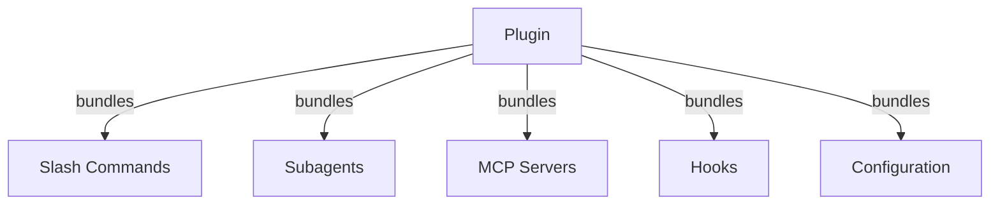
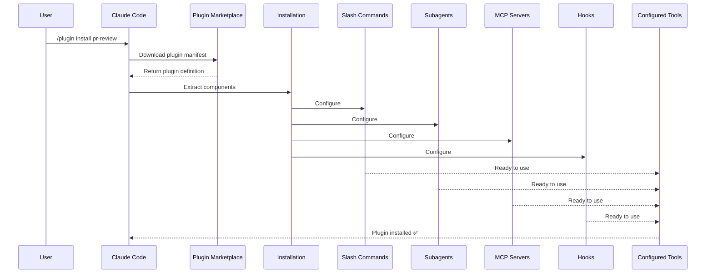
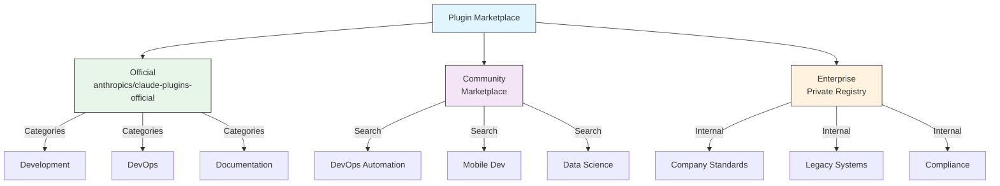
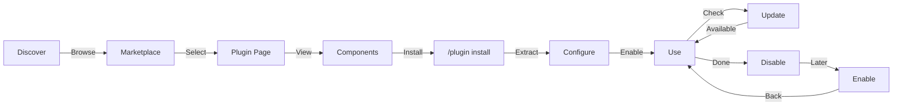
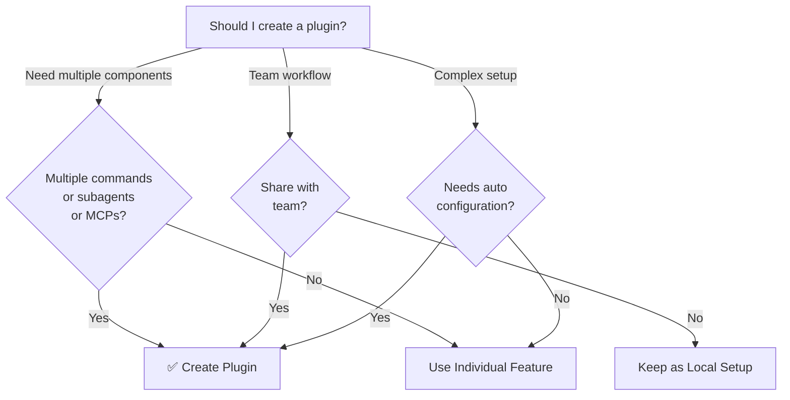

이 폴더에는 여러 Claude Code 기능을 하나의 설치 가능한 패키지로 묶은 완전한 plugin 예제가 포함되어 있습니다.

## 언제 읽으면 좋은가

- 여러 customization(slash command + subagent + hooks + MCP 서버)을 한 번에 설치/배포하고 싶을 때
- 팀 표준 워크플로(PR 리뷰, DevOps 자동화, 문서화 등)를 단일 명령으로 보급하고 싶을 때
- 외부 plugin marketplace에서 검증된 기능을 가져와 사용하고 싶을 때
- 조직 내에서 plugin source와 권한을 중앙에서 통제해야 할 때

## 개요

Claude Code Plugins는 커스터마이징(slash command, subagent, MCP 서버, hooks)의 번들 컬렉션으로, 단일 명령으로 설치할 수 있습니다. 여러 기능을 응집력 있고 공유 가능한 패키지로 결합하는 최상위 확장 메커니즘입니다.

**관련 가이드:**

- [플러그인 찾기](07-plugins.md#07-plugins-09-플러그인-찾기)

## Plugin 아키텍처



## Plugin 로딩 프로세스



## Plugin 유형 및 배포

| 유형 | 범위 | 공유 | 관리 주체 | 예시 |
|------|-------|--------|-----------|----------|
| Official | 글로벌 | 모든 사용자 | Anthropic | PR Review, Security Guidance |
| Community | 공개 | 모든 사용자 | 커뮤니티 | DevOps, Data Science |
| Organization | 내부 | 팀원 | 회사 | 내부 표준, 도구 |
| Personal | 개인 | 단일 사용자 | 개발자 | 커스텀 워크플로우 |

## Plugin 정의 구조

Plugin 매니페스트는 `.claude-plugin/plugin.json`에서 JSON 형식을 사용합니다:

```json
{
  "name": "my-first-plugin",
  "description": "A greeting plugin",
  "version": "1.0.0",
  "author": {
    "name": "Your Name"
  },
  "homepage": "https://example.com",
  "repository": "https://github.com/user/repo",
  "license": "MIT"
}
```

## Plugin 구조 예시

```
my-plugin/
├── .claude-plugin/
│   └── plugin.json       # 매니페스트 (이름, 설명, 버전, 작성자)
├── commands/             # 마크다운 파일로 된 Skills
│   ├── task-1.md
│   ├── task-2.md
│   └── workflows/
├── agents/               # 커스텀 에이전트 정의
│   ├── specialist-1.md
│   ├── specialist-2.md
│   └── configs/
├── skills/               # SKILL.md 파일이 있는 Agent Skills
│   ├── skill-1.md
│   └── skill-2.md
├── hooks/                # hooks.json의 이벤트 핸들러
│   └── hooks.json
├── .mcp.json             # MCP 서버 설정
├── .lsp.json             # 코드 인텔리전스를 위한 LSP 서버 설정
├── monitors/             # monitors.json에 정의된 백그라운드 모니터
│   └── monitors.json
├── bin/                  # plugin 활성화 시 Bash 도구의 PATH에 추가되는 실행 파일
├── settings.json         # plugin 활성화 시 적용되는 기본 설정 (현재 `agent` 및 `subagentStatusLine` 키 지원)
├── templates/
│   └── issue-template.md
├── scripts/
│   ├── helper-1.sh
│   └── helper-2.py
├── docs/
│   ├── README.md
│   └── USAGE.md
└── tests/
    └── plugin.test.js
```

### 백그라운드 모니터

Plugin은 `monitors/monitors.json` 파일을 통해 백그라운드 모니터를 정의할 수 있습니다. 모니터는 plugin이 활성화되면 자동으로 시작되며, stdout의 각 줄이 Claude에게 알림으로 전달됩니다.

```json
[
  {
    "name": "error-log",
    "command": "tail -F ./logs/error.log",
    "description": "Application error log"
  }
]
```

### LSP 서버 설정

Plugin은 실시간 코드 인텔리전스를 위한 Language Server Protocol(LSP) 지원을 포함할 수 있습니다. LSP 서버는 작업 중 진단, 코드 탐색, 심볼 정보를 제공합니다.

**설정 위치**:
- plugin 루트 디렉토리의 `.lsp.json` 파일
- `plugin.json`의 인라인 `lsp` 키

#### 필드 참조

| 필드 | 필수 | 설명 |
|-------|----------|-------------|
| `command` | 예 | LSP 서버 바이너리 (PATH에 있어야 함) |
| `extensionToLanguage` | 예 | 파일 확장자를 언어 ID에 매핑 |
| `args` | 아니오 | 서버의 명령줄 인수 |
| `transport` | 아니오 | 통신 방법: `stdio` (기본값) 또는 `socket` |
| `env` | 아니오 | 서버 프로세스의 환경 변수 |
| `initializationOptions` | 아니오 | LSP 초기화 시 전송되는 옵션 |
| `settings` | 아니오 | 서버에 전달되는 작업공간 설정 |
| `workspaceFolder` | 아니오 | 작업공간 폴더 경로 재정의 |
| `startupTimeout` | 아니오 | 서버 시작 대기 최대 시간(ms) |
| `shutdownTimeout` | 아니오 | 정상 종료를 위한 최대 시간(ms) |
| `restartOnCrash` | 아니오 | 서버 충돌 시 자동 재시작 |
| `maxRestarts` | 아니오 | 포기 전 최대 재시작 시도 횟수 |

#### 설정 예시

**Go (gopls)**:

```json
{
  "go": {
    "command": "gopls",
    "args": ["serve"],
    "extensionToLanguage": {
      ".go": "go"
    }
  }
}
```

**Python (pyright)**:

```json
{
  "python": {
    "command": "pyright-langserver",
    "args": ["--stdio"],
    "extensionToLanguage": {
      ".py": "python",
      ".pyi": "python"
    }
  }
}
```

**TypeScript**:

```json
{
  "typescript": {
    "command": "typescript-language-server",
    "args": ["--stdio"],
    "extensionToLanguage": {
      ".ts": "typescript",
      ".tsx": "typescriptreact",
      ".js": "javascript",
      ".jsx": "javascriptreact"
    }
  }
}
```

#### 사용 가능한 LSP plugin

공식 마켓플레이스에는 사전 구성된 LSP plugin이 포함되어 있습니다:

| Plugin | 언어 | 서버 바이너리 | 설치 명령 |
|--------|----------|---------------|----------------|
| `pyright-lsp` | Python | `pyright-langserver` | `pip install pyright` |
| `typescript-lsp` | TypeScript/JavaScript | `typescript-language-server` | `npm install -g typescript-language-server typescript` |
| `rust-lsp` | Rust | `rust-analyzer` | `rustup component add rust-analyzer`로 설치 |

#### LSP 기능

구성이 완료되면 LSP 서버는 다음을 제공합니다:

- **즉시 진단** -- 편집 직후 오류와 경고가 표시됩니다
- **코드 탐색** -- 정의로 이동, 참조 찾기, 구현체 찾기
- **호버 정보** -- 호버 시 타입 시그니처와 문서 표시
- **심볼 목록** -- 현재 파일이나 작업공간의 심볼 탐색

## Plugin 옵션 (v2.1.83+)

Plugin은 매니페스트의 `userConfig`를 통해 사용자 설정 가능한 옵션을 선언할 수 있습니다. `sensitive: true`로 표시된 값은 일반 텍스트 설정 파일이 아닌 시스템 키체인에 저장됩니다:

```json
{
  "name": "my-plugin",
  "version": "1.0.0",
  "userConfig": {
    "apiKey": {
      "description": "API key for the service",
      "sensitive": true
    },
    "region": {
      "description": "Deployment region",
      "default": "us-east-1"
    }
  }
}
```

## 영구 Plugin 데이터 (`${CLAUDE_PLUGIN_DATA}`) (v2.1.78+)

Plugin은 `${CLAUDE_PLUGIN_DATA}` 환경 변수를 통해 영구 상태 디렉토리에 접근할 수 있습니다. 이 디렉토리는 plugin별로 고유하며 세션 간에 유지되므로 캐시, 데이터베이스 및 기타 영구 상태에 적합합니다:

```json
{
  "hooks": {
    "PostToolUse": [
      {
        "command": "node ${CLAUDE_PLUGIN_DATA}/track-usage.js"
      }
    ]
  }
}
```

이 디렉토리는 plugin 설치 시 자동으로 생성됩니다. 여기에 저장된 파일은 plugin이 제거될 때까지 유지됩니다.

## Plugin 경로와 파일 해석

Plugin에는 사실상 두 개의 중요한 파일 시스템 기준점이 있습니다:

| 변수 | 의미 | 용도 |
|---------|---------|------------|
| `${CLAUDE_PLUGIN_ROOT}` | plugin 설치 루트 | 스크립트, 번들 설정, 상대 asset 참조 |
| `${CLAUDE_PLUGIN_DATA}` | plugin 전용 영구 데이터 디렉토리 | 캐시, 상태, 런타임 생성 산출물 |

실무 규칙:

- `${CLAUDE_PLUGIN_ROOT}`를 shipped file의 안정적인 기준점으로 취급
- `${CLAUDE_PLUGIN_DATA}`를 mutable plugin state의 안정적인 기준점으로 취급
- manifest component path는 plugin package 기준으로 결정적으로 유지
- 현재 working directory가 plugin directory라고 가정하지 않기

### Path behavior rules

Manifest와 보조 파일을 작성할 때는 다음 규칙이 안전합니다:

1. component path는 호출한 shell 상태가 아니라 plugin package 기준으로 해석되도록 설계
2. hook, MCP server, helper script가 안정적인 절대 기준점이 필요하면 `${CLAUDE_PLUGIN_ROOT}` 사용
3. writable state는 shipped plugin tree가 아니라 `${CLAUDE_PLUGIN_DATA}`에 저장

### Path traversal과 안전성

Plugin root 밖의 임의 host path에 의존하는 설계는 피하는 것이 좋습니다. 외부 path가 정말 필요하다면:

- explicit user configuration으로 받거나
- 안전한 runtime input으로부터 계산

이렇게 해야 packaging이 재현 가능해지고 설치/리뷰 중 surprise를 줄일 수 있습니다.

## 설정을 통한 인라인 Plugin (`source: 'settings'`) (v2.1.80+)

Plugin은 `source: 'settings'` 필드를 사용하여 설정 파일에 마켓플레이스 항목으로 인라인 정의할 수 있습니다. 이를 통해 별도의 저장소나 마켓플레이스 없이 plugin 정의를 직접 포함할 수 있습니다:

```json
{
  "pluginMarketplaces": [
    {
      "name": "inline-tools",
      "source": "settings",
      "plugins": [
        {
          "name": "quick-lint",
          "source": "./local-plugins/quick-lint"
        }
      ]
    }
  ]
}
```

## Plugin 설정

Plugin은 기본 설정을 제공하기 위해 `settings.json` 파일을 포함할 수 있습니다. 현재 `agent` 및 `subagentStatusLine` 키를 지원하며, `agent` 키는 plugin의 메인 스레드 에이전트를 설정합니다:

```json
{
  "agent": "agents/specialist-1.md"
}
```

Plugin이 `settings.json`을 포함하면 설치 시 기본값이 적용됩니다. 사용자는 자신의 프로젝트 또는 사용자 설정에서 이러한 설정을 재정의할 수 있습니다.

## Plugin Channels

Plugin은 channel-oriented workflow도 패키징할 수 있지만, channel 동작이 임의의 side concept로 따로 존재하는 것은 아닙니다. 실무적으로는 다른 고급 plugin과 같은 구성 요소를 사용합니다:

- 번들된 MCP server
- plugin이 관리하는 설정
- inbound event에 반응하는 선택적 hooks, commands, skills

특정 release channel 또는 communication channel 정책에 참여하는 plugin이라면, 그 정책은 prose가 아니라 managed settings로 명시하는 것이 좋습니다. `allowedChannelPlugins`는 channel-specific plugin governance의 핵심 정책 지점입니다.

### Channel-oriented plugin reference

독립된 `channels` 블록이 `plugin.json`에 따로 있는 것은 아닙니다. channel-capable plugin은 일반 plugin primitive를 조합해서 만듭니다:

| Concern | Where it lives | Notes |
|---|---|---|
| Channel transport/server | 번들된 MCP server | MCP server가 channel 동작을 선언하고 구현 |
| Channel-facing commands | `commands/` | channel workflow용 선택적 사용자 진입점 |
| Inbound event reactions | `hooks/` 또는 MCP server logic | 반응이 Claude 쪽인지 server 쪽인지에 따라 다름 |
| Durable state | `${CLAUDE_PLUGIN_DATA}` | channel cache, cursor, runtime state 저장 |
| Policy gating | Managed settings | `allowedChannelPlugins`가 핵심 governance control |

실무적으로는:

- 실제 구성요소는 plugin 구조 안에 ship하고
- 허용 여부는 managed settings로 제어하며
- 실제 동작이 MCP, hooks, policy에 있을 때 manifest에 가짜 schema key를 새로 만들지 않는 것이 맞습니다

## 독립형 vs Plugin 접근 방식

| 접근 방식 | 명령 이름 | 설정 | 적합한 용도 |
|----------|---------------|---|---|
| **독립형** | `/hello` | CLAUDE.md에서 수동 설정 | 개인용, 프로젝트별 |
| **Plugin** | `/plugin-name:hello` | plugin.json을 통한 자동화 | 공유, 배포, 팀 사용 |

빠른 개인 워크플로우에는 **독립형 slash command**를 사용하세요. 여러 기능을 번들로 묶거나, 팀과 공유하거나, 배포용으로 게시하려면 **plugin**을 사용하세요.

## 실용 예제

### 예제 1: PR Review Plugin

**파일:** `.claude-plugin/plugin.json`

```json
{
  "name": "pr-review",
  "version": "1.0.0",
  "description": "Complete PR review workflow with security, testing, and docs",
  "author": {
    "name": "Anthropic"
  },
  "repository": "https://github.com/your-org/pr-review",
  "license": "MIT"
}
```

**파일:** `commands/review-pr.md`

```markdown
---
name: Review PR
description: Start comprehensive PR review with security and testing checks
---

# PR Review

This command initiates a complete pull request review including:

1. Security analysis
2. Test coverage verification
3. Documentation updates
4. Code quality checks
5. Performance impact assessment
```

**파일:** `agents/security-reviewer.md`

```yaml
---
name: security-reviewer
description: Security-focused code review
tools: read, grep, diff
---

# Security Reviewer

Specializes in finding security vulnerabilities:
- Authentication/authorization issues
- Data exposure
- Injection attacks
- Secure configuration
```

**설치:**

```bash
/plugin install pr-review

# Result:
# ✅ 3 slash commands installed
# ✅ 3 subagents configured
# ✅ 2 MCP servers connected
# ✅ 4 hooks registered
# ✅ Ready to use!
```

### 예제 2: DevOps Plugin

**구성요소:**

```
devops-automation/
├── commands/
│   ├── deploy.md
│   ├── rollback.md
│   ├── status.md
│   └── incident.md
├── agents/
│   ├── deployment-specialist.md
│   ├── incident-commander.md
│   └── alert-analyzer.md
├── mcp/
│   ├── github-config.json
│   ├── kubernetes-config.json
│   └── prometheus-config.json
├── hooks/
│   ├── pre-deploy.js
│   ├── post-deploy.js
│   └── on-error.js
└── scripts/
    ├── deploy.sh
    ├── rollback.sh
    └── health-check.sh
```

### 예제 3: Documentation Plugin

**번들 구성요소:**

```
documentation/
├── commands/
│   ├── generate-api-docs.md
│   ├── generate-readme.md
│   ├── sync-docs.md
│   └── validate-docs.md
├── agents/
│   ├── api-documenter.md
│   ├── code-commentator.md
│   └── example-generator.md
├── mcp/
│   ├── github-docs-config.json
│   └── slack-announce-config.json
└── templates/
    ├── api-endpoint.md
    ├── function-docs.md
    └── adr-template.md
```

## Plugin 마켓플레이스

공식 Anthropic 관리 plugin 디렉토리는 `anthropics/claude-plugins-official`입니다. 엔터프라이즈 관리자는 내부 배포를 위한 비공개 plugin 마켓플레이스도 만들 수 있습니다.



### 마켓플레이스 설정

엔터프라이즈 및 고급 사용자는 설정을 통해 마켓플레이스 동작을 제어할 수 있습니다:

| 설정 | 설명 |
|---------|-------------|
| `extraKnownMarketplaces` | 기본값 외에 추가 마켓플레이스 소스 추가 |
| `strictKnownMarketplaces` | 사용자가 추가할 수 있는 마켓플레이스 제어 |
| `deniedPlugins` | 특정 plugin의 설치를 방지하는 관리자 관리 차단 목록 |

### 추가 마켓플레이스 기능

- **기본 git 타임아웃**: 대규모 plugin 저장소를 위해 30초에서 120초로 증가
- **커스텀 npm 레지스트리**: plugin이 의존성 해결을 위한 커스텀 npm 레지스트리 URL 지정 가능
- **버전 고정**: 재현 가능한 환경을 위해 plugin을 특정 버전에 고정

### 마켓플레이스 정의 스키마

Plugin 마켓플레이스는 `.claude-plugin/marketplace.json`에 정의됩니다:

```json
{
  "name": "my-team-plugins",
  "owner": "my-org",
  "plugins": [
    {
      "name": "code-standards",
      "source": "./plugins/code-standards",
      "description": "Enforce team coding standards",
      "version": "1.2.0",
      "author": "platform-team"
    },
    {
      "name": "deploy-helper",
      "source": {
        "source": "github",
        "repo": "my-org/deploy-helper",
        "ref": "v2.0.0"
      },
      "description": "Deployment automation workflows"
    }
  ]
}
```

| 필드 | 필수 | 설명 |
|-------|----------|-------------|
| `name` | 예 | 케밥 케이스의 마켓플레이스 이름 |
| `owner` | 예 | 마켓플레이스를 관리하는 조직 또는 사용자 |
| `plugins` | 예 | plugin 항목 배열 |
| `plugins[].name` | 예 | Plugin 이름 (케밥 케이스) |
| `plugins[].source` | 예 | Plugin 소스 (경로 문자열 또는 소스 객체) |
| `plugins[].description` | 아니오 | 간단한 plugin 설명 |
| `plugins[].version` | 아니오 | 시맨틱 버전 문자열 |
| `plugins[].author` | 아니오 | Plugin 작성자 이름 |

### Plugin 소스 유형

Plugin은 여러 위치에서 가져올 수 있습니다:

| 소스 | 구문 | 예시 |
|--------|--------|---------|
| **상대 경로** | 문자열 경로 | `"./plugins/my-plugin"` |
| **GitHub** | `{ "source": "github", "repo": "owner/repo" }` | `{ "source": "github", "repo": "acme/lint-plugin", "ref": "v1.0" }` |
| **Git URL** | `{ "source": "url", "url": "..." }` | `{ "source": "url", "url": "https://git.internal/plugin.git" }` |
| **Git 하위 디렉토리** | `{ "source": "git-subdir", "url": "...", "path": "..." }` | `{ "source": "git-subdir", "url": "https://github.com/org/monorepo.git", "path": "packages/plugin" }` |
| **npm** | `{ "source": "npm", "package": "..." }` | `{ "source": "npm", "package": "@acme/claude-plugin", "version": "^2.0" }` |
| **pip** | `{ "source": "pip", "package": "..." }` | `{ "source": "pip", "package": "claude-data-plugin", "version": ">=1.0" }` |

GitHub 및 git 소스는 버전 고정을 위한 선택적 `ref`(브랜치/태그) 및 `sha`(커밋 해시) 필드를 지원합니다.

### 배포 방법

**GitHub (권장)**:
```bash
# Users add your marketplace
/plugin marketplace add owner/repo-name
```

**기타 git 서비스** (전체 URL 필요):
```bash
/plugin marketplace add https://gitlab.com/org/marketplace-repo.git
```

**비공개 저장소**: git 자격 증명 도우미 또는 환경 토큰을 통해 지원됩니다. 사용자는 저장소에 대한 읽기 접근 권한이 있어야 합니다.

### 원격 marketplace URL과 비GitHub 소스

GitHub shorthand는 편리하지만 유일한 배포 경로는 아닙니다. marketplace나 plugin이 GitHub 밖에 있다면:

- 전체 git URL 사용
- 필요한 credential 조건 명시
- install source가 repo root인지 subdirectory인지 명시
- 재현 가능성이 중요하면 branch, tag, commit을 고정

특히 private registry나 enterprise-controlled marketplace에서는 URL 형식 자체가 지원 계약의 일부가 됩니다.

**공식 마켓플레이스 제출**: 더 넓은 배포를 위해 Anthropic이 관리하는 마켓플레이스에 plugin을 제출하려면 [claude.ai/settings/plugins/submit](https://claude.ai/settings/plugins/submit) 또는 [platform.claude.com/plugins/submit](https://platform.claude.com/plugins/submit)을 이용하세요.

### Strict 모드

마켓플레이스 정의가 로컬 `plugin.json` 파일과 상호작용하는 방식을 제어합니다:

| 설정 | 동작 |
|---------|----------|
| `strict: true` (기본값) | 로컬 `plugin.json`이 권위적; 마켓플레이스 항목이 보완 |
| `strict: false` | 마켓플레이스 항목이 전체 plugin 정의 |

**`strictKnownMarketplaces`를 통한 조직 제한:**

| 값 | 효과 |
|-------|--------|
| 설정 안 됨 | 제한 없음 -- 사용자가 모든 마켓플레이스 추가 가능 |
| 빈 배열 `[]` | 잠금 -- 마켓플레이스 허용 안 됨 |
| 패턴 배열 | 허용 목록 -- 일치하는 마켓플레이스만 추가 가능 |

```json
{
  "strictKnownMarketplaces": [
    "my-org/*",
    "github.com/trusted-vendor/*"
  ]
}
```

[[TIP("경고")]]
`strictKnownMarketplaces`가 적용된 strict 모드에서는 사용자가 허용 목록에 있는 마켓플레이스에서만 plugin을 설치할 수 있습니다. 이는 통제된 plugin 배포가 필요한 엔터프라이즈 환경에 유용합니다.
[[/TIP]]

## Plugin 설치 및 수명 주기



## 업데이트와 Auto-Update 동작

Plugin 업데이트는 자동으로 배경에서 조용히 바뀌는 동작이라기보다, 명시적인 lifecycle event로 취급하는 것이 맞습니다.

사용 명령:

```bash
claude plugin update
```

핵심 기대값:

- marketplace에 새 버전이 올라와도 설치된 복사본이 즉시 바뀌는 것은 아님
- silent background upgrade보다 명시적 update flow가 재현 가능성에 유리함
- 팀이 안정적 동작에 의존한다면 version pinning이 가장 안전함

### 현재 업데이트를 제어하는 표면

| Concern | Control surface | Notes |
|---|---|---|
| 설치된 plugin 업데이트 | `claude plugin update` | 명시적인 operator action |
| 설치 소스 고정 | Marketplace source / git ref / version | 재현 가능성에 가장 중요 |
| 로컬 수정 후 정의 다시 읽기 | `/reload-plugins` | 정의를 다시 읽을 뿐, build artifact를 재생성하지는 않음 |
| Auto-update 정책 | 문서화된 user-tunable background setting 없음 | 명시적 문서가 없는 silent-update control plane이 있다고 가정하지 말 것 |

즉:

- update는 explicit lifecycle action이고
- reload는 update가 아니며
- version/source pinning이 가장 안전한 운영 제어 수단입니다

## Plugin 기능 비교

| 기능 | Slash Command | Skill | Subagent | Plugin |
|---------|---------------|-------|----------|--------|
| **설치** | 수동 복사 | 수동 복사 | 수동 설정 | 단일 명령 |
| **설정 시간** | 5분 | 10분 | 15분 | 2분 |
| **번들링** | 단일 파일 | 단일 파일 | 단일 파일 | 다중 |
| **버전 관리** | 수동 | 수동 | 수동 | 자동 |
| **팀 공유** | 파일 복사 | 파일 복사 | 파일 복사 | 설치 ID |
| **업데이트** | 수동 | 수동 | 수동 | 자동 제공 |
| **의존성** | 없음 | 없음 | 없음 | 포함 가능 |
| **마켓플레이스** | 아니오 | 아니오 | 아니오 | 예 |
| **배포** | 저장소 | 저장소 | 저장소 | 마켓플레이스 |

## Plugin CLI 명령

모든 plugin 작업은 CLI 명령으로 사용할 수 있습니다:

```bash
claude plugin install <name>@<marketplace>   # Install from a marketplace
claude plugin remove <name>               # Remove a plugin
claude plugin list                           # List installed plugins
claude plugin enable <name>                  # Enable a disabled plugin
claude plugin disable <name>                 # Disable a plugin
claude plugin validate                       # Validate plugin structure
claude plugin update                         # Update installed plugins
```

## 설치 방법

### 마켓플레이스에서 설치
```bash
# CLI에서 설치 (정식 명령어):
claude plugin install plugin-name@marketplace-name
```

### 활성화 / 비활성화 (자동 감지된 범위로)
```bash
/plugin enable plugin-name
/plugin disable plugin-name
```

### 로컬 Plugin (개발용)
```bash
# CLI flag for local testing (repeatable for multiple plugins)
claude --plugin-dir ./path/to/plugin
claude --plugin-dir ./plugin-a --plugin-dir ./plugin-b
```

### Git 저장소에서 설치
```bash
/plugin install github:username/repo
```

## Plugin을 만들어야 하는 시점



### Plugin 사용 사례

| 사용 사례 | 권장 | 이유 |
|----------|-----------------|-----|
| **팀 온보딩** | ✅ Plugin 사용 | 즉시 설정, 모든 구성 포함 |
| **프레임워크 설정** | ✅ Plugin 사용 | 프레임워크별 명령 번들 |
| **엔터프라이즈 표준** | ✅ Plugin 사용 | 중앙 배포, 버전 관리 |
| **빠른 작업 자동화** | ❌ Command 사용 | 과도한 복잡성 |
| **단일 도메인 전문성** | ❌ Skill 사용 | 너무 무거움, skill 대신 사용 |
| **전문 분석** | ❌ Subagent 사용 | 수동으로 생성하거나 skill 사용 |
| **실시간 데이터 접근** | ❌ MCP 사용 | 독립형, 번들하지 않음 |

## Plugin 테스트

게시 전에 `--plugin-dir` CLI 플래그(여러 plugin에 대해 반복 가능)를 사용하여 로컬에서 plugin을 테스트합니다:

```bash
claude --plugin-dir ./my-plugin
claude --plugin-dir ./my-plugin --plugin-dir ./another-plugin
```

이렇게 하면 plugin이 로드된 상태로 Claude Code가 시작되어 다음을 확인할 수 있습니다:
- 모든 slash command가 사용 가능한지 확인
- subagent와 에이전트가 올바르게 작동하는지 테스트
- MCP 서버가 올바르게 연결되는지 확인
- hook 실행 검증
- LSP 서버 설정 확인
- 설정 오류가 있는지 확인

## 핫 리로드

Plugin은 개발 중 핫 리로드를 지원합니다. plugin 파일을 수정하면 Claude Code가 자동으로 변경을 감지할 수 있습니다. 강제로 리로드하려면:

```bash
/reload-plugins
```

이 명령은 세션을 재시작하지 않고 모든 plugin 매니페스트, 명령, 에이전트, skill, hooks, MCP/LSP 설정을 다시 읽습니다.

## 캐싱과 Reload 의미

Hot-reload는 plugin runtime cache를 이해하는 일을 대신해 주지 않습니다.

실무 가이드:

- manifest와 component 정의는 `/reload-plugins`로 다시 읽을 수 있음
- plugin이 compiled asset을 가리킨다면, reload 전에 생성된 build output이 실제로 존재해야 함
- 영구 상태는 shipped plugin tree가 아니라 `${CLAUDE_PLUGIN_DATA}`에 둬야 함
- 외부 패키지 설치나 generated file에 의존한다면, reload 전에 그 의존성을 따로 새로고침해야 함

즉, reload는 Claude Code의 plugin 정의 인식을 갱신할 뿐이고, plugin을 대신 rebuild해 주지는 않습니다.

## Plugin의 관리 설정

관리자는 관리 설정을 사용하여 조직 전체의 plugin 동작을 제어할 수 있습니다:

| 설정 | 설명 |
|---------|-------------|
| `enabledPlugins` | 기본적으로 활성화된 plugin 허용 목록 |
| `deniedPlugins` | 설치할 수 없는 plugin 차단 목록 |
| `extraKnownMarketplaces` | 기본값 외에 추가 마켓플레이스 소스 추가 |
| `strictKnownMarketplaces` | 사용자가 추가할 수 있는 마켓플레이스 제한 |
| `allowedChannelPlugins` | 릴리스 채널별 허용되는 plugin 제어 |

이러한 설정은 관리 설정 파일을 통해 조직 수준에서 적용할 수 있으며 사용자 수준 설정보다 우선합니다.

## Plugin 보안

Plugin subagent는 제한된 샌드박스에서 실행됩니다. 다음 frontmatter 키는 plugin subagent 정의에서 **허용되지 않습니다**:

- `hooks` -- subagent가 이벤트 핸들러를 등록할 수 없음
- `mcpServers` -- subagent가 MCP 서버를 설정할 수 없음
- `permissionMode` -- subagent가 권한 모델을 재정의할 수 없음

이를 통해 plugin이 선언된 범위를 넘어 권한을 에스컬레이션하거나 호스트 환경을 수정할 수 없도록 합니다.

> **보안 제한**: Plugin을 통해 배포된 agent는 보안상의 이유로 `hooks`, `mcpServers`, `permissionMode` 필드를 사용할 수 없습니다.

## Plugin 게시

**게시 단계:**

1. 모든 구성요소가 포함된 plugin 구조 생성
2. `.claude-plugin/plugin.json` 매니페스트 작성
3. 문서가 포함된 `README.md` 생성
4. `claude --plugin-dir ./my-plugin`으로 로컬 테스트
5. plugin 마켓플레이스에 제출
6. 검토 및 승인 받기
7. 마켓플레이스에 게시됨
8. 사용자가 단일 명령으로 설치 가능

**제출 예시:**

```markdown
# PR Review Plugin

## Description
Complete PR review workflow with security, testing, and documentation checks.

## What's Included
- 3 slash commands for different review types
- 3 specialized subagents
- GitHub and CodeQL MCP integration
- Automated security scanning hooks

## Installation
```bash
/plugin install pr-review
```

## Features
✅ Security analysis
✅ Test coverage checking
✅ Documentation verification
✅ Code quality assessment
✅ Performance impact analysis

## Usage
```bash
/review-pr
/check-security
/check-tests
```

## Requirements
- Claude Code 1.0+
- GitHub access
- CodeQL (optional)
```

## Plugin vs 수동 설정

**수동 설정 (2시간 이상):**
- slash command를 하나씩 설치
- subagent를 개별적으로 생성
- MCP를 별도로 설정
- hooks를 수동으로 설정
- 모든 것을 문서화
- 팀과 공유 (올바르게 설정하기를 기대)

**Plugin 사용 (2분):**
```bash
/plugin install pr-review
# ✅ Everything installed and configured
# ✅ Ready to use immediately
# ✅ Team can reproduce exact setup
```

## 모범 사례

### 권장 사항 ✅
- 명확하고 설명적인 plugin 이름 사용
- 포괄적인 README 포함
- plugin을 올바르게 버전 관리 (semver)
- 모든 구성요소를 함께 테스트
- 요구사항을 명확하게 문서화
- 사용 예제 제공
- 오류 처리 포함
- 발견성을 위해 적절한 태그 사용
- 하위 호환성 유지
- plugin을 집중적이고 응집력 있게 유지
- 포괄적인 테스트 포함
- 모든 의존성 문서화

### 비권장 사항 ❌
- 관련 없는 기능을 번들하지 않기
- 자격 증명을 하드코딩하지 않기
- 테스트를 건너뛰지 않기
- 문서를 잊지 않기
- 중복 plugin을 만들지 않기
- 버전 관리를 무시하지 않기
- 구성요소 의존성을 과도하게 복잡하게 만들지 않기
- 오류를 우아하게 처리하는 것을 잊지 않기

## 설치 안내

### 마켓플레이스에서 설치

1. **사용 가능한 plugin 탐색:**
   ```bash
   /plugin list
   ```

2. **plugin 세부정보 보기:**
   ```bash
   /plugin info plugin-name
   ```

3. **plugin 설치:**
   ```bash
   /plugin install plugin-name
   ```

### 로컬 경로에서 설치

```bash
/plugin install ./path/to/plugin-directory
```

### GitHub에서 설치

```bash
/plugin install github:username/repo
```

### 설치된 Plugin 목록 보기

```bash
/plugin list --installed
```

### Plugin 업데이트

```bash
/plugin update plugin-name
```

### Plugin 비활성화/활성화

```bash
# Temporarily disable
/plugin disable plugin-name

# Re-enable
/plugin enable plugin-name
```

### Plugin 제거

```bash
/plugin remove plugin-name
```

## 관련 개념

다음 Claude Code 기능은 plugin과 함께 작동합니다:

- **[Slash Commands](01-slash-commands.md)** - plugin에 번들되는 개별 명령
- **[Memory](02-memory.md)** - plugin을 위한 영구 컨텍스트
- **[Skills](03-skills.md)** - plugin으로 래핑할 수 있는 도메인 전문성
- **[Subagents](04-subagents.md)** - plugin 구성요소로 포함되는 전문 에이전트
- **[MCP 서버](05-mcp.md)** - plugin에 번들되는 Model Context Protocol 통합
- **[Hooks](06-hooks.md)** - plugin 워크플로우를 트리거하는 이벤트 핸들러

## 전체 예제 워크플로우

### PR Review Plugin 전체 워크플로우

```
1. User: /review-pr

2. Plugin executes:
   ├── pre-review.js hook validates git repo
   ├── GitHub MCP fetches PR data
   ├── security-reviewer subagent analyzes security
   ├── test-checker subagent verifies coverage
   └── performance-analyzer subagent checks performance

3. Results synthesized and presented:
   ✅ Security: No critical issues
   ⚠️  Testing: Coverage 65% (recommend 80%+)
   ✅ Performance: No significant impact
   📝 12 recommendations provided
```

## 문제 해결

### Plugin이 설치되지 않음
- Claude Code 버전 호환성 확인: `/version`
- JSON 검증기로 `plugin.json` 구문 확인
- 인터넷 연결 확인 (원격 plugin의 경우)
- 권한 확인: `ls -la plugin/`

### 구성요소가 로드되지 않음
- `plugin.json`의 경로가 실제 디렉토리 구조와 일치하는지 확인
- 파일 권한 확인: `chmod +x scripts/`
- 구성요소 파일 구문 검토
- 로그 확인: `/plugin debug plugin-name`

### MCP 연결 실패
- 환경 변수가 올바르게 설정되었는지 확인
- MCP 서버 설치 및 상태 확인
- `/mcp test`로 MCP 연결을 독립적으로 테스트
- `mcp/` 디렉토리의 MCP 설정 검토

### 설치 후 명령을 사용할 수 없음
- plugin이 성공적으로 설치되었는지 확인: `/plugin list --installed`
- plugin이 활성화되었는지 확인: `/plugin status plugin-name`
- Claude Code 재시작: `exit` 후 다시 열기
- 기존 명령과 이름 충돌이 있는지 확인

### Hook 실행 문제
- hook 파일에 올바른 권한이 있는지 확인
- hook 구문 및 이벤트 이름 확인
- 오류 세부사항을 위해 hook 로그 검토
- 가능하면 hooks를 수동으로 테스트

## 추가 리소스

- [공식 Plugins 문서](https://code.claude.com/docs/ko/plugins)
- [Plugin 탐색](https://code.claude.com/docs/ko/discover-plugins)
- [Plugin 마켓플레이스](https://code.claude.com/docs/ko/plugin-marketplaces)
- [Plugins 참조](https://code.claude.com/docs/ko/plugins-reference)
- [MCP 서버 참조](https://modelcontextprotocol.io/)
- [Subagent 설정 가이드](04-subagents.md)
- [Hook 시스템 참조](06-hooks.md)

---

---

<a id="07-plugins-01-devops-automation-plugin"></a>

## 07-01. DevOps Automation Plugin

배포, 모니터링, 인시던트 대응을 위한 완전한 DevOps 자동화입니다.

### 기능

✅ 자동화된 배포
✅ 롤백 절차
✅ 시스템 상태 모니터링
✅ 인시던트 대응 워크플로우
✅ Kubernetes 통합

### 설치

```bash
/plugin install devops-automation
```

### 포함 항목

#### Slash Commands
- `/deploy` - 프로덕션 또는 스테이징에 배포
- `/rollback` - 이전 버전으로 롤백
- `/status` - 시스템 상태 확인
- `/incident` - 프로덕션 인시던트 처리

#### Subagents
- `deployment-specialist` - 배포 운영
- `incident-commander` - 인시던트 조율
- `alert-analyzer` - 시스템 상태 분석

#### MCP 서버
- Kubernetes 통합

#### 스크립트
- `deploy.sh` - 배포 자동화
- `rollback.sh` - 롤백 자동화
- `health-check.sh` - 상태 확인 유틸리티

#### Hooks
- `pre-deploy.js` - 배포 전 검증
- `post-deploy.js` - 배포 후 작업

### 사용법

#### 스테이징에 배포
```
/deploy staging
```

#### 프로덕션에 배포
```
/deploy production
```

#### 롤백
```
/rollback production
```

#### 상태 확인
```
/status
```

#### 인시던트 처리
```
/incident
```

### 요구사항

- Claude Code 1.0+
- Kubernetes CLI (kubectl)
- 클러스터 접근 설정 완료

### 설정

Kubernetes 설정을 구성합니다:
```bash
export KUBECONFIG=~/.kube/config
```

### 예제 워크플로우

```
User: /deploy production

Claude:
1. Runs pre-deploy hook (validates kubectl, cluster connection)
2. Delegates to deployment-specialist subagent
3. Runs deploy.sh script
4. Monitors deployment progress via Kubernetes MCP
5. Runs post-deploy hook (waits for pods, smoke tests)
6. Provides deployment summary

Result:
✅ Deployment complete
📦 Version: v2.1.0
🚀 Pods: 3/3 ready
⏱️  Time: 2m 34s
```

---

<a id="07-plugins-02-alert-analyzer"></a>

## 07-02. Alert Analyzer

시스템 상태와 알림을 분석합니다:
- 알림 상관관계 분석
- 트렌드 분석
- 근본 원인 식별
- 메트릭 시각화
- 선제적 문제 감지

---

<a id="07-plugins-03-deployment-specialist"></a>

## 07-03. Deployment Specialist

배포 운영 전문가입니다:
- 블루-그린 배포
- 카나리 릴리스
- 롤백 절차
- 상태 확인
- 데이터베이스 마이그레이션

---

<a id="07-plugins-04-incident-commander"></a>

## 07-04. Incident Commander

인시던트 대응을 관리합니다:
- 심각도 평가
- 팀 조율
- 상태 업데이트
- 해결 추적
- 사후 분석 진행

---

<a id="07-plugins-05-애플리케이션-배포"></a>

## 07-05. 애플리케이션 배포

배포 워크플로우를 실행합니다:

1. 배포 전 검사 실행
2. 애플리케이션 빌드
3. 테스트 실행
4. 대상 환경에 배포
5. 상태 확인 실행
6. Slack으로 팀에 알림

---

<a id="07-plugins-06-인시던트-대응"></a>

## 07-06. 인시던트 대응

구조화된 인시던트 대응 워크플로우:

1. 인시던트 기록 생성
2. 심각도 및 영향 평가
3. 당직 팀에 알림
4. 진단 정보 수집
5. 대응 노력 조율
6. 해결 문서화
7. 사후 분석 일정 수립

---

<a id="07-plugins-07-배포-롤백"></a>

## 07-07. 배포 롤백

이전 안정 버전으로 롤백합니다:

1. 이전 배포 식별
2. 롤백 대상이 정상인지 확인
3. 롤백 절차 실행
4. 상태 확인 실행
5. 팀에 알림

---

<a id="07-plugins-08-시스템-상태-확인"></a>

## 07-08. 시스템 상태 확인

모든 서비스의 시스템 상태를 확인합니다:

1. Kubernetes 파드 상태 조회
2. 데이터베이스 연결 확인
3. API 응답 시간 모니터링
4. 오류율 검토
5. 리소스 사용률 확인
6. 전체 상태 보고

---

<a id="07-plugins-09-플러그인-찾기"></a>

## 07-09. 플러그인 찾기

이 문서는 Claude Code plugin을 찾고, 평가하고, 안전하게 설치하는 과정에 초점을 둡니다.

### 플러그인 discovery란 무엇인가

플러그인은 패키징된 확장 번들입니다. discovery는 설치 전에 세 가지를 확인하는 과정입니다.

1. 이 플러그인이 무엇을 추가하는가
2. 어느 정도의 권한을 얻는가
3. 이 워크플로에 정말 맞는 경계인가

플러그인 설치는 단순히 명령 하나를 더하는 일이 아닙니다. skill, agent, hook, MCP 서버, monitor, 실행 파일, settings까지 들어올 수 있습니다.

### 플러그인의 출처

대표적인 출처:

- 공식 마켓플레이스
- 커뮤니티 플러그인
- 조직 내부 플러그인
- 로컬 개발용 플러그인

출처가 더 신뢰할수록 검토 부담은 줄지만, 내부 플러그인이라도 범위 검토는 필요합니다.

### 설치 전 확인할 것

다음을 봐야 합니다.

- manifest 메타데이터와 버전
- 노출되는 commands와 skills
- 활성화되는 agents
- MCP 서버와 외부 연동
- hooks와 monitors
- 적용되는 settings
- Bash tool `PATH`에 들어가는 `bin/` 실행 파일

즉, 프롬프트만 추가하는 것이 아니라 실행 경로를 바꾸는 플러그인이라면 코드처럼 다뤄야 합니다.

### 언제 플러그인을 선택할까

여러 저장소나 팀으로 옮겨 다녀야 하는 재사용 패키지가 필요하면 plugin이 맞습니다.

반대로 다음이면 더 작은 기능이 나을 수 있습니다.

- skill 하나면 충분하다
- hook 하나면 충분하다
- 특정 저장소 안에서만 쓰고 패키징이 필요 없다

### discovery 팁

- 플러그인 이름보다 원하는 워크플로부터 출발합니다
- 범위가 분명하고 설치 문서가 명확한 플러그인을 우선합니다
- 무관한 기능을 한 번에 묶은 플러그인은 피합니다
- 보안 민감 플러그인은 편의성 플러그인보다 더 엄격하게 검토합니다

### 실전 안전 체크리스트

- 셸 실행 경로를 추가하는가
- 외부 네트워크 경로를 추가하는가
- 권한이나 settings 기본값을 바꾸는가
- 비활성화나 제거가 쉬운가

### 관련 가이드

- [Plugins Guide](07-plugins.md)
- [Skills](03-skills.md)
- [MCP](05-mcp.md)

### 공식 출처

- [Discover plugins](https://code.claude.com/docs/ko/discover-plugins)

---

<a id="07-plugins-10-documentation-plugin"></a>

## 07-10. Documentation Plugin

프로젝트를 위한 포괄적인 문서 생성 및 유지보수입니다.

### 기능

✅ API 문서 생성
✅ README 생성 및 업데이트
✅ 문서 동기화
✅ 코드 주석 개선
✅ 예제 생성

### 설치

```bash
/plugin install documentation
```

### 포함 항목

#### Slash Commands
- `/generate-api-docs` - API 문서 생성
- `/generate-readme` - README 생성 또는 업데이트
- `/sync-docs` - 코드 변경 사항과 문서 동기화
- `/validate-docs` - 문서 검증

#### Subagents
- `api-documenter` - API 문서 전문가
- `code-commentator` - 코드 주석 개선
- `example-generator` - 코드 예제 생성

#### 템플릿
- `api-endpoint.md` - API 엔드포인트 문서 템플릿
- `function-docs.md` - 함수 문서 템플릿
- `adr-template.md` - 아키텍처 결정 기록(ADR) 템플릿

#### MCP 서버
- 문서 동기화를 위한 GitHub 통합

### 사용법

#### API 문서 생성
```
/generate-api-docs
```

#### README 생성
```
/generate-readme
```

#### 문서 동기화
```
/sync-docs
```

#### 문서 검증
```
/validate-docs
```

### 요구사항

- Claude Code 1.0+
- GitHub 접근 (선택 사항)

### 예제 워크플로우

```
User: /generate-api-docs

Claude:
1. Scans all API endpoints in /src/api/
2. Delegates to api-documenter subagent
3. Extracts function signatures and JSDoc
4. Organizes by module/endpoint
5. Uses api-endpoint.md template
6. Generates comprehensive markdown docs
7. Includes curl, JavaScript, and Python examples

Result:
✅ API documentation generated
📄 Files created:
   - docs/api/users.md
   - docs/api/auth.md
   - docs/api/products.md
📊 Coverage: 23/23 endpoints documented
```

### 템플릿 사용법

#### API 엔드포인트 템플릿
전체 예제가 포함된 REST API 엔드포인트 문서화에 사용합니다.

#### 함수 문서 템플릿
개별 함수/메서드 문서화에 사용합니다.

#### ADR 템플릿
아키텍처 결정 문서화에 사용합니다.

### 설정

문서 동기화를 위한 GitHub 토큰 설정:
```bash
export GITHUB_TOKEN="your_github_token"
```

### 모범 사례

- 문서를 코드 가까이에 유지
- 코드 변경 시 문서도 업데이트
- 실용적인 예제 포함
- 정기적으로 검증
- 일관성을 위해 템플릿 사용

---

<a id="07-plugins-11-api-documenter"></a>

## 07-11. API Documenter

포괄적인 API 문서를 생성합니다:
- 엔드포인트 문서화
- 매개변수 설명
- 응답 스키마
- 코드 예제 (curl, JS, Python)
- 오류 코드

---

<a id="07-plugins-12-code-commentator"></a>

## 07-12. Code Commentator

코드 문서를 개선합니다:
- JSDoc/docstring 주석
- 인라인 설명
- 매개변수 설명
- 반환 타입 문서화
- 사용 예제

---

<a id="07-plugins-13-example-generator"></a>

## 07-13. Example Generator

실용적인 코드 예제를 생성합니다:
- 시작하기 가이드
- 일반적인 사용 사례
- 통합 예제
- 모범 사례
- 문제 해결 시나리오

---

<a id="07-plugins-14-api-문서-생성기"></a>

## 07-14. API 문서 생성기

완전한 API 문서를 생성합니다:

1. API 엔드포인트 스캔
2. 함수 시그니처 및 JSDoc 추출
3. 모듈/엔드포인트별 정리
4. 예제가 포함된 마크다운 생성
5. 요청/응답 스키마 포함
6. 오류 문서 추가

---

<a id="07-plugins-15-readme-생성기"></a>

## 07-15. README 생성기

포괄적인 README를 생성합니다:

1. 프로젝트 개요 및 설명
2. 설치 안내
3. 사용 예제
4. API 문서 링크
5. 기여 가이드라인
6. 라이선스 정보

---

<a id="07-plugins-16-문서-동기화"></a>

## 07-16. 문서 동기화

문서를 코드베이스와 동기화합니다:

1. 코드 변경 감지
2. 오래된 문서 식별
3. 영향받는 문서 업데이트
4. 예제가 여전히 작동하는지 검증
5. 버전 번호 업데이트

---

<a id="07-plugins-17-문서-검증"></a>

## 07-17. 문서 검증

문서 품질을 검증합니다:

1. 깨진 링크 확인
2. 코드 예제 검증
3. 완전성 확인
4. 포맷 확인
5. 실제 코드와 대조 검증

---

<a id="07-plugins-18-adr-architecture-decision-record-템플릿"></a>

## 07-18. ADR (Architecture Decision Record) 템플릿

> 사용 시 첫 줄을 "ADR [번호]: [결정 제목]" 형식으로 교체해 활용하세요.

### 상태
[제안됨 | 수락됨 | 폐기됨 | 대체됨]

### 배경
이 결정이나 변경을 촉발하는 문제는 무엇인가?

### 결정
제안하거나 실행하고자 하는 변경은 무엇인가?

### 결과
이 변경으로 인해 무엇이 더 쉬워지거나 어려워지는가?

#### 긍정적
- 이점 1
- 이점 2

#### 부정적
- 단점 1
- 단점 2

#### 중립적
- 고려사항 1
- 고려사항 2

### 검토한 대안
어떤 다른 옵션이 고려되었으며 왜 선택되지 않았는가?

#### 대안 1
설명 및 선택하지 않은 이유.

#### 대안 2
설명 및 선택하지 않은 이유.

### 참조
- 관련 ADR
- 외부 문서
- 토론 링크

---

<a id="07-plugins-19-api-엔드포인트-문서-템플릿"></a>

## 07-19. API 엔드포인트 문서 템플릿

> 사용 시 첫 줄을 "[METHOD] /api/v1/[endpoint]" 형식으로 교체해 활용하세요 (예: "GET /api/v1/users").

### 설명
이 엔드포인트가 수행하는 작업에 대한 간단한 설명.

### 인증
필요한 인증 방법 (예: Bearer 토큰).

### 매개변수

#### 경로 매개변수
| 이름 | 타입 | 필수 | 설명 |
|------|------|----------|-------------|
| id | string | 예 | 리소스 ID |

#### 쿼리 매개변수
| 이름 | 타입 | 필수 | 설명 |
|------|------|----------|-------------|
| page | integer | 아니오 | 페이지 번호 (기본값: 1) |
| limit | integer | 아니오 | 페이지당 항목 수 (기본값: 20) |

#### 요청 본문
```json
{
  "field": "value"
}
```

### 응답

#### 200 OK
```json
{
  "success": true,
  "data": {
    "id": "123",
    "name": "Example"
  }
}
```

#### 400 Bad Request
```json
{
  "success": false,
  "error": {
    "code": "VALIDATION_ERROR",
    "message": "Invalid input"
  }
}
```

#### 404 Not Found
```json
{
  "success": false,
  "error": {
    "code": "NOT_FOUND",
    "message": "Resource not found"
  }
}
```

### 예제

#### cURL
```bash
curl -X GET "https://api.example.com/api/v1/endpoint" \
  -H "Authorization: Bearer YOUR_TOKEN" \
  -H "Content-Type: application/json"
```

#### JavaScript
```javascript
const response = await fetch('/api/v1/endpoint', {
  headers: {
    'Authorization': 'Bearer token',
    'Content-Type': 'application/json'
  }
});
const data = await response.json();
```

#### Python
```python
import requests

response = requests.get(
    'https://api.example.com/api/v1/endpoint',
    headers={'Authorization': 'Bearer token'}
)
data = response.json()
```

### 속도 제한
- 인증된 사용자: 시간당 1000건 요청
- 공개 엔드포인트: 시간당 100건 요청

### 관련 엔드포인트
- [GET /api/v1/related](#)
- [POST /api/v1/related](#)

---

<a id="07-plugins-20-함수-문서-템플릿"></a>

## 07-20. 함수 문서 템플릿

> 사용 시 첫 줄을 "Function: `실제함수명`" 형식으로 교체해 활용하세요.

### 설명
함수가 수행하는 작업에 대한 간단한 설명.

### 시그니처
```typescript
function functionName(param1: Type1, param2: Type2): ReturnType
```

### 매개변수

| 매개변수 | 타입 | 필수 | 설명 |
|-----------|------|----------|-------------|
| param1 | Type1 | 예 | param1에 대한 설명 |
| param2 | Type2 | 아니오 | param2에 대한 설명 |

### 반환값
**타입**: `ReturnType`

반환되는 값에 대한 설명.

### 예외
- `Error`: 유효하지 않은 입력이 제공된 경우
- `TypeError`: 잘못된 타입이 전달된 경우

### 예제

#### 기본 사용법
```typescript
const result = functionName('value1', 'value2');
console.log(result);
```

#### 고급 사용법
```typescript
const result = functionName(
  complexParam1,
  { option: true }
);
```

### 참고사항
- 추가 참고사항 또는 경고
- 성능 고려사항
- 모범 사례

### 관련 항목
- [관련 함수](#)
- [API 문서](#)

---

<a id="07-plugins-21-pr-review-plugin"></a>

## 07-21. PR Review Plugin

보안, 테스트, 문서 확인을 포함한 완전한 PR 리뷰 워크플로우입니다.

### 기능

✅ 보안 분석
✅ 테스트 커버리지 확인
✅ 문서 검증
✅ 코드 품질 평가
✅ 성능 영향 분석

### 설치

```bash
/plugin install pr-review
```

### 포함 항목

#### Slash Commands
- `/review-pr` - 포괄적인 PR 리뷰
- `/check-security` - 보안 중심 리뷰
- `/check-tests` - 테스트 커버리지 분석

#### Subagents
- `security-reviewer` - 보안 취약점 탐지
- `test-checker` - 테스트 커버리지 분석
- `performance-analyzer` - 성능 영향 평가

#### MCP 서버
- PR 데이터를 위한 GitHub 통합

#### Hooks
- `pre-review.js` - 리뷰 전 검증

### 사용법

#### 기본 PR 리뷰
```
/review-pr
```

#### 보안 검사만
```
/check-security
```

#### 테스트 커버리지 검사
```
/check-tests
```

### 요구사항

- Claude Code 1.0+
- GitHub 접근
- Git 저장소

### 설정

GitHub 토큰을 설정합니다:
```bash
export GITHUB_TOKEN="your_github_token"
```

### 예제 워크플로우

```
User: /review-pr

Claude:
1. Runs pre-review hook (validates git repo)
2. Fetches PR data via GitHub MCP
3. Delegates security review to security-reviewer subagent
4. Delegates testing to test-checker subagent
5. Delegates performance to performance-analyzer subagent
6. Synthesizes all findings
7. Provides comprehensive review report

Result:
✅ Security: No critical issues found
⚠️  Testing: Coverage is 65%, recommend 80%+
✅ Performance: No significant impact
📝 Recommendations: Add tests for edge cases
```

---

<a id="07-plugins-22-performance-analyzer"></a>

## 07-22. Performance Analyzer

변경 사항의 성능 영향을 평가합니다:
- 알고리즘 복잡도
- 데이터베이스 쿼리 효율성
- 메모리 사용량
- 캐싱 기회

---

<a id="07-plugins-23-security-reviewer"></a>

## 07-23. Security Reviewer

보안 취약점을 찾는 전문가입니다:
- 인증/권한 부여 문제
- 데이터 노출
- 인젝션 공격
- 보안 설정

---

<a id="07-plugins-24-test-checker"></a>

## 07-24. Test Checker

테스트 커버리지와 품질을 분석합니다:
- 커버리지 비율
- 누락된 테스트 케이스
- 테스트 품질 평가
- 에지 케이스 식별

---

<a id="07-plugins-25-보안-검사"></a>

## 07-25. 보안 검사

코드 변경 사항에 대한 집중적인 보안 분석을 수행합니다:

1. 인증/권한 부여 검사
2. 데이터 노출 위험
3. 인젝션 취약점
4. 암호화 약점
5. 로그의 민감한 데이터

---

<a id="07-plugins-26-테스트-커버리지-검사"></a>

## 07-26. 테스트 커버리지 검사

테스트 커버리지와 품질을 분석합니다:

1. 테스트 커버리지 비율 확인
2. 테스트되지 않은 코드 경로 식별
3. 테스트 품질 검토
4. 누락된 테스트 케이스 제안
5. 에지 케이스가 다루어지는지 확인

---

<a id="07-plugins-27-pr-리뷰"></a>

## 07-27. PR 리뷰

이 명령은 다음을 포함하는 완전한 풀 리퀘스트 리뷰를 시작합니다:

1. 보안 분석
2. 테스트 커버리지 검증
3. 문서 업데이트
4. 코드 품질 검사
5. 성능 영향 평가
