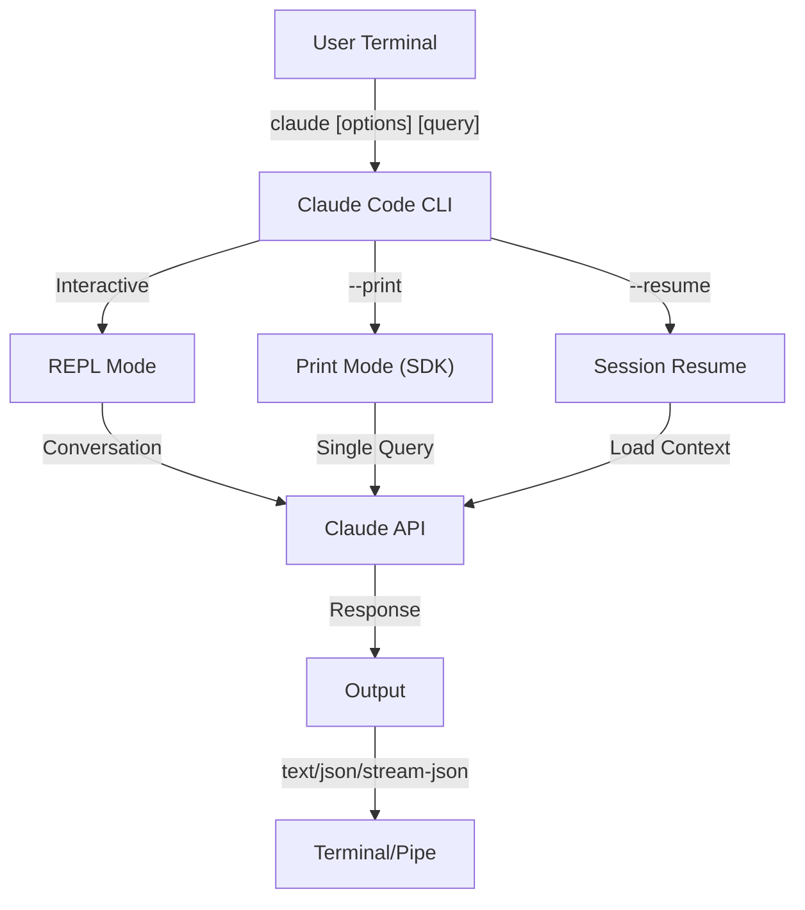
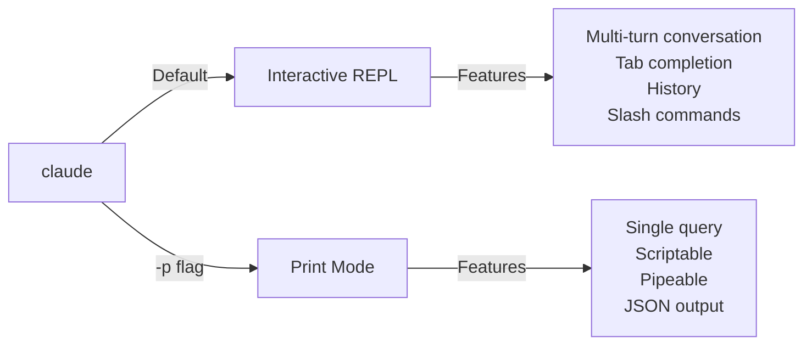

# 10. CLI 참조

## 개요

Claude Code CLI(Command Line Interface)는 Claude Code와 상호 작용하는 주요 방법입니다. 쿼리 실행, 세션 관리, 모델 구성, Claude를 개발 워크플로우에 통합하기 위한 강력한 옵션을 제공합니다.

**관련 가이드:**

- [Quickstart](10-cli.md#10-cli-05-quickstart)
- [Changelog](10-cli.md#10-cli-01-changelog)
- [Interactive Mode](10-cli.md#10-cli-04-interactive-mode)
- [Environment Variables](10-cli.md#10-cli-02-environment-variables)
- [도구 참고](10-cli.md#10-cli-06-도구-참고)
- [문제 해결](10-cli.md#10-cli-07-문제-해결)
- [오류 참고](10-cli.md#10-cli-03-오류-참고)

## 아키텍처



## CLI 명령어

| 명령어 | 설명 | 예시 |
|---------|-------------|---------|
| `claude` | 대화형 REPL 시작 | `claude` |
| `claude "query"` | 초기 프롬프트로 REPL 시작 | `claude "explain this project"` |
| `claude -p "query"` | Print mode - 쿼리 후 종료 | `claude -p "explain this function"` |
| `cat file \| claude -p "query"` | 파이프된 콘텐츠 처리 | `cat logs.txt \| claude -p "explain"` |
| `claude -c` | 가장 최근 대화 계속 | `claude -c` |
| `claude -c -p "query"` | Print mode에서 계속 | `claude -c -p "check for type errors"` |
| `claude -r "<session>" "query"` | ID 또는 이름으로 세션 재개 | `claude -r "auth-refactor" "finish this PR"` |
| `claude update` | 최신 버전으로 업데이트 | `claude update` |
| `claude mcp` | MCP 서버 구성 | [MCP 문서](05-mcp.md) 참조 |
| `claude mcp serve` | Claude Code를 MCP 서버로 실행 | `claude mcp serve` |
| `claude agents` | 구성된 모든 subagent 나열 | `claude agents` |
| `claude auto-mode defaults` | Auto mode 기본 규칙을 JSON으로 출력 | `claude auto-mode defaults` |
| `claude remote-control` | Remote Control 서버 시작 | `claude remote-control` |
| `claude plugin` | plugin 관리 (설치, 활성화, 비활성화) | `claude plugin install my-plugin` |
| `claude auth login` | 로그인 (`--email`, `--sso` 지원) | `claude auth login --email user@example.com` |
| `claude auth logout` | 현재 계정에서 로그아웃 | `claude auth logout` |
| `claude auth status` | 인증 상태 확인 (로그인 시 exit 0, 아닐 시 1) | `claude auth status` |
| `claude setup-token` | CI/스크립트용 장기 OAuth 토큰 생성. 토큰을 터미널에 출력하며 저장하지 않음. Claude 구독 필요 | `claude setup-token` |

## 핵심 플래그

| 플래그 | 설명 | 예시 |
|------|-------------|---------|
| `-p, --print` | 대화형 모드 없이 응답 출력 | `claude -p "query"` |
| `-c, --continue` | 가장 최근 대화 로드 | `claude --continue` |
| `-r, --resume` | ID 또는 이름으로 특정 세션 재개 | `claude --resume auth-refactor` |
| `-v, --version` | 버전 번호 출력 | `claude -v` |
| `-w, --worktree` | 격리된 git worktree에서 시작 | `claude -w` |
| `-n, --name` | 세션 표시 이름 | `claude -n "auth-refactor"` |
| `--from-pr <number>` | GitHub PR에 연결된 세션 재개 | `claude --from-pr 42` |
| `--remote "task"` | claude.ai에서 웹 세션 생성 | `claude --remote "implement API"` |
| `--remote-control, --rc` | Remote Control이 포함된 대화형 세션 | `claude --rc` |
| `--teleport` | 웹 세션을 로컬에서 재개 | `claude --teleport` |
| `--teammate-mode` | Agent team 표시 모드 | `claude --teammate-mode tmux` |
| `--bare` | 최소 모드 (hook, skill, plugin, MCP, 자동 메모리, CLAUDE.md 건너뜀) | `claude --bare` |
| ~~`--enable-auto-mode`~~ | ~~Auto 권한 모드 잠금 해제~~ (v2.1.111에서 제거됨, `--permission-mode auto` 사용) | `claude --permission-mode auto` |
| `--channels` | MCP 채널 플러그인 구독 | `claude --channels discord,telegram` |
| `--chrome` / `--no-chrome` | Chrome 브라우저 통합 활성화/비활성화 | `claude --chrome` |
| `--effort` | Thinking 노력 수준 설정 | `claude --effort high` |
| `--init` / `--init-only` | 초기화 hook 실행 | `claude --init` |
| `--maintenance` | 유지보수 hook 실행 후 종료 | `claude --maintenance` |
| `--disable-slash-commands` | 모든 skill 및 slash command 비활성화 | `claude --disable-slash-commands` |
| `--no-session-persistence` | 세션 저장 비활성화 (print mode) | `claude -p --no-session-persistence "query"` |
| `--verbose` | 상세 로깅 활성화 | `claude --verbose` |
| `--debug [categories]` | 디버그 로깅 활성화 (선택적 카테고리 필터) | `claude --debug api,hooks` |
| `--debug-file <path>` | 디버그 로그를 파일에 기록 | `claude --debug-file ./debug.log` |
| `--fork-session` | --resume과 함께 사용하여 세션 포크 | `claude -r "session" --fork-session` |
| `--tmux` | agent team의 tmux 표시 모드 설정 | `claude --tmux` |

### 대화형 모드 vs Print Mode



**대화형 모드** (기본):
```bash
# 대화형 세션 시작
claude

# 초기 프롬프트로 시작
claude "explain the authentication flow"
```

**Print Mode** (비대화형):
```bash
# 단일 쿼리 후 종료
claude -p "what does this function do?"

# 파일 내용 처리
cat error.log | claude -p "explain this error"

# 다른 도구와 체이닝
claude -p "list todos" | grep "URGENT"
```

## 모델 및 구성

| 플래그 | 설명 | 예시 |
|------|-------------|---------|
| `--model` | 모델 설정 (sonnet, opus, haiku 또는 전체 이름) | `claude --model opus` |
| `--fallback-model` | 과부하 시 자동 모델 폴백 | `claude -p --fallback-model sonnet "query"` |
| `--agent` | 세션에 사용할 agent 지정 | `claude --agent my-custom-agent` |
| `--agents` | JSON으로 사용자 정의 subagent 정의 | [Agent 구성](#agent-구성) 참조 |
| `--effort` | 노력 수준 설정 (low, medium, high, xhigh, max) | `claude --effort high` |

### 모델 선택 예제

```bash
# 복잡한 작업에 Opus 4.7 사용
claude --model opus "design a caching strategy"

# 빠른 작업에 Haiku 4.5 사용
claude --model haiku -p "format this JSON"

# 전체 모델 이름
claude --model claude-sonnet-4-6-20250929 "review this code"

# 안정성을 위한 폴백 포함
claude -p --model opus --fallback-model sonnet "analyze architecture"

# opusplan 사용 (Opus가 계획, Sonnet이 실행)
claude --model opusplan "design and implement the caching layer"
```

## 시스템 프롬프트 사용자 정의

| 플래그 | 설명 | 예시 |
|------|-------------|---------|
| `--system-prompt` | 전체 기본 프롬프트 교체 | `claude --system-prompt "You are a Python expert"` |
| `--system-prompt-file` | 파일에서 프롬프트 로드 (print mode) | `claude -p --system-prompt-file ./prompt.txt "query"` |
| `--append-system-prompt` | 기본 프롬프트에 추가 | `claude --append-system-prompt "Always use TypeScript"` |

### 시스템 프롬프트 예제

```bash
# 완전한 사용자 정의 페르소나
claude --system-prompt "You are a senior security engineer. Focus on vulnerabilities."

# 특정 지시사항 추가
claude --append-system-prompt "Always include unit tests with code examples"

# 파일에서 복잡한 프롬프트 로드
claude -p --system-prompt-file ./prompts/code-reviewer.txt "review main.py"
```

### 시스템 프롬프트 플래그 비교

| 플래그 | 동작 | 대화형 | Print |
|------|----------|-------------|-------|
| `--system-prompt` | 전체 기본 시스템 프롬프트 교체 | ✅ | ✅ |
| `--system-prompt-file` | 파일의 프롬프트로 교체 | ❌ | ✅ |
| `--append-system-prompt` | 기본 시스템 프롬프트에 추가 | ✅ | ✅ |

**`--system-prompt-file`은 print mode에서만 사용합니다. 대화형 모드에서는 `--system-prompt` 또는 `--append-system-prompt`를 사용하세요.**

## 도구 및 권한 관리

| 플래그 | 설명 | 예시 |
|------|-------------|---------|
| `--tools` | 사용 가능한 내장 도구 제한 | `claude -p --tools "Bash,Edit,Read" "query"` |
| `--allowedTools` | 프롬프트 없이 실행되는 도구 | `"Bash(git log:*)" "Read"` |
| `--disallowedTools` | 컨텍스트에서 제거되는 도구 | `"Bash(rm:*)" "Edit"` |
| `--dangerously-skip-permissions` | 모든 권한 프롬프트 건너뛰기 | `claude --dangerously-skip-permissions` |
| `--permission-mode` | 지정된 권한 모드에서 시작 | `claude --permission-mode auto` |
| `--permission-prompt-tool` | 권한 처리를 위한 MCP 도구 | `claude -p --permission-prompt-tool mcp_auth "query"` |
| ~~`--enable-auto-mode`~~ | ~~Auto 권한 모드 잠금 해제~~ (v2.1.111에서 제거됨, `--permission-mode auto` 사용) | `claude --permission-mode auto` |
| `--max-budget-usd <amount>` | 세션의 최대 비용 한도 설정 | `claude -p --max-budget-usd 5.00 "query"` |
| `--allow-dangerously-skip-permissions` | 다른 플래그가 권한을 우회할 수 있도록 허용 | `claude --allow-dangerously-skip-permissions` |

### 권한 예제

```bash
# 코드 리뷰를 위한 읽기 전용 모드
claude --permission-mode plan "review this codebase"

# 안전한 도구만으로 제한
claude --tools "Read,Grep,Glob" -p "find all TODO comments"

# 특정 git 명령어를 프롬프트 없이 허용
claude --allowedTools "Bash(git status:*)" "Bash(git log:*)"

# 위험한 작업 차단
claude --disallowedTools "Bash(rm -rf:*)" "Bash(git push --force:*)"
```

## 출력 및 형식

| 플래그 | 설명 | 옵션 | 예시 |
|------|-------------|---------|---------|
| `--output-format` | 출력 형식 지정 (print mode) | `text`, `json`, `stream-json` | `claude -p --output-format json "query"` |
| `--input-format` | 입력 형식 지정 (print mode) | `text`, `stream-json` | `claude -p --input-format stream-json` |
| `--verbose` | 상세 로깅 활성화 | | `claude --verbose` |
| `--include-partial-messages` | 스트리밍 이벤트 포함 | `stream-json` 필요 | `claude -p --output-format stream-json --include-partial-messages "query"` |
| `--json-schema` | 스키마에 맞는 검증된 JSON 가져오기 | | `claude -p --json-schema '{"type":"object"}' "query"` |
| `--max-budget-usd` | Print mode의 최대 지출 | | `claude -p --max-budget-usd 5.00 "query"` |
| `--json-schema <schema>` | 구조화된 출력을 위한 JSON 스키마 | | `claude -p --json-schema '{"type":"object"}' "query"` |
| `--append-system-prompt-file <path>` | 파일 내용을 시스템 프롬프트에 추가 | | `claude --append-system-prompt-file ./rules.txt` |
| `--max-turns <N>` | print mode에서 에이전트 턴 수 제한 | | `claude -p --max-turns 10 "query"` |
| `--input-format <format>` | 입력 형식: text 또는 stream-json | | `claude -p --input-format stream-json` |

### 출력 형식 예제

```bash
# 일반 텍스트 (기본)
claude -p "explain this code"

# 프로그래밍적 사용을 위한 JSON
claude -p --output-format json "list all functions in main.py"

# 실시간 처리를 위한 스트리밍 JSON
claude -p --output-format stream-json "generate a long report"

# 스키마 검증이 포함된 구조화된 출력
claude -p --json-schema '{"type":"object","properties":{"bugs":{"type":"array"}}}' \
  "find bugs in this code and return as JSON"
```

## 작업 공간 및 디렉토리

| 플래그 | 설명 | 예시 |
|------|-------------|---------|
| `--add-dir` | 추가 작업 디렉토리 추가 | `claude --add-dir ../apps ../lib` |
| `--setting-sources` | 쉼표로 구분된 설정 소스 | `claude --setting-sources user,project` |
| `--settings` | 파일 또는 JSON에서 설정 로드 | `claude --settings ./settings.json` |
| `--plugin-dir` | 디렉토리에서 plugin 로드 (반복 가능) | `claude --plugin-dir ./my-plugin` |
| `--mcp-config <path>` | MCP 서버 설정 파일 로드 | `claude --mcp-config ./mcp.json` |
| `--strict-mcp-config` | 지정된 MCP 설정만 사용, 나머지 무시 | `claude --strict-mcp-config` |
| `--session-id <id>` | 명시적 세션 ID 설정 | `claude --session-id "my-session"` |
| `--betas <features>` | 베타 기능 활성화 | `claude --betas feature1,feature2` |

### 다중 디렉토리 예제

```bash
# 여러 프로젝트 디렉토리에서 작업
claude --add-dir ../frontend ../backend ../shared "find all API endpoints"

# 사용자 정의 설정 로드
claude --settings '{"model":"opus","verbose":true}' "complex task"
```

## MCP 구성

| 플래그 | 설명 | 예시 |
|------|-------------|---------|
| `--mcp-config` | JSON에서 MCP 서버 로드 | `claude --mcp-config ./mcp.json` |
| `--strict-mcp-config` | 지정된 MCP 설정만 사용 | `claude --strict-mcp-config --mcp-config ./mcp.json` |
| `--channels` | MCP 채널 플러그인 구독 | `claude --channels discord,telegram` |

### MCP 예제

```bash
# GitHub MCP 서버 로드
claude --mcp-config ./github-mcp.json "list open PRs"

# Strict 모드 - 지정된 서버만 사용
claude --strict-mcp-config --mcp-config ./production-mcp.json "deploy to staging"
```

## 세션 관리

| 플래그 | 설명 | 예시 |
|------|-------------|---------|
| `--session-id` | 특정 세션 ID 사용 (UUID) | `claude --session-id "550e8400-..."` |
| `--fork-session` | 재개 시 새 세션 생성 | `claude --resume abc123 --fork-session` |

### 세션 예제

```bash
# 마지막 대화 계속
claude -c

# 이름이 지정된 세션 재개
claude -r "feature-auth" "continue implementing login"

# 실험을 위해 세션 분기
claude --resume feature-auth --fork-session "try alternative approach"

# 특정 세션 ID 사용
claude --session-id "550e8400-e29b-41d4-a716-446655440000" "continue"
```

### 세션 분기

실험을 위해 기존 세션에서 브랜치를 생성합니다:

```bash
# 다른 접근 방식을 시도하기 위해 세션 분기
claude --resume abc123 --fork-session "try alternative implementation"

# 사용자 정의 메시지로 분기
claude -r "feature-auth" --fork-session "test with different architecture"
```

**사용 사례:**
- 원본 세션을 잃지 않고 대안적 구현 시도
- 병렬로 다른 접근 방식 실험
- 성공한 작업에서 변형을 위한 브랜치 생성
- 메인 세션에 영향을 주지 않고 파괴적 변경 테스트

원본 세션은 변경되지 않으며, 분기된 세션은 새로운 독립 세션이 됩니다.

## 고급 기능

| 플래그 | 설명 | 예시 |
|------|-------------|---------|
| `--chrome` | Chrome 브라우저 통합 활성화 | `claude --chrome` |
| `--no-chrome` | Chrome 브라우저 통합 비활성화 | `claude --no-chrome` |
| `--ide` | IDE가 사용 가능하면 자동 연결 | `claude --ide` |
| `--max-turns` | 에이전트 턴 제한 (비대화형) | `claude -p --max-turns 3 "query"` |
| `--debug` | 필터링이 포함된 디버그 모드 활성화 | `claude --debug "api,mcp"` |
| `--enable-lsp-logging` | 상세 LSP 로깅 활성화 | `claude --enable-lsp-logging` |
| `--betas` | API 요청을 위한 베타 헤더 | `claude --betas interleaved-thinking` |
| `--plugin-dir` | 디렉토리에서 plugin 로드 (반복 가능) | `claude --plugin-dir ./my-plugin` |
| ~~`--enable-auto-mode`~~ | ~~Auto 권한 모드 잠금 해제~~ (v2.1.111에서 제거됨, `--permission-mode auto` 사용) | `claude --permission-mode auto` |
| `--effort` | Thinking 노력 수준 설정 | `claude --effort high` |
| `--bare` | 최소 모드 (hook, skill, plugin, MCP, 자동 메모리, CLAUDE.md 건너뜀) | `claude --bare` |
| `--channels` | MCP 채널 플러그인 구독 | `claude --channels discord` |
| `--tmux` | Worktree용 tmux 세션 생성 | `claude --tmux` |
| `--fork-session` | 재개 시 새 세션 ID 생성 | `claude --resume abc --fork-session` |
| `--max-budget-usd` | 최대 지출 (print mode) | `claude -p --max-budget-usd 5.00 "query"` |
| `--json-schema` | 검증된 JSON 출력 | `claude -p --json-schema '{"type":"object"}' "q"` |

### 고급 예제

```bash
# 자율 작업 제한
claude -p --max-turns 5 "refactor this module"

# API 호출 디버그
claude --debug "api" "test query"

# IDE 통합 활성화
claude --ide "help me with this file"
```

## Agent 구성

`--agents` 플래그는 세션에 대한 사용자 정의 subagent를 정의하는 JSON 객체를 받습니다.

### Agent JSON 형식

```json
{
  "agent-name": {
    "description": "Required: when to invoke this agent",
    "prompt": "Required: system prompt for the agent",
    "tools": ["Optional", "array", "of", "tools"],
    "model": "optional: sonnet|opus|haiku"
  }
}
```

**필수 필드:**
- `description` - 이 agent를 사용할 시기에 대한 자연어 설명
- `prompt` - agent의 역할과 동작을 정의하는 시스템 프롬프트

**선택 필드:**
- `tools` - 사용 가능한 도구 배열 (생략 시 모두 상속)
  - 형식: `["Read", "Grep", "Glob", "Bash"]`
- `model` - 사용할 모델: `sonnet`, `opus`, 또는 `haiku`

### 전체 Agent 예제

```json
{
  "code-reviewer": {
    "description": "Expert code reviewer. Use proactively after code changes.",
    "prompt": "You are a senior code reviewer. Focus on code quality, security, and best practices.",
    "tools": ["Read", "Grep", "Glob", "Bash"],
    "model": "sonnet"
  },
  "debugger": {
    "description": "Debugging specialist for errors and test failures.",
    "prompt": "You are an expert debugger. Analyze errors, identify root causes, and provide fixes.",
    "tools": ["Read", "Edit", "Bash", "Grep"],
    "model": "opus"
  },
  "documenter": {
    "description": "Documentation specialist for generating guides.",
    "prompt": "You are a technical writer. Create clear, comprehensive documentation.",
    "tools": ["Read", "Write"],
    "model": "haiku"
  }
}
```

### Agent 명령어 예제

```bash
# 인라인으로 사용자 정의 agent 정의
claude --agents '{
  "security-auditor": {
    "description": "Security specialist for vulnerability analysis",
    "prompt": "You are a security expert. Find vulnerabilities and suggest fixes.",
    "tools": ["Read", "Grep", "Glob"],
    "model": "opus"
  }
}' "audit this codebase for security issues"

# 파일에서 agent 로드
claude --agents "$(cat ~/.claude/agents.json)" "review the auth module"

# 다른 플래그와 결합
claude -p --agents "$(cat agents.json)" --model sonnet "analyze performance"
```

### Agent 우선순위

여러 agent 정의가 존재할 때, 다음 우선순위로 로드됩니다:
1. **CLI 정의** (`--agents` 플래그) - 세션별
2. **사용자 수준** (`~/.claude/agents/`) - 모든 프로젝트
3. **프로젝트 수준** (`.claude/agents/`) - 현재 프로젝트

CLI 정의 agent는 세션 동안 사용자 및 프로젝트 agent를 모두 재정의합니다.

---

## 고가치 사용 사례

### 1. CI/CD 통합

자동화된 코드 리뷰, 테스트, 문서화를 위해 CI/CD 파이프라인에서 Claude Code를 사용합니다.

**GitHub Actions 예제:**

```yaml
name: AI Code Review

on: [pull_request]

jobs:
  review:
    runs-on: ubuntu-latest
    steps:
      - uses: actions/checkout@v4

      - name: Install Claude Code
        run: npm install -g @anthropic-ai/claude-code

      - name: Run Code Review
        env:
          ANTHROPIC_API_KEY: ${{ secrets.ANTHROPIC_API_KEY }}
        run: |
          claude -p --output-format json \
            --max-turns 1 \
            "Review the changes in this PR for:
            - Security vulnerabilities
            - Performance issues
            - Code quality
            Output as JSON with 'issues' array" > review.json

      - name: Post Review Comment
        uses: actions/github-script@v7
        with:
          script: |
            const fs = require('fs');
            const review = JSON.parse(fs.readFileSync('review.json', 'utf8'));
            // Process and post review comments
```

**Jenkins Pipeline:**

```groovy
pipeline {
    agent any
    stages {
        stage('AI Review') {
            steps {
                sh '''
                    claude -p --output-format json \
                      --max-turns 3 \
                      "Analyze test coverage and suggest missing tests" \
                      > coverage-analysis.json
                '''
            }
        }
    }
}
```

### 2. 스크립트 파이핑

분석을 위해 파일, 로그, 데이터를 Claude를 통해 처리합니다.

**로그 분석:**

```bash
# 오류 로그 분석
tail -1000 /var/log/app/error.log | claude -p "summarize these errors and suggest fixes"

# 접근 로그에서 패턴 찾기
cat access.log | claude -p "identify suspicious access patterns"

# Git 이력 분석
git log --oneline -50 | claude -p "summarize recent development activity"
```

**코드 처리:**

```bash
# 특정 파일 리뷰
cat src/auth.ts | claude -p "review this authentication code for security issues"

# 문서 생성
cat src/api/*.ts | claude -p "generate API documentation in markdown"

# TODO 찾기 및 우선순위 지정
grep -r "TODO" src/ | claude -p "prioritize these TODOs by importance"
```

### 3. 다중 세션 워크플로우

여러 대화 스레드로 복잡한 프로젝트를 관리합니다.

```bash
# 기능 브랜치 세션 시작
claude -r "feature-auth" "let's implement user authentication"

# 나중에 세션 계속
claude -r "feature-auth" "add password reset functionality"

# 대안적 접근 방식을 시도하기 위해 분기
claude --resume feature-auth --fork-session "try OAuth instead"

# 다른 기능 세션으로 전환
claude -r "feature-payments" "continue with Stripe integration"
```

### 4. 사용자 정의 Agent 구성

팀의 워크플로우에 맞는 전문 agent를 정의합니다.

```bash
# Agent 설정을 파일에 저장
cat > ~/.claude/agents.json << 'EOF'
{
  "reviewer": {
    "description": "Code reviewer for PR reviews",
    "prompt": "Review code for quality, security, and maintainability.",
    "model": "opus"
  },
  "documenter": {
    "description": "Documentation specialist",
    "prompt": "Generate clear, comprehensive documentation.",
    "model": "sonnet"
  },
  "refactorer": {
    "description": "Code refactoring expert",
    "prompt": "Suggest and implement clean code refactoring.",
    "tools": ["Read", "Edit", "Glob"]
  }
}
EOF

# 세션에서 agent 사용
claude --agents "$(cat ~/.claude/agents.json)" "review the auth module"
```

### 5. 배치 처리

일관된 설정으로 여러 쿼리를 처리합니다.

```bash
# 여러 파일 처리
for file in src/*.ts; do
  echo "Processing $file..."
  claude -p --model haiku "summarize this file: $(cat $file)" >> summaries.md
done

# 배치 코드 리뷰
find src -name "*.py" -exec sh -c '
  echo "## $1" >> review.md
  cat "$1" | claude -p "brief code review" >> review.md
' _ {} \;

# 모든 모듈에 대한 테스트 생성
for module in $(ls src/modules/); do
  claude -p "generate unit tests for src/modules/$module" > "tests/$module.test.ts"
done
```

### 6. 보안 인식 개발

안전한 운영을 위해 권한 제어를 사용합니다.

```bash
# 읽기 전용 보안 감사
claude --permission-mode plan \
  --tools "Read,Grep,Glob" \
  "audit this codebase for security vulnerabilities"

# 위험한 명령어 차단
claude --disallowedTools "Bash(rm:*)" "Bash(curl:*)" "Bash(wget:*)" \
  "help me clean up this project"

# 제한된 자동화
claude -p --max-turns 2 \
  --allowedTools "Read" "Glob" \
  "find all hardcoded credentials"
```

### 7. JSON API 통합

`jq` 파싱을 사용하여 Claude를 도구의 프로그래밍 가능한 API로 활용합니다.

```bash
# 구조화된 분석 가져오기
claude -p --output-format json \
  --json-schema '{"type":"object","properties":{"functions":{"type":"array"},"complexity":{"type":"string"}}}' \
  "analyze main.py and return function list with complexity rating"

# jq와 통합하여 처리
claude -p --output-format json "list all API endpoints" | jq '.endpoints[]'

# 스크립트에서 사용
RESULT=$(claude -p --output-format json "is this code secure? answer with {secure: boolean, issues: []}" < code.py)
if echo "$RESULT" | jq -e '.secure == false' > /dev/null; then
  echo "Security issues found!"
  echo "$RESULT" | jq '.issues[]'
fi
```

### jq 파싱 예제

`jq`를 사용하여 Claude의 JSON 출력을 파싱하고 처리합니다:

```bash
# 특정 필드 추출
claude -p --output-format json "analyze this code" | jq '.result'

# 배열 요소 필터링
claude -p --output-format json "list issues" | jq -r '.issues[] | select(.severity=="high")'

# 여러 필드 추출
claude -p --output-format json "describe the project" | jq -r '.{name, version, description}'

# CSV로 변환
claude -p --output-format json "list functions" | jq -r '.functions[] | [.name, .lineCount] | @csv'

# 조건부 처리
claude -p --output-format json "check security" | jq 'if .vulnerabilities | length > 0 then "UNSAFE" else "SAFE" end'

# 중첩된 값 추출
claude -p --output-format json "analyze performance" | jq '.metrics.cpu.usage'

# 전체 배열 처리
claude -p --output-format json "find todos" | jq '.todos | length'

# 출력 변환
claude -p --output-format json "list improvements" | jq 'map({title: .title, priority: .priority})'
```

---

## 모델

Claude Code는 다양한 기능을 가진 여러 모델을 지원합니다:

| 모델 | ID | 컨텍스트 윈도우 | 참고 |
|-------|-----|----------------|-------|
| Opus 4.7 | `claude-opus-4-7` | 1M | 가장 강력, `xhigh` 노력 기본값, adaptive thinking |
| Opus 4.6 | `claude-opus-4-6` | 1M 토큰 | 적응형 노력 수준 |
| Sonnet 4.6 | `claude-sonnet-4-6` | 1M 토큰 | 속도와 성능의 균형 |
| Haiku 4.5 | `claude-haiku-4-5` | 1M 토큰 | 가장 빠름, 빠른 작업에 최적 |

### 모델 선택

```bash
# 짧은 이름 사용
claude --model opus "complex architectural review"
claude --model sonnet "implement this feature"
claude --model haiku -p "format this JSON"

# opusplan 별칭 사용 (Opus가 계획, Sonnet이 실행)
claude --model opusplan "design and implement the API"

# 세션 중 빠른 모드 토글
/fast
```

### 모델 별칭 (Model Aliases)

| Alias | 설명 |
|-------|------|
| `opus` | 최신 Opus 모델 (현재 claude-opus-4-7) |
| `sonnet` | 최신 Sonnet 모델 (현재 claude-sonnet-4-6) |
| `haiku` | 최신 Haiku 모델 (현재 claude-haiku-4-5) |
| `opusplan` | Opus로 계획 수립, Sonnet으로 실행 |

### 업그레이드 채널 (Upgrade Channels)

기본 Opus 모델 ID를 환경 변수로 고정할 수 있습니다:

```bash
export ANTHROPIC_DEFAULT_OPUS_MODEL=claude-opus-4-7
```

### 노력 수준 (Effort Levels)

```bash
# CLI 플래그로 노력 수준 설정
claude --effort high "complex review"

# Slash command로 노력 수준 설정
/effort high

# 환경 변수로 노력 수준 설정
export CLAUDE_CODE_EFFORT_LEVEL=high   # low, medium, high, xhigh (Opus 4.7 기본값), or max
```

프롬프트에서 "ultrathink" 키워드가 딥 추론을 활성화합니다. `xhigh` 노력 수준은 Opus 4.7의 기본값이며, `max`는 모든 최신 모델에서 지원됩니다.

---

## 주요 환경 변수

| 변수 | 설명 |
|----------|-------------|
| `ANTHROPIC_API_KEY` | 인증을 위한 API 키 |
| `ANTHROPIC_MODEL` | 기본 모델 재정의 |
| `ANTHROPIC_CUSTOM_MODEL_OPTION` | API용 사용자 정의 모델 옵션 |
| `ANTHROPIC_DEFAULT_OPUS_MODEL` | 기본 Opus 모델 ID 재정의 |
| `ANTHROPIC_DEFAULT_SONNET_MODEL` | 기본 Sonnet 모델 ID 재정의 |
| `ANTHROPIC_DEFAULT_HAIKU_MODEL` | 기본 Haiku 모델 ID 재정의 |
| `MAX_THINKING_TOKENS` | Extended thinking 토큰 예산 설정 |
| `CLAUDE_CODE_EFFORT_LEVEL` | 노력 수준 설정 (`low`/`medium`/`high`/`max`) |
| `CLAUDE_CODE_SIMPLE` | 최소 모드, `--bare` 플래그로 설정 |
| `CLAUDE_CODE_DISABLE_AUTO_MEMORY` | 자동 CLAUDE.md 업데이트 비활성화 |
| `CLAUDE_CODE_DISABLE_BACKGROUND_TASKS` | Background task 실행 비활성화 |
| `CLAUDE_CODE_DISABLE_CRON` | 예약/cron 작업 비활성화 |
| `CLAUDE_CODE_DISABLE_GIT_INSTRUCTIONS` | Git 관련 안내 비활성화 |
| `CLAUDE_CODE_DISABLE_TERMINAL_TITLE` | 터미널 제목 업데이트 비활성화 |
| `CLAUDE_CODE_DISABLE_1M_CONTEXT` | 1M 토큰 컨텍스트 윈도우 비활성화 |
| `CLAUDE_CODE_DISABLE_NONSTREAMING_FALLBACK` | 비스트리밍 폴백 비활성화 |
| `CLAUDE_CODE_ENABLE_TASKS` | Task list 기능 활성화 |
| `CLAUDE_CODE_TASK_LIST_ID` | 세션 간 공유되는 이름이 지정된 작업 디렉토리 |
| `CLAUDE_CODE_ENABLE_PROMPT_SUGGESTION` | 프롬프트 제안 토글 (`true`/`false`) |
| `CLAUDE_CODE_EXPERIMENTAL_AGENT_TEAMS` | 실험적 agent teams 활성화 |
| `CLAUDE_CODE_NEW_INIT` | 새 초기화 플로우 사용 |
| `CLAUDE_CODE_SUBAGENT_MODEL` | Subagent 실행 모델 |
| `CLAUDE_CODE_PLUGIN_SEED_DIR` | Plugin 시드 파일 디렉토리 |
| `CLAUDE_CODE_SUBPROCESS_ENV_SCRUB` | 서브프로세스에서 제거할 환경 변수 |
| `CLAUDE_AUTOCOMPACT_PCT_OVERRIDE` | 자동 압축 비율 재정의 |
| `CLAUDE_STREAM_IDLE_TIMEOUT_MS` | 스트림 유휴 타임아웃 (밀리초) |
| `SLASH_COMMAND_TOOL_CHAR_BUDGET` | Slash command 도구 문자 예산 |
| `ENABLE_TOOL_SEARCH` | 도구 검색 기능 활성화 |
| `MAX_MCP_OUTPUT_TOKENS` | MCP 도구 출력 최대 토큰 |

---

## 빠른 참조

### 가장 많이 사용되는 명령어

```bash
# 대화형 세션
claude

# 빠른 질문
claude -p "how do I..."

# 대화 계속
claude -c

# 파일 처리
cat file.py | claude -p "review this"

# 스크립트용 JSON 출력
claude -p --output-format json "query"
```

### 플래그 조합

| 사용 사례 | 명령어 |
|----------|---------|
| 빠른 코드 리뷰 | `cat file | claude -p "review"` |
| 구조화된 출력 | `claude -p --output-format json "query"` |
| 안전한 탐색 | `claude --permission-mode plan` |
| 안전 가드레일이 있는 자율 작업 | `claude --permission-mode auto` |
| CI/CD 통합 | `claude -p --max-turns 3 --output-format json` |
| 작업 재개 | `claude -r "session-name"` |
| 사용자 정의 모델 | `claude --model opus "complex task"` |
| 최소 모드 | `claude --bare "quick query"` |
| 예산 제한 실행 | `claude -p --max-budget-usd 2.00 "analyze code"` |

---

## 문제 해결

### 명령어를 찾을 수 없음

**문제:** `claude: command not found`

**해결 방법:**
- Claude Code 설치: `npm install -g @anthropic-ai/claude-code`
- PATH에 npm 전역 bin 디렉토리가 포함되어 있는지 확인
- 전체 경로로 실행 시도: `npx claude`

### API 키 문제

**문제:** 인증 실패

**해결 방법:**
- API 키 설정: `export ANTHROPIC_API_KEY=your-key`
- 키가 유효하고 충분한 크레딧이 있는지 확인
- 요청한 모델에 대한 키 권한 확인

### 세션을 찾을 수 없음

**문제:** 세션을 재개할 수 없음

**해결 방법:**
- 사용 가능한 세션 목록을 확인하여 올바른 이름/ID 찾기
- 세션이 비활성 기간 후 만료되었을 수 있음
- 가장 최근 세션을 계속하려면 `-c` 사용

### 출력 형식 문제

**문제:** JSON 출력이 올바르지 않음

**해결 방법:**
- `--json-schema`를 사용하여 구조 강제
- 프롬프트에 명시적인 JSON 지시사항 추가
- `--output-format json` 사용 (프롬프트에서 JSON을 요청하는 것만으로는 부족)

### 권한 거부

**문제:** 도구 실행이 차단됨

**해결 방법:**
- `--permission-mode` 설정 확인
- `--allowedTools` 및 `--disallowedTools` 플래그 검토
- 자동화에는 `--dangerously-skip-permissions` 사용 (주의하여)

---

## 추가 리소스

- **[공식 CLI 참조](https://code.claude.com/docs/ko/cli-reference)** - 전체 명령어 참조
- **[Headless 모드 문서](https://code.claude.com/docs/ko/headless)** - 자동화 실행
- **[Slash Command](01-slash-commands.md)** - Claude 내 사용자 정의 단축키
- **[메모리 가이드](02-memory.md)** - CLAUDE.md를 통한 영구 컨텍스트
- **[MCP 프로토콜](05-mcp.md)** - 외부 도구 통합
- **[고급 기능](09-advanced-features.md)** - Plan mode, extended thinking
- **[Subagent 가이드](04-subagents.md)** - 위임 작업 실행

---


---

---

<a id="10-cli-01-changelog"></a>

## 10-01. Changelog

이 문서는 공식 Claude Code changelog를 빠르게 읽기 위한 실전 가이드입니다. 전체 upstream 릴리스 이력을 그대로 복제하지는 않습니다.

### 공식 changelog가 무엇인가

Anthropic은 버전별 릴리스 노트를 공식 changelog 페이지에 게시합니다. 공식 문서에 따르면 이 페이지는 GitHub의 `CHANGELOG.md`에서 생성되며, CLI 안에서는 `/release-notes`로 같은 흐름을 확인할 수 있습니다.

공식 문서가 권장하는 두 가지 빠른 확인:

- `claude --version`으로 현재 설치 버전 확인
- `/release-notes`로 Claude Code 안에서 변경사항 열기

### 효율적으로 읽는 방법

세 단계로 보면 됩니다.

1. 내 설치 버전을 확인하고
2. 그 위쪽 최신 항목을 훑고
3. 내가 많이 쓰는 기능 중심으로 다시 본다

특히 유용한 관찰 포인트:

- 세션 로딩과 `/resume`
- plugin 및 MCP 시작 속도
- 권한과 sandbox 수정
- UI/터미널 렌더링 수정
- web, remote, review 관련 변경

### 최신 주요 항목

현재 공식 changelog 페이지 기준 최신 항목은 다음과 같습니다.

#### `2.1.116` — 2026년 4월 20일

중요한 변화:

- 큰 세션에서 `/resume`이 훨씬 빨라짐
- 여러 stdio MCP 서버 사용 시 시작 속도 개선
- VS Code 계열 터미널의 fullscreen scrolling 개선
- plugin reload/auto-update가 누락된 의존성을 자동 설치할 수 있게 됨
- 보안 및 터미널 동작 관련 수정 다수 포함

긴 세션, plugin-heavy 환경, IDE 통합 터미널을 많이 쓴다면 특히 볼 가치가 큽니다.

#### `2.1.114` — 2026년 4월 18일

- agent teams teammate 권한 요청 시 발생하던 permission dialog crash 수정

멀티에이전트 워크플로를 쓰는 팀에게는 작은 항목이지만 중요합니다.

#### `2.1.113` — 2026년 4월 17일

주요 내용:

- CLI가 번들 JavaScript 대신 네이티브 Claude Code 바이너리를 실행
- `sandbox.network.deniedDomains` 추가
- `/ultrareview` 개선
- `/loop` wakeup 동작 개선
- Bash allow/deny 규칙 관련 보안 수정 다수

sandbox 정책, review 워크플로, shell safety에 민감하다면 이 항목을 자세히 읽는 편이 좋습니다.

### 언제 weekly digest를 볼까

changelog는 버전 단위의 정확한 변화 확인용입니다. 모든 수정이 아니라 "무엇이 내 작업 방식을 바꾸는가"를 보고 싶다면 WHATS-NEW.md 또는 공식 weekly digest가 더 적합합니다.

정리하면:

- changelog: 정확한 버전 변화
- weekly digest: 중요한 기능 변화와 데모

### 운영상 조언

- "최근에 뭔가 바뀐 것 같다"면 먼저 changelog를 확인합니다
- 장애나 버그 리포트에는 설치 버전을 같이 남깁니다
- 저장소 문제라고 단정하기 전에 최신 fix와 증상을 대조합니다
- Bash 규칙, plugin, sandbox를 많이 쓴다면 보안 fix를 더 주의 깊게 봅니다

### 관련 가이드

- [Quickstart](10-cli.md#10-cli-05-quickstart)
- [문제 해결](10-cli.md#10-cli-07-문제-해결)
- [오류 참고](10-cli.md#10-cli-03-오류-참고)
- What's New

### 공식 출처

- [Claude Code changelog](https://code.claude.com/docs/ko/changelog)

---

<a id="10-cli-02-environment-variables"></a>

## 10-02. Environment Variables

환경 변수는 설정 파일을 편집하지 않고 Claude Code 동작을 바꾸는 가장 빠른 방법입니다.

### 어디에 설정할까

공식 문서는 두 가지 주요 경로를 지원합니다.

- `claude` 실행 전에 셸에서 export
- `settings.json`의 `env` 키 아래에 선언

임시 오버라이드는 셸 export, 지속 기본값은 `settings.json`이 더 적합합니다.

### 가장 중요한 변수군

변수는 많지만, 실무적으로 자주 건드리는 묶음은 몇 가지로 압축됩니다.

#### 인증과 라우팅

- `ANTHROPIC_API_KEY`
- `ANTHROPIC_AUTH_TOKEN`
- `ANTHROPIC_BASE_URL`
- `CLAUDE_CODE_USE_BEDROCK`, `CLAUDE_CODE_USE_VERTEX`, `CLAUDE_CODE_USE_FOUNDRY`

이 변수들이 요청 대상과 인증 경로를 결정합니다.

#### 세션과 컨텍스트 동작

- `CLAUDE_AUTOCOMPACT_PCT_OVERRIDE`
- `CLAUDE_CODE_SKIP_PROMPT_HISTORY`
- `CLAUDE_CODE_FILE_READ_MAX_OUTPUT_TOKENS`
- `CLAUDE_CODE_ENABLE_TASKS`

세션이 커질 때나, 스크립트 실행을 최대한 휘발성으로 만들고 싶을 때 중요합니다.

#### 보안과 격리

- `CLAUDE_CODE_SUBPROCESS_ENV_SCRUB`
- `CLAUDE_CODE_DISABLE_FILE_CHECKPOINTING`
- `CLAUDE_CODE_DISABLE_GIT_INSTRUCTIONS`
- 각종 sandbox 및 provider auth skip 관련 변수

신뢰 경계가 중요한 환경이라면 가장 먼저 감사해야 할 변수들입니다.

#### 기능 플래그

- `CLAUDE_CODE_EXPERIMENTAL_AGENT_TEAMS`
- `CLAUDE_CODE_USE_POWERSHELL_TOOL`
- `CLAUDE_CODE_ENABLE_TELEMETRY`

미리보기 기능이나 인프라 통합을 여는 경우가 많습니다.

### 실전 예시

임시 API 키 오버라이드:

```bash
export ANTHROPIC_API_KEY=sk-ant-...
claude
```

agent teams 활성화:

```bash
export CLAUDE_CODE_EXPERIMENTAL_AGENT_TEAMS=1
claude
```

휘발성 세션에서 transcript 저장 끄기:

```bash
export CLAUDE_CODE_SKIP_PROMPT_HISTORY=1
claude -p "summarize this diff"
```

### 흔한 실수

- env var가 파일 설정을 덮는다는 점을 놓치는 것
- 임시 인증 변수를 너무 오래 export해 두는 것
- subprocess scrubbing이 켜진 상태에서 자식 프로세스도 같은 변수를 볼 거라고 생각하는 것
- proxy/gateway 변수를 제공자 프로토콜과 맞지 않게 쓰는 것

### 관련 가이드

- [Configuration](09-advanced-features.md#09-advanced-features-08-configuration)
- [문제 해결](10-cli.md#10-cli-07-문제-해결)
- [Authentication and IAM](11-deployment-admin.md#11-deployment-admin-02-인증-및-iam)

### 공식 출처

- [Environment variables](https://code.claude.com/docs/ko/env-vars)

---

<a id="10-cli-03-오류-참고"></a>

## 10-03. 오류 참고

이 문서는 Claude Code가 이미 실행 중일 때 나타나는 런타임 오류를 다룹니다. 설치 중 PATH 문제, 바이너리 문제, TLS 문제는 문제 해결 문서를 보세요.

### 자동 재시도

Claude Code는 일시적 실패를 바로 보여주지 않고 먼저 여러 번 재시도합니다. 서버 오류, 과부하 응답, 요청 시간 초과, 일시적 429 제한, 연결 끊김은 지수 백오프로 다시 시도됩니다.

조절 가능한 환경 변수는 다음과 같습니다.

```text
CLAUDE_CODE_MAX_RETRIES
API_TIMEOUT_MS
```

### 서버 오류

#### `API Error: 500 Internal server error`

Anthropic 쪽 내부 오류입니다. 프롬프트나 계정 문제는 아닙니다. `status.claude.com`을 확인하고 잠시 후 다시 시도하세요. 계속되면 `/feedback`을 사용하세요.

#### `API Error: Repeated 529 Overloaded errors`

API가 일시적으로 포화 상태입니다. 몇 분 뒤 다시 시도하고, 필요하면 `/model`로 다른 모델로 바꾸세요.

#### `Request timed out`

요청이 제한 시간 안에 끝나지 못했습니다. 다시 시도하거나 작업을 더 작은 단위로 나누세요. 네트워크가 느리면 `API_TIMEOUT_MS`를 늘릴 수 있습니다.

#### Auto mode가 작업 안전성을 판단하지 못함

분류 모델이 과부하되면 Auto mode는 무작정 승인하지 않고 작업을 막습니다. 잠시 뒤 다시 시도하세요.

### 사용 한도

#### `You’ve hit your session limit`

플랜의 누적 사용 한도를 다 썼습니다. 메시지에 나온 리셋 시각까지 기다리거나, `/usage`와 `/extra-usage`로 상태를 확인하세요.

#### `Server is temporarily limiting requests`

이건 일시적 throttling입니다. 잠깐 기다렸다가 다시 시도하세요.

#### `Request rejected (429)`

키, Bedrock 프로젝트, Vertex 프로젝트에 연결된 rate limit에 걸렸습니다. `/status`를 확인하고 동시성을 줄이세요.

#### `Credit balance is too low`

Console 조직의 선불 크레딧이 부족합니다. 크레딧을 충전하거나 `/login`으로 구독 기반 인증을 사용하세요.

### 인증 오류

#### `Not logged in`

`/login`을 실행하세요. 환경 변수 기반 인증을 기대했다면, Claude Code를 실행한 셸에 `ANTHROPIC_API_KEY`가 export되어 있는지 확인하세요.

#### `Invalid API key`

`ANTHROPIC_API_KEY` 또는 `apiKeyHelper`가 돌려준 키가 거부되었습니다. 변수를 제거하고 다시 실행한 뒤 `/status`로 활성 자격 증명을 확인하세요.

#### `This organization has been disabled`

오래된 API 키가 구독 로그인보다 우선하는 경우가 많습니다. 현재 셸과 셸 프로필에서 `ANTHROPIC_API_KEY`를 제거하세요.

#### `OAuth token revoked` 또는 `OAuth token has expired`

다시 `/login` 하세요. 같은 세션에서 반복되면 먼저 `/logout`으로 완전히 지운 뒤 `/login` 하세요.

#### `does not meet scope requirement user:profile`

저장된 토큰이 현재 기능에 필요한 scope보다 오래되었습니다. `/login`으로 새 토큰을 발급받으세요.

### 네트워크와 연결 오류

#### `Unable to connect to API`

API에 아예 도달하지 못했습니다. 같은 셸에서 연결을 확인하세요.

```bash
curl -I https://api.anthropic.com
```

프록시를 쓰면 `HTTPS_PROXY`를 설정하고, LLM gateway나 relay를 쓰면 base URL 설정도 확인하세요.

#### `SSL certificate verification failed`

프록시나 TLS 검사 장비가 Node가 신뢰하지 않는 인증서를 내보내고 있습니다. `NODE_EXTRA_CA_CERTS`로 조직의 CA 번들을 지정하고, 전역 TLS 검증 비활성화는 피하세요.

### 요청 오류

#### `Prompt is too long`

대화와 첨부 파일이 모델 컨텍스트 창을 넘었습니다. `/compact`, `/clear`, `/context`를 사용하고, 쓰지 않는 MCP 서버는 줄이세요.

#### `Error during compaction: Conversation too long`

`/compact` 자체가 들어갈 공간이 부족합니다. Esc를 두 번 눌러 몇 턴 뒤로 가고 다시 compact 하세요. 그래도 부족하면 `/clear`로 새 세션을 시작하세요.

#### `Request too large`

원시 요청 본문이 API 바이트 제한을 넘었습니다. 큰 파일을 붙여넣지 말고 경로로 참조하세요.

#### `Image was too large`

첨부한 이미지가 크기나 해상도 제한을 넘었습니다. 더 작은 크롭본이나 리사이즈한 이미지를 사용하세요.

#### `PDF too large` 또는 `PDF is password protected`

PDF를 분할하거나 보호를 해제하거나 텍스트를 추출한 뒤 다시 시도하세요.

#### `Extra inputs are not permitted`

프록시나 gateway가 `anthropic-beta` 헤더를 제거했습니다. 헤더를 그대로 전달하도록 고치거나, 필요하면 베타 의존 기능을 끄세요.

#### `There’s an issue with the selected model`

모델 이름이 잘못됐거나 현재 계정에 권한이 없습니다. `/model`로 사용할 수 있는 모델을 고르고, `--model`, `ANTHROPIC_MODEL`, 설정 파일에서 오래된 ID가 있는지 확인하세요.

#### `Claude Opus is not available with the Claude Pro plan`

플랜에 포함된 모델로 바꾸세요. 최근 업그레이드했다면 `/logout` 후 `/login`으로 다시 인증해야 새 권한이 반영됩니다.

#### `thinking.type.enabled is not supported for this model`

Claude Code 버전이 모델 설정 요구사항보다 오래되었습니다. 업데이트하고 다시 시작하거나, 더 오래된 모델을 고르세요.

#### `Thinking budget exceeds output limit`

thinking budget이 응답 길이보다 커서 답변 공간이 없어졌습니다. `MAX_THINKING_TOKENS`를 낮추거나 출력 한도를 올리세요.

#### `API Error: 400 due to tool use concurrency issues`

중간에 tool call이 끊기거나 중간 편집이 일어나 대화 기록이 꼬였습니다. `/rewind`로 체크포인트 이전으로 돌아가 다시 진행하세요.

### 에러 없이 품질만 나빠질 때

오류는 안 뜨는데 답변이 갑자기 이상하면 다음을 먼저 확인하세요.

- `/model`로 모델 확인
- `/effort`로 reasoning level 확인
- `/context`로 컨텍스트 압박 확인
- `/compact` 또는 `/clear`로 오래된 기록 정리
- `/rewind`로 잘못된 턴 되돌리기

큰 `CLAUDE.md`, 사용하지 않는 MCP 서버, 오래된 지시문이 흔한 원인입니다.

### 보고

여기에 없는 오류이거나 복구 방법이 안 통하면 `/feedback`을 사용하세요. 컴포넌트별 오류는 해당 문서를 따르세요.

- MCP 서버 연결 또는 인증 실패: MCP 문서
- hook 실패: hooks 문서
- 설치나 파일시스템 문제: 문제 해결 문서

### 공식 출처

- https://code.claude.com/docs/ko/errors
- https://code.claude.com/docs/ko/troubleshooting
- https://code.claude.com/docs/ko/settings
- https://code.claude.com/docs/ko/mcp
- https://code.claude.com/docs/ko/permissions

---

<a id="10-cli-04-interactive-mode"></a>

## 10-04. Interactive Mode

Interactive mode는 `claude`를 `-p` 없이 실행했을 때의 전체 터미널 작업 공간입니다.

### 무엇을 다루는가

공식 interactive-mode 문서는 다음을 다룹니다.

- 키보드 단축키
- 멀티라인 입력
- 명령 검색
- transcript viewer
- background Bash task
- prompt suggestion
- task list
- 푸터의 PR 상태
- vim 스타일 편집

이 문서는 그중 실무적으로 자주 쓰는 동작을 압축한 요약입니다.

### 핵심 입력 패턴

프롬프트에서:

- `/`는 commands와 skills
- `!`는 Bash mode
- `@`는 파일 경로 자동완성

대부분의 일상 작업은 이 세 진입점으로 시작합니다.

### 멀티라인 입력

공식 문서는 여러 방식을 제시합니다.

- `\` + `Enter`
- macOS의 `Option+Enter`
- 지원되는 터미널의 `Shift+Enter`
- `Ctrl+J`
- 로그나 코드 블록은 그대로 paste

터미널이 `Shift+Enter`를 기본 지원하지 않으면 `/terminal-setup`을 실행합니다.

### 키보드 기능

특히 중요한 기능:

- 히스토리 기반 command search
- transcript viewer
- task list toggle
- Bash 작업 백그라운드 전환
- `/config`를 통한 vim editor mode

단축키 목록을 외우는 것보다, 이 세션을 단순 REPL이 아니라 작업 공간으로 보는 습관이 더 중요합니다.

### Background Bash Tasks

Claude Code는 Bash 명령을 백그라운드로 돌릴 수 있어서, 긴 명령이 실행되는 동안에도 대화를 계속할 수 있습니다.

실전 경로는 두 가지입니다.

- Claude에게 백그라운드 실행을 요청
- Bash tool 실행 중 `Ctrl+B`로 백그라운드 전환

백그라운드 작업 출력은 파일로 저장되고, Claude가 나중에 다시 읽을 수 있습니다.

### Prompt Suggestions

프롬프트 입력창에는 흐릿한 추천 후속 명령이 나타날 수 있습니다. 기준은:

- 최근 git 이력
- 현재 대화 흐름
- 다음에 할 가능성이 큰 작업

시간을 아껴주면 쓰고, 집중을 방해하면 끄면 됩니다.

### Task List

복잡한 작업에서는 Claude가 compaction 이후에도 유지되는 task list를 관리할 수 있습니다.

중요한 동작:

- `Ctrl+T`로 표시/숨김
- pending, in-progress, complete 상태 표시
- `CLAUDE_CODE_TASK_LIST_ID`로 여러 세션 간 공유 가능

### 푸터의 PR 상태

열린 PR이 있는 브랜치에서 `gh`가 설치·인증되어 있으면, Claude Code는 푸터에 PR 상태를 직접 보여줄 수 있습니다.

공식 문서가 설명하는 대표 상태:

- approved
- pending review
- changes requested
- draft
- merged

### 언제 interactive mode가 맞는가

다음이면 interactive mode가 좋습니다.

- 여러 턴이 필요할 수 있다
- 수정 전에 탐색이 필요하다
- 승인과 task tracking이 중요하다
- 사람이 실시간으로 방향을 잡아야 한다

한 번 실행하고 끝나는 automation은 `-p` non-interactive mode가 더 맞습니다.

### 관련 가이드

- [CLI Reference](10-cli.md)
- [Quickstart](10-cli.md#10-cli-05-quickstart)
- [Terminal Configuration](09-advanced-features.md#09-advanced-features-29-terminal-configuration)

### 공식 출처

- [Interactive mode](https://code.claude.com/docs/ko/interactive-mode)

---

<a id="10-cli-05-quickstart"></a>

## 10-05. Quickstart

이 문서는 공식 Claude Code quickstart를 터미널 사용자 관점으로 압축한 첫 실행 가이드입니다. 전체 CLI 레퍼런스를 읽기 전에 빠르게 시작하고 싶다면 여기부터 보는 편이 좋습니다.

### 시작 전 준비

먼저 다음을 준비합니다.

- 명령을 실행할 수 있는 터미널 또는 셸
- 작업할 코드 프로젝트나 저장소
- 다음 중 하나의 계정 경로:
  - Claude Pro, Max, Team, Enterprise 구독
  - Claude Console 계정과 API 과금
  - Bedrock, Vertex AI, Microsoft Foundry 같은 지원 공급자 경로

Windows를 WSL 없이 네이티브로 사용할 예정이라면 Git for Windows를 먼저 설치합니다.

### 1단계: Claude Code 설치

권장 네이티브 설치 방법:

```sh
## macOS, Linux, WSL
curl -fsSL https://claude.ai/install.sh | bash

## Windows PowerShell
irm https://claude.ai/install.ps1 | iex
```

대안 패키지 매니저:

```sh
brew install --cask claude-code
winget install Anthropic.ClaudeCode
```

설치 시 알아둘 점:

- 네이티브 설치는 백그라운드 자동 업데이트를 사용합니다.
- `brew`, `winget` 설치는 수동 업그레이드가 필요합니다.
- Homebrew의 `claude-code`는 stable 채널, `claude-code@latest`는 latest 채널을 추적합니다.

### 2단계: 로그인

처음 한 번 Claude Code를 실행하고 로그인 흐름을 완료합니다.

```sh
claude
```

대화형 세션 안에서는 다음 명령으로도 로그인할 수 있습니다.

```text
/login
```

지원되는 로그인 경로:

- Claude 구독 계정
- Claude Console 계정
- Bedrock, Vertex AI, Foundry 기반 클라우드 인증

현재 어떤 계정이 활성화되었는지는 `/status`로 확인합니다.

### 3단계: 첫 세션 시작

프로젝트 디렉터리에서 Claude Code를 실행합니다.

```sh
cd /path/to/project
claude
```

처음에 자주 쓰는 명령:

```text
/help
/resume
/status
```

### 4단계: 코드베이스 탐색 질문하기

바로 수정보다 먼저 저장소 이해 질문부터 던지는 편이 좋습니다.

```text
what does this project do?
what technologies does this project use?
where is the main entry point?
explain the folder structure
```

Claude Code는 필요할 때 프로젝트 파일을 읽기 때문에, 대부분의 경우 긴 문맥을 직접 붙여넣을 필요가 없습니다.

### 5단계: 작은 수정부터 시도하기

처음에는 범위가 작은 변경이 적합합니다.

```text
add a hello world function to the main file
```

일반적인 흐름:

1. Claude가 관련 파일을 찾습니다.
2. 수정안을 제안합니다.
3. 사용자가 승인하거나 거부합니다.
4. Claude가 편집을 적용합니다.

권한 프롬프트는 정상 동작입니다. 더 세밀한 제어는 [Permissions and Security](09-advanced-features.md#09-advanced-features-21-권한-보안)를 참고하면 됩니다.

### 6단계: Git 작업을 대화형으로 처리하기

자주 쓰는 Git 프롬프트:

```text
what files have I changed?
commit my changes with a descriptive message
create a new branch called feature/quickstart
show me the last 5 commits
help me resolve merge conflicts
```

Claude Code가 Git 상태를 읽고 명령을 제안할 수는 있지만, 브랜치 이름, 커밋 메시지, 충돌 해결 결과는 항상 직접 검토하는 편이 안전합니다.

### 7단계: 버그 수정이나 기능 추가 요청하기

원하는 작업을 자연어로 설명합니다.

```text
there's a bug where users can submit empty forms - fix it
```

또는:

```text
add input validation to the user registration form
```

더 잘 작동하게 하려면:

- 증상, 범위, 기대 결과를 함께 적고
- 이미 알고 있는 관련 파일이나 모듈을 지정하고
- 정확성이 중요하면 테스트도 같이 요청합니다

### 핵심 명령

| 명령 | 용도 |
|---|---|
| `claude` | 대화형 모드 시작 |
| `claude "task"` | 초기 프롬프트와 함께 세션 시작 |
| `claude -p "query"` | print mode로 한 번 실행하고 종료 |
| `claude -c` | 가장 최근 대화 계속 |
| `claude -r <session>` | 이름 또는 ID로 세션 재개 |
| `/help` | 사용 가능한 슬래시 명령 보기 |
| `/clear` | 현재 대화 문맥 비우기 |
| `exit` 또는 `Ctrl+D` | Claude Code 종료 |

### 초보자 팁

- "fix the bug"보다 "잘못된 자격 증명 입력 후 빈 화면이 뜨는 로그인 버그를 고쳐라"처럼 구체적으로 적는 편이 낫습니다.
- 큰 작업은 단계로 나눠 지시합니다.
- 처음 보는 코드베이스에서는 수정 전에 먼저 분석을 시킵니다.
- Tab 완성, 명령 기록, `/` 명령 검색을 활용하면 속도가 크게 빨라집니다.

### 다음에 읽을 문서

- [CLI 참조](10-cli.md)
- [도구 참고](10-cli.md#10-cli-06-도구-참고)
- [문제 해결](10-cli.md#10-cli-07-문제-해결)
- [Permissions and Security](09-advanced-features.md#09-advanced-features-21-권한-보안)
- [Session and Interaction](09-advanced-features.md#09-advanced-features-26-세션-인터랙션)
- [Execution Modes](09-advanced-features.md#09-advanced-features-13-실행-모드)

### 공식 출처

- [Claude Code Quickstart](https://code.claude.com/docs/ko/quickstart)

---

<a id="10-cli-06-도구-참고"></a>

## 10-06. 도구 참고

Claude Code에는 기본 제공 도구가 정해져 있습니다. 이 페이지의 도구 이름은 권한 규칙, 서브에이전트 도구 목록, 훅 매처에서 그대로 쓰는 정확한 문자열입니다. 새 기능이 필요하면 기본 도구를 임의로 늘리는 대신 MCP 서버를 연결하세요.

### 기본 제공 도구

| 도구 | 하는 일 | 권한 |
| --- | --- | --- |
| `Agent` | 자체 컨텍스트 창을 가진 서브에이전트를 실행합니다. | 아니요 |
| `AskUserQuestion` | 여러 선택지를 제시해 요구사항을 명확히 합니다. | 아니요 |
| `Bash` | 현재 환경에서 셸 명령을 실행합니다. | 예 |
| `CronCreate` | 현재 세션 안에서 반복 또는 1회성 프롬프트를 예약합니다. | 아니요 |
| `CronDelete` | 예약된 작업을 ID로 취소합니다. | 아니요 |
| `CronList` | 세션의 예약 작업 목록을 보여줍니다. | 아니요 |
| `Edit` | 특정 파일에 국소적인 편집을 적용합니다. | 예 |
| `EnterPlanMode` | 코드 작성 전에 계획을 세우는 모드로 전환합니다. | 아니요 |
| `EnterWorktree` | 격리된 git worktree를 만들거나 엽니다. | 아니요 |
| `ExitPlanMode` | 승인용 계획을 제시하고 plan mode를 종료합니다. | 예 |
| `ExitWorktree` | worktree 세션을 끝내고 원래 디렉터리로 돌아갑니다. | 아니요 |
| `Glob` | 패턴으로 파일을 찾습니다. | 아니요 |
| `Grep` | 파일 내용에서 패턴을 검색합니다. | 아니요 |
| `ListMcpResourcesTool` | 연결된 MCP 서버가 노출한 리소스를 나열합니다. | 아니요 |
| `LSP` | 언어 서버 기반 코드 인텔리전스를 제공합니다. | 아니요 |
| `Monitor` | 긴 실행 작업이나 로그를 백그라운드에서 감시합니다. | 예 |
| `NotebookEdit` | Jupyter 노트북 셀을 수정합니다. | 예 |
| `PowerShell` | Windows에서 PowerShell 명령을 직접 실행합니다. | 예 |
| `Read` | 파일 내용을 읽습니다. | 아니요 |
| `ReadMcpResourceTool` | URI로 특정 MCP 리소스를 읽습니다. | 아니요 |
| `SendMessage` | agent team 동료에게 메시지를 보내거나 서브에이전트를 재개합니다. | 아니요 |
| `Skill` | 메인 대화 안에서 skill을 실행합니다. | 예 |
| `TaskCreate` | 세션 작업 항목을 만듭니다. | 아니요 |
| `TaskGet` | 작업 세부 정보를 가져옵니다. | 아니요 |
| `TaskList` | 모든 작업과 상태를 나열합니다. | 아니요 |
| `TaskOutput` | 레거시 백그라운드 작업 출력 읽기 도구입니다. | 아니요 |
| `TaskStop` | 실행 중인 백그라운드 작업을 중지합니다. | 아니요 |
| `TaskUpdate` | 작업 메타데이터를 갱신하거나 삭제합니다. | 아니요 |
| `TeamCreate` | agent team을 만듭니다. | 아니요 |
| `TeamDelete` | agent team을 삭제합니다. | 아니요 |
| `ToolSearch` | tool search가 켜져 있을 때 지연 로드된 도구를 불러옵니다. | 아니요 |
| `TodoWrite` | 세션 작업 체크리스트를 관리합니다. | 아니요 |
| `WebFetch` | URL 내용을 가져옵니다. | 예 |
| `WebSearch` | 웹 검색을 수행합니다. | 예 |
| `Write` | 파일을 새로 만들거나 덮어씁니다. | 예 |

### 권한 메모

`Bash`, `Edit`, `Write`, `WebFetch`, `WebSearch`, `NotebookEdit`, `Monitor`, `Skill`은 기본적으로 승인이 필요합니다. `Read`, `Glob`, `Grep` 같은 읽기 전용 도구는 보통 승인이 필요하지 않습니다.

권한 규칙은 `Bash(npm run build)` 또는 `Read(./.env)`처럼 도구 이름과 선택적 지정자를 조합해 적습니다. Claude는 deny 규칙을 먼저, 그다음 ask, 마지막으로 allow 순서로 평가합니다.

`SendMessage`, `TeamCreate`, `TeamDelete`는 `CLAUDE_CODE_EXPERIMENTAL_AGENT_TEAMS=1`을 설정했을 때만 사용할 수 있습니다. `TaskOutput`은 deprecated이므로 작업 출력 파일을 직접 읽는 방식이 권장됩니다.

### 동작 참고

#### Bash

`Bash`는 각 명령을 별도 프로세스로 실행합니다. 메인 세션에서는 `cd`로 바뀐 작업 디렉터리가 다음 Bash 호출로 이어질 수 있지만, 프로젝트 디렉터리나 추가 디렉터리 안에 있어야 합니다. 환경 변수는 Bash 호출 사이에 유지되지 않습니다. 계속 유지해야 하면 `CLAUDE_ENV_FILE` 또는 `SessionStart` 훅을 사용하세요.

#### LSP

`LSP`는 언어 서버에서 코드 인텔리전스를 가져옵니다. 파일을 편집한 뒤 타입 오류와 경고를 자동으로 보고할 수 있고, 정의로 이동, 참조 검색, 타입 조회, 심볼 목록 보기, 인터페이스 구현 추적도 할 수 있습니다. 해당 언어의 code intelligence plugin을 설치해야 활성화됩니다.

#### Monitor

`Monitor`는 로그, CI 상태, 디렉터리 변경, 장시간 실행 스크립트를 대화가 멈추지 않도록 백그라운드에서 감시할 때 씁니다. Claude Code v2.1.98 이상이 필요하고, `Bash`와 같은 권한 규칙을 사용하며, Amazon Bedrock, Google Vertex AI, Microsoft Foundry에서는 사용할 수 없습니다. 텔레메트리나 비필수 트래픽이 꺼져 있어도 사용할 수 없습니다.

#### PowerShell

`PowerShell`은 선택형 미리보기 기능입니다. Windows에서는 Git Bash로 우회하지 않고 PowerShell 명령을 직접 실행할 수 있습니다. Linux, macOS, WSL에서는 PowerShell 7 이상과 `pwsh`가 `PATH`에 있어야 합니다. 미리보기 제한으로는 Auto mode 미지원, PowerShell 프로필 미로드, Windows에서 sandbox 미지원, 그리고 Claude Code 시작에는 여전히 Git Bash가 필요하다는 점이 있습니다.

### 사용 가능한 도구 확인

실제 사용 가능 도구는 provider, platform, settings에 따라 달라집니다. 실행 중인 세션에서 확인하려면 Claude에게 이렇게 물어보세요.

```text
What tools do you have access to?
```

정확한 MCP 도구 이름은 `/mcp`로 확인합니다.

### 공식 출처

- https://code.claude.com/docs/ko/tools-reference
- https://code.claude.com/docs/ko/settings
- https://code.claude.com/docs/ko/permissions
- https://code.claude.com/docs/ko/mcp

---

<a id="10-cli-07-문제-해결"></a>

## 10-07. 문제 해결

이 문서는 설치나 환경 문제를 다룹니다. `API Error: 500`, `529 Overloaded`, `429`, `Prompt is too long` 같은 실행 중 API 오류는 오류 참고 문서를 보세요.

### 설치 문제

#### 설치 후 `claude`를 찾지 못할 때

설치가 끝났는데 셸이 `claude`를 못 찾으면 `PATH`와 설치 위치를 확인하세요.

```bash
echo $PATH | tr ':' '\n' | grep local/bin
ls -la "$(which claude)"
```

macOS와 Linux에서는 보통 `~/.local/bin`에 설치됩니다. 빠져 있으면 셸 설정에 추가하세요.

```bash
echo 'export PATH="$HOME/.local/bin:$PATH"' >> ~/.zshrc
source ~/.zshrc
```

Windows PowerShell에서는 다음으로 확인할 수 있습니다.

```powershell
echo $Env:Path -split ';' | Select-String local\\bin
```

#### WSL 설치나 Node 오류

WSL에서 OS 감지 문제나 `exec: node: not found`가 보이면 WSL이 Linux 바이너리를 쓰는지 확인하세요.

```bash
which npm
which node
```

출력이 `/mnt/c/`를 가리키면 Windows 쪽 Node를 물고 있는 것입니다. WSL 안에 Node를 다시 설치하고, 필요하면 다음처럼 다시 설치하세요.

```bash
npm config set os linux
npm install -g @anthropic-ai/claude-code --force --no-os-check
```

`sudo npm install -g`는 쓰지 마세요.

#### 권한 또는 바이너리 문제

npm 설치가 끝났는데도 바이너리가 실패하면 네이티브 설치 경로를 쓰거나, 다시 설치해 보세요.

```bash
claude doctor
curl -fsSL https://claude.ai/install.sh | bash
```

macOS, Linux, WSL에서는 npm 권한이나 optional dependency 문제가 있을 때 네이티브 설치가 유용합니다.

### 인증 문제

#### 로그인 실패가 반복될 때

가장 먼저 아래 순서로 재시도하세요.

```text
/logout
claude
```

그다음 다시 로그인합니다. 브라우저가 자동으로 안 열리면 프롬프트에서 `c`를 눌러 OAuth URL을 복사한 뒤 수동으로 여세요.

#### OAuth 코드 오류

잘못된 코드 오류는 코드가 잘리거나 만료됐다는 뜻인 경우가 많습니다. 브라우저가 열린 직후 빨리 다시 시도하세요. 원격 SSH 세션이라면 원격 머신이 아니라 로컬 브라우저에서 URL을 여세요.

#### 로그인 후 `403 Forbidden`

로그인은 됐는데 요청이 거부되면 다음을 확인하세요.

- 구독이 활성 상태인지
- Console 계정에 `Claude Code` 또는 `Developer` 역할이 있는지
- 기업용 프록시가 API 요청을 방해하지 않는지

#### 토큰 만료 또는 자주 다시 로그인함

다시 `/login`을 실행하세요. 계속 반복되면 시스템 시간이 맞는지 확인하고, macOS에서는 Keychain 접근도 확인하세요.

```bash
security unlock-keychain ~/Library/Keychains/login.keychain-db
```

`claude doctor`로 자격 증명 저장 문제를 점검할 수 있습니다.

#### API 키가 구독 로그인보다 우선하는 경우

유료 구독이 있는데도 다른 조직처럼 동작하면 `ANTHROPIC_API_KEY`가 쉘 프로필에 남아 있는지 확인하세요. 있으면 제거하고 `/status`로 현재 인증 방식을 확인하세요.

### 네트워크와 프록시 문제

#### 설치나 업데이트 다운로드 실패

다운로드 호스트에 접근되는지 확인하세요.

```bash
curl -sI https://storage.googleapis.com
```

프록시 뒤에 있으면 Claude Code를 시작하기 전에 프록시 변수를 설정하세요.

```bash
export HTTP_PROXY=http://proxy.example.com:8080
export HTTPS_PROXY=http://proxy.example.com:8080
```

#### API 연결 문제

같은 셸에서 API 도달 여부를 확인하세요.

```bash
curl -I https://api.anthropic.com
```

Windows PowerShell에서는 alias 충돌을 피하려고 `curl.exe`를 쓰세요.

```powershell
curl.exe -I https://api.anthropic.com
```

TLS 검사 장비가 있다면 Node에 조직의 CA 번들을 지정해야 할 수 있습니다.

### 제공자와 모델 접근 문제

#### 선택한 모델을 사용할 수 없음

모델이 없거나 접근 권한이 없다는 메시지가 보이면 다음 순서로 확인하세요.

1. `--model` 플래그
2. `ANTHROPIC_MODEL` 환경 변수
3. 설정 파일

사용 가능한 모델을 고르려면 `/model`을 사용하고, 가능하면 버전 고정 ID 대신 `sonnet`이나 `opus` 같은 별칭을 쓰세요.

#### Pro 플랜에 없는 모델

Opus 같은 모델이 플랜에 포함되지 않으면 `/model`로 지원 모델을 고르세요. 최근 업그레이드했다면 `/logout` 후 `/login`을 다시 해서 권한을 새로 받아오세요.

#### 구독이 있는데도 조직 비활성화 메시지가 뜰 때

대부분 오래된 `ANTHROPIC_API_KEY`가 구독 로그인보다 우선해서 생깁니다. 현재 셸과 셸 프로필에서 해당 변수를 제거하고 다시 실행하세요.

### 품질과 검색 문제

#### 출력 품질이 갑자기 나빠진 것 같을 때

다음 순서로 확인하세요.

- `/model`로 모델이 맞는지 확인
- `/effort`로 reasoning level 확인
- `/context`로 세션이 너무 꽉 찼는지 확인
- `/compact` 또는 `/clear`로 오래된 컨텍스트 정리
- 잘못된 턴이 끼어 있으면 `/rewind`

큰 `CLAUDE.md`, 사용하지 않는 MCP 서버, 오래된 지시문도 품질을 떨어뜨릴 수 있습니다.

#### 검색이나 `@file`이 불안정할 때

시스템 `ripgrep`을 설치하고 필요하면 번들 버전을 끄세요.

```bash
brew install ripgrep
winget install BurntSushi.ripgrep.MSVC
sudo apt install ripgrep
```

그다음:

```bash
export USE_BUILTIN_RIPGREP=0
```

#### 마크다운 생성 문제

코드 펜스 언어 태그가 빠지거나 간격이 이상하면 파일을 직접 수정하게 하거나 포맷팅 훅을 추가하세요. 범위를 좁혀 다시 요청한 뒤 렌더링 결과를 확인하는 것도 좋습니다.

### 언제 상향 보고할지

`/doctor`로 설치 유형, 설정, MCP 구성, 키바인딩, 기타 로컬 문제를 점검할 수 있습니다. 제품 버그처럼 보이면 `/feedback`을 사용하세요. 지역 제한이나 서비스 장애가 의심되면 `status.claude.com`을 확인하세요.

### 공식 출처

- https://code.claude.com/docs/ko/troubleshooting
- https://code.claude.com/docs/ko/getting-started
- https://code.claude.com/docs/ko/settings
- https://code.claude.com/docs/ko/mcp
- https://code.claude.com/docs/ko/permissions
